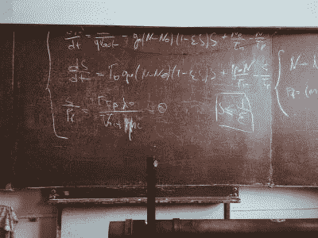

# 预测大学教室和足球场的成功

> 原文：<https://towardsdatascience.com/predicting-success-for-college-classrooms-and-football-fields-5f45e20153bf?source=collection_archive---------64----------------------->

## 每个学生在高等教育机构的旅程都会产生大量数据。使用它来构建支持机构和学生成功的模型。

*照片由* [*MD 杜兰*](https://unsplash.com/@mdesign85?utm_source=unsplash&utm_medium=referral&utm_content=creditCopyText) *上* [*下*](https://unsplash.com/s/photos/graduates?utm_source=unsplash&utm_medium=referral&utm_content=creditCopyText)

帽子、礼服、文凭……还有数据！

每个学生在高等教育机构的旅程都会产生大量数据。[招聘](https://youtu.be/S0ejeB1OPR0)、咨询[、留人](https://community.alteryx.com/t5/Alteryx-Use-Cases/Predicting-and-Improving-Student-Retention/ta-p/599950)、资助[、行政](https://community.alteryx.com/t5/Alteryx-Use-Cases/Hkust-Saves-15-Hours-Month-with-Code-Free-Expense-Allocation/ta-p/599103) [流程](https://community.alteryx.com/t5/Alteryx-Use-Cases/Solving-Student-Number-Projections-Work-in-2-Minutes-Using/ta-p/497570)、[考核措施](https://community.alteryx.com/t5/Alteryx-Use-Cases/The-Thrill-of-Solving-in-Higher-Education-Alteryx-PolyU/ta-p/167050)，课程工作、体育活动、校友活动均可详细跟踪。

这些数据可以在预测模型中发挥作用，推进机构目标并帮助学生取得成功。除了上面链接的有效用例，这里还有两种更具创新性的方法，研究人员使用机器学习在高等教育的世界中进行预测。当然，尽管存在挑战，但预测分析可以提供对各种高等教育数据的洞察。

# KISS:对学生(…和模特)保持简单

随着许多学院和大学现在主要在线教学，学生们正面临着不同寻常的学习挑战。在线学习管理系统(LMS)提供了大量关于学生如何参与课程活动、在线资源和相互交流的数据。但是，哪些数据最能预测哪些学生可能会挣扎，哪些模型提供了最大的效用？

一组研究人员从 Moodle，一个流行的 LMS，收集了四个学期的在线计算机编程入门课程的数据。这些数据包括学生与课程内容的“认知互动”，他们彼此之间的“社会互动”，以及他们与教师的“教学互动”；研究人员认为这些类别可能有不同的预测能力。他们还收集了更多的数据，如学生在 LMS 上的总互动量，并向学生发放了一份关于动机和人口统计的问卷。最后，他们建立了新的功能，包括一个“承诺因子”，一个学生每周总互动量与班上所有学生平均互动量的比率。

*照片由* [*虹膜王*](https://unsplash.com/@irishappens?utm_source=unsplash&utm_medium=referral&utm_content=creditCopyText) *上* [*下*](https://unsplash.com/s/photos/student-laptop?utm_source=unsplash&utm_medium=referral&utm_content=creditCopyText)

有了这些有趣的数据，研究人员测试了 13 种不同的数据组合和 6 种不同的预测算法，以了解哪种算法能够最好地识别出有辍学或在第八周失败风险的学生。

令人惊讶的是，他们发现——尽管试图开发新的方法来检查学生的数据——“简单的交互计数可以用来生成预测模型，”尽管其他研究表明这可能还不够复杂。他们预测高风险学生的最佳模型是根据所有学生互动的总计数训练的 [AdaBoost](https://community.alteryx.com/t5/Alteryx-Designer-Knowledge-Base/Tool-Mastery-Boosted-Model/ta-p/419302) 分类器，第二好的模型也使用 AdaBoost，具有相同的计数和“承诺因子”功能。除了这些简单的数据点，即使是学生问卷也不能增强模型。

“我们可以得出这样的结论，一门包含几十种材料的更有条理的课程最适合学生的需求，因为他们可以与课程进行良好的互动，从而取得成功。研究人员写道:“学生互动似乎意味着参与，更多的参与会让学生取得成功。”。

虽然这似乎是显而易见的——建立一个强大的在线课程，学生更有可能成功！—这些结果对那些想自己尝试学习分析和预测的人很有帮助。你不一定要建立一个超级复杂的模型来识别和接触有风险的学生。一种更简单的方法来跟踪学生的在线参与度，并识别那些参与度较低的学生，仍然有助于学生的成功。

*照片由* [*安德鲁·麦克罗伊*](https://unsplash.com/@mcelroyaw?utm_source=unsplash&utm_medium=referral&utm_content=creditCopyText) *上* [*下*](https://unsplash.com/s/photos/%22american-football%22-twitter?utm_source=unsplash&utm_medium=referral&utm_content=creditCopyText)

# 大学体育中的预测分析:成功的推特

机器学习不仅仅是为了大学的学术和行政需要。另一个[研究项目](https://ir.uiowa.edu/cgi/viewcontent.cgi?article=7872&context=etd)“从标签到海斯曼:大学足球招生中的社交媒体和网络”，展示了如何将[逻辑回归](https://community.alteryx.com/t5/Alteryx-Designer-Knowledge-Base/Tool-Mastery-Logistic-Regression/ta-p/159461)用于足球学生运动员的推特帖子，以 87%的准确率预测他们是否会在这些推特帖子发布后的一个月内获得奖学金。

在正确预测报价方面，逻辑回归优于其他算法，包括[随机森林](https://community.alteryx.com/t5/Alteryx-Designer-Knowledge-Base/Seeing-the-Forest-for-the-Trees-An-Introduction-to-Random-Forest/ta-p/158062)和 [SVM](https://community.alteryx.com/t5/Data-Science/And-For-My-Next-Trick-An-Introduction-to-Support-Vector-Machines/ba-p/360762) 。研究人员手工标注了 7000 多条推文，但自动自然语言处理，如[情感分析](https://community.alteryx.com/t5/Data-Science-Blog/Try-Sentiment-Analysis-with-Designer-You-Must/ba-p/589153)，也可能是有用的。

虽然为一个团队选择一名运动员似乎是一个复杂的决定，有许多无形的因素，但有趣的是，Twitter 内容本身被证明是有预测性的。重要的变量包括运动员是否发布了“自我推销”的推文，“迎合”的推文称赞特定的教练和团队，以及他们参加的营地或拜访过他们的教练等信息。Bigsby 还创建了另一个逻辑回归模型，可以预测运动员是否会加入或“退出”某些团队。

除了体育和高等教育，这项研究还为如何将这种预测方法创造性地用于各种工作的招聘提供了思路。

*照片由* [*罗马法师*](https://unsplash.com/@roman_lazygeek?utm_source=unsplash&utm_medium=referral&utm_content=creditCopyText) *上* [*下*](https://unsplash.com/s/photos/math?utm_source=unsplash&utm_medium=referral&utm_content=creditCopyText)

# 潜在问题

虽然这些例子使用的数据很容易从 LMSes 或公共社交媒体获得，但高等教育数据在实践中可能很难收集和分析。机构孤岛、分散的数据以及对学生隐私和偏见的担忧都带来了挑战。

来自 Hechinger 报告的这篇最近的[文章](https://hechingerreport.org/predictive-analytics-boosting-college-graduation-rates-also-invade-privacy-and-reinforce-racial-inequities/)特别涵盖了使用预测分析法对学生成绩的一些潜在的意想不到的后果。一个模型(和一个解释它的导师)可以引导一个学生远离一个被预测对那个学生来说过于雄心勃勃的首选专业……但是那个学生也许能够迎接挑战。模型和导师的指导是否符合学生的最大利益？这不是一个容易回答的问题。关于隐私和系统偏见的问题也发挥了作用。

诚然，这里存在复杂的问题。不过，只要小心，预测分析有很多方法可以用来帮助学生和其他人打造高质量的高等教育体验。

有关如何使用预测分析的更多灵感，请观看下面来自 Educause 的视频，其中一些机构领导人解释了预测分析在其机构中的作用。你也可以看看这本免费的电子书，它展示了七所不同的学校在各自机构的不同领域对分析方法的使用。

**原载于** [**Alteryx 社区**](https://community.alteryx.com/t5/Data-Science/Predicting-Success-for-College-Classrooms-and-Football-Fields/ba-p/634499) **并精选于** [**Alteryx 数据科学门户**](https://community.alteryx.com/t5/Alteryx-Data-Science-Portal/ct-p/ds-portal) **。**