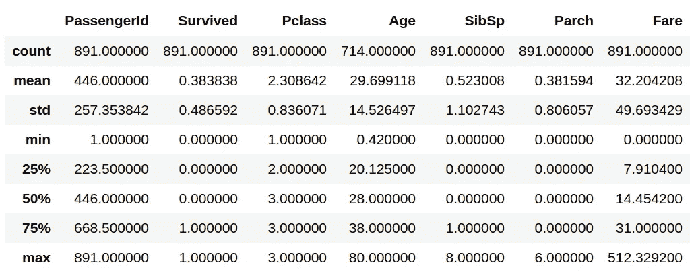
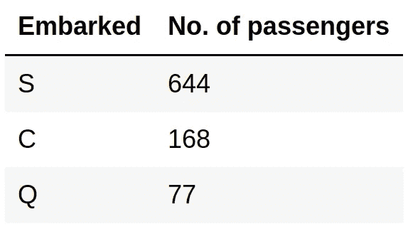
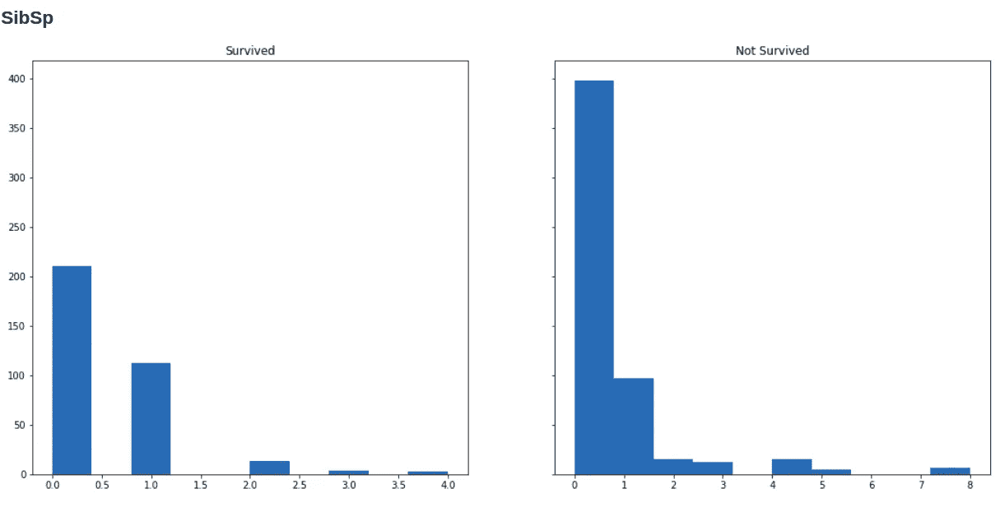

# 预测泰坦尼克号的幸存者

> 原文：<https://towardsdatascience.com/predicting-survivors-of-titanic-e7280822b00b?source=collection_archive---------35----------------------->

## 谁会在海难中幸存？我们可以用机器学习来回答这样的问题。


斯图亚特(1843-1923)/公共领域

1912 年 4 月 15 日凌晨，由白星航运公司运营的英国客轮泰坦尼克号在从南安普敦到纽约的处女航中撞上冰山后沉没在北大西洋。据估计，船上 2224 名乘客和船员中，超过 1500 人死亡，这使得沉船成为现代史上最致命的和平时期商业海上灾难之一。

我们现在想要的是创建一个机器学习模型，能够预测谁将在泰坦尼克号的沉船中幸存。为此，我们将使用[这个来自 Kaggle 的](https://www.kaggle.com/c/titanic/data)数据集——这个任务也有一个 Kaggle 竞赛，这是一个开始 Kaggle 竞赛的好地方。该数据集包含关于乘客的以下信息:


# 探索性分析

现在，在对这个数据集进行任何机器学习之前，做一些探索性分析并看看我们的数据看起来如何是一个好的做法。我们也想一路准备/打扫。

```
import numpy as np
import pandas as pddf = pd.read_csv('train.csv')
df
```


```
df.describe()
```



我们在数据中看到了什么？我们看到 *PassengerId* 列有一个与每个乘客相关联的唯一编号。机器学习算法可以很容易地使用这个字段来记住每个乘客的结果，而没有概括的能力。此外，还有一个*名字*变量，我个人认为它不能以任何方式决定一个人是否幸存。所以，我们将删除这两个变量。

```
del df['PassengerId']
del df['Name']
```

现在，让我们看看我们是否有丢失的值，以及它们有多少。

```
df.isnull().sum()
```


在 891 个样本中，687 个样本的*座舱*变量为空值。此变量缺少太多值，无法使用它。我们会删除它。

```
del df['Cabin']
```

我们不想删除其他两列，因为它们很少缺少值，我们将增加它们。
对于*装载的*变量，由于它是一个分类变量，我们将查看每个类别的计数，并用拥有最多项目的类别替换 2 个空值。

```
df['Embarked'].value_counts()
```



*oaked 最常见的值是“S ”,因此我们将使用它来替换空值。*

```
df['Embarked'].loc[pd.isnull(df['Embarked'])] = 'S'
```

对于年龄，我们将用平均年龄替换缺失值。

```
mean_age_train = np.mean(df['Age'].loc[pd.isnull(df['Age']) == False].values)
df['Age'].loc[pd.isnull(df['Age'])] = mean_age_train
```

请注意，我们应该存储我们从训练数据中了解到的一切，例如*开始*上课的频率或*年龄*的平均值，因为我们将在进行预测时使用这些信息，以防测试数据中也有缺失值。我们还将计算并存储*费用*平均值，以备测试数据需要。

```
mean_fare_train = np.mean(df['Fare'].loc[pd.isnull(df['Fare']) == False].values)
```

我们去掉了空值，现在让我们看看接下来会发生什么。

# 顺序编码

机器学习算法对文本不起作用(至少不能直接起作用)，我们需要用数字转换所有字符串。我们将使用序数编码进行这种转换。序号编码是一种通过给每个类别分配一个数字来将分类变量转换为数字的方法。我们将使用 Scikit-Learn 的`OrdinalEncoder`对变量*性别*、*票*、*上船*进行这种转换。
在此之前，我们将备份当前的数据格式以备将来使用。

```
df_bkp = df.copy()
from sklearn.preprocessing import OrdinalEncoderdf['Sex'] = OrdinalEncoder().fit_transform(df['Sex'].values.reshape((-1, 1)))
df['Ticket'] = OrdinalEncoder().fit_transform(df['Ticket'].values.reshape((-1, 1)))
df['Embarked'] = OrdinalEncoder().fit_transform(df['Embarked'].values.reshape((-1, 1)))
```

# 形象化

现在，我们将可视化我们的数据，看看我们的变量在存活和未存活类中的分布如何变化。
下面是我们数据集中每个变量的直方图(以及生成它的代码)，左边是幸存人员的子集，右边是未幸存人员的子集。

```
import matplotlib.pyplot as plt
from IPython.display import display, Markdowndef show(txt):
    # this function is for printing markdown in jupyter notebook
    display(Markdown(txt))for i in range(1, 9):
    show(f'### {df.columns[i]}')
    f, (survived, not_survived) = plt.subplots(1, 2, sharey=True, figsize=(18, 8))
    survived.hist(df.iloc[np.where(df['Survived'] == 1)[0], i])
    survived.set_title('Survived')not_survived.hist(df.iloc[np.where(df['Survived'] == 0)[0], i])
    not_survived.set_title('Not Survived')
    plt.show()
```



# 对这种数据格式运行机器学习

现在，我们将在数据集上尝试几种机器学习方法，看看我们会得到什么结果。我们将使用的机器学习方法有:

*   逻辑回归
*   支持向量机
*   决策图表
*   k 个最近邻居
*   多层感知器

我们将使用 Scikit-Learn 的`cross_val_score`进行(5 重)交叉验证，而不是选择一个固定的验证集来估计测试集的准确性，sci kit-Learn 的`cross_val_score`返回一个数组，其中包含每次交叉验证迭代的分数。

```
from sklearn.model_selection import cross_val_score
from sklearn.linear_model import LogisticRegression
from sklearn.svm import SVC
from sklearn.tree import DecisionTreeClassifier
from sklearn.neighbors import KNeighborsClassifier
from sklearn.neural_network import MLPClassifierX = df.iloc[:, 1:].values
y = df.iloc[:, 0].values# Logistic Regression
lr = LogisticRegression()
lr_score = np.mean(cross_val_score(lr, X, y))
print(f'Logistic Regression: {lr_score}')# Support Vector Machine
svc = SVC()
svc_score = np.mean(cross_val_score(svc, X, y))
print(f'Support Vector Machine: {svc_score}')# Decision Tree
dtc = DecisionTreeClassifier()
dtc_score = np.mean(cross_val_score(dtc, X, y))
print(f'Decision Tree: {dtc_score}')# K Nearest Neighbors
knc = KNeighborsClassifier()
knc_score = np.mean(cross_val_score(knc, X, y))
print(f'K Nearest Neighbors: {knc_score}')# Multi-Layer Perceptron
mlpc = MLPClassifier()
mlpc_score = np.mean(cross_val_score(mlpc, X, y))
print(f'Multi-Layer Perceptron: {mlpc_score}')
```

运行这段代码，我们得到了以下结果:


# 特征工程

让我们看看是否可以通过处理数据集的要素来提高精确度。为此，我们将首先恢复到应用序号编码之前所做的备份。

```
df = df_bkp.copy()
```

# 一键编码

现在，我们想对我们的分类变量应用一次性编码，而不是顺序编码。使用一键编码，我们不是给每个类分配一个数字，而是给一个向量分配所有的 0，除了一个特定于该类的位置，在该位置我们放置一个 1。也就是说，我们将每个类转换成一个独立的变量，其值为 0 或 1。我们将使用 Scikit-Learn 的`OneHotEncoder`对变量 *Pclass* 、 *Sex* 、 *Ticket* 和*embedded*应用一键编码。

```
from sklearn.preprocessing import OneHotEncoder# Pclass
pclass_transf = OneHotEncoder(sparse=False, dtype=np.uint8, handle_unknown='ignore')
pclass_transf.fit(df['Pclass'].values.reshape((-1, 1)))
pclass = pclass_transf.transform(df['Pclass'].values.reshape((-1, 1)))
df['Pclass0'] = pclass[:, 0]
df['Pclass1'] = pclass[:, 1]
df['Pclass2'] = pclass[:, 2]
del df['Pclass']# Sex
gender_transf = OneHotEncoder(sparse=False, dtype=np.uint8, handle_unknown='ignore')
gender_transf.fit(df['Sex'].values.reshape((-1, 1)))
gender = gender_transf.transform(df['Sex'].values.reshape((-1, 1)))
df['Male'] = gender[:, 0]
df['Female'] = gender[:, 1]
del df['Sex']# Ticket
ticket_transf = OneHotEncoder(sparse=False, dtype=np.uint8, handle_unknown='ignore')
ticket_transf.fit(df['Ticket'].values.reshape((-1, 1)))
ticket = ticket_transf.transform(df['Ticket'].values.reshape((-1, 1)))
for i in range(ticket.shape[1]):
    df[f'Ticket{i}'] = ticket[:, i]
del df['Ticket']# Embarked
embarked_transf = OneHotEncoder(sparse=False, dtype=np.uint8, handle_unknown='ignore')
embarked_transf.fit(df['Embarked'].values.reshape((-1, 1)))
embarked = embarked_transf.transform(df['Embarked'].values.reshape((-1, 1)))
for i in range(embarked.shape[1]):
    df[f'Embarked{i}'] = embarked[:, i]
del df['Embarked']
```

# 缩放至[0，1]范围

我们还想将数值变量缩放到[0，1]范围。为此，我们将使用`MinMaxScaler`来缩放变量，以便最小值移动到 0，最大值移动到 1，其他中间值相应地在 0，1 之间缩放。我们将把这个转换应用到变量*年龄*、 *SibSp* 、 *Parch* 、*费用*。

```
from sklearn.preprocessing import MinMaxScalerage_transf = MinMaxScaler().fit(df['Age'].values.reshape(-1, 1))
df['Age'] = age_transf.transform(df['Age'].values.reshape(-1, 1))sibsp_transf = MinMaxScaler().fit(df['SibSp'].values.reshape(-1, 1))
df['SibSp'] = sibsp_transf.transform(df['SibSp'].values.reshape(-1, 1))parch_transf = MinMaxScaler().fit(df['Parch'].values.reshape(-1, 1))
df['Parch'] = parch_transf.transform(df['Parch'].values.reshape(-1, 1))fare_transf = MinMaxScaler().fit(df['Fare'].values.reshape(-1, 1))
df['Fare'] = fare_transf.transform(df['Fare'].values.reshape(-1, 1))
```

# 对这种新的数据格式进行机器学习

现在，我们将对这种新的数据格式运行相同的机器学习算法，看看我们会得到什么结果。

```
X = df.iloc[:, 1:].values
y = df.iloc[:, 0].values# Logistic Regression
lr = LogisticRegression()
lr_score = np.mean(cross_val_score(lr, X, y))
print(f'Logistic Regression: {lr_score}')# Support Vector Machine
svc = SVC()
svc_score = np.mean(cross_val_score(svc, X, y))
print(f'Support Vector Machine: {svc_score}')# Decision Tree
dtc = DecisionTreeClassifier()
dtc_score = np.mean(cross_val_score(dtc, X, y))
print(f'Decision Tree: {dtc_score}')# K Nearest Neighbors
knc = KNeighborsClassifier()
knc_score = np.mean(cross_val_score(knc, X, y))
print(f'K Nearest Neighbors: {knc_score}')# Multi-Layer Perceptron
mlpc = MLPClassifier()
mlpc_score = np.mean(cross_val_score(mlpc, X, y))
print(f'Multi-Layer Perceptron: {mlpc_score}')
```


在我们以这种方式设计了我们的特征之后，我们在所有分类器的准确性上得到了显著的提高。其中最好的分类器是决策树分类器。现在我们试图通过使用`GridSearchCV`进行超参数调整来改进它。

# 超参数调谐

```
from sklearn.model_selection import GridSearchCVdtc = DecisionTreeClassifier()
params = {
    'max_depth': list(range(2, 151)),
    'min_samples_split': list(range(2, 15))
}
clf = GridSearchCV(dtc, params)
clf.fit(X, y)print(f'Best params: {clf.best_params_}')
print(f'Best score: {clf.best_score_}')
```

我们得到的参数是:


我们得到的分数是 **84.40%** ，在超参数调优后提高了 **0.9%** 。

*我希望这些信息对您有用，感谢您的阅读！*

这篇文章也贴在我自己的网站[这里](https://www.nablasquared.com/predicting-survivors-of-titanic-with-machine-learning/)。随便看看吧！