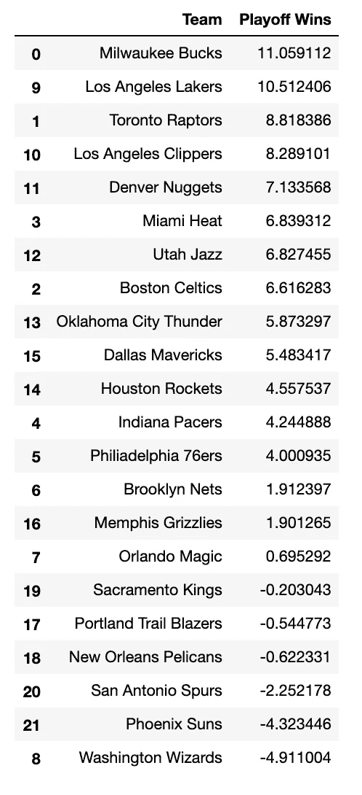

# 用机器学习预测 2020 年 NBA 总冠军

> 原文：<https://towardsdatascience.com/predicting-the-2020-nba-champion-with-machine-learning-32100f6b253d?source=collection_archive---------27----------------------->

## 使用常规赛统计的历史联盟排名

埃德加·恰帕罗在 [Unsplash](https://unsplash.com?utm_source=medium&utm_medium=referral) 上拍摄的照片

当新冠肺炎在三月份暂停 NBA 赛季时，我和其他数百万人一样，彻底崩溃了。作为一个铁杆湖人球迷，我很高兴看到勒布朗和他的团队最终带我们去了乐土。但在经历了过去 6 年完全平庸的表现，没有一场季后赛的表现，以及哀悼已故伟大的科比·比恩·布莱恩特(RIP)的去世后，我想，

> 当湖人队终于有机会夺冠时，这个赛季真的有必要出现一种不可见的病毒吗？

但是 7 月 31 日，**篮球又回来了**。

不过，重新开始还有一个月，我已经看完了所有能想到的与篮球相关的内容，从观看 70 年代的 NBA 录像到 6 年级的 AAU 集锦。当我们耐心等待奥兰多的比赛结果时，我想让篮球界对这个赛季的未来有一点了解。我一直喜欢在季后赛开始前深入分析球队并预测每个赛季的冠军。在学习了一个月如何编码和使用数据分析工具后，我觉得已经准备好开始我的第一个机器学习项目来预测 2020 年的 NBA 冠军。(完整的 Github 回购可以在这里找到:[https://github.com/trustinyoon/2020-NBA-Chip-Predictor](https://github.com/trustinyoon/2020-NBA-Chip-Predictor))

# 数据收集

## 为什么我使用球队常规赛的联赛排名

我想创建一个模型，只使用常规赛的数据来预测 NBA 冠军。我总是着迷于球队的常规赛排名，并相信它们在决定球队在季后赛中的表现方面有着巨大的影响力。最初，我想过使用每场比赛的团队统计数据，然而，游戏在策略、速度、打法、运动员甚至游戏规则方面都发生了如此巨大的变化，如果我比较不同赛季的每场比赛统计数据，会有太多的噪音。例如，在 2003-2004 赛季，一支球队每场比赛的平均得分是 93.4 分，而上赛季是 111.2 分。仅仅通过比较原始数据来比较不同时代的球员或球队是不准确的。

确定一个团队的优势和劣势的最好方法是将它的表现*相对于每个赛季的其他比赛*进行比较。因此，我决定使用每个球队统计类别中的常规赛联赛排名作为特征来训练我的模型，以预测季后赛的胜利数。使用球队统计的联盟排名而不是每场比赛的球队统计，可以更清楚地显示出什么样的策略和执行对决定不同赛季的季后赛成功最有影响。

## 擦

为了收集数据，我从网上刮下了自 2002-2003 赛季以来每支季后赛球队在 basketball-reference.com T2 的常规赛排名。联赛排名从 1 到 30，因为总共有 30 支球队:联赛排名 1 为最好，30 为最差。自从季后赛结构在 2004 年改变后，我没有刮旧赛季，因此 NBA 总冠军必须包括赢得 7 场比赛中的 4 场比赛，而以前的赛季没有。我也没有包括没有进入季后赛的球队，因为这将扭曲我的季后赛胜利数的因变量数据。

我从 basketball-reference.com 刮来的一个球队常规赛表格的例子。联赛排名显示在“Lg 排名”行中。

这个表是为我的 y 变量收集自 2003 年以来每个季后赛球队的季后赛胜利数的数据。

# 数据清理

在构建了熊猫的数据框架后，我运行了一个相关矩阵来过滤掉与季后赛胜利数(因变量)的皮尔逊相关系数小于 0 . 25 的联盟排名(自变量)。这给我留下了以下与季后赛胜利至少适度相关的联盟排名:投篮命中率%，3%，2%，防守篮板，对手投篮命中率%，对手 2%，对手盖帽，常规赛胜利，胜率，简单评分系统(SRS)，整体进攻评分，整体防守评分，有效投篮命中率%，对手有效投篮命中率%，以及上座率。

## 所选要素的多重共线性

在常规赛胜率(W)、胜率(MOV)和简单评分系统(SRS)中排名前三似乎是能够预测 NBA 冠军的体面指标。然而，SRS 和 MOV 是高度相关的，因为在计算两者时使用了点微分。我决定去掉 MOV，因为 SRS 稍微更准确一些，它考虑到了赛季安排的难度。上座率也有所下降，因为 2020 赛季的剩余比赛将在奥兰多的迪士尼世界进行，没有现场观众。

有效投篮命中率(eFG%和 O_eFG%)与其对应的投篮命中率(2P%、O_2P%、FG%、O_FG%)高度相关，所以我去掉了后四个，因为有效投篮命中率计算出的投篮效率稍微更准确一些。eFG%也与季后赛的胜场数稍有关联。

检查多重共线性后，我的模型具有以下特征:

*   3 个百分点
*   防守篮板
*   对手拦网
*   常规赛获胜
*   简单评级系统
*   总体进攻评分
*   总体防御评级
*   有效现场目标%
*   对手有效投篮命中率%

# 探索性数据分析

## 冠军球队常规赛联赛随时间的排名

就冠军常规赛团队进攻数据而言，2000 年代比 2010 年代有更多的可变性。这里最有趣的趋势是 3P%,因为金州勇士队自 2014 年以来以投篮 3 分彻底改变了篮球。三分球已经成为比赛中最重要的投篮，因为它有更高的 EV 和空间能力来创造更多的空位两分球。我们看到，一般来说，近几年的冠军往往在每个进攻团队的统计排名前 5-10，通常在 3P%排名前 5。

常规赛球队防守统计排名的可变性似乎比球队进攻统计排名小得多，在这三个类别中排名前 5-10 可以是季后赛冠军的一个很好的指标。防守篮板(DRB)很重要，但比限制对手投篮效率(O_eFG%)和整体防守评分(DRtg)稍微次要一些。

常规赛的胜数(W)和简单评分系统(SRS)似乎是预测一个冠军最一致的指标。冠军球队很少在常规赛胜利数或 Sr 数上排名前五之外。

## 限制对手拦网的影响被低估了

我发现对手的盖帽(O_BLK)类别是与季后赛胜利适度相关的最有趣的特征。这一发现让我假设，在 BLK 排名前百分之一的球队会让对手更难防守，这相当于更大的胜算。此外，篮球中的大部分盖帽来自非常短距离的投篮，因此对手盖帽能力较低的球队能够在更高的扣球率下得分，因为有更高的概率进行短距离投篮(例如上篮/扣篮)vs 中距离 2 分或 3 分。

# 预测模型

## 线性回归--随机森林--XGBoost

受邀参加奥兰多 2020 赛季重新开始的 22 支球队中每支球队的季后赛胜利预计数

在随机森林和 XGBoost 模型中交叉验证了训练和测试集，这有助于降低 MAEs 和防止过度拟合。

在每个模型中，密尔沃基雄鹿队预计将获得最多的季后赛胜利，湖人队紧随其后😒。尽管在 2019 年总决赛 MVP 科怀·伦纳德离开后，许多体育分析师都认为多伦多猛龙队排名很高，但卫冕冠军多伦多猛龙队的排名也令人惊讶。

但是在我把我所有的刺激资金都押在雄鹿队会赢得这个赛季之前，首先要考虑几件事。

# 结论

## 限制

我对数据的主要担忧是冠军球队(16 场季后赛胜利)的样本量非常小。这意味着每种模式中最好的球队的预期胜场数总是少于 16 场，这显然不足以赢得冠军。然而，我将分数解释为一个相对尺度，以查看哪支球队作为冠军具有最高的获胜预测值。

模型的 MAE 也随着每次测试和训练数据的变化而变化。每个型号的值通常在 2 到 3 之间。我用随机试验的预测和 MAE 的结果来总结发现。

## 摘要

使用常规赛 stat 联盟排名，我发现常规赛期间在胜场数(W)和简单评分系统(SRS)的联盟排名中名列前茅是预测冠军的最佳指标。在最近的趋势中，进攻得分高于防守得分也意味着赢得冠军的机会更大。

最佳预测性能由随机森林回归器实现，MAE 为 2.65，并预测雄鹿队以 13 场预期胜利成为冠军的热门。XGBoost 有一个较小的平均绝对误差 2.44，但是，它预测第一名雄鹿队只会赢得 9.3 场比赛，这与冠军所需的 16 场比赛相去甚远。

密尔沃基雄鹿队被每个模特选为最有希望赢得冠军的球队。湖人、猛龙、快船通常都混在雄鹿之后的积分榜上。

## 未来的工作

使用预测获胜次数可能不是确定冠军队伍的最有效方法。我会通过提供一支球队赢得 16 场季后赛的概率而不是它的期望值来增强我的模型预测。

我计划每季不断更新数据集，并继续完善现有模型/添加新模型。考虑到这是我的第一个数据科学项目，我使用的算法、参数和统计数据还有很大的改进空间。