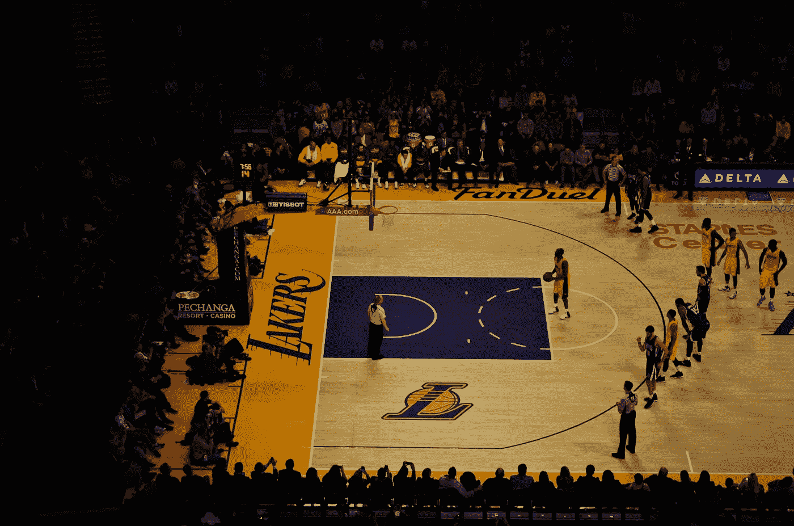
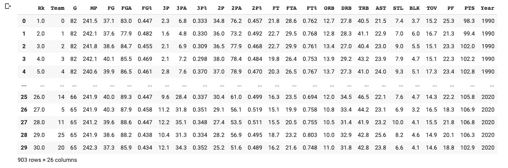
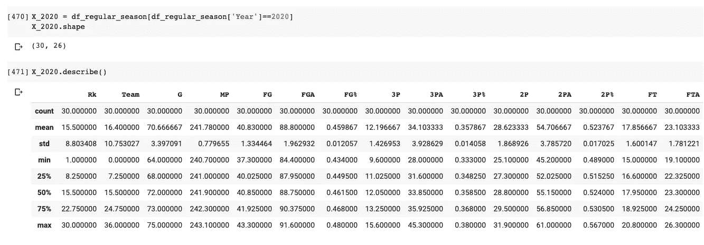
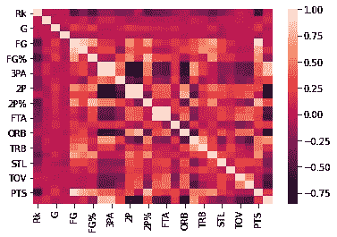
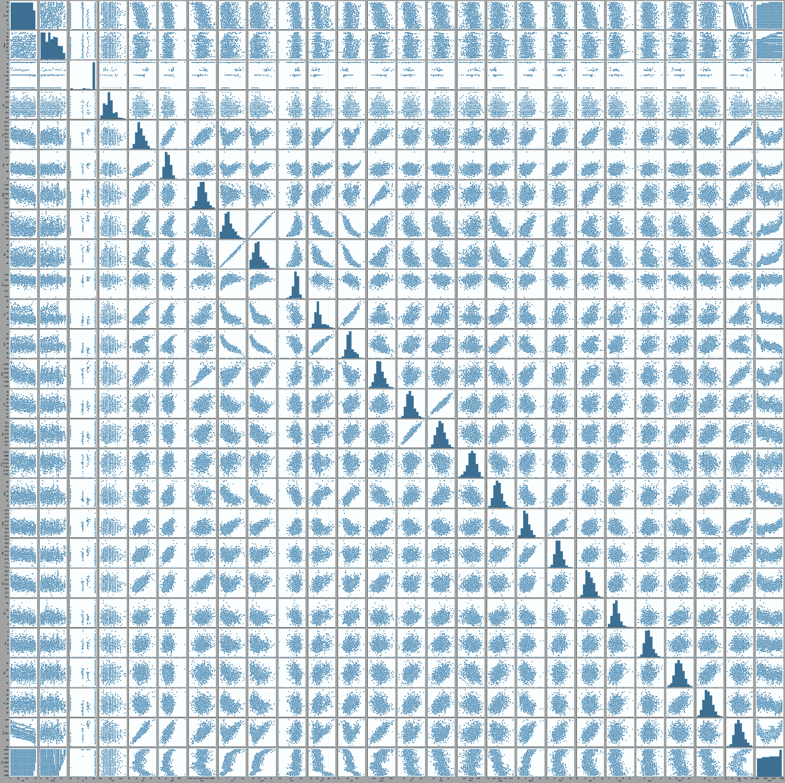
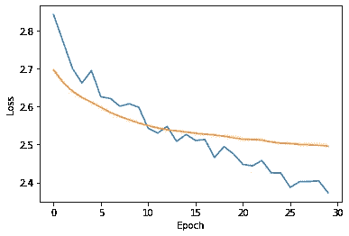

# 用机器学习预测 NBA 季后赛比分

> 原文：<https://towardsdatascience.com/predicting-the-2020-nba-playoffs-bracket-with-machine-learning-2030f80fa62c?source=collection_archive---------32----------------------->

## 利用历史篮球数据和机器学习预测每个系列赛的结果是可能的吗？

章鱼保罗是一只短命的头足类动物(2008 年 1 月 26 日-2010 年 10 月 26 日),饲养在德国奥伯豪森的[海洋生物中心](https://en.wikipedia.org/wiki/Sea_Life_Centres),他因被指能够预测国际足联世界杯足球赛的结果而一夜成名。他所要做的就是吃两个盒子中的一个，除了参赛国家队的旗帜之外，其他方面都一样。许多人认为章鱼是地球上最接近外星智慧的 T4 生物，人们可能会怀疑这种德国无脊椎动物(无意冒犯)是否知道一些关于足球的秘密，而这些秘密可能是更聪明的无毛猿(*又名*人类)事实上不知道的。



有时候你只有一次机会赢得比赛。[图片由 [Ramiro Pianarosa](https://unsplash.com/@rapiana) 在[Unsplash.com](https://unsplash.com/)上拍摄]

基于计算机预测体育赛事结果的历史很长。内特·西尔弗的《信号与噪声的 T2》讲述了一个很好的故事，这是对这个主题感兴趣的人的必读之作。这本书还提醒读者，大多数这样的预测都失败了。然而，特别是自从[深度学习](https://www.dataversity.net/brief-history-deep-learning/#:~:text=The%20history%20of%20Deep%20Learning,to%20mimic%20the%20thought%20process.)的出现，先进的统计方法在体育赛事中的应用变得越来越重要，例如导致[对棒球中的年轻球员](https://en.wikipedia.org/wiki/Moneyball)进行球探，或者改进训练*，例如*到篮球中的[投三分球](https://www.reddit.com/r/dataisbeautiful/comments/837qnu/heat_map_of_1058383_basketball_shots_from_ncaa/)。在这个历史时刻，我们很自然会问自己，在利用历史数据预测体育运动方面，人工智能能比我们强多少。在这篇文章中，我们将探索预测 NBA 季后赛的可能性，谁知道呢，甚至可能赢得 100 万美元。

## 用人工智能赢得 NBA 支架挑战赛

今年，美国国家篮球协会(NBA)发起了一项挑战，鼓励人们预测所有季后赛系列赛(加上决胜局)的结果，名为 [NBA 括号挑战](https://picks.nba.com/bracket-challenge)。虽然加入挑战的窗口现在已经关闭，并且在撰写本文时已经有了一些结果，但总体来看，如何安排机器学习系统来做出这样的预测是很有趣的。这当然是一种相当简化的方法，尽管在过去已经提出了更先进的例子[，例如基于最大熵](https://www.mdpi.com/1099-4300/18/12/450/pdf)的[原理。我准备了一个 Google Colab](https://en.wikipedia.org/wiki/Principle_of_maximum_entropy) [笔记本](https://colab.research.google.com/drive/1bG_4lY4INWFLKf0buWWdoJcf3KntztR7?usp=sharing)，你可以用它来玩。您还需要输入数据，您可以从[这个共享文件夹](https://drive.google.com/drive/folders/1WzIHocxpkGF4TfywVAdLOi4w8v6Co6HA?usp=sharing)中复制这些数据。

首先，我们从[篮球参考网站](https://www.basketball-reference.com/leagues/NBA_2019.html)收集数据。人们可以方便地下载常规赛和季后赛的统计数据。在这里，我们限制到 1990 年至 2019 年，我们将使用 2020 年的常规赛数据来预测 2020 年的支架。

对于每支球队，每年都有以下“经典”功能可用(平均每场比赛):

*   常规赛末排名(Rk)
*   玩游戏的次数(克)
*   播放分钟数(MP)
*   现场目标(FG)
*   投篮尝试(FGA)
*   现场目标百分比(FG%)
*   三分球射门(3P)
*   3 分投篮尝试(3PA)
*   三分球命中率(3P%)
*   两分投篮得分(2P)
*   2 分投篮尝试(2PA)
*   两分投篮命中率(2P%)
*   罚球(英尺)
*   罚球次数
*   罚球百分比(英尺%)
*   进攻篮板
*   防守篮板(DRB)
*   篮板总数(TRB)
*   助攻数(AST)
*   偷窃(短期)
*   街区(BLK)
*   周转率
*   个人犯规
*   点

人们可以以 CSV 格式下载所有这些数据，这些数据可以很容易地作为一个 [Pandas](https://pandas.pydata.org/) dataframe 来处理。



熊猫数据框包含 1990 年至 2020 年的常规季节数据



一些数据探索揭示了输入特征的平均值和百分位数。

毫不奇怪，这些特征之间存在相关性。为了减少输入特征的数量并尽可能消除相关性，习惯上是将[标准化](https://scikit-learn.org/stable/modules/generated/sklearn.preprocessing.StandardScaler.html) ( *即*去除平均值并缩放方差)，然后对输入应用[主成分分析](https://scikit-learn.org/stable/modules/generated/sklearn.decomposition.PCA.html)分解。



输入要素之间相关性的热图



成对输入特征变量的相关图。看起来像斑点的子图对应于不相关的变量。相反，一些子图显示了很强的相关性，如射门次数(FGA)与得分(pts)或得分(PTS)与排名(Rk)。

为了训练机器学习模型，在这个例子中只是一个浅层神经网络，我们假设常规赛数据包含足够的信息来预测季后赛比赛的结果，这有点夸张，但也不太疯狂。

```
Model: "DNN_regresson" _________________________________________________________________ Layer (type)                 Output Shape              Param #    ================================================================= input_69 (InputLayer)        [(None, 32)]              0          _________________________________________________________________ dense_185 (Dense)            (None, 32)                1056       _________________________________________________________________ dropout_98 (Dropout)         (None, 32)                0          _________________________________________________________________ dense_186 (Dense)            (None, 16)                528        _________________________________________________________________ dropout_99 (Dropout)         (None, 16)                0          _________________________________________________________________ dense_187 (Dense)            (None, 14)                238        ================================================================= Total params: 1,822 Trainable params: 1,822 Non-trainable params: 0 _________________________________________________________________
```

从技术角度来看，必须创建一组输入示例和相应的标签。有人可能天真地认为，预测比赛结果最明显的方法是让模型输出每个队赢的比赛数，*例如*4–1，2–4，等等。事实上，这种多维预测是不必要的，通常会产生 3-3、1-3 等不可能的结果。认识到可能结果的数量是有限的，这个问题就可以大大简化。例如，由于每个系列都必须以七局三胜结束(或在 2005 年前的第一轮中以五局三胜结束)，因此只允许以下系列，因此可以在地图中进行编码:

```
valid_results = [(3,0), (3,1), (3,2), (4,0), (4,1), (4,2), (4,3), (3,4), (2,4), (1,4), (0,4), (2,3), (1,3), (0,3)]result_to_idx = {res: i for i, res in enumerate(valid_results)}
idx_to_result = {i: res for i, res in enumerate(valid_results)}
```

这样，我们可以要求网络输出 14 种可能结果中每一种的 [*softmax* 概率](https://stats.stackexchange.com/questions/189331/why-is-the-softmax-used-to-represent-a-probability-distribution)。这样就不会得到不可能的结果作为输出。这种情况下的损失函数是[sparse _ categorial _ cross entropy](https://jovianlin.io/cat-crossentropy-vs-sparse-cat-crossentropy/)，它基本上是一个 categorial _ cross entropy，它不需要将标签表示为独热向量，而只是表示为整数，在这种情况下对应于有效游戏结果的索引。

该网络可以训练几十个时期和小批量。这种图的关键特征是训练和验证损失之间的必要一致。



作为训练时期的函数的训练(蓝色)和验证(橙色)损失。

## 决赛成绩

为了得到最终结果，训练好的网络被多次调用，每次比赛调用一次。首先，有必要定义一下互相对抗的队伍的名字。每个名字都被转换成一个表示索引的整数，该整数又被用于获取给定团队和给定年份(在本例中为 2020 年)的输入特征。

```
first_round = [
  ["milwaukee bucks", "orlando magic"],
  ["miami heat", "indiana pacers"],
  ["boston celtics", "philadelphia 76ers"],
  ["toronto raptors", "brooklyn nets"],
  ["los angeles lakers", "portland trail blazers"],
  ["oklahoma city thunder", "houston rockets"],
  ["denver nuggets", "utah jazz"],
  ["los angeles clippers", "dallas mavericks"]]
```

然后，该程序计算第一轮的结果，并根据结果，为半决赛、决赛和决赛创建类似的列表。

所以…预测如下:

**第一轮**

*   密尔沃基雄鹿队 4-3 奥兰多魔术队
*   迈阿密热火队 4-3 印第安纳步行者队
*   波士顿凯尔特人队 4 比 1 费城 76 人队
*   多伦多猛龙队 4 比 1 布鲁克林篮网队
*   洛杉矶湖人队 2-4 波特兰开拓者队
*   俄克拉荷马雷霆队 2-4 休斯顿火箭队
*   丹佛掘金队 2-4 犹他爵士队
*   洛杉矶快船队 4-1 达拉斯小牛队

**胡人**

*   密尔沃基雄鹿队 4 比 3 迈阿密热火队
*   波士顿凯尔特人队 2-4 多伦多猛龙队
*   波特兰开拓者队 2-4 休斯顿火箭队
*   犹他爵士队 2-4 洛杉矶快船队

**大会决赛**

*   密尔沃基雄鹿队 4-3 多伦多猛龙队
*   休斯顿火箭队 2-4 洛杉矶快船队

**总决赛**

*   密尔沃基雄鹿队 4 比 1 洛杉矶快船队

那么，今年真的是扬尼斯·阿德托昆博年吗？