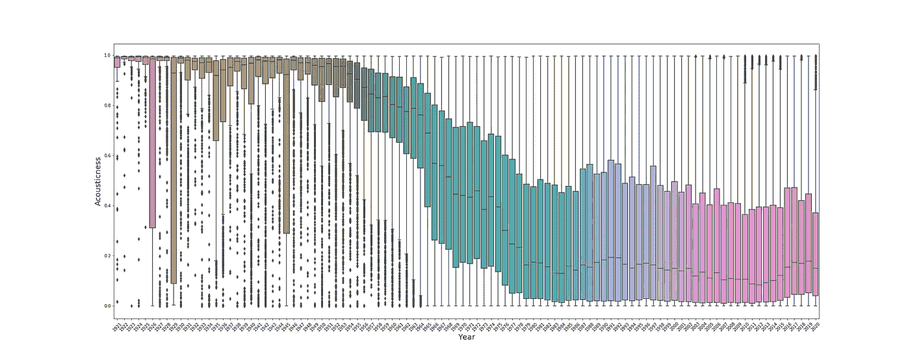
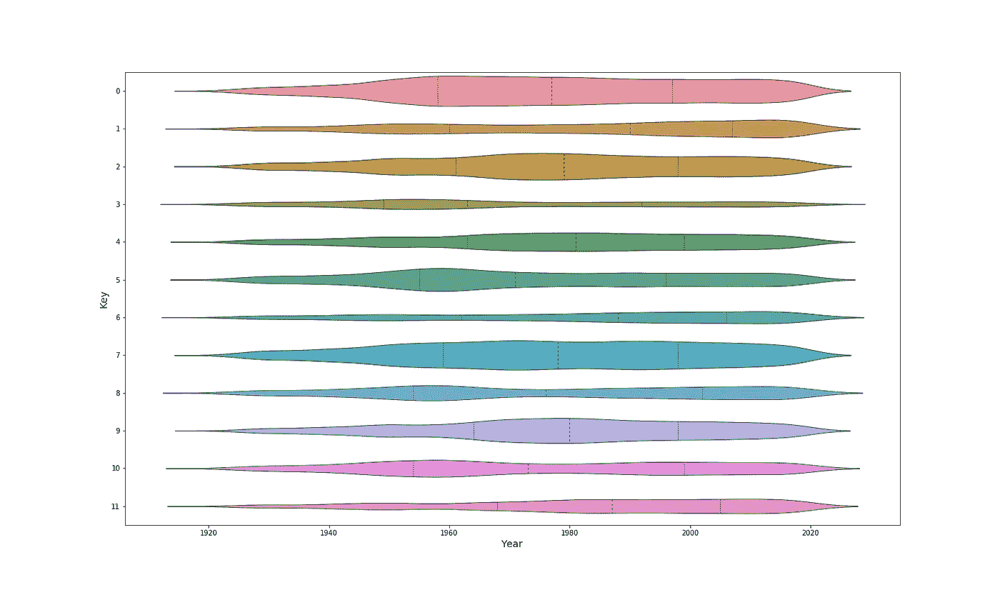
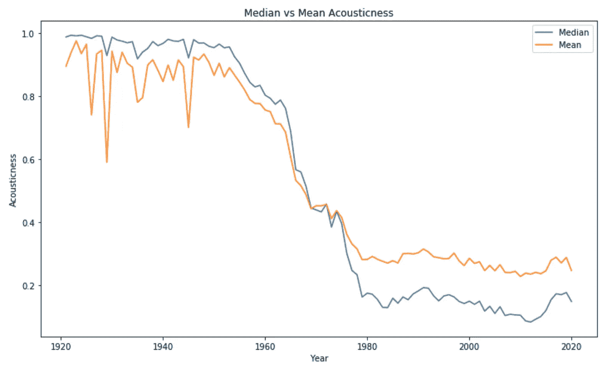
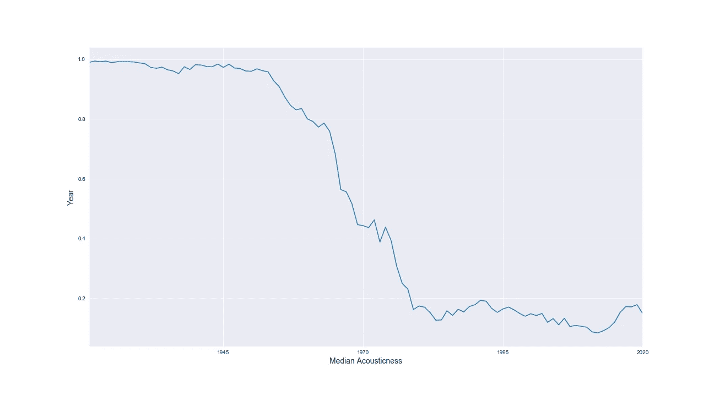
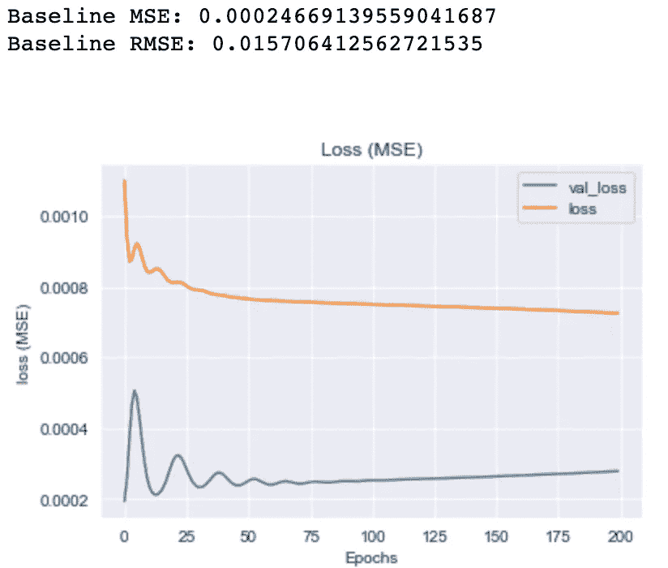
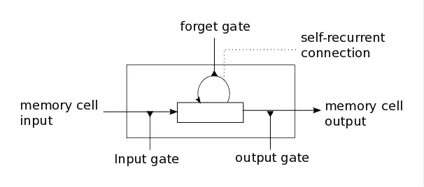
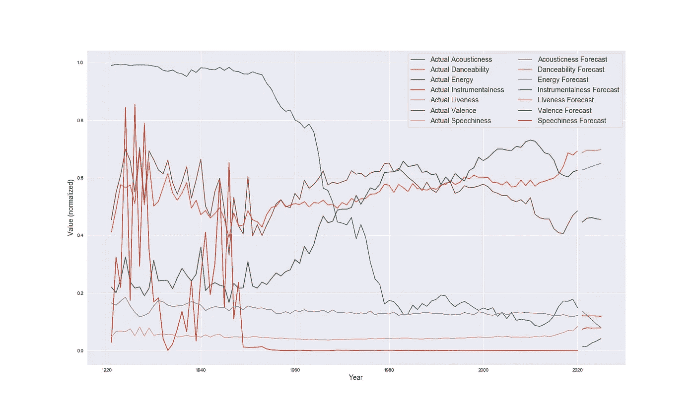

# 用深度学习预测主流音乐的声音

> 原文：<https://towardsdatascience.com/predicting-the-future-sound-of-music-with-lstm-modeling-85488d8eac18?source=collection_archive---------32----------------------->

[夹具](https://unsplash.com/@fixelgraphy?utm_source=medium&utm_medium=referral)在 [Unsplash](https://unsplash.com?utm_source=medium&utm_medium=referral) 上拍照

毫无疑问，Spotify 是当今最受欢迎的音乐流媒体平台之一，它高度受数据驱动。数据科学家利用机器学习推荐系统进行个人策划的播放列表，这是该平台最受欢迎和准确得出奇的功能之一。更多深思熟虑的，甚至是新颖的功能被不断地寻找，以保持用户与平台的互动。

所以我在想如何利用 Spotify 的开发者数据来获得创意。

当有人提到一位艺术家时，你听说过“超越时代”这个词吗？如果我们今天就能预测明天谁会领先于他们的时代，那会怎么样？当然,“走在时代前面”的音乐家大多很有名，但更重要的是，他们通常负责发起他们流派的变革。*声波历史进程的改变。*

**进入数据科学 Spotify 对每首歌曲的歌曲特征进行令人印象深刻的算法音频分析。**

Spotify 使用算法，根据“声音”、“可跳舞性”和“速度”等特征，给每首歌曲一个数字轮廓。我们可以随着时间的推移汇总这些特征来回答我们的问题。

# 目标:

该项目的主要目标是分析和预测 Spotify 上超过 160，000 首歌曲的数据集的年平均(主流)趋势。我将尝试使用长短期记忆(LSTM)递归神经网络来预测每个特征在未来可能的值。这基本上是一个数据驱动的数字表示，代表了 5 年后普通音乐的声音。然后，可以创建与这些未来特征值最接近的歌曲播放列表，并将其命名为“领先于他们的时间的曲目”，并可以作为对应用程序用户的流行吸引力。

## 数据:

从 1920 年到 2020 年发行了超过 160，000 首曲目，每首曲目都有 14 个特征值:

点击“查看文件”可以在 Jovian.ai 上看到完整的 EDA/处理笔记本。

来自 [Spotify 开发者页面](https://developer.spotify.com/documentation/web-api/reference/tracks/get-audio-features/)的一些功能定义:

**Acousticness** :一个从 0.0 到 1.0 的置信度度量，表示音轨是否是声学的。1.0 表示音轨是声学的高置信度。

**可跳性**:可跳性描述了一首曲目在音乐元素组合的基础上适合跳舞的程度，包括速度、节奏稳定性、节拍强度和整体规律性。值 0.0 最不适合跳舞，1.0 最适合跳舞。

**活跃度**:检测录音中是否有观众。较高的活跃度值表示音轨被现场执行的概率增加。高于 0.8 的值表示该轨迹很有可能是实时的。

**乐器性**:预测一个音轨是否不包含人声。“Ooh”和“aah”在这种情况下被视为乐器。Rap 或口语词轨道明显是“有声的”。乐器度值越接近 1.0，轨道不包含人声内容的可能性就越大。高于 0.5 的值旨在表示乐器轨道，但随着该值接近 1.0，置信度会更高。

**效价**:从 0.0 到 1.0 的量度，描述一首曲目所传达的音乐积极性。高价曲目听起来更积极(例如，快乐、愉快、欣快)，而低价曲目听起来更消极(例如，悲伤、沮丧、愤怒)。

# 探索数据

这些年来，音乐在数字上是如何发展的？以下是我在 EDA 期间看到的几个例子:

**“声音”特征框随时间变化图**

声音有明显的区别。20 世纪早期的高音质音乐。乐器、扩音器和制作设备的技术进步可能是大多数最新音乐的声学乐器和整体声音较少的原因。

这些数据的分布告诉我，每年的声学平均值可能并不能很好地代表这些数据，因为它们会受到异常值的影响。我们可能需要创建一个新的具有中间值的年度数据框。中值将更准确地代表大部分数据。

随着时间推移，小提琴演奏出了“关键”

这里我们有一个不同的音乐音阶的用法的概念，一个分类的特征，随着时间的推移。在大多数年份，0 和 7 键音阶是使用最多的，这可以从他们小提琴的粗细看出。

# 清洁

乍一看，这个数据集对我来说非常干净。它没有丢失的值，没有奇怪的字符，等等。但是经过 EDA 的进一步检查和可视化，一些需要处理的细节开始出现。

例如,“语速”的定义告诉我们:“语速检测音轨中口语单词的存在。越是类似语音的录音(例如脱口秀、有声读物、诗歌)，属性值就越接近 1.0。高于 0.66 的值描述了可能完全由口语单词组成的音轨。”

我们现在知道过滤掉任何包含超过 0.66 的语音值的音轨，因为它们是由实际上不是音乐的歌曲组成的。换句话说，这些是录音讲话，也许是单口喜剧录音，它们不会在音乐潮流中扮演角色。

# 特征工程

我在 EDA 过程中注意到，我需要创建一个新的数据框架，该框架根据中位数而不是平均值对每年的每个值进行分组。这是因为异常值的不平衡分布使得平均值不是集中趋势测量的准确表示。看看一段时间内中值“声音”与平均值“声音”的比较:

我能够创建这个新数据框的最简单的方法是将“分组依据”中位数分配给单独的列，然后合并它们，因为有许多原始列与我们无关，如“显式”或“名称”。在这里看看我的代码:

点击“查看文件”可以在 Jovian.ai 上看到完整的 EDA/处理笔记本。

# 建模

我进行了 ARIMA 和 LSTM 建模和调整，最初使用“声学”功能，其绘制的时间序列如下所示:

这里真正的目标是练习使用 LSTM 模型，但是我用 ARIMA 做了基线建模。在使用记录值、差分数据、LSTM 层叠加、双向 LSTM 层等众多 ARIMA 和 LSTM 模型后，给我最低均方根误差(RMSE)的模型是利用 1 滞后差分数据的 LSTM 模型。

使用差异数据的 LSTM 验证损失曲线

那么，什么是 LSTM 模式呢？ LSTM 代表“长短期记忆”，这是一种循环神经网络(RNN)。通过一系列的 sigmoid 和 tan 激活，LSTM 细胞选择性地遗忘其长期序列的一部分(通过循环遗忘门)。这些剩余值被用于预测下一个值，该值被输出到下一个单元中，作为下一个序列的存储单元输入。

如果你想从技术上更深入地了解如何创建 LSTM 模型，可以看看我写的分解编码过程的帖子(链接即将推出！).

# 用最佳 LSTM 模型预测未来值

由于价值(在我们的例子中是年)越来越难以预测，我们将预测上限定在 5 年。下面的图表显示了到 2025 年所有标准化要素的预测值(可以放在同一 y 轴上):

# 过滤“超越时代”的艺术家

我决定从建模中去掉一些在历史上具有相同中值的特征，比如“显式”和“模式”。

不幸的是，我们的数据集不包含任何与所有特征的预测(中值)完全匹配的歌曲。对于最接近 2025 年预测值的歌曲，我采用每个预测模型 RMSE 与其预测值之间的间隔来过滤数据。

最“超前”的艺术家:[二十一名飞行员——我心中的泪点](https://open.spotify.com/album/3cQO7jp5S9qLBoIVtbkSM1?highlight=spotify:track:3bnVBN67NBEzedqQuWrpP4)

第二大“超前”艺人:[新浪潮摇滚乐队——美少女](https://open.spotify.com/album/66ocxSzZ98wk1rWNfrvU8u?highlight=spotify:track:6N81xlWzMaEYhjHry55OSI)

第三和第四位最“超前”的艺术家:[卢·凯尔，里尔·特杰——错了(壮举。Lil Tjay)混音](https://open.spotify.com/album/3bt4LNUYoC2ELK8HBa7rjs?highlight=spotify:track:1Ml32gIRsMAQuUTEt8hwpZ)

[莎拉·拉尔森清洁盗贼——交响乐(壮举。莎拉·拉尔森)](https://open.spotify.com/album/4b13SJlne61y53KSEwuQtD?highlight=spotify:track:1x5sYLZiu9r5E43kMlt9f8)

我们的数据集中没有符合每个预测特征范围的歌曲。我们发现与 2025 年预测(10 个中有 7 个)特征范围最相似的一首歌是《21 个飞行员》——《我心中的泪》。这首歌在我们的“可跳舞性”、“持续时间 _ 毫秒”、“能量”、“速度”、“效价”、“流行度”和“关键”误差范围内，与实际预测值相差不大。有 10 个共有特征中有 6 个的歌曲是新浪潮摇滚乐队的《美丽的女孩》。两首歌分享了 10 分中的 5 分。12 首歌分享了 10 个值中的 4 个。

# 结论

我们已经成功预测了我们的每个特征。那么他们告诉了我们什么？我们的模型预测，到 2025 年，普通歌曲将具备以下特征:

节奏将增加到 122.2 BPM 左右。响度将继续反弹，并达到接近-6db 的中值。(挺大声的！)歌曲中的工具性可能已经卷土重来，从 0。语速(人声/口语)将趋于平稳。声学度将再次降低，降至 0.08。平均受欢迎程度将继续增长。效价(积极/快乐)将下降并稳定在 0.455。能量会继续反弹，触及 0.649。可跳舞性或多或少也会保持稳定，只会上升一小部分，达到 0.697。换句话说，未来 5 年将保持最高的可跳性。

随后的研究表明，简单的时间序列，如数据点较少的时间序列，通常在 ARIMA 模型中表现更好，而 LSTM 模型在非常复杂的时间序列中表现更好，效率更高。考虑到这一点，我们能够使用稳定数据，通过 LSTM 建模获得较低的 RMSE，用于我们对每个特征的最终预测！

# 进一步建议

如果可能的话，我们可以直接访问 Spotify API，在整个 Spotify 库中查询那些拥有所有功能的最前沿艺术家。Spotify 总共列出了超过 5000 万首歌曲。找到与每个建模特征的未来平均值完全匹配的歌曲的概率要高得多。

将这种预测进一步扩展到各个流派，看看每个流派是如何随着时间的推移而演变的，以及这些流派中的哪些艺术家更早就演奏了这些价值观的音乐，这将是很有趣的。

最后，更多的时间分配来改进模型分层和/或参数将有助于我们预测的准确性。

欢迎在 GitHub [这里](https://github.com/oac0de/Spotify-Sound-Of-Future-Prediction)查看整个项目，如果你对我的过程有任何问题或建议，也可以给我发消息！