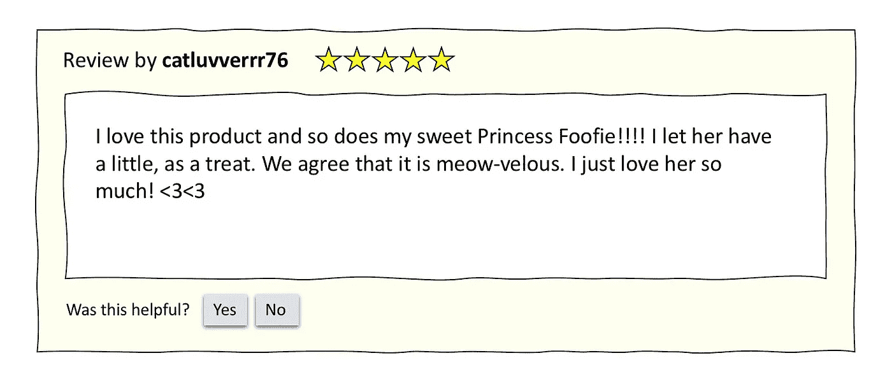
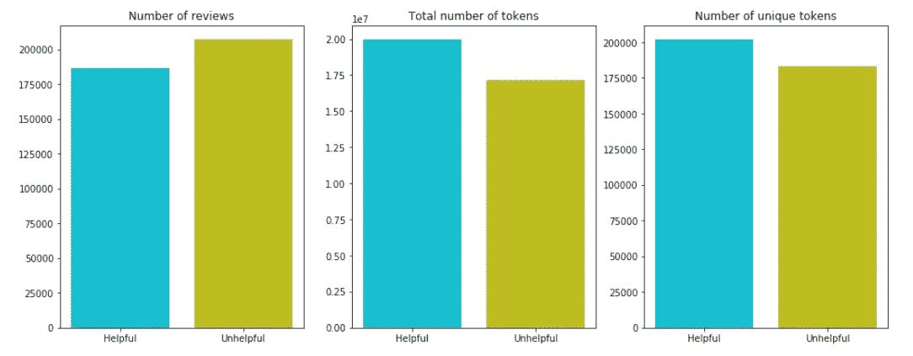

# 预测同行撰写的产品评论的“有用性”

> 原文：<https://towardsdatascience.com/predicting-the-helpfulness-of-peer-written-product-reviews-ef7a0dfea2c3?source=collection_archive---------23----------------------->

## 将自然语言处理和神经网络应用于复杂的文本处理问题



这有帮助吗？菲公主想知道。

一些电子商务网站让顾客写下他们产品的评论，其他顾客在考虑购买产品时可以浏览这些评论。我知道我读过我的顾客朋友写的产品评论，这些评论帮助我判断一个产品是否符合尺寸，是否能持续很长时间，或者是否含有我担心的成分。

如果一家企业能够预测哪些评论对其客户会有帮助，那会怎样？也许它可以把这些评论放在页面的最前面，这样读者就可以更快地获得最好的信息。也许企业可以注意到哪些主题出现在这些有用的评论中，并修改其产品描述以包含更多此类信息。也许企业甚至可以识别“超级评论者”，即特别擅长撰写有用评论的用户，并激励他们评论更多产品。

利用亚马逊的大量产品评论，我训练了一系列机器学习模型，试图识别哪些评论被读者评为“有帮助的”。我尝试了随机森林、逻辑回归、支持向量机、GRU 网络和 LSTM 网络，以及各种自然语言处理(NLP)技术来预处理我的数据。事实证明，预测有用的评论非常困难，但并非不可能！直奔代码，[查看我的 GitHub repo](https://github.com/jrkreiger/helpful-reviews) 。要了解更多关于我是如何做到的，请继续阅读。

# 数据集

以下是您需要了解的数据集:

*   [它来自亚马逊(via Kaggle)](https://www.kaggle.com/snap/amazon-fine-food-reviews) ，尤其是食品部门，不仅包括食品，还包括厨房小工具和宠物食品。
*   它是在 2002 年至 2012 年期间收集的，所以它并不完全是最新的，但我认为在 2020 年我们仍然可以从中学习很多东西。
*   它包含了超过 500，000 条评论，在我删除重复的评论后，还剩下 393，579 条评论。
*   读者有机会将评论标记为“有用”或“无用”。还有一个否决评论的选项，但没怎么用过。大约 52%的评论获得了零个“有帮助”的投票，其余的获得了一个或多个“有帮助”的投票。
*   除了“有用性”和评论本身的文本，数据集还记录了产品 ID、用户 ID、时间戳和评论作者给产品的星级(满分 5 分)。

以下是按类别划分的评论数、总令牌数和唯一令牌数的快速浏览:



虽然有帮助的评论少了，但是比没有帮助的包含了更多的词和更多独特的词。

# 困惑于预测

鉴于这个数据集的内容，我有两个大问题。问题 1:除了评论本身的文本之外,“有用性”可以通过其他特征来预测吗？例如，如果有用的评论总是包括 5 星评级，或者总是由同一批评论者撰写，那我就省了很多文字争论！

事实证明，答案是否定的:使用数据集中的任何其他特征，或者我自己设计的少数特征，都无法预测有用的评论。有用的评论可以是短的、长的、正面的或负面的；可以是新手写的，也可以是有经验的审稿人写的；它们可以是流行或不知名的产品；而且他们的词汇和无益的评论很像。

这是 t-SNE 的评论样本图，主要关注文本本身。t-SNE 图基本上是对数据集进行主成分分析，将所有要素减少到 2 或 3 个成分，然后绘制它们，这样您就可以看到类是如何重叠(或不重叠)的。这个情节揭示了一个噩梦:至少在这两个维度上，这两个类有很多重叠*。*

**

*这让我想到了问题 2:如果没有预测有用性的捷径，我该如何从文本中预测有用性呢？我应该如何为建模预处理评论？应该尝试哪些机型？众所周知，使用人工生成的文本作为预测模型的输入非常困难，部分原因是有太多的方法可以将文本转换为数据，然后您需要相当复杂的模型来处理这些数据。选哪个？*

*当决定如何预处理评论文本时，我想尝试一系列的技术，集中在那些在我的项目的探索阶段看起来最有希望的技术上。至于建模，我想从更简单、训练更快的模型开始，然后逐步进行最复杂的选择。我希望前几轮测试可以帮助我确定最佳的预处理选项，而最后几轮测试可以帮助我完善我的最佳模型。*

# *第一阶段:进入森林*

*我的第一轮大实验包括针对基线随机森林模型测试不同的预处理技术:*

*   *将文本作为二元模型处理，然后在其上训练一个随机森林。*
*   *将文本作为术语-文档矩阵进行处理(基本计数矢量化)，然后在此基础上训练一个随机森林。*
*   *计算 TF-IDF(术语频率-逆文档频率)向量，然后在随机森林中运行这些向量。*

*所有这些在验证数据上的表现都在 54–55%的准确度范围内，这仅比随机猜测好一点点，但至少不比随机猜测差！TF-IDF 得分最高，所以我决定使用 TF-IDF 向量作为输入，尝试调整一个随机森林，以便做得更好。我尝试了以下方法:*

*   *使用网格搜索来确定要使用的最佳估计数和最大树深。*
*   *将 TF-IDF 向量的长度增加一倍(即，创建了更多的输入数据)，然后进行一种形式的主成分分析(使用 [TruncatedSVD](https://scikit-learn.org/stable/modules/generated/sklearn.decomposition.TruncatedSVD.html) )来选择一些可以解释训练数据中 80%方差的成分。*
*   *使用我在前面两步中生成的所有东西训练了一个最终的随机森林。*

*所有这些都产生了一个模型，该模型对训练数据过度拟合(超过 99%的准确率)，对验证数据的准确率为 57%，这是我迄今为止的最好成绩。*

*但是比随机猜测好 7 个百分点并不值得大书特书，所以我转向了迁移学习方法。*

# *第二阶段:脱下手套*

*迁移学习包括将别人的模型计算出的权重代入你自己的模型。这可能是一种非常方便的方式，可以从其他人的投资中受益，例如，在维基百科的所有内容上训练一个巨大的模型。*

*这就是嵌入手套的原因。斯坦福大学的一些[聪明人训练了一个巨大的模型](https://nlp.stanford.edu/projects/glove/)来量化英语单词在上下文中的关系。通过从 GloVe 中为我的评论语料库中的每个单词收集相关的嵌入向量，我可以从中受益。然后，对于每篇评论，我取所有单个单词向量的平均值，形成一个新的向量，代表评论的整个文本。然后，可以将所有评审向量传递给模型进行训练或预测。*

*我将我的手套嵌入传递给三个模型:随机森林、逻辑回归和支持向量分类器。这些模型在验证数据上的准确率也在 53–56%之间，其中随机森林的准确率最高。经过一些额外的调优，我仍然只能得到 56%的验证准确率。*

*在这一切之后，我非常想看看神经网络能做什么。*

# *第三阶段:只有蚊帐*

*众所周知，序列对序列模型在处理文本数据时表现良好，所以我决定尝试两种不同的这类神经网络架构。我特别感兴趣的是让这些网络动态地计算它们自己的嵌入；由于 GloVe 做得不太好，我希望仅基于我的数据集的嵌入可能是更好的选择。*

*看看我的基线神经网络的结构:*

```
*# Try again with more epochs, callbacks
import tensorflow as tf

embedding_size = 128
model = tf.keras.models.Sequential()
model.add(tf.keras.layers.Embedding(200000, embedding_size, input_shape=(100,)))
model.add(tf.keras.layers.GRU(25, return_sequences=True, input_shape=(100,)))
model.add(tf.keras.layers.GRU(25, return_sequences=True, input_shape=(100,)))
model.add(tf.keras.layers.GlobalMaxPool1D())
model.add(tf.keras.layers.Dropout(0.5))
model.add(tf.keras.layers.Dense(50, activation='relu'))
model.add(tf.keras.layers.Dropout(0.5))
model.add(tf.keras.layers.Dense(50, activation='relu'))
model.add(tf.keras.layers.Dropout(0.5))
model.add(tf.keras.layers.Dense(1, activation='relu'))

model.compile(loss='binary_crossentropy', optimizer='adam', metrics=['accuracy'])

history = model.fit(X_train, y_train, epochs=50, batch_size=2048, validation_data=(X_val, y_val))*
```

*这是一个计算嵌入的层，两个各有 25 个门控递归单元(GRU)节点的层，一个汇集其输出的层，两个各有 50 个节点的密集层(有 50%的丢弃以避免过度拟合)，然后一个节点对每个样本进行最终预测。我也尝试了同样的架构，但是用长短期记忆(LSTM)节点代替 GRUs。结果没有实质性的差异，GRU 稍微快了一点，所以我决定继续用更大的输入向量和更多的训练时段来调整 GRU 网络。*

# *最佳模型和结果*

*总的来说，我最好的模型是最后一个:GRU 网络在验证数据上达到了 59%的准确率。在我的 holdout 数据集上，这个模型也达到了 59%的准确率，考虑到它试图解决的问题的复杂性，这还算不错。*

*像这样的模型可以用来对提交的评论进行排序，并将那些可能有帮助的评论排在队列的最前面。一家企业也可以从自己的网站上搜集评论，筛选出有用的，然后再去评论，以了解潜在客户想知道的、他们的产品描述没有提供的信息。类似地，企业可以确定有用评论的作者，并鼓励他们写更多，或者修改他们的评论提交表格，以包括撰写更多信息性评论的技巧(正如 AirBnB、猫途鹰和其他公司已经做的那样)。*

*如果你想在有用的评论上看到我的整个项目的精彩细节，请查看 GitHub 上的代码。感谢阅读！*

**跨贴自*[*【jrkreiger.net】*](http://jrkreiger.net)*。**