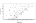
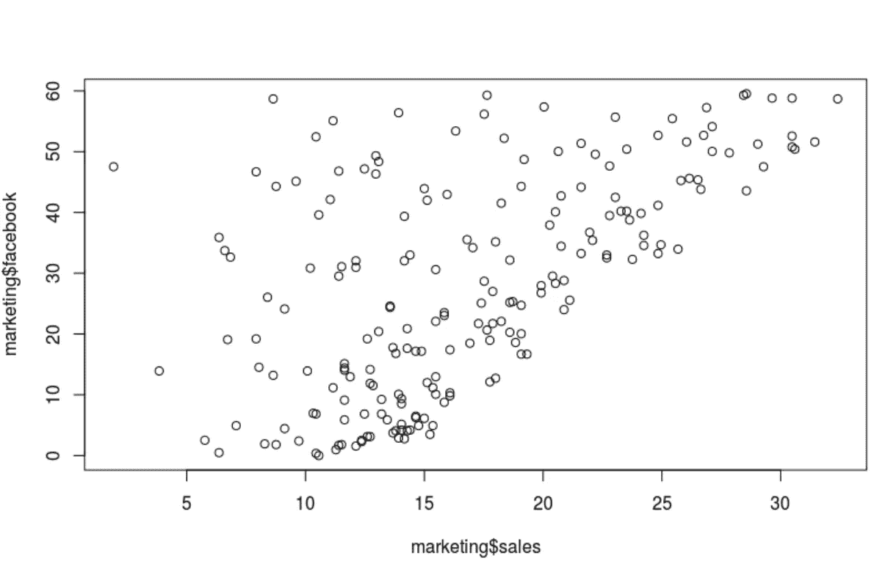
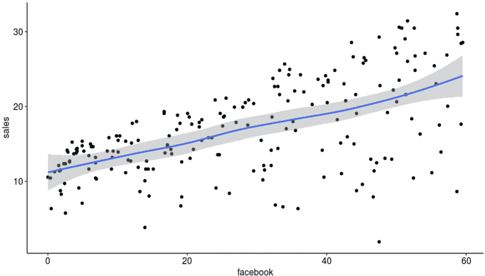
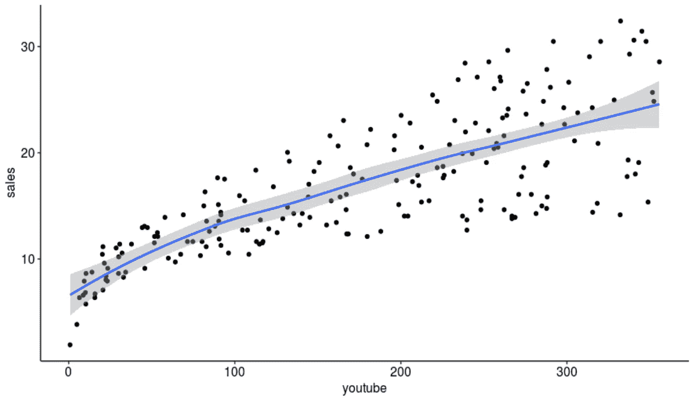
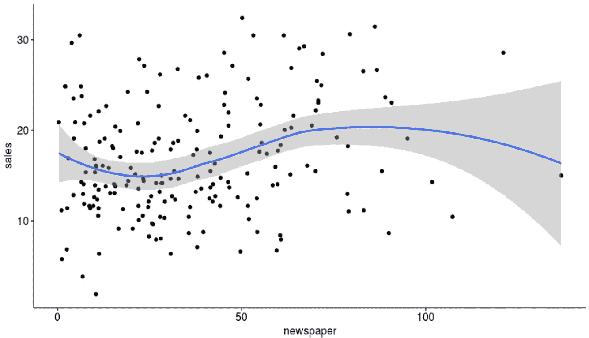
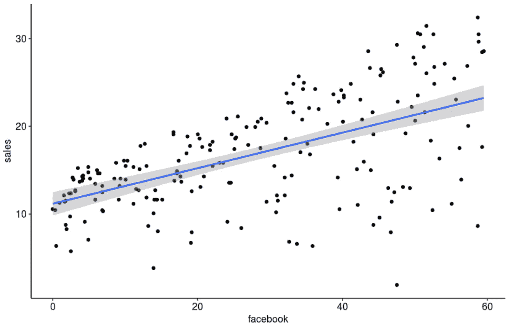

# 用线性回归预测社交媒体广告对销售的影响

> 原文：<https://towardsdatascience.com/predicting-the-impact-of-social-media-advertising-on-sales-with-linear-regression-b31e04f15982?source=collection_archive---------7----------------------->

*本文将详细介绍使用 r 软件包进行简单线性回归的步骤，还将涵盖相关的基本介绍性统计数据。*


由[活动创作者](https://unsplash.com/@campaign_creators?utm_source=medium&utm_medium=referral)在 [Unsplash](https://unsplash.com?utm_source=medium&utm_medium=referral) 上拍摄的照片

# 什么是简单线性回归？

线性回归测量响应变量 **Y** 和预测变量 **X** 之间的关系。X 增加一个单位，Y 增加吗？还是随着 X 增加一个单位而减少？我们想用线性关系从 X 预测 Y 变量。我们可以理解两个变量是如何相互联系或相互影响的。

例如，假设 Y 是伦敦不同街区每 1000 人被刺伤的次数——刺伤次数越多，犯罪率越高。如果 X 是不同社区的中值房价，我们可以使用线性回归来测试中值房价较低的社区是否有较高的犯罪率，反之亦然。

# 回归方程:

数学上，线性回归可以表示如下:

Y=β1+β2X+ϵ

*   响应(相关)变量 **Y** 是我们试图预测的。
*   预测(独立)变量 **X** 用于预测响应。
*   β1 是*截距*，是一个常量值*。*如果 X = 0，那么 Y 将完全依赖于β1。
*   β2 是回归线的*斜率*。我们将这些术语称为系数。
*   ϵ是残差项。这将显示 x 可以解释多少 Y，误差项的平均值为 0。

让我们用一个例子来形象化这一点。

# 带 R 的示例

我们将使用`datarium`包中包含的`marketing` 数据集，其中包含一家虚构公司的三种媒体(脸书、YouTube 和报纸)的广告预算(以千美元计)以及该公司的销售数据。

# 1.提出我们的问题:

制定一个研究问题是指导探索性数据分析过程的有用方法。它可以帮助清理数据集，并通过消除不需要的变量、处理缺失值等为严格的分析做准备。我们的一般问题是:

考虑到 YouTube 和报纸广告的效果，脸书广告对公司的销售有什么影响？

我们希望开发一个线性模型来解释预测变量`facebook` 和数值响应变量`sales`之间的关系。在本文中，我们将使用 R 包来执行简单的线性回归。这里有一个简单的线性回归方程:

Sales=β0+β1*Facebook+ϵ

涉及多个预测变量的多元回归将在另一篇文章中进行解释(*即将发布！*)。例如，如果我们想测试脸书广告对公司销售的影响*给定*YouTube 和报纸广告的广告预算，我们的多元回归方程将如下所示:

销售额=β0+β1 * Facebook+β2 * YouTube+β3*newspaper+ϵ

我们将首先从一个简单的线性回归开始，找到预测响应`sales`的最佳直线，作为预测值`facebook`的函数。

# 2.安装

首先在 R Studio 中安装`tidyverse`、`ggpubr`和`datarium`包。从`datarium`包中导入`marketing`数据集。

```
library(tidyverse)
library(ggpubr)
data(“marketing”, package = “datarium”)
```

# 3.探索性数据分析

首先，我们将使用`str()`函数来获得数据结构的快照视图。我们可以看到有 200 行数据和 4 个变量——**YouTube**、 **facebook** 、**报纸**和**销售额**。我们还可以看到每个变量的前几个单独的值。此外，我们可以看到每一列变量的类别——我们的每个变量都被归类为“数值型”。

```
> str(marketing)
'data.frame':	200 obs. of  4 variables:
 $ youtube  : num  276.1 53.4 20.6 181.8 217 ...
 $ facebook : num  45.4 47.2 55.1 49.6 13 ...
 $ newspaper: num  83 54.1 83.2 70.2 70.1 ...
 $ sales    : num  26.5 12.5 11.2 22.2 15.5 ...
```

我们也可以使用`dim()` 来了解数据帧的尺寸，即行数和列数。

```
> dim(marketing)
[1] 200 4
```

接下来，我们将使用`head()`函数来浏览一下我们的原始数据。默认情况下，该函数将返回前六行，但是我们可以根据自己的喜好查看任意数量的行。我们希望看到前 10 行:

```
> head(marketing, 10)
   youtube facebook newspaper sales
1   276.12    45.36     83.04 26.52
2    53.40    47.16     54.12 12.48
3    20.64    55.08     83.16 11.16
4   181.80    49.56     70.20 22.20
5   216.96    12.96     70.08 15.48
6    10.44    58.68     90.00  8.64
7    69.00    39.36     28.20 14.16
8   144.24    23.52     13.92 15.84
9    10.32     2.52      1.20  5.76
10  239.76     3.12     25.44 12.72
```

让我们也用`tail`看看数据集的结尾。这非常有用，因为在一些数据集中，最后几列可能包含数据的总计或汇总，这可能是不相关的。

```
> tail(marketing)
    youtube facebook newspaper sales
195  179.64    42.72      7.20 20.76
196   45.84     4.44     16.56  9.12
197  113.04     5.88      9.72 11.64
198  212.40    11.16      7.68 15.36
199  340.32    50.40     79.44 30.60
200  278.52    10.32     10.44 16.08
```

现在，我想使用`summary`调出一些汇总统计数据。

```
> summary(marketing)
youtube          facebook       newspaper     
 Min.   :  0.84   Min.   : 0.00   Min.   :  0.36  
 1st Qu.: 89.25   1st Qu.:11.97   1st Qu.: 15.30  
 Median :179.70   Median :27.48   Median : 30.90  
 Mean   :176.45   Mean   :27.92   Mean   : 36.66  
 3rd Qu.:262.59   3rd Qu.:43.83   3rd Qu.: 54.12  
 Max.   :355.68   Max.   :59.52   Max.   :136.80  
     sales      
 Min.   : 1.92  
 1st Qu.:12.45  
 Median :15.48  
 Mean   :16.83  
 3rd Qu.:20.88  
 Max.   :32.40
```

我们必须理解这些重要的术语和数字代表什么。

*   **均值:**所有数值之和除以数值总数。在我们的示例数据集中，YouTube 广告的平均预算是 176.45 美元或 176，450 美元。另一方面，脸书的平均广告预算要低得多，为 27.92 英镑或 27，920 美元。
*   **中位数:**奇数排序列表中的中间数。在偶数列表中，中位数是将排序数据分为上下两半的两个数字的平均值。
*   **最小值:**这是每个变量的最小数值。
*   **最大值:**这是每个变量的最大数值。

所以我们已经收集了一些关于数据集的有趣信息。我们知道，该公司在 YouTube 上的平均广告支出高于脸书或报纸广告。

我们可以通过`quantile`更深入地了解数据的分布。

```
> quantile(marketing$facebook)
   0%   25%   50%   75%  100% 
 0.00 11.97 27.48 43.83 59.52
```

# 4.让我们开始策划吧！

太好了！我们有了一些关于数据集的初步信息，现在我们可以绘制一些图表。我们将使用`ggpubr()` 包中的`ggplot()`函数。首先，为了演示为什么我们使用`ggpubr` 包来绘制我们的图形，我们将使用`plot()` **，** R 的内置绘图函数来绘制基本图形。

```
> plot(marketing$sales, marketing$facebook)
```



现在，我们将使用`ggplot()`。

```
> ggplot(marketing, aes(x = facebook, y=sales)) + geom_point() + stat_smooth()
```



脸书 vs 销售

允许以更美观的方式绘制图表。这里，情节是带有“aes”或“美学映射”的*营销数据集*、*、从 **facebook** 和**销售**变量导出的*、一组*点*和一个*平滑器*。

上图(准备出版)显示了**销售额**和 **facebook** 变量之间的正线性关系。这表明广告预算的增加会导致公司销售额的增加。出于好奇，我们也可以想象一下销售和 YouTube 广告以及销售和报纸广告之间的关系。



YouTube vs 销售



报纸 vs 销售

有趣的是，虽然`sales`和`youtube` 广告之间的关系也是线性的和正的，但是`sales`和`newspaper` 广告之间的关系却不是——它是一条曲线，实际上在报纸广告的非常低和非常高的水平上开始负斜率。

**自变量和因变量之间的*相关性*如何？**相关性分析将确定两个连续变量之间的关系强度。我们必须计算*相关系数*来执行该分析。相关性取+1 和-1 之间的值。接近 0 的值表示两个变量之间的相关性较弱。

在我们的示例数据集中，如果高销售额伴随着高脸书广告价值，变量将是正相关的，反之亦然。正如我们在图表中已经看到的，销售额和脸书广告之间存在正相关关系。然而，销售和 YouTube 广告之间有更强的正相关性。

销售和报纸广告之间的相关性最弱。这表明销售(Y)的大部分变化是报纸广告(X)无法解释的。为了衡量销售额的显著变化，我们需要一个具有强相关性的解释变量，即 YouTube 或脸书。

```
> cor(marketing$sales, marketing$facebook)
[1] 0.5762226> cor(marketing$sales, marketing$youtube)
[1] 0.7822244> cor(marketing$sales, marketing$youtube)
[1] 0.7822244
```

# 5.简单线性回归

为了在 R 中执行简单的线性回归，我们将使用`lm()`。

```
> model1 = lm(sales ~ facebook, data = marketing)
> model1Call:
lm(formula = sales ~ facebook, data = marketing)Coefficients:
(Intercept)     facebook  
    11.1740       0.2025
```

# 5.回归线

现在，让我们为我们的回归生成一个图表。回归线将尝试最小化残差平方和(RSS 或残差平方和)。

```
> ggplot(marketing, aes(facebook, sales)) +
 geom_point() +
 stat_smooth(method = lm)
```



**回归概念:**

*   *拟合值和残差:*通常，真实世界的数据不会正好落在回归线上，这就是为什么回归方程包含误差项ϵ.的原因拟合/预测值用^.表示如果β用^表示，则系数为*估计值*。统计学区分估计值和已知值，因为估计值是不确定的，而已知值是固定的。误差项ϵ将包含估计值和已知值之间的差异。
*   *最小二乘法:*在简单回归中，我们会使用 OLS 或普通最小二乘法来估计我们的回归模型与数据的拟合程度。用^表示的系数是使 RSS 最小的值。然而，在多元回归中，我们将使用**最大似然**来估计模型拟合度。

# 6.解读我们的回归

估计回归线为:

Sales=11.174+0.2025*Facebook+ϵ

*   截距(β0)为 11.174，可以解释为脸书广告预算值为零时的预测美元销售额。因此，对于等于零的脸书广告预算，我们可以预计销售额为 11.174 * 1000 = 11，174 美元。
*   回归系数(β1)表明，对于等于 1000 美元的脸书广告预算，我们可以预期销售额增加 202.5 单位(0.2025*1000)，即`sales = 11.174 + 0.2025*1000 = 56.44 units`。这相当于 213，670 美元的销售额。

# 7.评估我们的模型

现在我们有了回归模型，我们需要理解如何解释它。仅仅创建一个回归模型是不够的。我们必须检查(a)我们的回归是否有统计学上的显著关系，以及(b)我们的模型是否与数据吻合。很好地拟合数据的回归模型是这样的，X 的变化导致 y 的变化。

在继续之前，我们必须了解标准误差和假设检验。

**标准误差:**

标准误差衡量我们的系数估计值与我们的响应变量的实际平均值相差多少。标准误差可用于计算**置信区间**。置信区间量化回归系数的不确定性。通过使用`confint()`函数，我们了解到区间[0.12，0.24]有 95%的机会包含β1 的真值。

```
> confint(model1)
                2.5 %     97.5 %
(Intercept) 9.8419062 12.5060253
facebook    0.1622443  0.2427472
```

**假设检验:**

标准误差可用于对回归系数进行假设检验。最常见的假设检验是检验零假设和替代假设。

*   零假设(H0):系数等于零，即预测变量和响应变量之间没有关系。
*   替代假设(H1):系数不等于零，即预测变量和响应变量之间存在关系。

为了检验零假设，我们必须确定β1 的估计值是否离零足够远，使得β1 不为零。如果β1 估计值的标准误差足够小，那么即使β1 估计值很小，也会提供反对零假设的证据。

我们如何衡量β1 的估计值离零有多远？t 统计量将测量我们对β1 的估计值偏离 0 的标准偏差的数量。我们需要使用回归模型来拒绝零假设，并证明**销售**和 **facebook** 变量之间存在关系。

为了解释我们的线性回归，我们将展示我们模型的统计摘要。为此，我们使用`summary()`。

```
> summary(model1)Call:
lm(formula = sales ~ facebook, data = marketing)Residuals:
     Min       1Q   Median       3Q      Max 
-18.8766  -2.5589   0.9248   3.3330   9.8173 Coefficients:
            Estimate Std. Error t value Pr(>|t|)    
(Intercept) 11.17397    0.67548  16.542   <2e-16 ***
facebook     0.20250    0.02041   9.921   <2e-16 ***
---
Signif. codes:  0 ‘***’ 0.001 ‘**’ 0.01 ‘*’ 0.05 ‘.’ 0.1 ‘ ’ 1Residual standard error: 5.13 on 198 degrees of freedom
Multiple R-squared:  0.332,	Adjusted R-squared:  0.3287 
F-statistic: 98.42 on 1 and 198 DF,  p-value: < 2.2e-16
```

# 8.测试我们模型的准确性

让我们来分解这个摘要输出:

*   残差:如前所述，残差是由^.表示的估计系数残差是实际值和估计值之间的差值。理想情况下，残差的分布应该是对称的。
*   系数:我们的系数β0 和β1 分别代表截距和斜率。我们已经在上一节解释了这些系数。
*   *系数标准误差*，如上所述，衡量我们的系数估计值与我们的响应变量的实际平均值相差多少。换句话说，它衡量系数估计的准确性。我们的标准误差越接近零越好。
*   *系数 t 值*测量我们的系数估计值离 0 有多远(以标准偏差表示)。相对于标准误差，较大的 t 值将提供反对零假设的证据，并表明预测变量和响应变量之间存在关系。具有低 t 统计量的预测器可以被丢弃。理想情况下，t 值应大于 1.96，p 值应小于 0.05。
*   c *系数— Pr( > t)* 代表 p 值或观察到大于 t 的值的概率。p 值越小，我们越有可能拒绝零假设。通常，5%或更低的 p 值是一个很好的分界点。注意*符号。在我们的例子中，代码' T9 '与每个评估相关联。三个星号代表高度显著的 p 值。由于销售和脸书广告之间的关系非常重要，我们可以拒绝我们的零假设。*
*   剩余标准误差:这衡量我们回归拟合的质量。这是**销售**变量将*偏离真实回归线*的平均金额。
*   多重 R 平方:除了 t 统计量和 p 值，这是我们测量回归模型拟合度最重要的指标。r 衡量我们的预测变量(销售额)和我们的回应/目标变量(脸书广告)之间的线性关系。它总是介于 0 和 1 之间。接近 0 的数字表示回归，不能很好地解释响应变量的方差，接近 1 的数字可以解释响应变量中观察到的方差。在我们的例子中，调整后的 R(根据自由度进行调整)是 0.3287——只有 32.87%的销售增长可以用脸书广告来解释。如果我们进行多元回归，我们会发现 R 会随着响应变量数量的增加而增加。(注:YouTube 广告预算与公司销售额的关系更强，R 为 0.612。因此，与脸书广告相比，YouTube 广告可以更好地预测公司销售数据)
*   F 统计量:这是一个很好的指标，表明 Y 和 x 之间是否存在关系，我们的 F 统计量离 1 越远，我们的回归模型就越好。在我们的例子中，F 统计量是 98.42，在给定数据集大小(200 个观察值)的情况下，它相对大于 1。在多元回归模型中，F 统计量更相关。

因此，我们需要重点关注的模型拟合的四个关键指标是 t 统计量、p 值、R 和 F 统计量。t 统计量越大，p 值越小。p 值越小，X 和 Y 之间关系的几率越大。R 衡量模型与数据的拟合程度-如果 R 接近 1，则表明 Y 中的大部分变化可以用 X 来解释。F 统计显示了模型的总体显著性。较大的 F 统计量将对应于具有统计显著性的 p 值(p < 0.05)。

# 8.总结我们的结果

总的来说，我们已经进行了简单的线性回归，也涵盖了一些基本的介绍性统计。这绝不是对营销数据集的全面分析，而只是一个如何执行和解释简单的 r 线性回归的示例。这是一个很好的起点，尤其是在试图理解 t 统计量、p 值和标准误差等重要统计概念的相关性时。在下一篇文章中，我们将继续讨论这个数据集的多元回归。多元回归练习将是迈向全面数据分析项目的一步。