# 使用神经网络(AI)预测西雅图警察拦截期间逮捕和搜身的可能性

> 原文：<https://towardsdatascience.com/predicting-the-likelihood-of-arrests-and-frisks-during-seattle-police-stops-using-neural-networks-9e8de4360cfb?source=collection_archive---------39----------------------->

面对 2008-2009 年大衰退期间全球经济的不确定性，技术世界继续以惊人的速度前进。苹果推出了 iPhone 3G，这是他们的第二款 iPhone 产品，也是第一款包含现在广受欢迎的 *App Store* 的产品，它将在 2020 年超过每周$1B 的收入，并独自超越世界上大多数国家的国内生产总值。几年前收购安卓之后，谷歌推出了*安卓*操作系统，后来占据了手机市场近 75%的市场份额。伴随这些重大技术的是“物联网”的形成，这是全球数十亿设备的集合，这些设备现在连接到互联网，并持续收集和共享数据。物联网诞生于 2008 年或 2009 年，当时联网设备的数量超过了联网人数。

自 2008 年以来，物联网(IoT)的存在在当今世界的各个方面都变得更加明显。从这些物联网设备中创建的大量数据是巨大的 IBM 在 2017 年估计，曾经存在的 90%的数据是在 2017 年之前的两年中创建的！我们每天创建 2.5 万亿字节的数据，随着技术的进步和数字鸿沟的缩小，这个数字还在不断增长。许多组织已经学会了利用他们的数据来快速发展他们的策略，以满足他们的客户的经常不明确的需求。这样做为这些公司维持了巨大的增长和盈利水平——例如，脸书、Alphabet、亚马逊、网飞和沃尔玛，为他们自己的市场价值增加了数十亿美元，并使自己成为世界上最有价值的公司之一。

物联网凸显了数据在当今数字化社会中的重要性。没有采用物联网传感器的组织至少正在改变他们的标准操作程序，以从常规业务流程中捕获数据。由于大规模数据管理和仓储的日益复杂性，以及缺乏这样做的短期激励，许多政府组织在采用和促进这一新的数字时代方面行动迟缓。西雅图的亚马逊和雷蒙德的微软总部所在地金县是一个反驳这种观点的地方政府。金县有一个开放的数据政策，定期将最新数据发布到他们位于 https://data.kingcounty.gov/[的公民门户网站](https://data.kingcounty.gov/)。数据主题包括执法、环境质量、交通等。

我使用人工智能(AI)预测西雅图警察局在“特里”拦截(临时拘留或涉嫌犯罪活动的主体)期间进行**逮捕**或**搜身**的可能性。西雅图市提供了一个非常棒的数据集，我们将用来训练一个机器学习模型:[https://data . Seattle . gov/Public-Safety/Terry-Stops/28ny-9ts 8/data](https://data.seattle.gov/Public-Safety/Terry-Stops/28ny-9ts8/data)。

# **数据转换**

根据对数据集的检查，并不是该属性中提供的每个属性都有助于进行这些预测。例如，我们可以自信地假设主体 ID 和 Terry Stop ID 号是任意值，与逮捕或搜查主体的决定无关。也就是说，我们将用来完成这项任务的数据集的属性包括在下面。

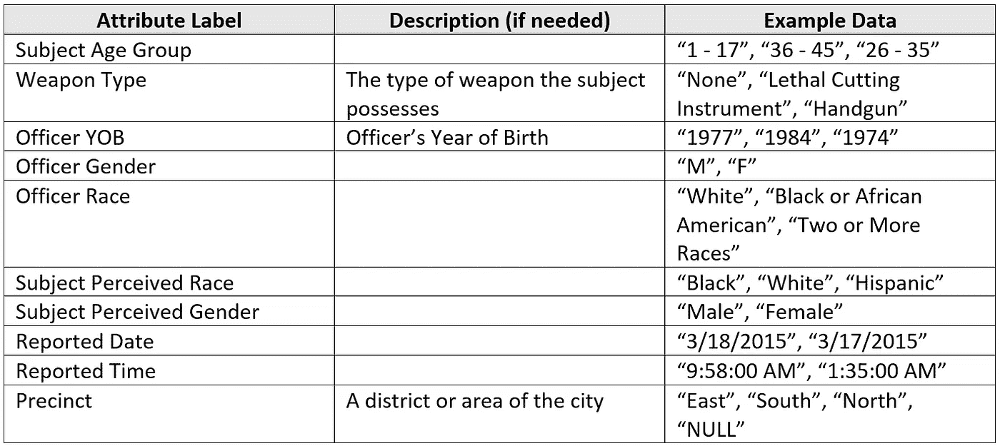

我们将用来完成这项任务的人工智能概念是一个**神经网络**。神经网络是受构成动物大脑的生物神经元启发并模仿的计算系统。神经网络接受数字阵列作为输入，然后对这些输入中的每一个应用加权来计算输出。通过使用“反向传播”,神经网络将在训练过程中“学习”,并调整其内部权重，使其越来越接近所需的输出。我将特别使用一个神经网络系统，这个系统是我用微软的编程语言 C#从头开始创建的。NET 框架。我的神经网络使用双曲正切(TANH)激活函数，我有一个具有 50 个隐藏神经元的隐藏层，每层拥有一个偏置神经元，我使用 0.018 的学习率进行反向传播。

神经网络本质上是复杂的矩阵计算器。计算器只接受数值，不接受数据集中存在的字符串(文本)值。这意味着我们需要对数据进行一些翻译，以便计算机能够理解输入。除了军官的出生年份之外，该数据集中提供的所有属性都需要从字符串值转换为数字值。

那么我们如何将这些字符串值转换成数字呢？对于每个属性中的每个唯一值，我们将创建另一个属性，如果原始属性与该唯一值匹配，则包含值 1，如果不匹配，则包含值 0。例如，如果我们要对*主题感知种族*属性进行转换，并且该属性的唯一值只有“白人”、“黑人”和“西班牙裔”，我们将创建新属性“主题 _ 是 _ 白人”、“主题 _ 是 _ 黑人”和“主题 _ 是 _ 西班牙裔”。对于每条记录，如果受试者感知的种族与这些新属性相匹配，我们将为每条新属性填入 1，如果不匹配，则填入 0。

我将这种转换应用于数据集中的许多属性，以创建新的输入列表，我们将输入到我们的神经网络中:

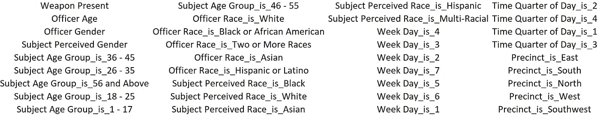

对于只包含两个唯一值(即性别)的属性，我们不必应用这种转换。对于这些属性，我只是将其中一个值替换为 0，将另一个值替换为 1。对于性别，我将所有“男性”值替换为 0，将所有“女性”值替换为 1。

在我们准备好训练我们的神经网络之前，还有一个转换必须应用。*军官年龄*字段包含范围从 22 到 69 的值。神经网络将一个**激活函数**应用到它们的每个内部计算中，以模拟生物神经元的阈值“触发”。TANH(以及许多常用的激活函数)的美妙之处在于，输出将始终在–1 和 1 的范围内，防止内部权重在训练时膨胀到无穷大。

双曲正切函数**是非线性的**，这意味着输出的梯度(导数)不一致。这种非线性赋予每个神经元**“激发或不激发”**的特性，这在动物的生物神经元中是可以找到的。此外，激活函数的非线性使得我们的神经网络能够发现数据中的非线性趋势。每个神经元由动作电位(输入值)刺激，然后通过双曲正切函数传递。如果动作电位足够高，神经元就会“点火”，将正数传递给下一层的每一个神经元。这个输出然后被连接神经元和下一层神经元的轴突**放大或沉默**。

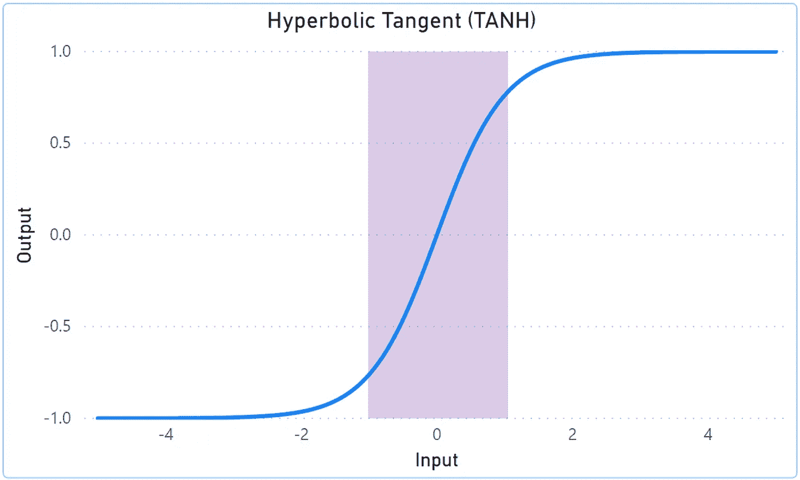

由于双曲正切函数的梯度在–1 和 1 之间最为显著(如上图中的紫色框所示)，我们将对数据集的连续属性应用最小-最大归一化，以将其向下“归一化”(拉伸)至–1 和 1 之间。我们需要应用的唯一属性是“军官年龄”属性。

在对上面详细描述的数据进行转换之后，我们现在准备好训练我们的神经网络。我们的数据集包含 13，573 条完整且可用的记录。我决定用 75%的数据来训练我们的模型，剩下的 25%用来测试我们神经网络预测的准确性。在初始化了具有 38 个输入节点、50 个隐藏节点和 2 个输出节点的新神经网络之后，我们准备好训练我们的模型。像这样大规模的神经网络训练可能是计算密集型的，需要一些时间，所以我将工作负载外包给了微软 Azure 的计算优化 FSV2 虚拟机的一个实例，该虚拟机由英特尔的至强白金处理器提供支持。

下面是我们正在使用的神经网络图。原谅我的小文本，但它必须小，以适应。

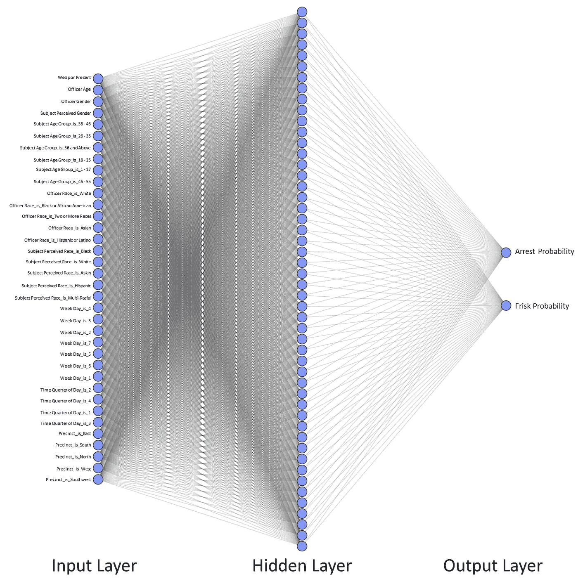

10，180 次训练迭代和 38 小时后，我们有了一个完全训练好的神经网络，可以做预测了。大约有 3393 个预测，所以我不能在这里全部显示出来。但是，以下是对结果的高级分析。

# **预测精度**

**神经网络正确预测逮捕了吗？**

神经网络计算了每个事件记录中发生逮捕的概率。对于网络预测最有可能逮捕的 100 条记录，在这 100 起事件中有 47 起真的发生了逮捕。相反，网络预测的 100 条记录中*最不可能*被逮捕，事实上，其中 73 条*没有*导致逮捕。结合这两个指标，这意味着在前 200 个最极端的案例中，预测正确 120 次，或成功率为 60%。比扔硬币要好，但还不足以非常自信！这是否意味着我们的神经网络失败了？不一定。如果我们后退一步，我们可以认识到输入的数据可能与逮捕的机会没有很大的相关性。我敢肯定，有更多的逮捕发生的决定因素没有在这个数据集中进行测量——对象的举止，药物和酒精的影响，交谈中的尊重，以及以前的犯罪历史都是警察在拦截中可能的决定因素，没有作为输入纳入我们的模型。因此，由于数据的性质，我们可能要求我们的神经网络执行一项不可能的任务。

**神经网络是否正确预测了搜身？**

与逮捕类似，我们的神经网络也计算了每起事件发生搜身的概率。对于网络预测最有可能被搜身的 100 条记录，实际上有 82 条被搜身了。对于网络预测最不可能被逮捕的 100 条记录来说，事实上有 87 条记录没有被搜身，而不是被 T2 搜身。总的来说，这意味着我们的模型在 200 个案例中有 169 个是正确的，或者说成功率大约为 85%。这相对于停搏预测的准确性是一个很大的改进，并且足够高，让我相信我们的模型在数据中发现了很强的相关性。为什么不是 100%呢？请记住，这是不完善和不完整的信息。这并没有(也可能永远不会)完全捕捉到*在每个警察停车时发生的每一件事*。因此，期望从我们提供的有限数据中获得近乎完美的预测精度是不合理的。理论上，随着我们提供更多相关数据，这种准确性应该会提高。

现在将我们的范围改为整个测试数据集，神经网络在 66%的情况下正确预测了逮捕，在 75%的情况下正确预测了搜查。虽然这些结果并不完美，但它们确实表明我们的神经网络能够从数据的相关性中提取和学习。那么神经网络是怎么做到的呢？让我们进一步分析结果，尝试阐明相关性。

# **属性关联**

**武器出现**

武器的存在如何影响逮捕或搜身的预测？在我们的网络最有信心逮捕的前 100 个案例中，有 70 个案例确实有武器。在我们的网络最有信心进行搜身的前 100 个场景中，武器出现了 94 次。另一方面，在最不可能被逮捕或搜身的 100 个案例中，没有一个案例带有武器。这非常表明，这种输入是神经网络预测结果的强有力指标。

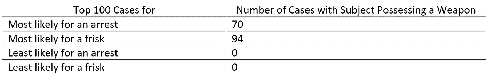

最有可能搜身时携带武器的案件有 94 起，最有可能逮捕时携带武器的案件有 70 起，这一事实表明，武器的存在与搜身而不是逮捕更有关联。这可能与常识相反，但实际上可能是有道理的——也许如果有武器，搜身几乎总是会发生，但考虑到武器可能是合法拥有的，并不总是导致逮捕。

**官龄**

军官的年龄如何影响我们的预测？以下是结果:

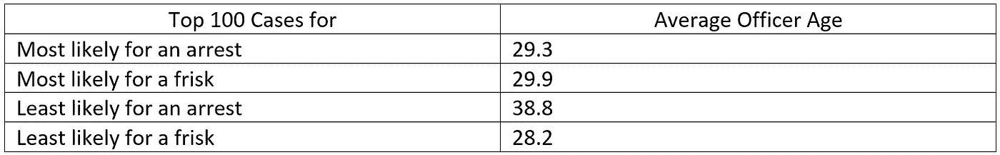

最有可能被捕的平均年龄是 29.3 岁，而最不可能被捕的平均年龄是 38.8 岁。这是一个巨大的差异！这意味着我们的神经网络已经发现了警官年龄和被捕几率之间的相关性，并表明年轻警官比年长警官更有可能实施逮捕。也许年纪较大的警官成熟到不需要进行逮捕，或者积极地试图完全避免这种情况。也许年纪较大的官员通常更多地担任管理角色，因此不太可能实施逮捕。

最有可能搜身和最不可能搜身的平均年龄非常相似——29.9 岁和 28.2 岁，所以不足以进行深入研究和推断。

**军官性别**

军官的性别如何影响我们的预测？

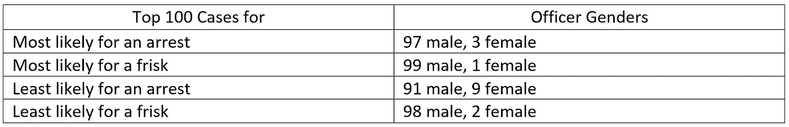

这里没有大的区别，但有些值得注意。如果警察的性别是男性而不是女性，被逮捕和搜身的可能性更大。尤其是考虑到被捕的可能性。

**主题性别**

受试者的性别如何影响我们的预测？

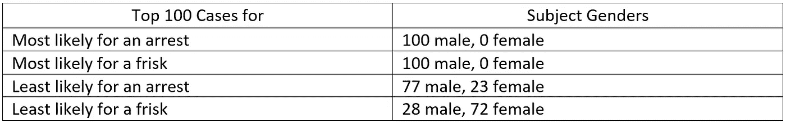

我们的神经网络已经注意到了这种明显的相关性。无论是最有可能逮捕的案件还是最有可能搜身的案件，研究对象都是 100%的男性。当观察最不可能逮捕和最不可能搜身的案件时，这一比率变化很大。最不可能被逮捕的案件中只有 77%是男性(23%是女性)，而最不可能被搜身的案件中，男性比例骤降至 28%(72%是女性)。

最有可能搜身和最不可能搜身的男女比例发生了巨大变化。最有可能的情况下是 100%男性，最不可能的情况下是 72%女性！为什么会这样？我们可以做出许多假设，并用数据来检验每一个假设，但我的最佳猜测是，这是因为由于潜在的性骚扰反弹或诉讼，警察不太可能对女性进行搜身。

这是否意味着官员在工作中有意识或无意识的偏见？也许吧！但是匆忙得出这样的结论是危险的…这可能是许多事情的结果。从理论上讲，这也可能是男性从事的活动的违法程度比女性平均水平更严重的结果。

**学科年龄**

受试者的年龄如何影响我们的预测？让我们来看看结果:

*最有可能被捕:*

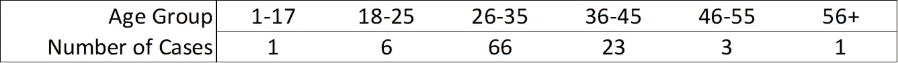

*最有可能搜身的:*

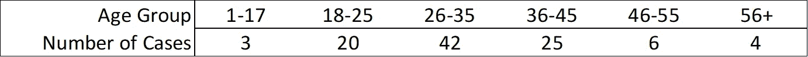

*最不可能被逮捕:*

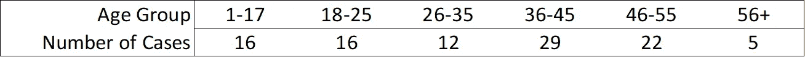

*最不可能搜身的:*

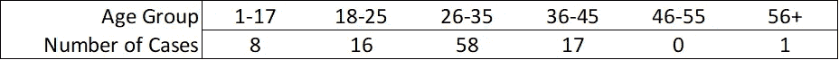

请注意，在被标记为最有可能被捕的前 100 个案例中，有 66 个案例的年龄在 26 至 35 岁之间。这意味着我们的神经网络表明这个年龄范围特别容易被逮捕。再问一次，这是否意味着西雅图的警察对这个年龄范围有偏见？也许，但不一定。这可能是该年龄段的人从事的非法活动比其他年龄段的人多得多的结果。

另一方面，最不可能被逮捕的人有更多的年轻和年长的人，这表明这些年龄的人确实不太可能被逮捕。类似的趋势也适用于弗里斯克的预测。

**军官竞赛**

军官的种族作为一个属性如何影响我们模型的预测？

*最有可能被捕:*

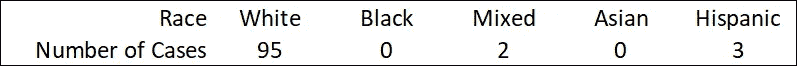

*最有可能被搜身的:*

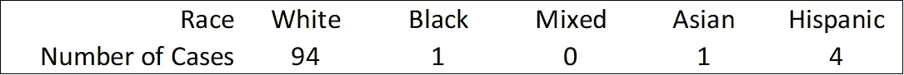

*最不可能被逮捕:*

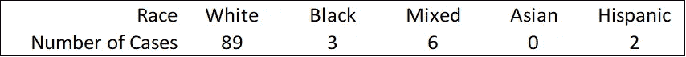

*最不可能搜身:*

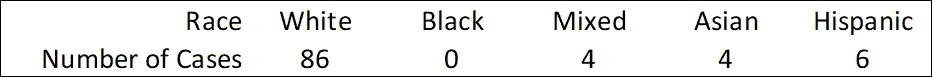

这里的比率变化不大，不能提供有用的信息来推断模式或得出结论。

**学科竞赛**

受试者的种族如何影响我们的预测？

*最有可能被捕:*

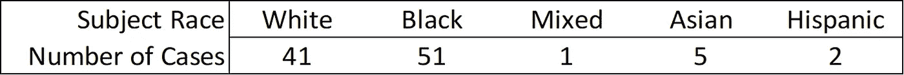

*最有可能搜身的:*

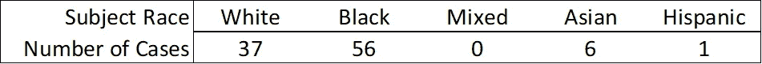

*最不可能被逮捕:*

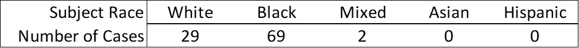

*最不可能搜身的:*

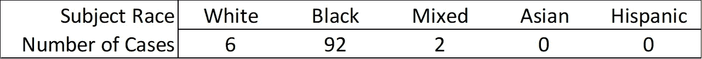

与警官的种族相似，受试者的种族似乎不是逮捕或搜身结果的有影响的决定因素，但也许在某些地区有一些小的关联。然而，请注意最有可能搜身的案例和最不可能搜身的案例之间的组合变化。最不可能搜身的案件非常严重地偏向黑人。为什么警察比其他种族的警察更少对黑人搜身？没有办法用我们现有的数据来判断，但神经网络现在已经警告我们这一趋势——如果我们有这些资源可供支配，我们可以选择用其他方法和数据来进一步挖掘。

最有可能和最不可能的逮捕组合非常相似。这是不是意味着我们的神经网络坏了？不，这表明这一指标与逮捕或搜身的可能性之间没有很大的关联。

**星期几**

星期几如何影响预测？

*最有可能被逮捕:*

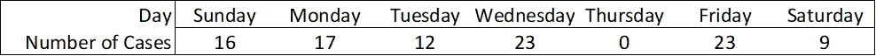

最有可能被搜身的是:

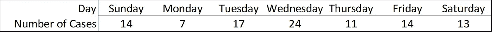

*最不可能被逮捕:*

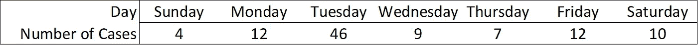

最不可能搜身的是

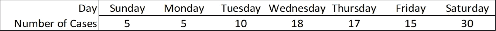

除了周二被捕的可能性最小之外，这里似乎没有任何值得注意的趋势。

**一天中的时间**

我们把一天的时间分成四个不同的组:午夜到早上 6 点，早上 6 点到中午，中午到下午 6 点，下午 6 点到午夜。我们完全可以把它分成 24 小时，甚至更长时间，但是这样效率很低，而且可能不会有什么深刻的发现。训练我们的神经网络需要更多的时间，所以我妥协了，把一天中的时间分成四组。以下是结果:

*最有可能被捕:*

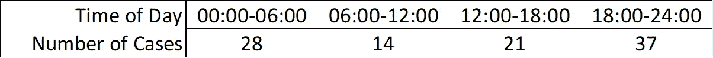

*最有可能搜身的:*

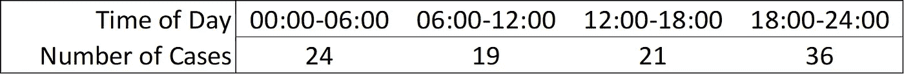

*最不可能被捕:*

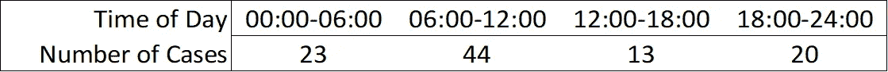

*最不可能搜身的:*

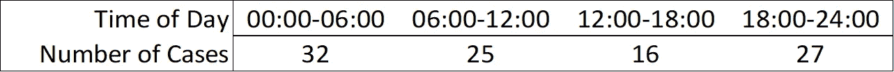

结果表明了你的预期:逮捕和搜身更有可能发生在深夜或凌晨。

**辖区**

最后，辖区如何影响我们神经网络的预测？数据集的 terry 停靠点出现在五个不同的区域:北部、东部、南部、西部和西南部。

*最有可能被捕:*

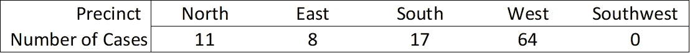

*最有可能搜身的:*

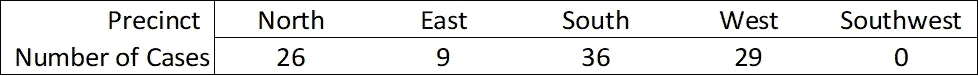

*最不可能被逮捕:*

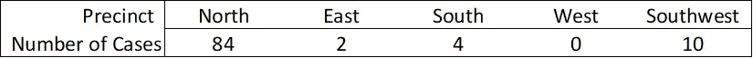

*最不可能搜身的:*

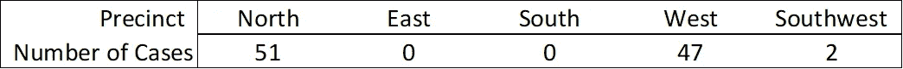

这里最清楚的指标在于逮捕数据:请注意，我们的网络预测的最有可能*逮捕的前 100 起案件中有 64%发生在西区。进一步重申这一点，在我们的神经网络最有信心逮捕不会*不会*发生的前 100 条记录中，北部似乎是一个相对安全的区域，84%的记录在北部，而西部没有记录发生！*

这让我们清楚地看到西雅图的哪些选区可能是安全的，哪些选区可能会变得更加危险。从神经网络做出的预测中，我们可以推断，与西部或者南部相比，北部和西南部是城镇中相对安全的部分。

但是这个假设有保证吗？绝对不行！也许数据是扭曲的——可能西雅图警察局有更多的警察在某些地区巡逻，比如西部，这就是那里有更多逮捕的原因。然而，这一反驳点可能被证明是错误的，因为北部是可能发生搜身的地区之一，这表明那里确实有警察存在。

# **总结**

如前所述，我们的神经网络正确预测逮捕的准确率为 66%，正确预测搜身的准确率为 75%。虽然这些数字并不完美，但它们比扔硬币要好，表明我们的模型能够发现并学习输入数据与逮捕或搜身可能性之间的相关性。

这对我们有什么用？回想起来，这种学习模型可以帮助警察或政府官员发现数据中的异常和趋势。这些见解可用于帮助规划资源分配。例如，如果神经网络模型发现一种趋势，即逮捕很可能发生在城镇的特定地区，在一周的特定日期，在一天的特定时间，官员可以将更多的警力资源分配到该地区，以在犯罪活动发生之前主动预防犯罪活动。在人工分析的监督下，像这样的多层趋势通常很难发现；多亏了神经网络，我们现在可以揭示这些趋势。

我为处理这个数据集而创建的神经网络花了大约 38 个小时来训练 10，180 个例子，或者每次迭代大约 13.5 秒。训练时间长的原因是计算密集型顺序反向传播算法，该算法调整模型的内部权重以更好地逼近每个输出。幸运的是，正向传播(要求模型做出预测)要快得多。即使比我们在这里使用的模型更深的模型也可以在不到十分之一秒的时间内做出预测，即使是在像 5 美元的 Raspberry Pi Zero 这样的低功耗廉价硬件上。

在一个神经网络被创建并在至少性能良好的硬件上训练之后，该模型可以被部署到低性能硬件上，这样它的预测能力就可以在“边缘”(前线)使用——通过物联网设备在警察手中使用。也许在未来，警察将佩戴一系列小型物联网传感器，这些传感器可以实时捕获比该数据集中列出的更多的数据:对话对话、面部表情图像、与对象的接近程度等等。这些传感器可以通过应用情绪分析(可能也由另一个神经网络驱动)来判断对话的情绪，并将其对对话中紧张程度的估计作为输入传递给我们的模型。计算机视觉技术，如微软的 Azure Face 认知服务，可以分析实时图像，并对军官和受试者的压力水平进行预测，并将这些作为输入传递给我们的模型。你甚至可以给警察配备心率监测器或皮质醇监测设备来检测压力或不适，并以此作为输入。

所有这些输入都可以输入到每个官员佩戴的小型离散物联网设备中。这种设备将使用最新版本的经过训练的神经网络，随着情况的发展，不断预测逮捕或搜身的可能性。如果逮捕的可能性超过了预定的阈值，连接的物联网设备可以自动向该地区的另一名官员发出支持信号。军官们将不再需要自己通过无线电寻求帮助，这可能会通过诱导受试者的“战斗或逃跑”反应来使局势进一步升级，并且还会使他们自己处于这样做的潜在反弹的危险中。

随着物联网传感器在各个经济部门的各个业务领域变得越来越普遍，高质量数据的可用性将会增加。幸运的是，希望参与这场数据驱动的人工智能革命的组织可以通过价格合理的现成技术来实现。这样做将极大地改进学习模型，因为引入了高度相关的数据，增强了模型的预测准确性。我鼓励任何对企业数字化转型感兴趣的组织领导者进行投资——与未来的收益或成本节约相比，今天的成本可能微不足道。