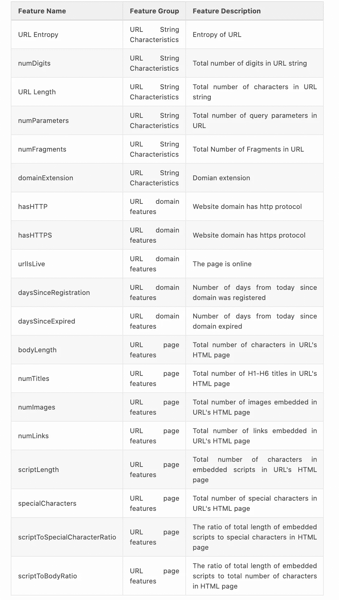
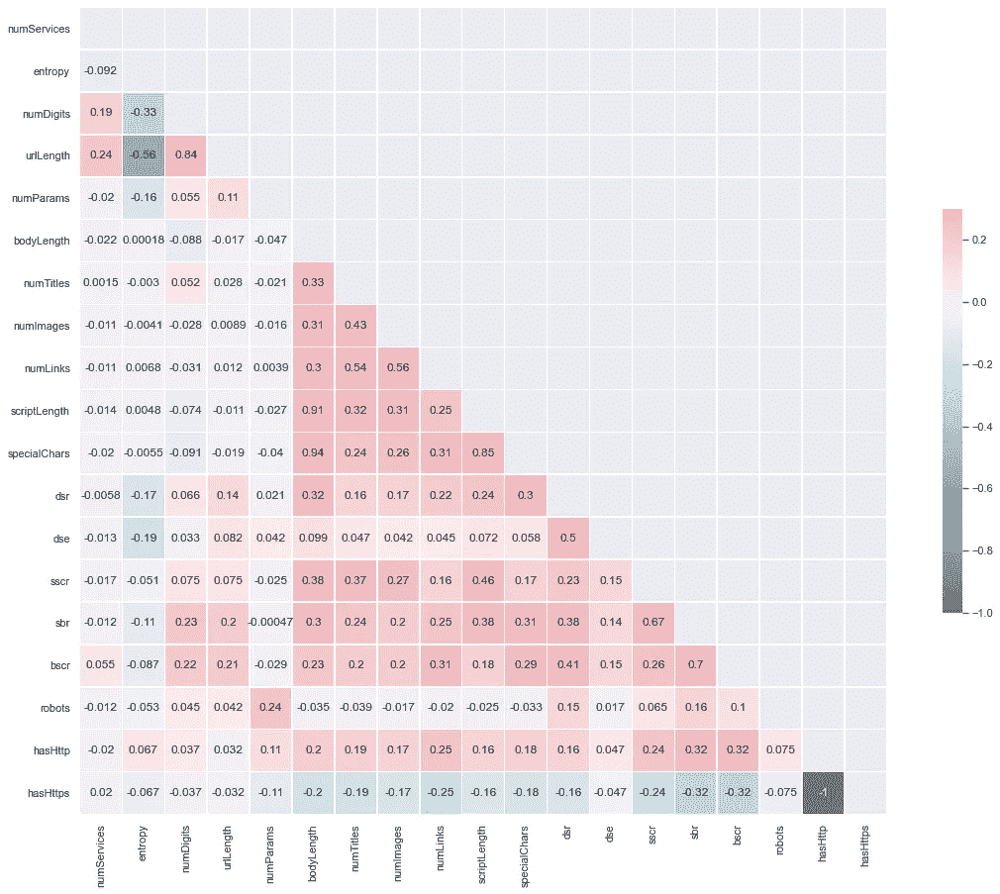
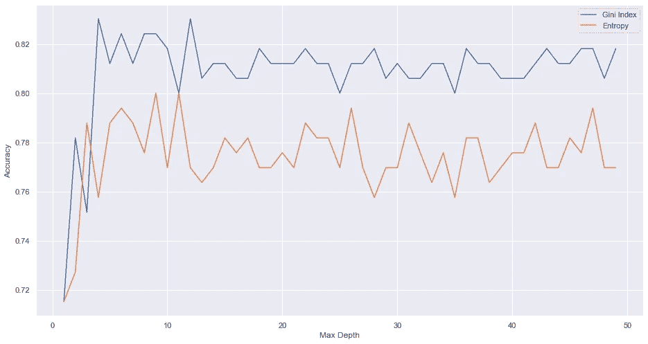

# 预测网址的恶意性

> 原文：<https://towardsdatascience.com/predicting-the-maliciousness-of-urls-24e12067be5?source=collection_archive---------11----------------------->

## 创建用于分离恶意和良性 URL 的特征向量

在本文中，我们将逐步开发一个用于识别恶意 URL 的简单特性集表示。我们将为 URL 创建特征向量，并使用这些向量来开发用于识别恶意 URL 的分类模型。为了评估这些特征在区分恶意网址和良性网址方面有多好，我们建立了一个基于决策树的机器学习模型来预测给定网址的恶意性。

恶意网站是网络安全中众所周知的威胁。它们是在线传播病毒、蠕虫和其他类型恶意代码的有效工具，并且是大多数网络攻击的 60%以上的罪魁祸首。恶意 URL 可以通过电子邮件链接、文本消息、浏览器弹出窗口、页面广告等方式发送。这些 URL 可能是指向可疑网站的链接，或者很可能嵌入了“可下载内容”。这些嵌入的下载可能是间谍软件、键盘记录器、病毒、蠕虫等。因此，及时检测和缓解恶意代码在其网络中的传播已成为网络防御人员的当务之急。恶意 URL 检测器的各种技术以前主要依赖于 URL 黑名单或签名黑名单。这些技术大多提供“事后”解决方案。为了提高恶意 URL 检测方法的及时性和抽象性，机器学习技术正日益被接受。

为了开发机器学习模型，我们需要一个特征提取框架来表征 URL 或将 URL 转换为特征向量。在本文中，我们将收集已知恶意网址和已知良性网址的样本。然后，我们开发一个指纹识别框架，并为样本中的所有 URL 提取一组给定的***【M】***特征。我们通过开发一个具有这些特征的简单预测模型来测试这些特征在区分恶意 URL 和良性 URL 方面的有效性。最后，我们测量模型预测恶意网址的能力，作为区分恶意网址和良性网址的特征的有效性。

下图是本文中方法流程的概述。


分析处理

# 数据

我们从两个来源收集数据:Alexa 1000 强网站和 phishtank.com。从 Alexa 的前 1000 个网站中抓取了 1000 个假定的良性 URL，从[phishtank.com](http://phishtank.com)中抓取了 1000 个可疑的恶意 URL。由于 virustotal API 的限制率，我们随机抽取了 500 个假定的良性 URL 和 500 个假定的恶意 URL。然后通过[病毒扫描这些网址。检测到 0 个恶意内容的 URL 被标记为良性(b_urlX)，检测到至少 8 个恶意内容的 URL 被标记为恶意(m_urlX)。我们将每次扫描的 JSON 结果转储到相应的文件‘b _ urlx . JSON’、‘m _ urlx . JSON’中。您可以在这里](https://eneyi.github.io/2020/04/01/virustotal.com)找到这些文件[。](https://github.com/eneyi/dataarchive/tree/master/pmurls/data/featurized)

```
from requests import get
from os import listdir
import pandas **as** pd
import numpy **as** np
from pandas.io.json import json_normalize
import seaborn **as** sns
import matplotlib.pyplot **as** plt
import math
from datetime import datetime
plt**.**rcParams["figure.figsize"] **=** (20,20)
```

# 处理应用编程接口速率限制和 IP 阻塞

为了确认示例中的恶意 URL 是恶意的，我们需要向 VirusTotal 发送多个请求。病毒扫描提供多个病毒扫描引擎的汇总结果。此外，我们通过(Shodan)[shodan.io]传递 URL。Shodan 是所有连接到互联网的设备的搜索引擎，提供基于服务的 URL 服务器功能。VirusTotal 和 Shodan 目前的 API 速率限制分别是每分钟 4 个请求和每个 API 密钥每月至少 10，000 个请求。虽然对数据的 URL 请求数量在 Shodan API 请求限制之内，但事实证明，病毒总数有点困难。这是通过创建几个虚拟磁带库应用编程接口密钥(最多 4 个)并在每个请求中随机采样来解决的。除了限制 API 请求的数量之外，在短时间内发送多个请求还会导致来自 VT 和 Shodan 服务器的 IP 阻塞。我们编写了一个小爬虫，从[https://free-proxy-list.net/](https://free-proxy-list.net/)获取最新的精英 IP 地址集，并为每个请求创建一个新的代理列表，因为自由代理的寿命非常短。除了 IP 池之外，我们还使用 Python 的 FakeUserAgent 库在每个请求上切换用户代理。

最后，对于每个请求，使用新的代理和用户代理，我们可以每分钟发送 16 个请求，而不是之前的 4 个。每个请求都有以下请求参数:

*   1 病毒总密钥:来自 VT API 密钥池的样本。
*   1 Shodan 密钥:来自 Shodan API 密钥池的示例。
*   1 IP:向[https://free-proxy-list.net/](https://free-proxy-list.net/)发送请求，获取最新的免费精英代理。
*   1 用户代理:Python 的可用用户代理示例(假冒用户代理)[https://pypi . org/project/假冒用户代理/]

Shodan 和 VT 的扫描产生了以下[数据集](https://github.com/eneyi/dataarchive/blob/master/pmurls/data/scanned_data.csv)。从 shodan 中，我们提取了以下特征:

*   numServices:主机上运行的服务(开放端口)总数
*   robotstxt:网站是否启用了 robots txt

扫描后的最终数据集在[这里](https://eneyi.github.io/2020/04/01/predicting-the-maliciousness-of-urls.html)可用。您可以下载这些数据并运行您的分析。

# 指纹 URL(用于恶意软件 URL 检测的特征 URL)

目标是提取 URL 特征，这些特征对于区分恶意 URL 和良好 URL 非常重要。首先，让我们看看一个 URL 的结构中的相关部分。


典型的 URL

URL(统一资源定位器的缩写)是一种引用，它指定了 web 资源在计算机网络上的位置以及检索它的机制。如下图所示，URL 由不同的组件组成。该协议或方案规定了如何(或需要什么)传输信息。主机名是计算机网络上计算机 IP 地址的人类可读的唯一引用。域名服务(DNS)命名层次结构将 IP 地址映射到主机名。被攻破的网址被用来实施网络攻击。这些攻击可能是任何或多种形式的网络钓鱼电子邮件、垃圾邮件和驾车下载。

关于域名，所有者购买人们觉得更容易记住的域名。所有者通常希望他们提供的品牌、产品或服务的名称是特定的。URL 的这一部分(域)一旦设置就不能更改。恶意域名所有者可能会选择多个廉价域名，例如“xsertyh.com”。

免费 URL 参数是 URL 的一部分，可以通过更改来创建新的 URL。这些包括目录名、文件路径和 URL 参数。这些免费的 URL 参数通常被攻击者操纵来创建新的 URL、嵌入恶意代码并传播它们。

有许多用于恶意 URL 检测的技术，两种主要技术是 a)黑名单技术，和 b)机器学习技术。黑名单包括维护已知恶意域的数据库，并将新 URL 的主机名与数据库中的主机名进行比较。这是一个“事后”问题。它将无法检测新的和看不见的恶意网址，只有当它被认为是来自受害者的恶意网址时，它才会被加入黑名单。另一方面，机器学习方法提供了一种可跨平台推广且独立于已知签名的先验知识的预测方法。给定恶意和良性恶意软件样本的样本，ML 技术将提取已知好的和坏的 URL 的特征，并概括这些特征以识别新的和看不见的好的或坏的 URL。

URL 指纹识别过程针对 3 种类型的 URL 功能:

*   URL 字符串特征:源自 URL 字符串本身的特征。
*   URL 域特征:URL 域的域特征。其中包括 whois 信息和 shodan 信息。
*   页面内容特征:从 URL 的页面提取的特征(如果有的话)

下表显示了提取的所有特征的摘要:



URL 的特征向量摘要

运行上面的脚本会产生以下带有 23 个特征的数据。我们将把整数、布尔值和对象列名放在不同的列表中，以便于数据访问。

```
objects **=** [i **for** i **in** data**.**columns **if** 'object' **in** str(data**.**dtypes[i])]
booleans **=** [i **for** i **in** data**.**columns **if** 'bool' **in** str(data**.**dtypes[i])]
ints **=** [i **for** i **in** data**.**columns **if** 'int' **in** str(data**.**dtypes[i]) **or** 'float' **in** str(data**.**dtypes[i])]
```

# 移除高度相关的要素

最线性分析假设预测变量之间不存在多重共线性，即预测要素对不得相关。这种假设背后的直觉是，没有额外的信息添加到具有多个相关特征的模型中，因为相同的信息被其中一个特征捕获。

多重相关特征也表示数据中的冗余特征，删除它们是数据降维的良好开端。通过移除相关特征(仅保留一组观察到的相关特征)，我们可以解决预测值之间的特征冗余和共线性问题。

让我们创建一个简单的相关性网格来观察恶意和良性 URL 的派生特征之间的相关性，并删除一个或多个高度相关的特征。

```
corr **=** data[ints**+**booleans]**.**corr()
*# Generate a mask for the upper triangle* mask **=** np**.**triu(np**.**ones_like(corr, dtype**=**np**.**bool))*# Set up the matplotlib figure* f, ax **=** plt**.**subplots(figsize**=**(20, 15))*# Generate a custom diverging colormap* cmap **=** sns**.**diverging_palette(220, 10, as_cmap**=**True)*# Draw the heatmap with the mask and correct aspect ratio* sns**.**heatmap(corr, mask**=**mask, cmap**=**cmap, vmax**=**.3, center**=**0,
            square**=**True, linewidths**=**.5, cbar_kws**=**{"shrink": .5}, annot**=**True)
```



互相关系数

然而，我们并不希望删除所有相关的变量——只删除那些相关性非常强、不会给模型增加额外信息的变量。为此，我们为观察到的正相关和负相关定义了某个“阈值”(0.7)。

我们看到大部分高度相关的特征都是负相关的。例如，在 URL 中的字符数和 URL 的熵之间存在 0.56 的负相关系数，这表明较短的 URL 具有

这里我们将创建一个函数来识别和删除多个相关特征中的一个。

# 预测 URL 的恶意性(决策树)

建模根据以前观察到的数据模式构建了解释数据的蓝图。建模通常是预测性的，因为它试图使用这种开发的“蓝图”来预测基于过去观察的未来或新观察的值。

基于提取的特征，我们想要最好的预测模型来告诉我们一个看不见的 URL 是恶意的还是良性的。因此，我们寻求有用功能的独特组合，以准确区分恶意和良性 URL。我们将经历两个阶段，特征选择，其中我们只选择对预测目标变量有用的特征，并用决策树建模以开发恶意和良性 URL 的预测模型。

# 特征选择

什么样的变量对识别一个网址是“恶意的”还是“良性的”最有用？在计算上，我们可以通过测试哪些变量“改善”或“未能改善”预测模型的整体性能，来自动选择哪些变量最有用。这个过程被称为“特征选择”。特征选择还有助于降低数据的维数，解决计算复杂性和模型性能的问题。特征选择的目标是获得原始数据的有用子集，该子集以不丢失有用信息的方式预测目标特征(一起考虑所有预测)。尽管特征选择超出了简单的相关性消除，但是对于本文，我们将我们的特征选择方法限制为仅仅保留这些特征。让我们创建一个只包含不相关要素的原始数据子集。

```
predictor_columns **=** data2**.**columns
d **=** data2[predictor_columns]
x, y **=** d[predictor_columns], data['vt_class']
```

我们只保留对模型有独特贡献的特征。我们现在可以开始用原始样本的 70%和这 14 个特征来开发模型。我们将保留 30%的样本来评估模型在新数据上的性能。

*   数字服务
*   熵
*   数字
*   数字图表
*   体长
*   数字标题
*   数字图像
*   数字链接
*   每日业务报告(Daily Service Report)
*   data-storageequipment 数据储藏设备
*   sscr
*   小触须（同 small bristles）
*   机器人
*   哈希 Http

```
from sklearn.model_selection import train_test_split
X_train, X_test, y_train, y_test **=** train_test_split(x, y, test_size **=** 0.3, random_state **=** 100)
```

# 决策树

```
from sklearn import tree
from sklearn.metrics import accuracy_scorefrom sklearn.externals.six import StringIO  
from IPython.display import Image  
from sklearn.tree import export_graphviz
import pydotplus
```

有多种机器学习算法(分类)算法可用于识别恶意 URL。在将 URL 转换成代表性的特征向量之后，我们将“恶意 URL 识别问题”建模为二元分类问题。二元分类模型为只有两种结果“恶意”和“良性”的类训练预测模型。批量学习算法是在以下假设下工作的机器学习算法:

`- the entire training data is available before model development and`

`- the target variable is known before the model training task.`

批处理算法是理想和有效的，因为它们是可解释的区分学习模型，使用训练数据点之间的简单损失最小化。决策树是机器学习中的一种批量学习算法。

在决策分析中，决策树是模型得出某些结论的决策过程的可视化表示。决策树背后的基本思想是试图理解什么因素影响类成员，或者为什么一个数据点属于一个类标签。决策树清楚地显示了构成类成员的条件。因此，它们是决策过程的可视化表示。

决策树通过将数据集分解成越来越小的部分来构建预测模型。分割子集的决定基于最大化分割的信息增益或最小化分割的信息损失。从根节点(没有不确定性的最纯粹的特征)开始，通过基于子集的纯粹性创建各种叶节点来形成树。

在这种情况下，决策树将解释每个特征的类别边界，以将 URL 分类为恶意或良性。构建决策树时，有两个主要因素需要考虑:

`- a) What criteria to use in splitting or creating leaf nodes and
- b) tree pruning to control how long a tree is allowed to grow to control the risk of over-fitting.`

决策树算法的 criteria 参数指定控制什么标准(Gini 或熵),而 max_depth 参数控制允许树增长多远。基尼系数是指如果我们根据分支中的分布随机选择一个标签，随机样本被错误分类的概率。熵是对信息(或者说缺乏信息)的一种度量。

不幸的是，由于事先不知道标准和树深度的正确组合，我们将不得不反复测试这两个参数的最佳值。我们针对两个标准测试了 50 次迭代的 max_depth，并可视化了模型准确度分数。



参数调谐

似乎最好的模型是最简单的模型，基尼指数和最大深度为 4，样本外准确率为 84%。此外，最大化熵似乎不会产生好的结果，这表明添加到模型中的新参数不一定给出新的信息，但是可以产生改进的节点概率纯度。因此，我们可以用 max_depth = 4 和 Gini 标准来拟合和可视化该树，以识别哪些特征在分离恶意和良性 URL 中最重要。

建立模型…

```
*###create decision tree classifier object* DT **=** tree**.**DecisionTreeClassifier(criterion**=**"gini", max_depth**=**4)*##fit decision tree model with training data* DT**.**fit(X_train, y_train)*##test data prediction* DT_expost_preds **=** DT**.**predict(X_test)
```

想象这棵树…

```
dot_data **=** StringIO()
export_graphviz(DT, out_file**=**dot_data,  
                filled**=**True, rounded**=**True,
                special_characters**=**True,feature_names**=**X_train**.**columns, class_names**=**DT**.**classes_)
graph **=** pydotplus**.**graph_from_dot_data(dot_data**.**getvalue())  
Image(graph**.**create_png())
```


树

预测模型的准确性对 max_depth(树修剪)和分裂质量标准(节点分裂)的参数调整非常敏感。这也有助于实现最简单的简约模型，防止过度拟合，并在看不见的数据上表现得一样好。这些参数特定于不同的数据问题，最好测试不同参数值的组合。

该模型显示，恶意 URL 的脚本与特殊字符比率(sscr)较低，URL 字符相对更“有序”或更单调。此外，恶意网址的域名可能在 5-9 个月前已经过期。我们还知道“恶意广告”的问题，即骗子获得过期合法域名的所有权，以分发可下载的恶意代码。最后，大概良性 URL 最显著的特点就是长寿。他们似乎缓和了 HTML 正文内容中脚本与特殊字符的比例，使域名寿命延长到 4-8 年。