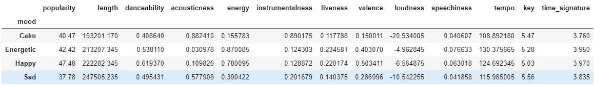
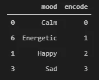
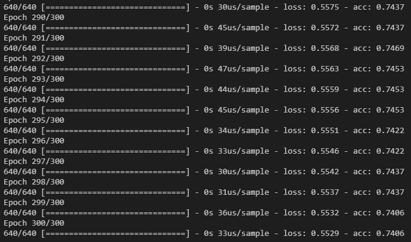
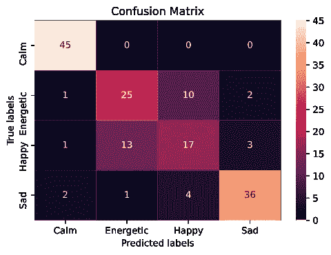
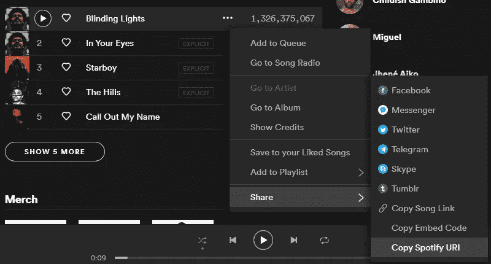
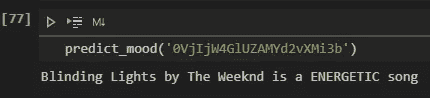

# 用深度学习预测一首歌的音乐情绪。

> 原文：<https://towardsdatascience.com/predicting-the-music-mood-of-a-song-with-deep-learning-c3ac2b45229e?source=collection_archive---------7----------------------->

## 使用 Python 上的 Keras 和 Tensorflow 库，通过神经网络模型预测音乐曲目情绪的酷方法。


乌列尔·索伯兰斯在 [Unsplash](https://unsplash.com/s/photos/music-mood?utm_source=unsplash&utm_medium=referral&utm_content=creditCopyText) 上拍摄的照片

音乐是一种表达我们情感的强大语言，在很多情况下，它被用来治疗我们生活中的困难时刻。情绪和心情可以很容易地反映在音乐中，当我们做运动时，我们倾向于听充满活力的音乐，同样，当我们焦虑或疲劳时，一首优美放松的歌曲可以帮助我们平静下来。这就是为什么我试图弄清楚分类模型如何帮助确定特定曲目的情绪。

在这篇文章中，我将展示并解释我如何使用一个用于分类的**多类神经网络**和 Spotify 提供的一个很酷的数据集来实现这个想法。所以不要再说了，让我们开始工作吧！！。

*我的 Github 存储库中的全部代码、脚本、笔记本和数据([点击此处](https://github.com/cristobalvch/Spotify-Machine-Learning))

# 所需工具:

*   **熊猫**和 **Numpy** 进行数据分析。
*   **Keras 和 Tensorflow** 构建深度学习模型。
*   **Sklearn** 验证模型。
*   **Seaborn** 和 **Matplotlib** 绘制一个漂亮的图形。
*   **Spotipy** Python 库([点击这里](https://spotipy.readthedocs.io/en/2.13.0/)了解更多信息)。
*   **Spotify 凭证**访问其 API 和数据采集([点击此处](https://developer.spotify.com/)了解更多信息)。

# Spotify 音频功能:

Spotify 使用一系列不同的功能对歌曲进行分类。我从 Spotify 网页复制/粘贴信息。

*   声音:一种置信度，从 0.0 到 1.0，表示音轨是否是声音的。1.0 表示音轨是声学的高置信度。
*   可跳舞性:可跳舞性描述了一个曲目在音乐元素组合的基础上适合跳舞的程度，包括速度、节奏稳定性、节拍强度和整体规律性。值 0.0 最不适合跳舞，1.0 最适合跳舞。
*   能量:能量是一个从 0.0 到 1.0 的度量，代表强度和活动的感知度量。通常，高能轨道感觉起来很快，很响，很嘈杂。例如，死亡金属具有高能量，而巴赫前奏曲在音阶上得分较低。对该属性有贡献的感知特征包括动态范围、感知响度、音色、开始速率和一般熵。
*   乐器性:预测音轨是否不包含人声。“Ooh”和“aah”在这种情况下被视为乐器。Rap 或口语词轨道明显是“有声的”。乐器度值越接近 1.0，轨道不包含人声内容的可能性就越大。高于 0.5 的值旨在表示乐器轨道，但随着该值接近 1.0，置信度会更高。
*   活跃度:检测录音中是否有观众。较高的活跃度值表示音轨被现场执行的概率增加。高于 0.8 的值很有可能表示该音轨是实时的。
*   响度:轨道的整体响度，以分贝(dB)为单位。响度值是整个轨道的平均值，可用于比较轨道的相对响度。响度是声音的质量，是与体力(振幅)相关的主要心理因素。值通常在-60 和 0 db 之间。
*   语速:语速检测音轨中是否存在口语单词。越是类似语音的录音(例如脱口秀、有声读物、诗歌)，属性值就越接近 1.0。高于 0.66 的值描述可能完全由口语单词组成的轨道。介于 0.33 和 0.66 之间的值描述可能包含音乐和语音的轨道，可以是分段的，也可以是分层的，包括说唱音乐。低于 0.33 的值很可能代表音乐和其他非语音类轨道。
*   配价:从 0.0 到 1.0 的一种量度，描述音轨所传达的音乐积极性。高价曲目听起来更积极(例如，快乐、愉快、欣快)，而低价曲目听起来更消极(例如，悲伤、沮丧、愤怒)。
*   速度:轨道的整体估计速度，单位为每分钟节拍数(BPM)。在音乐术语中，速度是给定作品的速度或步调，直接来源于平均节拍持续时间。

# 1.解释和分析数据:

为了获得数据，我必须使用 Spotipy 库创建一系列函数。这个库有助于 Spotify 服务自动下载更多关于播放列表、歌曲、艺术家音乐等的技术信息(如上所述)。出于本文的主要目的，我不会提及我是如何获得数据的，但我会解释数据由什么组成。

您可能知道，分类问题使用带标签的数据，所以我必须创建这些标签。我决定创建 4 个类别来标记曲目，这些类别是“**充满活力的**”、“**冷静的**”、“**快乐的**”和“**悲伤的**”。我根据下面这篇文章选择这些类别，这篇文章解释了按情绪对音乐进行分类的最佳方式。

[](https://sites.tufts.edu/eeseniordesignhandbook/2015/music-mood-classification/) [## 音乐情绪分类

### 本文将涵盖使用各种 DSP 和音乐理论技术分析音乐，包括节奏，和声…

sites.tufts.edu](https://sites.tufts.edu/eeseniordesignhandbook/2015/music-mood-classification/) 

然后，我在 Spotify 上搜索了一些基于这 4 个标签的不同音乐曲目的播放列表(每个标签 200 首曲目)，最后，我将所有这些曲目连接到由每个情绪标记的主数据框中。你可以在我的 GitHub 知识库上查看这个数据集([点击这里](https://github.com/cristobalvch/Spotify-Playlists/blob/master/data/data_moods.csv))

主要数据有 **800 行**和 **18 列**，但是为了信息还原的目的，我决定使用**长度**、**舞蹈性**、**声音性**、**能量**、I **乐器性**、**活跃度**、**化合价**、**响度**

**我通过标签对数据框进行分组，计算轨迹特征的平均值。我得到了以下结果:**

****

**使用平均统计分组的数据帧。(图片由作者提供)**

**做这个简单的分析，我很快注意到最流行的歌曲是快乐的，悲伤的歌曲往往有很长的长度，充满活力的歌曲节奏最快，平静的歌曲往往是有声的。**

# **2.构建模型:**

## **2.1-数据预处理:**

**为了标准化特征，我使用了**最小最大缩放器**来缩放范围为[0，1]的值，并保持原始分布的形状。我还对 4 个标签进行了编码，因为神经网络使用数值来训练和测试。最后，我将数据分成 **80%用于训练**和 **20%用于测试**。**

```
*#Libraries to pre-process the variables*
from sklearn.preprocessing import LabelEncoder,MinMaxScaler
from sklearn.model_selection import train_test_split
```

**我用来处理数据的代码:**

```
*#Define the features and the target*
col_features = df.columns[6:-3]
X = df[col_features]
Y = df['mood']*#Normalize the features*
X= MinMaxScaler().fit_transform(X)*#Encode the labels (targets)*
encoder = LabelEncoder()
encoder.fit(Y)
encoded_y = encoder.transform(Y)*#Split train and test data with a test size of 20%*
X_train,X_test,Y_train,Y_test = train_test_split(X,encoded_y,test_size=0.2,random_state=15)
```

**标签编码如下:**

****

**标签及其编码。(图片由作者提供)**

## **2.2 创建模型:**

**为了建立这个模型，我使用了 Keras 库，这个库被设计成能够快速实验**深度神经网络**，专注于用户友好。我的主要目标是将轨迹分为 4 类情绪(**平静、精力充沛、快乐和悲伤**)，因此我的模型由一个**多类神经网络**组成，输入为 **10 个特征**， **1 层**有 **8 个节点**，4 个输出**有输出层**。我还需要使用一个分类器作为估计器，在这种情况下，分类器是 **KerasClassifier** ，它将我之前使用定义的神经网络模型创建的函数作为参数。激活函数对应于一个**整流线性单元** ( **Relu)** ，损失函数是一个 L **逻辑函数**和**亚当梯度下降算法**是优化器。**

```
*#Libraries to create the Multi-class Neural Network*
from keras.models import Sequential
from keras.layers import Dense
from keras.wrappers.scikit_learn import KerasClassifier
from keras.utils import np_utils*#Import tensorflow and disable the v2 behavior and eager mode*
import tensorflow as tf
tf.compat.v1.disable_eager_execution()
tf.compat.v1.disable_v2_behavior()
```

*   ****重要提示**:我禁用了 TensorFlow 的急切执行和 v2 行为，因为我一直试图理解和学习库在那些模式下是如何工作的(抱歉我是 Tensorflow 的新手呵呵)。**

**我用来建立神经网络的代码:**

```
*#Function that creates the structure of the Neural Network*
def base_model():
    *#Create the model*
    model = Sequential()*#Add 1 layer with 8 nodes,input of 4 dim with relu function*
   model.add(Dense(8,input_dim=10,activation='relu'))*#Add 1 layer with output 3 and softmax function*
   model.add(Dense(4,activation='softmax'))*#Compile the model using logistic loss function and adam *    optimizer, accuracy correspond to the metric displayed
   model.compile(loss='categorical_crossentropy',optimizer='adam',
              metrics=['accuracy'])
   return model*#Configure the estimator with 300 epochs and 200 batchs. the build_fn takes the function defined above*.
estimator = KerasClassifier(build_fn=base_model,epochs=300,
                            batch_size=200)
```

## **3.3 评估模型:**

**使用 **K 倍交叉验证**我评估了使用训练数据的估计器。拆分的次数是 K= **10** 洗牌所有的值。**

```
*#Library to evaluate the model*
from sklearn.model_selection import cross_val_score, KFold
```

**我用来评估模型的代码:**

```
*#Evaluate the model using KFold cross validation*kfold = KFold(n_splits=10,shuffle=True)results = cross_val_score(estimator,X,encoded_y,cv=kfold)print("%.2f%% (%.2f%%)" % (results.mean()*100,results.std()*100))
```

**模型的精确度是每个折叠精确度的平均值，在本例中，精确度为 **72.75** %。**

## **3.4 训练模型:**

**是时候训练模型了！所以让我们开始编码:**

```
*#Train the model with the train data*
estimator.fit(X_train,Y_train)*#Predict the model with the test data*
y_preds = estimator.predict(X_test)
```

**需要特别提到的是，模型是用 **640 个样本**(主数据的 80%)训练的。**

**模型训练时最后一个时期的一些输出。**

****

**历元、时间、损失和训练过程中模型的准确性。(图片由作者提供)**

# **3.多类神经网络的精度；**

**最后，为了评估模型的准确性，我使用 Seaborn 库和 Matplotlib 绘制了一个混淆矩阵。我还计算了 Sklearn 库提供的准确率分数。**

```
*#Create the confusion matrix using test data and predictions*
cm = confusion_matrix(Y_test,y_preds)*#plot the confusion matrix*
ax = plt.subplot()
sns.heatmap(cm,annot=True,ax=ax)
labels = target['mood'].tolist()
ax.set_xlabel('Predicted labels')
ax.set_ylabel('True labels')
ax.set_title('Confusion Matrix')
ax.xaxis.set_ticklabels(labels)
ax.yaxis.set_ticklabels(labels)
plt.show()*#Show the accuracy score* 
print("Accuracy Score",accuracy_score(Y_test,y_preds))
```

****

**音乐情绪的混乱矩阵**

**最终的准确度分数为 **76%** ，看一下混淆矩阵，我注意到我的模型可以很好地分类平静和悲伤的歌曲，但在处理充满活力和快乐的歌曲时有一些问题。我可以修改一些参数，如批次大小、时期，或者聚合或删除一些追踪要素来训练我的模型，从而帮助提高模型的准确性。**

# **4.享受按情绪分类音乐的乐趣:**

**我想展示如何预测一首歌的情绪，这首歌可能你懒得完全听，但你想知道这首歌会让你跳舞还是哭。**

**我的 Github 存储库([点击此处](https://github.com/cristobalvch/Spotify-Machine-Learning/blob/master/helpers.py))上有一个名为 **helpers.py、**的脚本，使用它你只需要在 Spotify 上为开发者创建一个应用程序([点击此处](https://developer.spotify.com/dashboard/)了解更多信息)并获得一个 **Client_id** 、 **Client_secret** 和**重定向 URL** 。使用这个脚本，你可以通过 **这个多类分类模型**的一点帮助，下载预测任何歌曲 [**情绪所需的特性。(没错，就像披头士的歌)。**](https://www.youtube.com/watch?reload=9&v=0C58ttB2-Qg)**

**首先，我们需要获得 Spotify 应用程序提供的任何歌曲的 Spotify URI。比如，我会预测周末的**炫目灯光**的心情。**

**眩目灯光下的 Spotify URI:Spotify:track:0 vjijw 4g luzamy D2 vxmi 3 b**

****

**Spotify 应用面板(作者截图)。**

**然后，我会将歌曲的 Spotify URI 传递给一个我定义的名为 predict_mood 的函数。该函数将歌曲的 Id 作为参数，并包含在创建的神经网络模型中**

**预测情绪函数的代码是:**

```
*#Import the Script helpers.py*
from helpers import *def predict_mood(id_song):
    *#Join the model and the MinMaxScaler in a Pipeline*
    pip = Pipeline([('minmaxscaler',MinMaxScaler()),('keras',
                     KerasClassifier(build_fn=base_model,epochs=300,
                     batch_size=200,verbose=0))])*#Fit the Pipeline*
    pip.fit(X2,encoded_y)

   *#Obtain the features of the song (Function created on helpers.py)*
    preds = get_songs_features(id_song)*#Pre-processing the input features for the Model*
    preds_features = np.array(preds[0][6:-2]).reshape(-1,1).T

    *#Predict the features of the song*
    results = pip.predict(preds_features)
    mood = np.array(target['mood'][target['encode']==int(results)])

    #Obtain the name of the song and the artist
    name_song = preds[0][0]
    artist = preds[0][2]*#Store the name,artist and mood of the song to print.* result_pred=print("{0} by {1} is a {2} song".format(name_song,
                                                 artist,mood))return result_pred
```

**《致盲之光》的 Spotify URI 是“spotify:track:0 vjijw 4g luzamy D2 vxmi 3 b”但是predict_mood 函数取 Id，所以我只需要取“Spotify:track”之后的代码:在这种情况下，Id 是 **0VjIjW4GlUZAMYd2vXMi3b。****

****

**结果显示，周末的强光使人精神振奋。很准确，你不这样认为吗？。**

# **5.结论**

**深度学习算法在实现与你喜欢的事情相关的想法或项目方面有很多乐趣。就我而言，我非常喜欢音乐，所以我可以用这些知识创造一些很酷的方法来帮助我自动完成一项可能需要很长时间才能完成的任务。我还可以更多地了解这个神奇的数据科学世界，以及我对音乐品味的倾向。**

# **我的文章:**

*   **[一个友好的公共汽车和分析人员到达网页上的部门](https://medium.com/@cristobal.veas.ch/una-forma-genial-para-buscar-y-analizar-arriendos-de-departamentos-en-la-web-e20727390a8c)**
*   **[使用 Python 和 R 对音乐进行聚类，在 Spotify 上创建您的播放列表](/clustering-music-to-create-your-personal-playlists-on-spotify-using-python-and-k-means-a39c4158589a)**
*   **[一种在网络上进行公共汽车和分析工作的交互形式。](https://medium.com/@cristobal.veas.ch/una-forma-interactiva-para-buscar-y-analizar-ofertas-de-trabajo-en-la-web-ef9327b0a8d3)**
*   **[从你电脑的音乐文件夹中自动播放 Spotify 上的播放列表](https://medium.com/datadriveninvestor/automating-playlists-on-spotify-from-the-music-folders-of-your-computer-c79060eadab2)**

## **参考资料:**

*   **[https://towards data science . com/cross-validation-explained-evaluating-estimator-performance-e51e 5430 ff 85](/cross-validation-explained-evaluating-estimator-performance-e51e5430ff85)**
*   **[https://towards data science . com/clustering-music-to-create-your-personal-playlists-on-Spotify-using-python-and-k-means-a39c 4158589 a](/clustering-music-to-create-your-personal-playlists-on-spotify-using-python-and-k-means-a39c4158589a)**
*   **[https://machine learning mastery . com/multi-class-classification-tutorial-keras-deep-learning-library/](https://machinelearningmastery.com/multi-class-classification-tutorial-keras-deep-learning-library/)**