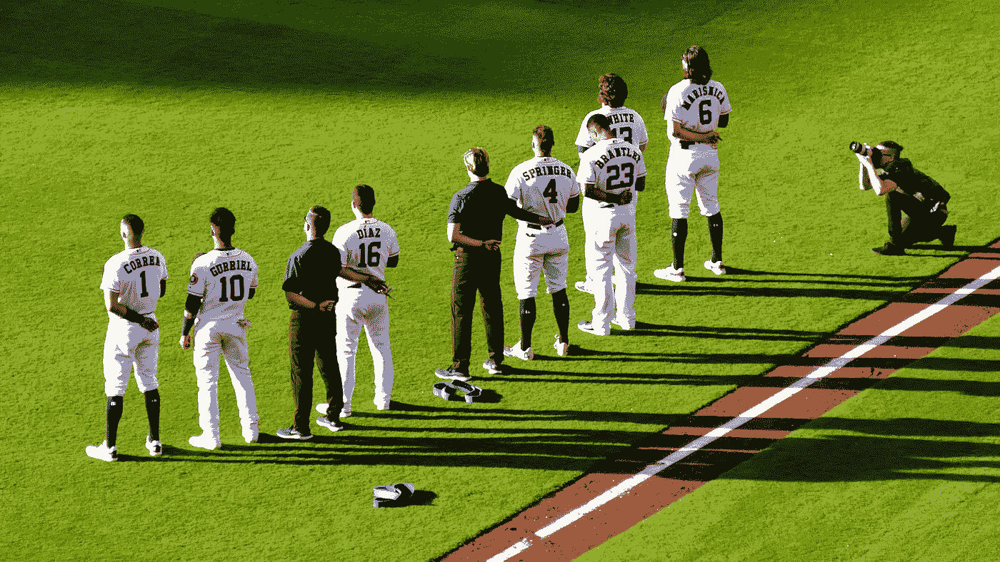

# 使用人工神经网络预测下一个音高

> 原文：<https://towardsdatascience.com/predicting-the-next-pitch-using-artificial-neural-networks-fc464383f53d?source=collection_archive---------36----------------------->

## 太空人真的需要使用照相机吗…

来源:来自 Pixabay 的 Vic Cherubuni

# 欺骗和猜测:在棒球中获得优势

休斯顿太空人队在 2017 年赢得了世界大赛。他们有一个令人难以置信的运行，击败了波士顿红袜队，纽约洋基队，和(谢天谢地)洛杉矶道奇队。然而，美国职业棒球大联盟最近的调查发现，太空人作弊。尽管休斯顿(和旧金山)的球迷不关心太空人队如何击败道奇队赢得世界大赛，但太空人队被发现利用技术窃取标志。他们从一个非法的中外场摄像机转播了对方接球手的手势。在俱乐部会所隧道里的教练会收到摄像头的反馈，并通过敲打垃圾桶来发出超速信号，而不是敲打快速球。这里有一个视频分解，原谅*NSFW*语言。

在棒球比赛中，知道什么球会到来是一个不可思议的优势。捕鼠人试图不被发现是有原因的。作为一名前球员，我可以证明知道接下来会发生什么是非常有用的。此外，有一个复杂的方法和预测投球通常是区分伟大击球手的特征。这里有一个技安进攻方式的例子:

> “我通常打区域联防，大部分时间我会坐快速球。但是如果有一个人会给我一个 2-1 的变速球，我会坐以待毙。或者(与)一个投滑球的左撇子，我会坐滑球。我会坐在这些球场上，然后让一切都过去。”

此外，名人堂外野手和前全垒打王汉克·亚伦曾经说过:

> “猜测投手会投出什么是成功击球手的 80%。另外 20%只是执行力。”

在一个复杂的击球方法中考虑了多个变量后，我意识到猜测或坐下来，下一次投球是机器学习的完美应用，特别是香草前馈神经网络。

# 先决条件:

我是一名数据科学家新手，但这篇博文假设我熟悉基本的深度学习和 python 概念。

# 数据收集和清理:

Statcast 是棒球领域最近的一项创新，它使整个项目成为可能。Statcast 给出了每一个音高的 CSV 文件，每个音高都有大量的数据，如速度、音高位置、音高结果、位置等。我想把这种算法用在拥有高级混合音高的投手身上，也就是说，以相对高的频率投出至少三种主要音高。米科拉斯在 2019 年投掷了大约 2800 个跟踪球，斯特罗曼投掷了大约 3000 个球。

在推特上关注达伦·威尔曼，替我谢谢他。他在 Statcast 建立了基础设施来实现这一点。推特:@darenw

斯特罗曼的球场阿森纳/来源:Statcast

米科拉斯的球场/来源:Statcast

我在 excel 中做了最初的数据清理，因为无可否认，作为一个以金融为导向的人，我对 excel 比对熊猫更有信心。清理数据后，我根据自己的经验和职业球员的陈述选择了以下相关变量来预测投球:以前的投球类型(string)、以前的投球结果(string)、击球手的惯用手(string)、投球数(ints)、跑垒员(boolean)、出局数(int)、局数(int)和当前跑垒差(int)。

# 初始模型:

以下是我用过的库。如果有疑问，就扔进去:

输入库后，我读入 CSV 文件，然后去熊猫工作。我们的第一步是一次性编码所有的字符串值。一种热门的编码方式是将分类数据转换为数字数据，以便机器学习模型可以用它来执行逻辑回归。

所有数据都整齐地组织在 NumPy 数组中，我使用 Sklearn 库创建了一个随机训练/测试分割。在试验了不同的优化器之后，我使用 Keras API 构建了一个带有一个隐藏层的前馈模型。

对于斯特罗曼来说，这在预测超过 600 个音高时产生了 46%的准确率。这个结果比随机预测的概率要高得多。

然而，46%让我深感不满。我很反感。我想做得比抛硬币更好，即使硬币真的是六面的，形状也很奇怪。我想到了一个更准确的方法来建立这个模型。

# 解决问题:

当检查 Astros 中继系统时，我意识到他们没有中继准确的音高。他们转播快速球或慢速球。猜测准确的下一个音高不像猜测音高的特征那样实用，比如移动和速度。我回到 CSV，将相似的球种归类为硬球(两缝线快速球(伸卡球)和四缝线快速球)、破球(切球和滑球)和软球(曲球和变速球)。这更类似于宇航员使用的撞击系统。

通过稍微改变模型和输入，我能够获得接近 60%的准确率。

# 应用和结论:

在过去的 20 年里，棒球一直是体育界应用定量方法的领导者。从应用上来说，我觉得这个模型可以作为打者或者任何东西的学习工具来真正打败道奇队。击球手可以使用这个模型来策划球探报告，并在第二天面对先发投手的击球上进行模拟。此外，我知道这个模型还可以改进。我使用的变量并不是猜测音高艺术的全部。我很想从一些玩家和捕手(他们称之为游戏)的头脑中了解如何改进这个模型。请在下面找到我的 git 库，里面有模型和数据。

 [## danielajk99/pitch_predictor

### 用于基音预测的人工神经网络。为 danielajk99/pitch_predictor 开发做出贡献，创建一个…

github.com](https://github.com/danielajk99/pitch_predictor) 

特别感谢布兰登·威廉姆斯和诺亚·鲁本帮助我完成了这个项目。还要特别感谢 Ulk Aslak 教授和 Lucian Leahu 教授，他们向我介绍了人工神经网络。

*数据和球场画面来自棒球专家的 Statcast 搜索工具。按照这个* [*链接*](https://baseballsavant.mlb.com/statcast_search) *在 Statcast 中创建自己的数据集。*

丹尼尔·丹·金是乔治敦大学的本科生。这个博客是他在丹麦留学项目的最终项目的一部分(由于新冠肺炎的原因，现在实际上是一个在家学习的项目)。在推特上关注我:@danielajk99。