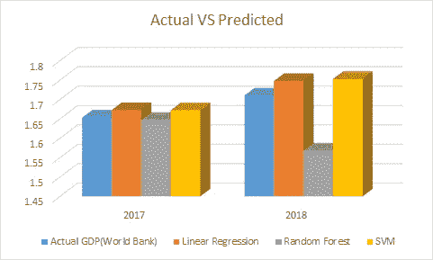
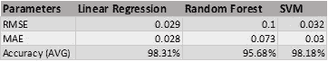

# 利用经济指标预测名义 GDP:一种数据科学方法

> 原文：<https://towardsdatascience.com/predicting-the-nominal-gdp-using-economic-indicators-a-data-science-approach-7c56cded782?source=collection_archive---------20----------------------->

## 利用流行的分类模型预测国内生产总值

凯文·Ku 在 [Unsplash](https://unsplash.com?utm_source=medium&utm_medium=referral) 上的照片

这篇文章讨论了使用网络上的数据预测名义 GDP(国内生产总值)。问题陈述是**从真实来源收集**数据，执行**探索性数据分析(EDA)，训练**模型，以及**预测**名义 GDP(加拿大)。作为一名 IT 人员，我对这些经济学相关术语知之甚少。这就是为什么首先要做的是熟悉这些概念。接下来是用 R 编程语言学习和执行这个项目，并熟悉流行的 R 包，如 *tidyverse、ggplot、caret* 等。在实践中，很好地利用在线资源可以很容易地习惯 R 及其语法。

步入任务，遇到各种经济**统计**又名指标，分类为**滞后和领先指标**。经济指标可能对一个国家的名义 GDP 有直接影响。我们的方法是用这些指标来预测加拿大的名义 GDP。在研究了各种在线博客、文章和论文中的这些指标后，最终确定了以下指标:

> 人口
> 难民人口
> 实际利率
> 国内公司数量
> 旅游服务(占进口服务-国际收支的百分比)
> 税收
> 房地产市场
> 劳动生产率
> 政府债券收益率 10 年期利率
> 个人汇款(收到&以美元支付)
> 铁路运送旅客
> 航空运送旅客
> 通货膨胀
> 收入增长
> 失业率
> 政府赤字
> 消费价格指数
> 商品价格指数
> 欧元对加元的兑换率
> 美元对加元的兑换率
> 多伦多证券交易所交易价值
> 多伦多证券交易所交易量
> 入境国际游客

数据来自加拿大统计局、T2、世界银行、T4 统计局和其他来源。这些指标被假定为**特征**，这些特征的数据是在 2009 年至 2018 年间收集的。数据集分为两部分，训练集和测试集。

T

> ***探索性数据分析***

在数据集组装、清理和整齐排列后，开始对数据集进行探索性数据分析。使用标准正态分布的概率密度 ***dnorm*** 函数进行数据标准化。为了检查数据是否正常，对每个特征**应用**夏皮罗-维尔克正态性检验**。**除 3 个变量外，所有变量的 p 值都大于 0.05，这表明它们是正常的。为了分析数据集特征之间的相关性，使用了 *caret* 包的***find correlation***函数，去除了高度相关的属性。由于数据点较少，即 8 个(2009 年至 2016 年)，必须降低数据的维度。这是通过使用 ***prcomp*** 函数应用**主成分分析(PCA)** 完成的。至此，EDA 结束了。现在让我们开始建模吧！参考 GitHub 链接… [点击这里](https://github.com/DmonteDD/NominalGDP_Prediction_inR)！

> ***线性回归建模***

在这种类型的建模中，PCA 值用于使用 **lm()** 函数训练简单的**线性回归**模型。使用*汇总*功能对生成的模型进行汇总。关键观察是 p 值小于显著性水平(< 0.05)。这意味着我可以安全地拒绝零假设，因为预测系数的系数β为零。此外，模型的 **F 统计值**为 428.6(越多越好)。因此，可以得出结论，该模型具有统计学意义。为了验证该模型，我对 2017 年和 2018 年的值进行了测试。模型的总体准确率为 98.31%。文章末尾的表格提供了关于实验的更多细节。

> ***随机森林造型***

对于这个建模，*R 语言的 randomForest* 库使得选择特征和创建随机森林模型变得更加容易。 **importance()** 函数根据数据叶节点杂质找到并显示每个特征的重要性。这些数据存储在一个新的数据集中，该数据集根据重要性值进行排序。这里的技巧不是选择重要性值仅较高或较低的特征，而是选择中和频谱的值，即较高、较低和中等重要性值的组合，以保持平衡。使用试错法挑选了六个特征。

> 个人汇款(已收)
> 实际利率
> 旅游服务进口
> 国债收益率 10 年期利率
> 政府赤字
> 国内公司数量

使用**随机森林**函数对模型进行训练。 *mtry* 参数设置为 6(特征数量)，树的数量( *ntree* )设置为 1000。该模型对 2017 年和 2019 年 NGDP 的预测平均准确率为 95.68%。

> ***支持向量机建模***

这是我们实验清单上的最后一个。为了在我们的使用中利用 SVM 建模，我们使用了提供 svn 函数的 R 的 e1071 包来建模。因为我们的用例不是一个分类用例，所以必须应用回归选项。为此， *svm()* 函数提供了一个*类型*参数，使我们能够进行选择。相应地，选择*EPS-回归*类型，并将*内核*参数设置为径向。关于内核的更多细节，点击这里。这里预测的平均准确率为 98.18%。下面的图表提供了实验的更多细节。

显示实际值与预测值的图表

总之，尽管数据集很小，但所有模型的预测准确率都在 95%以上。当使用 PCA 值训练线性模型时，得到的输出比其他的更好。然而，随机森林可以被认为是最不可靠的，因为它使用数据集的最少特征。如果不是准确性或可靠性，该结果至少倡导了经济指标在预测名义 GDP 中的意义。

PS:这个实验是提交给[加拿大统计局](https://www.statcan.gc.ca/eng/cder/announcements)商业数据科学家挑战 2019/2020 的一部分。