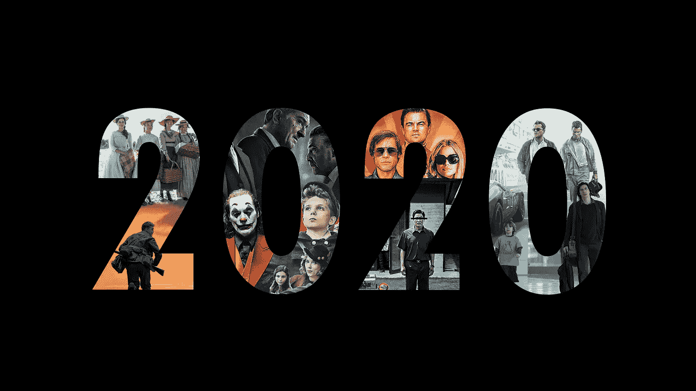
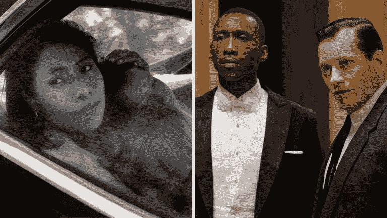
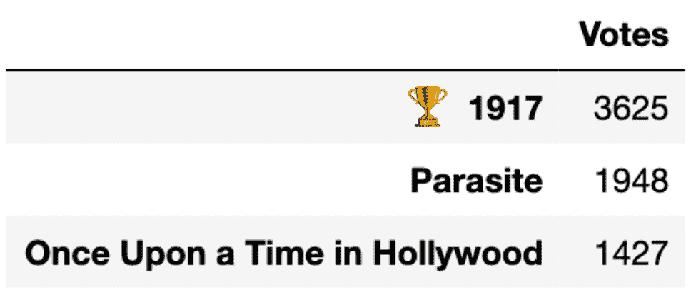

# 使用优先机器学习预测奥斯卡

> 原文：<https://towardsdatascience.com/predicting-the-oscars-using-preferential-machine-learning-32f06ffbf427?source=collection_archive---------31----------------------->

## 奥斯卡和他们的优先投票让我创造了一种新颖的机器学习方法来模仿这种投票系统

去年对电影来说是很棒的一年，如果你像我一样，沐浴在电影票热潮的余晖中，仍然在电影院看很多电影，你知道*好莱坞往事*、*寄生虫*、 *1917* 和更多的电影提供了独特的电影体验。每年的奥斯卡周日，好莱坞都会聚在一起，给自己一个大大的鼓励。当晚最大的奖项是最佳影片奖，它可以将一部电影载入电影史。与奥斯卡之夜颁发的其他 23 个奖项不同，梦寐以求的最佳影片奖是通过一种称为优先投票的方法选出的，这种方法比传统投票更复杂。为今年的奥斯卡做准备，并了解优先投票让我写了一些程序，用机器学习来模拟这个投票系统。

Reddit 用户 u/Tillmann_S 的 2020 奥斯卡艺术

在这篇文章中，我:

*   选择用于预测奥斯卡的数据
*   从数据科学的角度探索优先投票的工作原理
*   演示一个我自己设计的方法，我称之为**优先投票随机森林**
*   模拟最佳影片投票的幕后发生的事情
*   预测今年的最佳影片得主

我没有在本文中包含我的任何代码，但是这里是[存储库，包含我在这个分析中使用的笔记本](https://github.com/njparker1993/oscars_predictions)

# **如何预测奥斯卡:数据集**

为了使用机器学习来预测任何事情，我们需要一个有意义的数据集来训练我们的模型。在最佳影片竞赛的情况下，我们有 9 部 2019 年提名的电影。尽管我对奥斯卡充满敬意(毕竟我有足够的兴趣写这篇文章)，但我毫无保留地认为，今年的最佳电影将赢得奥斯卡最佳影片奖。该学院由电影行业各个领域的数千名成员组成，他们每个人都有自己的偏见，这导致了他们的投票。因为投票背后有真实的人，我们不能依赖票房利润或总评论家分数等电影质量的数字指标。但是你知道什么和电影制作人的投票密切相关吗？其他电影人投票。

还有许多其他的颁奖典礼组成了“颁奖季”，像美国演员工会奖和导演工会奖这样的活动的投票者通常也是奥斯卡奖投票者。利用早期奖项如 SAGs、DGAs、PGAs、金球奖和 BAFTAs 的结果，并结合奥斯卡信息如提名数，我可以训练一个模型来预测今年的最佳影片获奖者。为了获得一致的电影数据和命名惯例，我从维基百科上收集了每个颁奖典礼的提名者和获奖者的数据，并使用熊猫和美丽的汤包将它们合并到 Python 中的一个数据集。

# **优先投票的工作原理**

优先投票，也称为即时决胜投票，通常用于有许多候选人争夺一个席位的情况。自 2009 年以来，奥斯卡一直使用这种计票系统来决定最佳影片竞赛，当时该领域从五个提名人扩大到十个。在优先投票中，选民不是为一部电影投票，而是提交一份对所有选项进行排名的投票，排名第一的选项将作为该电影的投票。然后开始一个迭代过程，其中最不受欢迎的电影被淘汰，所有的投票被重新排序，直到一部电影获得超过 50%的#1 选票。在一部电影从所有选票中被淘汰后，之前将被淘汰的电影放在第一位的选票现在将第二位移到第一位，这增加了剩余电影的票数。这一过程一直持续到一部电影获得超过 50%的#1 选票，然后它被宣布为获胜者。这种消除过程的模拟如下所示。

图 1:优先投票淘汰的模拟。由我的偏好随机森林生成

优先投票法的批评者声称，这种方法奖励容易喜欢或无争议的电影，因为无争议的电影将在人们的排名中处于中间位置，而有争议的电影可能在一些人的投票中名列前茅，但在其他人的投票中垫底，因此它们很容易被淘汰。去年，当更具艺术性的电影《T2》《罗马》《T3》输给更具大众吸引力的电影《T4》《绿皮书》时，这种效应就显现出来了。

图片来源:左——阿方索·卡隆/网飞，右——环球影业/参与者/梦工厂

**优先抽签随机森林**

我们过去已经看到，优先投票可以改变最佳影片竞赛的结果，因此我创建了一个模型来反映这种独特的计票方法。随机森林分类器模型通过使用多个去相关的决策树分类器进行预测。这里有一篇文章更侧重于传统随机森林如何工作的细节。一般来说，一个随机森林会根据树叶的大小将每棵树的“投票”作为一个分数，并根据哪个类别在所有树中拥有最多“投票”来选择最终标签。对于这个优先投票随机森林，我们改为使用测试集中每部电影的 ProbA 值，并使用它们来创建电影的第 1-9 名排名。ProbA 值是该项在“赢家”类别中的可能性，代表比二元“赢家”或“输家”分类更软的预测。这种更软的预测允许我们将预测从布尔分类改为范围。每个决策树产生一张选票，一旦整个森林产生了他们的选票，优先选票淘汰的迭代过程开始确定森林对获胜者的选择。通过使用排名而不是挑选一个类别，我的优先投票随机森林保存了传统随机森林会丢弃的信息，并在优先投票的消除和重新排名阶段再次使用。

图 2:单个决策树对测试集的投票

# **模拟奥斯卡颁奖典礼**

利用我的优先投票随机森林，我模拟了今年的最佳图片竞赛。为了消除每棵决策树的相关性，我改变了每棵树看到的奖励，类似于随机森林的 *max_features* 超参数。在这个模拟中， *max_features* 代表投票的学院成员可能属于哪个公会，或者他们对该季其他奖项的关注程度。我还为每个决策树添加了一个随机噪声特征来进行训练，代表每个投票者对某些电影的天生偏见。该学院由大约 7000 名不同的投票者组成，所以我启动了我的森林，很快就产生了 7000 张选票。经过 6 轮淘汰最后一部电影后，第一部电影获得了超过 50%的第一票，我的模型选出了最佳影片奖…

图 3:6 轮优先投票淘汰后的最终排名。当电影《1917》获得超过 50%的票数时，这一过程就停止了。

# **最终预测**

我的优先投票随机森林是一种模拟奥斯卡的新颖方法，我希望它能帮助你了解最佳影片投票和随机森林分类器的一些内容，但除了优先投票，让我们进入正题，真正预测这些坏男孩。利用我搜集的获奖电影数据集，我实现了 H2O 强大的 [AutoML 工具](http://docs.h2o.ai/h2o/latest-stable/h2o-docs/automl.html)来训练 100 个不同的随机森林、XBGT 和深度学习模型，用各种参数来预测今年的奥斯卡奖。AutoML 选择了 XGBoost 模型，该模型在交叉验证中正确预测了 159 部电影中的 147 部电影的奥斯卡奖结果。这个模型的漩涡预测了哪部电影？还有 *1917* ！看起来这部电影的前景不错，因为优先投票随机森林和我的 AutoML 模型都预测到了。

图片来源:环球影业，弗朗索瓦·杜哈梅尔

## 链接和推销:

[该项目的 Github 回购](https://github.com/njparker1993/oscars_predictions)

抓取代码灵感来自 Github 用户 [Buzdygan](https://github.com/Buzdygan)

旧金山大学 MSDS 分校