# 预测二手车的价格

> 原文：<https://towardsdatascience.com/predicting-the-price-of-used-cars-891d13faf3fc?source=collection_archive---------44----------------------->


帕克·吉布斯在 [Unsplash](https://unsplash.com?utm_source=medium&utm_medium=referral) 上的照片

## 具有特征选择和特征工程的 XGBoost 实现

本文旨在分析二手车数据集的属性，以便在使用 XGBoost 模型预测这些汽车的价格之前执行特征选择和特征工程。数据处理、清理、特征选择和建模的整个过程在下面的部分中示出。术语“属性”、“变量”和“特征”在本文中可互换使用，具有相同的含义，即它们指的是数据集的列。

我们先来了解一下特征选择和特征工程是什么意思。

# 特征选择

选择那些与输出变量预测最相关的输入特征的过程称为特征选择。这有助于减少数据的维度，并确保模型不会学习那些可能降低其准确性的不相关特征。

有关功能选择[的更多信息，请点击此处](https://en.wikipedia.org/wiki/Feature_selection)。

# 特征工程

在使用或不使用现有要素的情况下，为给定数据集获取新要素以提高该数据集模型性能的过程称为要素工程。

有关特征工程的更多信息[点击此处](https://en.wikipedia.org/wiki/Feature_engineering)。

现在让我们深入到实现部分。

# 履行

## 导入必要的库

我们导入了预测过程所需的以下库。

```
import pandas as pd
import matplotlib.pyplot as plt
import numpy as np
from sklearn.preprocessing import StandardScaler, LabelEncoder
from sklearn.model_selection import train_test_split
import math
import matplotlib
import seaborn as sns%matplotlib inline
```

## 加载数据集

这里使用的数据集是加载的[二手车](https://www.kaggle.com/orgesleka/used-cars-database)数据集。它拥有从易贝收集的 37 万行数据和描述每辆二手车细节的 28 个属性。但是使用了具有 50000 行的总数据集的子集。这些数据的内容是德语，然后翻译成英语。这个原始数据集的翻译子集可以在[这里](https://drive.google.com/file/d/1xgRSyfaulUpSQIH4dcrXlrizSsJJPcMj/view?usp=sharing)找到。数据集属性的描述如下所示:

```
df = pd.read_csv(‘../input/data.csv’, sep=’,’, header=0, encoding=’cp1252')
```

```
df.describe()
```

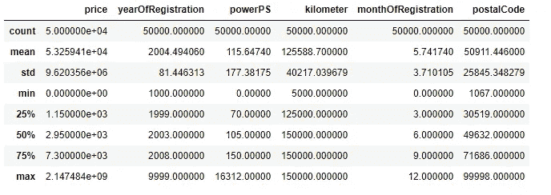

从数据描述中我们可以看到，有些[数值变量](https://www.saedsayad.com/numerical_variables.htm#:~:text=A%20numerical%20or%20continuous%20variable,numerical%20variables%2C%20interval%20and%20ratio.)有不能存在的值。例如， *yearOfRegistration* 变量的最小值为 1000，最大值为 9999，而这两个值是不可能的。这些值将在接下来的代码块中处理。

## 删除不必要的列和不允许的值

然后，我们删除数据集中对预测汽车成本没有意义的属性。

```
df.drop([‘name’,’seller’, ‘offerType’, ‘dateCrawled’, ‘lastSeen’], axis=’columns’, inplace=True)
```

然后删除属性值不可能(不允许)的行。

```
df=df[(df.price>=100) & (df.price<=200000) & (df.yearOfRegistration>=1950) & (df.yearOfRegistration<=2019) & (df.monthOfRegistration>0) & (df.monthOfRegistration<=12) & (df.powerPS>10) & (df.powerPS<1000)]df.describe()
```

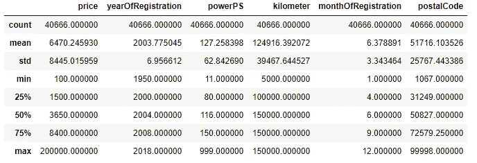

从上面的数据描述中我们可以看到，属性现在只有可能的值。

## NA 值的插补

我们首先需要找出哪些属性具有 NA 值，即空字段。

```
df.isna().sum()
```

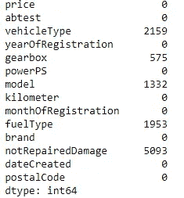

所以 NA 值只存在于[分类变量](https://en.wikipedia.org/wiki/Categorical_variable)中。为了填充每个空字段([插补](/6-different-ways-to-compensate-for-missing-values-data-imputation-with-examples-6022d9ca0779)，使用该属性的模式值。

```
var=[‘vehicleType’,’gearbox’,’model’,’fuelType’,’notRepairedDamage’]
for i in var:
    df[i].fillna(df[i].mode()[0],inplace=True)
df.isna().sum()
```

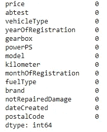

## 使用目标变量的特征可视化

根据*价格*变量绘制特征*注册年份*、*注册月份、*和*邮政编码*。

```
for i in [‘yearOfRegistration’, ‘monthOfRegistration’,’postalCode’]:
    sns.jointplot(x=i, y=’price’,data=df[[i,’price’]],size=7)
```

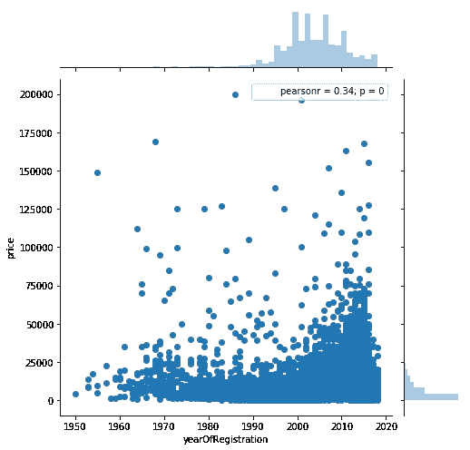

注册年份与价格

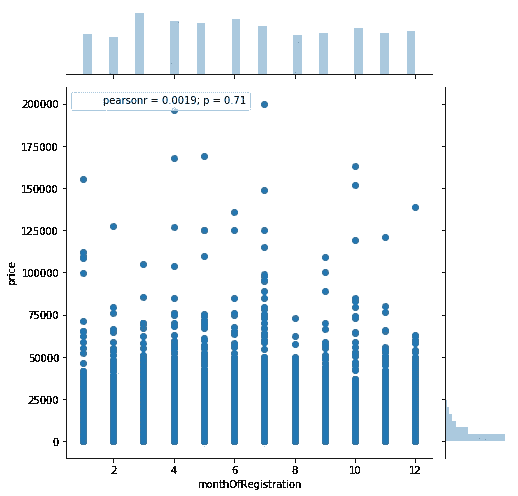

注册与价格

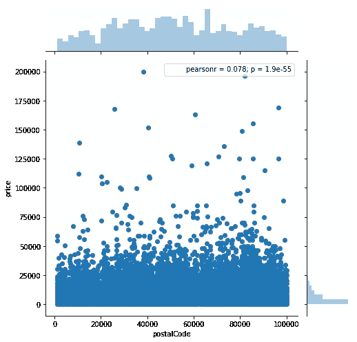

邮政编码与价格

为每对变量显示的图以及[皮尔逊相关性和 p 值](https://dataschool.com/fundamentals-of-analysis/correlation-and-p-value/)可用作特征选择度量。第二个图显示*月注册*与*价格的相关值非常低，而 p 值很高。*所以这个变量被删除了。

```
df.drop([‘monthOfRegistration’],axis=’columns’,inplace=True)
```

## 特征工程——创造新的特征“ageOfCar”

这个数据集有一个属性 *dateCreated* ，这是在易贝上创建汽车广告的日期。通过使用这个属性和 *yearOfRegistration* 属性，我们可以创建一个告诉我们汽车年龄的新特性( *ageOfCar* )。

```
df[‘ageOfCar’]=pd.DatetimeIndex(df[‘dateCreated’]).year-df[‘yearOfRegistration’]
sns.jointplot(x=’ageOfCar’,y=’price’,data=df[[‘ageOfCar’,’price’]],size=7)
```

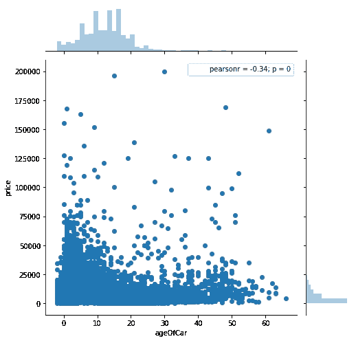

车龄与价格

从上面的图中我们可以看到，皮尔逊相关性的大小与*注册年份*和*价格*的皮尔逊相关性的大小相同，但是为负。这意味着随着车龄的增加，价格会下降，这在现实生活中也是如此。

现在我们删除变量 *yearOfRegistration* 和 *dateCreated。*

```
df.drop([‘yearOfRegistration’,’dateCreated’],axis=’columns’,inplace=True)
```

## 用箱线图识别和去除异常值

> 在统计学中，**异常值**是与其他观察值显著不同的数据点。异常值可能是由于测量中的可变性造成的，或者它可能表示实验误差；后者有时被排除在数据集之外。异常值会在统计分析中引起严重的问题。(来源:[维基百科](https://en.wikipedia.org/wiki/Outlier))

所以基本上离群点就是不符合一般数据分布的数据点。数据中存在的异常值会扭曲模型并扰乱其学习过程。因此，现在我们将检测数据集中的这些异常值，并使用[箱线图](https://en.wikipedia.org/wiki/Box_plot)(四分位数间距)方法移除它们。要了解不同的异常值检测方法[请点击这里](/ways-to-detect-and-remove-the-outliers-404d16608dba)。

```
sns.boxplot(x=df[‘price’])
```

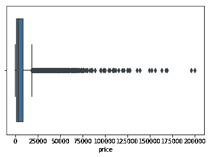

价格箱线图

因此*价格*变量的异常值位于值 25000 之后。

```
sns.boxplot(x=df[‘ageOfCar’])
```

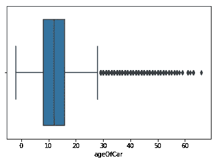

ageOfCar 箱线图

```
sns.boxplot(x=df['powerPS'])
```

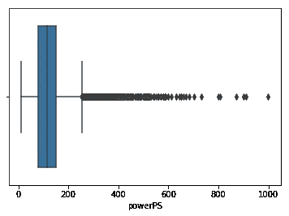

powerPS 的箱线图

```
sns.boxplot(x=df['kilometer'])
```

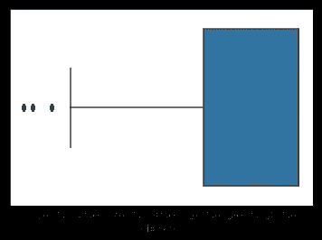

公里箱线图

同样，对于特征*而言，ageOfCar、powerPS、千米*值分别高于 30、高于 280 和低于 25000 都是异常值。这些异常值现在已被移除。

```
df=df[(df.price<=25000) & (df.ageOfCar>=0) & (df.ageOfCar<=30) & (df.powerPS<=280) & (df.kilometer>=25000)]
```

## 编码分类变量

现在，我们需要对数据集的分类变量进行编码，以便模型可以使用它进行训练。分类变量有几种[编码技术](/all-about-categorical-variable-encoding-305f3361fd02)。在这种情况下，我们将对具有两个类的变量使用标签编码，对具有两个以上类的变量使用目标编码。目标编码优于一键编码，因为后者会导致数据维数非常高。

```
x=df.drop([‘price’],axis=’columns’,inplace=False)
y=df[‘price’]le1=LabelEncoder().fit(x['gearbox'])
x['gearbox'] =le1.transform(x['gearbox'])
le2=LabelEncoder().fit(x['notRepairedDamage'])
x['notRepairedDamage'] =le2.transform(x['notRepairedDamage'])
le3=LabelEncoder().fit(x['abtest'])
x['abtest']=le3.transform(x['abtest'])from category_encoders import TargetEncoderte=TargetEncoder(cols=['brand','model','vehicleType','fuelType','postalCode']).fit(x,y)
x=te.transform(x)
```

## 使用相关热图

通过使用关联热图，我们可以了解变量之间的关系。从热图中可以得出两个主要观察结果(不包括对角线元素):

*   与其他输入变量高度相关的输入变量。
*   与输出变量相关性低的输入变量。

现在让我们生成热图。

```
f, ax = plt.subplots(figsize=(11, 9))
cmap = sns.diverging_palette(220, 10, as_cmap=True)
x[‘price’]=y
sns.heatmap(x.corr(),cmap=cmap,square=True,annot=True)
```

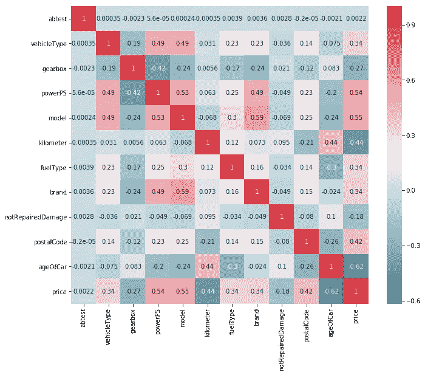

从热图中，我们可以看到输入变量之间没有太大的相关性，但是， *abtest* 与 *price 的相关性很差。*因此 *abtest* 被移除。

```
x.drop([‘abtest’],axis=’columns’,inplace=True)y=x['price']
x.drop(['price'],axis='columns',inplace=True)
```

## 标准化，分为训练集和验证集

我们现在将变量标准化，并将其分为训练集(80%)和验证集(20%)。

```
sc=StandardScaler()
x=sc.fit_transform(x)X_train, X_val, y_train, y_val = train_test_split(x, y, test_size=0.2, random_state = 42)
```

## 使用 XGBoost 模型进行训练和测试

我们使用一个 [XGBoost](/https-medium-com-vishalmorde-xgboost-algorithm-long-she-may-rein-edd9f99be63d) 模型来训练数据并预测输出。我们还使用 sklearn 模块的 [GridSearchCV](https://medium.com/datadriveninvestor/an-introduction-to-grid-search-ff57adcc0998) 来确定模型的最佳参数。使用 GridSearchCV 调优的参数有:

*   **n_estimators:** 定义 XGBoost 模型使用的估计器(树)的数量。
*   **max_depth:** 定义每棵树允许的最大深度，用于控制过拟合。
*   **eta:** 这是模型的学习率，它缩小了节点的权重，使其更加稳健。

为了获得模型性能的无偏估计，我们使用了带有`cv=5`的 [K 倍交叉验证](https://machinelearningmastery.com/k-fold-cross-validation/)方法。通过使用 [RMSE](https://en.wikipedia.org/wiki/Root-mean-square_deviation) 作为误差度量来识别最佳参数。因为我们需要找到产生最小 RMSE 的模型，我们将 RMSE 的负数传递给`scoring`参数。

```
import xgboost as xgb
from sklearn.model_selection import GridSearchCVparam={‘n_estimators’:[10,20,50,100,150,200],
 ‘max_depth’:range(3,11),
 ‘eta’:[0.05,0.1,0.15,0.2,0.25,0.3]}xgr=xgb.XGBRegressor()
gs=GridSearchCV(estimator=xgr,param_grid=param,scoring=’neg_root_mean_squared_error’,cv=5,verbose=3)
gs.fit(X_train,y_train)
```

参数搜索完成后，我们现在可以查看确定的最佳参数及其相应的指标得分。

```
print(gs.best_params_)
print(gs.best_score_)
```

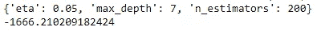

`eta=0.05`、`n_estimators=200`、`max_depth=7`被确定为产生最低 RMSE 分数的参数。使用 GridSearchCV 确定的这些参数，我们构建最终模型并将其用于预测。对于回归问题，比如这个问题，误差度量比如 RMSE、MSE、MAE、R 等。被使用。这里，我们使用 RMSE 和 T21(决定系数)作为误差度量。XGBoost 的`score()`函数返回回归问题的 R 值。

```
from sklearn.metrics import mean_squared_errorxgr=xgb.XGBRegressor(eta=0.05,max_depth=7,n_estimators=200)
xgr.fit(X_train,y_train)
pred=xgr.predict(X_val)
print('RMSE: ',mean_squared_error(y_val,pred,squared=False))
print('R2Score: ',xgr.score(X_val,y_val))
```

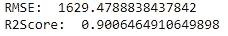

RMSE 和 R 值表明模型的结果相当准确。现在，为了评估模型的性能，并了解数据分布的捕捉情况，我们从残差中生成图。

> 在回归分析中，因变量的观测值(y)与预测值(ŷ)之差称为**残差** (e)。每个数据点有一个**残差**。(来源: [Stattrek](https://stattrek.com/statistics/dictionary.aspx?definition=residual#:~:text=In%20regression%20analysis%2C%20the%20difference,residuals%20are%20equal%20to%20zero.) )

我们使用标准化残差(残差除以其标准差)来创建散点图和直方图。

```
def residual_plot(y_test, y_pred):
    res = y_test — y_pred
    fig, axs = plt.subplots(1,2,figsize=(30,10))
    std_res = res/np.std(res)
    axs[0].title.set_text(‘Scatter Plot of residuals’)
    axs[0].set_xlabel(‘True Output’)
    axs[0].set_ylabel(‘Residuals’)
    axs[0].scatter(y_test,std_res)
    axs[1].title.set_text(‘Histogram of residuals’)
    sns.distplot(std_res, ax = axs[1]);
    plt.show()residual_plot(y_val,pred)
```

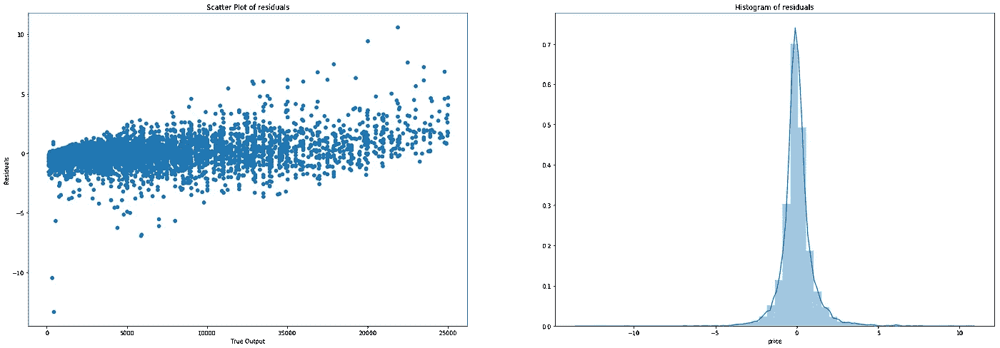

残差的散点图和直方图

散点图显示存在一些异常值，并且残差不具有恒定的方差。因此，它们不遵循正态分布。直方图显示大部分残差集中在零附近。

## 特征重要性

为了理解输出预测过程中每个特征的重要性并得出未来的推论，我们绘制了直接从 XGBoost 模型中获得的[特征重要性](/explaining-feature-importance-by-example-of-a-random-forest-d9166011959e)值。

```
feature_important = xgr.feature_importances_
values = list(feature_important)data = pd.DataFrame(data=values, index=feat, columns=[“score”]).sort_values(by = “score”)
ax=data.plot(kind=’barh’,title=’Feature Importance’,legend=None)
ax.set_xlabel(‘Importance value’)
ax.set_ylabel(‘Features’)
plt.show()
```

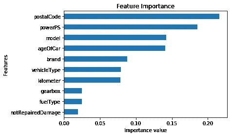

特征重要性

*未修复损坏*、*燃油类型、*和*变速箱*对*价格的预测作用不大。*

# 结论

总之，我们利用二手车数据集来理解数据清理、插补、特征选择和特征工程的概念。我们还学习了如何使用 XGBoost 模型，并通过绘制残差和特征重要性值对其进行回归分析。

要获得 IPython 笔记本的完整代码[请点击这里](https://drive.google.com/file/d/1qJhC6bqacrOvBMmNTfV-3-ELLatlZiu0/view?usp=sharing)。