# 用 R 和 Python 中的多元逻辑回归预测 SARS CoV-2 结果的概率

> 原文：<https://towardsdatascience.com/predicting-the-probability-of-sars-cov-2-result-using-multiple-logistic-regressing-in-r-and-python-874cf9185d62?source=collection_archive---------33----------------------->

## 对 SARS 冠状病毒 2 型患者进行分类以及哪些变量会影响结果。


来源:[维克斯](https://www.vexels.com/vectors/preview/191360/covid-19-background-design?ref=vexelsck&tap_s=576618-2da5a0)

***编者注:*** [*走向数据科学*](http://towardsdatascience.com/) *是一份以研究数据科学和机器学习为主的中型刊物。我们不是健康专家或流行病学家，本文的观点不应被解释为专业建议。想了解更多关于疫情冠状病毒的信息，可以点击* [*这里*](https://www.who.int/emergencies/diseases/novel-coronavirus-2019/situation-reports) *。*

## **简介**

大约两个月前，巴西的以色列阿尔伯特·爱因斯坦医院发布了关于 Kaggle 的公开数据，以便更好地了解这种新型冠状病毒。因此，我试图使用这个数据集来预测患 SARS CoV-2 的概率，并检查哪些变量影响最具预测性的 SARS CoV-2 结果。

**背景**

截至 3 月 27 日，圣保罗州记录了 1223 例新冠肺炎确诊病例，68 例相关死亡，而拥有约 1200 万人口的圣保罗州，以及以色列阿尔伯特·爱因斯坦医院所在地，截至 3 月 23 日，有 477 例确诊病例和 30 例相关死亡。该州和圣保罗县都决定建立隔离和社会距离措施，这将至少持续到 4 月初，以减缓病毒的传播。

**数据集**

该数据集包含在巴西圣保罗的以色列阿尔伯特爱因斯坦医院就诊的患者的匿名数据，这些患者在就诊期间收集了样本以进行新型冠状病毒 RT-PCR 和其他实验室测试。

数据集总共有 5644 行和 111 列。

**分析中使用的变量(预测值)**

这篇文章不足以解释所有使用的变量。因此，我将即时讨论一些重要的预测因素。

为了准备数据，我使用了 Python 中的 Pandas。对于逻辑回归分析，我使用了 r。现在让我们跳到数据准备。

## **数据准备**

第一眼看数据集，我发现了许多 *NaN* 值。在前进之前，必须纠正缺少值的问题。

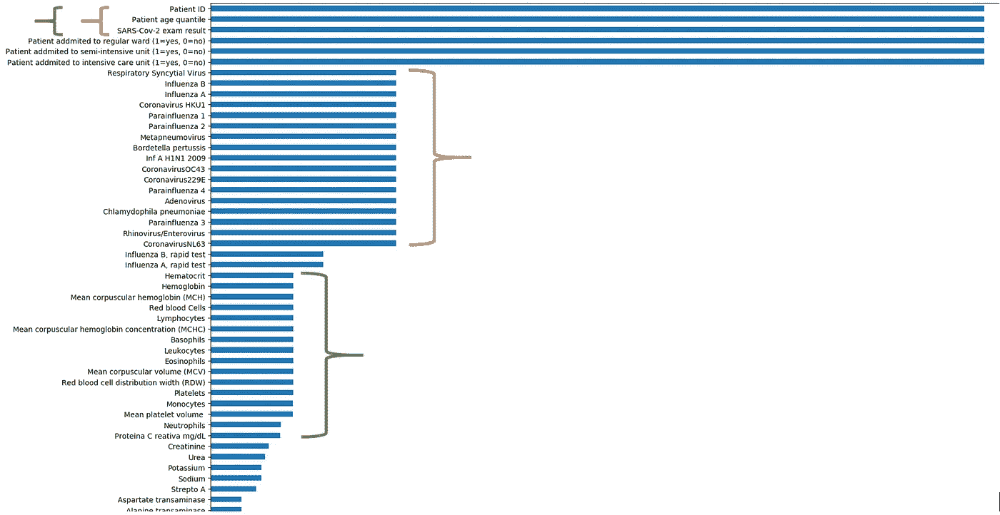

按降序排列的每一列的值计数

从这里开始，我将数据集分成两个子集，命名为条件和疾病。(它们只是名字，不代表任何东西)橙色标记的是疾病子集，绿色标记的是病情子集。

变量*中性粒细胞*和*蛋白质 C reativa* 中的缺失值必须进行估算。我已经使用 KNNImputer 来估算丢失的值。

对于这两个数据集，我们的目标变量是 *SARS_CoV2_exam_result。*数据集疾病具有所有分类预测值，数据集条件具有所有连续数值预测值。

对于分类变量，0 表示未检测到疾病，1 表示检测到疾病。

## **分析**

从这里开始，我将使用 R 进行分析。让我们从疾病数据集开始。

**疾病数据集分析**

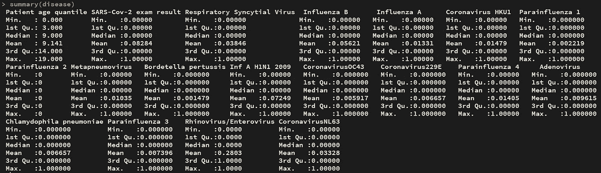

疾病数据集摘要

我不得不跳过副流感 2 号，因为没有病例。现在，让我们绘制克拉姆夫相关图，以检查分类变量之间的相关性。

```
# CramerV Correlation to check for any correlation between catagorical variables
# Except Patient's age, all other variables are catagorical(binary)
>disease.corr = PairApply(disease[,names(disease) != "Patient_Age_Quantile"],cramerV, symmetric = TRUE)
# Displaying correlation with variable SARS_COV2_Result
>disease.corr[,2]
# Correlation plot
>corrplot(disease.corr, method = "square", type = "lower")
```

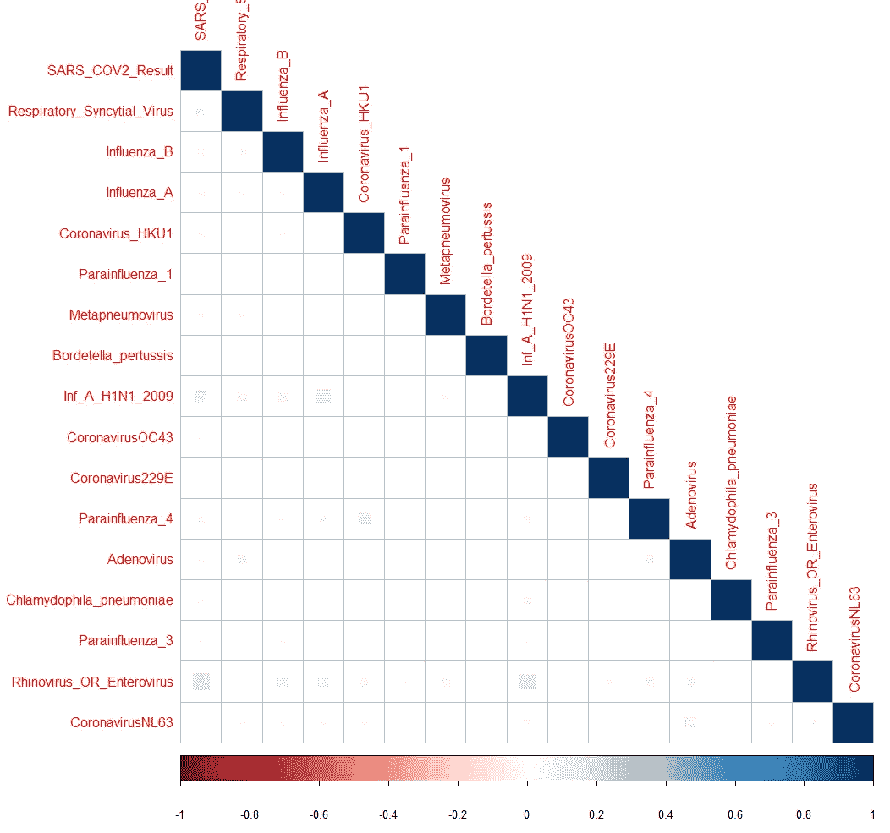

疾病数据集相关图

这里最重要的预测因子似乎是我们目标上的*鼻病毒或肠道病毒*，相关值为 0.1517。(不太重要)现在让我们将数据集分成 80%的训练和 20%的测试。

```
# Dividing Train/Test data with 80% training and 20% test
>sample_size <- floor(0.8 * nrow(disease))
>train <- sample(nrow(disease), size = sample_size)
>disease.train <- as.data.frame(disease[train,])
>disease.test <- as.data.frame(disease[-train,])
```

我们的数据集还没有准备好进行逻辑回归分析。

```
# Logistic regression considering top predictors
>disease.function = paste("SARS_COV2_Result", "~", "Patient_Age_Quantile + Rhinovirus_OR_Enterovirus")
disease.glm = glm(as.formula(disease.function), data = disease.train , family = binomial)
>summary(disease.glm)
```

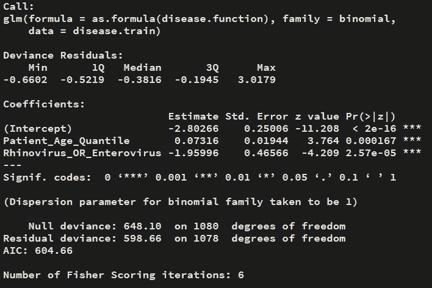

疾病概述

在这里，预测因子*患者年龄分位数*和*鼻病毒或肠道病毒*的 P 值显示了巨大的希望。

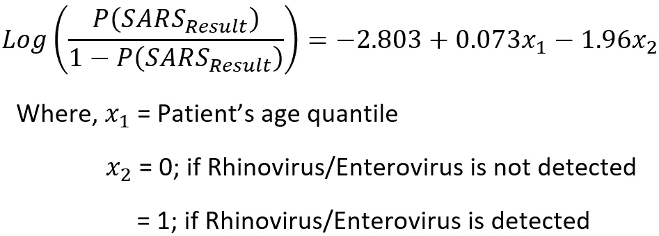

根据上面的等式，我们可以说，如果一个人患有鼻病毒，他/她患 SARS CoV2 的可能性较小。

我使用了 10 重交叉验证来验证我们的模型。下一步是预测测试数据集上的值并准备混淆矩阵。

```
# 10 fold cross-validation to verify the model
>cv.glm(disease.train,disease.glm,K=10)$delta[1]# Predicting on test data based on training set
>disease.glm.predict <- predict(disease.glm,disease.test,type = "response")
>summary(disease.glm.predict)
# Mean predict results for SARS Cov2 Results diagnosis
>tapply(disease.glm.predict, disease.test$SARS_COV2_Result, mean)# Confusion matrix for threshold of 1%
>disease.confusion = table(disease.test$SARS_COV2_Result, disease.glm.predict > 0.01)
>disease.confusion# False negative error(Type II error)
>disease.type2error = disease.confusion[1,1]/
(disease.confusion[1,1]+disease.confusion[2,2])
>disease.type2error
```

我设置了一个严格的阈值(1%)来最小化第二类错误。该模型必须最大限度地减少误检患者的数量。60%的患有新冠肺炎的患者将从模型中被错误地检测为阴性，这是相当高的。

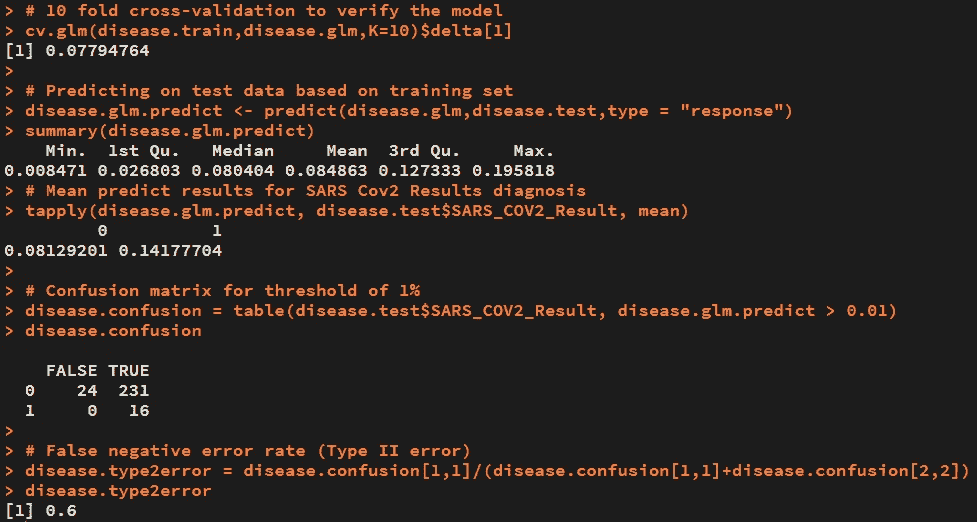

正如预测的那样，ROC 曲线是 okayish 的。

```
# Plotting ROCR curve
>disease.ROCRpred = prediction(disease.glm.predict, >disease.test$SARS_COV2_Result)
>disease.ROCRperf = performance(disease.ROCRpred, "tpr", "fpr")
>par(mfrow=c(1,2))
>plot(disease.ROCRperf, colorize=TRUE, >print.cutoffs.at=seq(0,1,by=0.1), text.adj=c(-0.2,1.7))# Probability of SARS vs Rhinovirus plot
>disease.predicted.data <- data.frame(
  probability.of.having.SARS=disease.glm.predict,
  Rhinovirus=disease.test$Rhinovirus_OR_Enterovirus)
>disease.predicted.data <- disease.predicted.data[
  order(disease.predicted.data$probability.of.having.SARS, decreasing=FALSE),]
>disease.predicted.data$rank <- 1:nrow(disease.predicted.data)>plot(probability.of.having.SARS ~ Rhinovirus,disease.predicted.data, type = "l", lwd = 2)
```

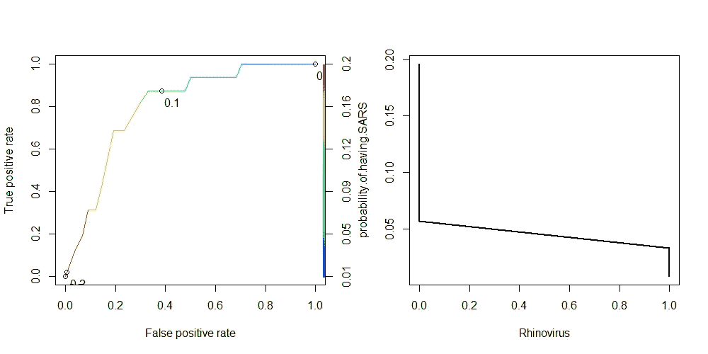

ROC 图和 SARS 与鼻病毒的概率图

鼻病毒的症状接近 SARS CoV-2 病毒，多见于鼻部([鼻病毒](https://en.wikipedia.org/wiki/Rhinovirus))。因此，随着鼻病毒的检测，患 SARS 的概率降低。

**条件数据集分析**

条件数据集包含所有数字预测值，即从血液样本中获取的值。从摘要来看，数据看起来正常。

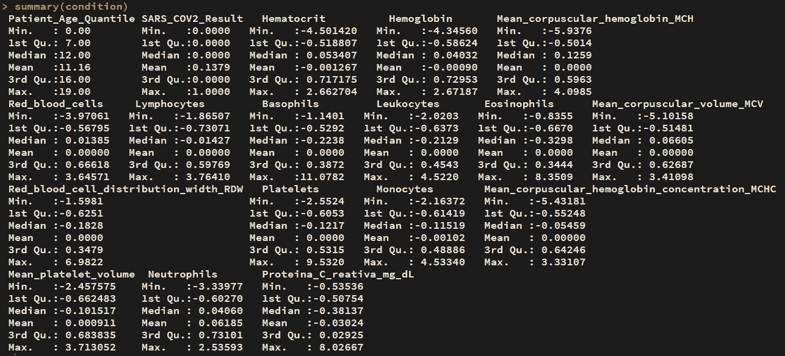

条件数据集摘要

重复相同的步骤，对目标变量的较高相关预测值应用逻辑回归。

```
# attaching the final dataset
>attach(condition)# Correlation between varables
>condition.corr = cor(condition)
>condition.corr[,2]
# Correlation plot
>corrplot(condition.corr, method = "square", type = "lower")# Dividing Train/Test data with 80% training dataset
>sample_size <- floor(0.8 * nrow(condition))
>train_ind <- sample(nrow(condition), size = sample_size)
>condition.train <- as.data.frame(condition[train_ind,])
>condition.test <- as.data.frame(condition[-train_ind,])# Logistic regression considering all the variables on the targer variable SARS_COV2_Result
>condition.function = paste("SARS_COV2_Result", "~", "Patient_Age_Quantile + Leukocytes + Eosinophils + Red_blood_cell_distribution_width_RDW + Platelets + Proteina_C_reativa_mg_dL")
>condition.glm = glm(as.formula(condition.function), data = >condition.train , family = binomial)
>summary(condition.glm)# 10 fold cross-validation to verify the model
>cv.glm(condition.train,condition.glm,K=10)$delta[1]# Predicting on test data based on training set
>condition.glm.predict <- predict(condition.glm,condition.test,type = "response")
>summary(condition.glm.predict)
>tapply(condition.glm.predict, condition.test$SARS_COV2_Result, mean)# Confusion matrix for threshold of 1%
>condition.confusion = table(condition.test$SARS_COV2_Result, condition.glm.predict > 0.01)
>condition.confusion# False negative error rate (Type II error)
>condition.type2error = condition.confusion[1,1]/ (condition.confusion[1,1]+condition.confusion[2,2])
>condition.type2error
```

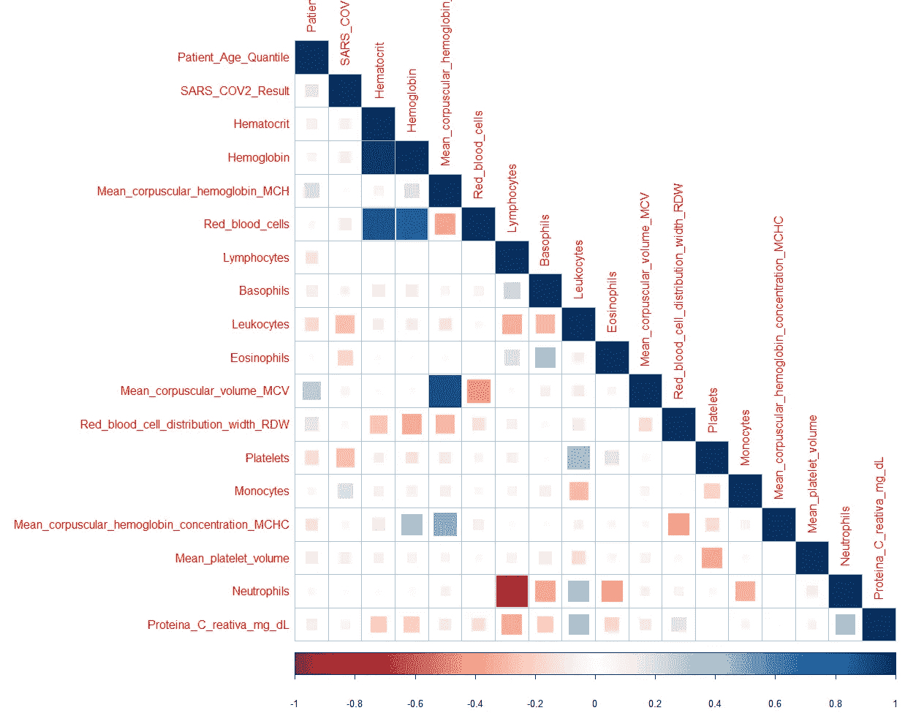

条件数据集相关图

这里我们看到一些高度相关的变量。然而，我们只考虑与目标变量高度相关的预测值。因此，为了进行分析，我将使用*患者年龄分位数、白细胞、嗜酸性粒细胞、红细胞分布宽度 RDW、血小板和蛋白质 a_C_reativa_mg_dL* 预测值。我们来看看 glm 总结。

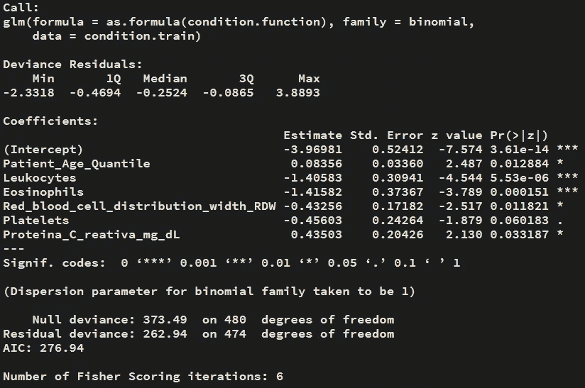

条件数据集 glm 摘要

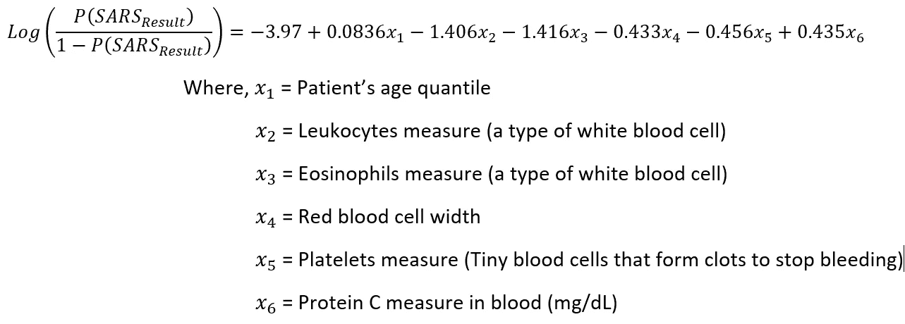

让我们预测一下测试数据集的误差。使用该模型，121 例中的 30 例给出错误的结果，并且 ROC 曲线优于先前的模型。

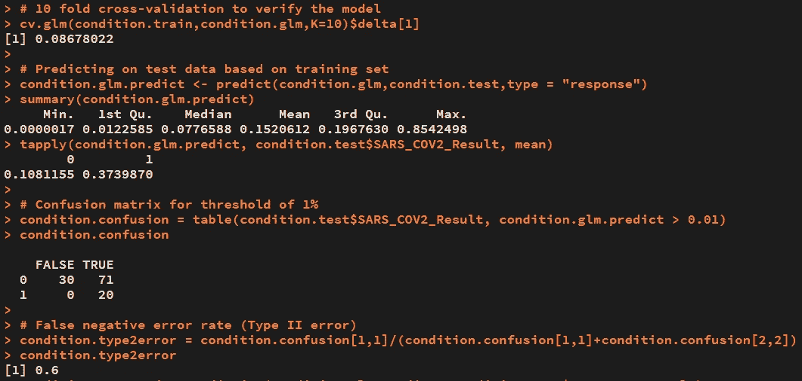

```
# Plotting ROCR curve
>condition.ROCRpred = prediction(condition.glm.predict,    condition.test$SARS_COV2_Result)
>condition.ROCRperf = performance(condition.ROCRpred, "tpr", "fpr")
>plot(condition.ROCRperf, colorize=TRUE, print.cutoffs.at=seq(0,1,by=0.1), text.adj=c(-0.2,1.7))
```

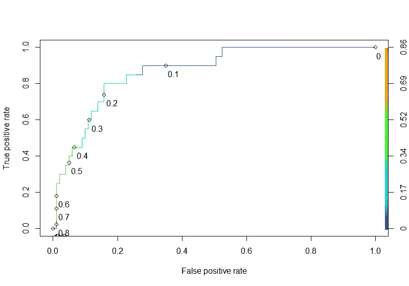

条件数据集 ROC 曲线

绘制结果，

```
# Creating a dataframe with variables and predicted values of SARS results
>condition.predict.dataframe <- data.frame(
  probability.of.having.SARS=condition.glm$fitted.values,
  Leukocytes=condition.train$Leukocytes,
  Patient_Age_Quantile = condition.train$Patient_Age_Quantile,
  Eosinophils = condition.train$Eosinophils,
  Red_blood_cell_distribution_width_RDW = >condition.train$Red_blood_cell_distribution_width_RDW,
  Platelets = condition.train$Platelets,
  Proteina_C_reativa_mg_dL = >condition.train$Proteina_C_reativa_mg_dL)>plot1 = ggplot(data=condition.predict.dataframe, aes(x=Patient_Age_Quantile, y=probability.of.having.SARS)) +
  geom_point(aes(color=Patient_Age_Quantile), size=4)
>plot2 = ggplot(data=condition.predict.dataframe, aes(x=Leukocytes, y=probability.of.having.SARS)) +
  geom_point(aes(color=Leukocytes), size=4)
>plot3 = ggplot(data=condition.predict.dataframe, aes(x=Red_blood_cell_distribution_width_RDW, y=probability.of.having.SARS)) +
  geom_point(aes(color=Red_blood_cell_distribution_width_RDW), size=4)
>plot4 = ggplot(data=condition.predict.dataframe, aes(x=Eosinophils, y=probability.of.having.SARS)) +
  geom_point(aes(color=Eosinophils), size=4)
>plot5 = ggplot(data=condition.predict.dataframe, aes(x=Platelets, y=probability.of.having.SARS)) +
  geom_point(aes(color=Platelets), size=4)
>plot6 = ggplot(data=condition.predict.dataframe, aes(x=Proteina_C_reativa_mg_dL, y=probability.of.having.SARS)) +
  geom_point(aes(color=Proteina_C_reativa_mg_dL), size=4)
# Plotting the values
>grid.arrange(plot1, plot2, plot3, plot4, plot5, plot6, ncol=3 , nrow = 2)
```

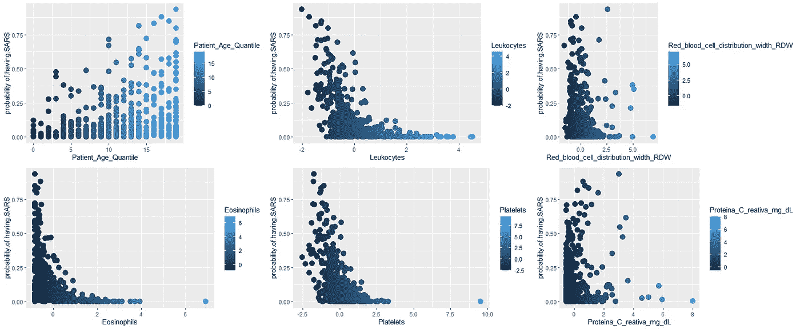

患 SARS 的概率与预测值

我们可以看到，*患者的年龄分位数*和*蛋白 a C reativa* 呈正相关，其余与目标变量的概率呈负相关。

**预测器的单独调查**

一些预测因素在单独分析时显示出巨大的潜力。这些预测是，

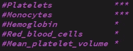

我现在将创建一个函数来分析这些变量，以查看它们的效果。

```
# Plotting Seperate probability graphs
>plotting.function <- function(var,variableORrank){
  condition.sep.function = paste("SARS_COV2_Result", "~", as.character(var))
  condition.sep.glm = glm(as.formula(condition.sep.function), data = condition.train , family = binomial)
  print(summary(condition.sep.glm))
  cv.glm(condition.train,condition.sep.glm,K=10)$delta[1]

  condition.predicted.data <- data.frame(
    probability.of.SARS=condition.sep.glm$fitted.values,
    variable=condition.train[,as.character(var)])

  condition.predicted.data <- condition.predicted.data[
    order(condition.predicted.data$variable, decreasing=FALSE),]

  condition.predicted.data$rank <- 1:nrow(condition.predicted.data)

  ggplot(data=condition.predicted.data, aes(x= variable, y=probability.of.SARS)) +
    geom_point(aes(color=variable), size=3) +
    xlab(as.character(var)) +
    ylab("Probability of having SARS CoV-2") +
    scale_colour_gradient(low = "darkgreen", high = "darkred", na.value = NA) +
    ggtitle(coef(summary(condition.sep.glm))[,'Pr(>|z|)'])
}>plotfun1 = plotting.function("Platelets")
>plotfun2 = plotting.function("Monocytes")
>plotfun3 = plotting.function("Hemoglobin")
>plotfun4 = plotting.function("Red_blood_cells")
>plotfun5 = plotting.function("Mean_platelet_volume")
>grid.arrange(plotfun1, plotfun2, plotfun3, plotfun4, plotfun5, ncol=3 , nrow = 2)
```

结果是，

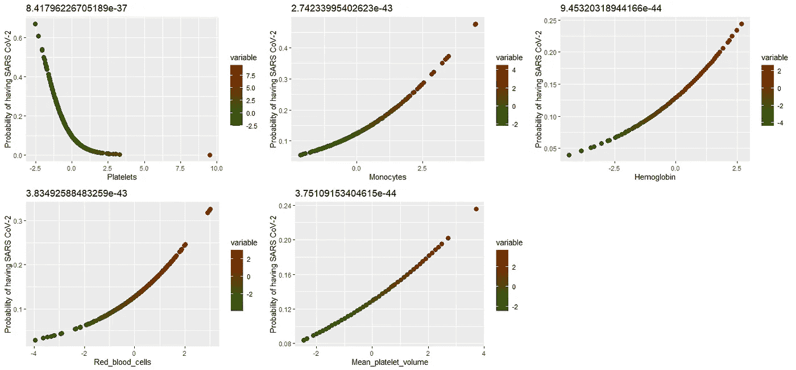

患 SARS 的概率与单一预测因子分析(图表标题为 Pr(>|z|)值，越低越好)(单核细胞是一种白细胞，血红蛋白是一种含铁的氧运输金属蛋白)

除了*血小板*之外，所有预测因子都与患 SARS CoV-2 的概率呈正相关。

# **结论**

对于医院来说，区分鼻病毒携带者和新冠肺炎病毒携带者是非常重要的。将鼻病毒和新冠肺炎病毒患者分开会让这个过程快很多。

高%vol 的白细胞表明身体正在对抗病毒。

当携带病毒时，身体不能产生足够的血小板来帮助止血。

利用给定的患者血液数据，该模型可以预测患 SARS CoV-2 的概率。

# **分析中使用的代码**

[](https://github.com/ZeroPanda/COVID-19-Regression-Analysis) [## 零熊猫/新冠肺炎回归分析

### 介质物品分析代码。通过创建一个……为零熊猫/新冠肺炎回归分析的发展做出贡献

github.com](https://github.com/ZeroPanda/COVID-19-Regression-Analysis) 

# **参考文献**

[统计学习介绍及在 R 中的应用](http://faculty.marshall.usc.edu/gareth-james/ISL/ISLR%20Seventh%20Printing.pdf)；加雷斯·詹姆斯，丹妮拉·威滕，特雷弗·哈斯蒂，罗伯特·蒂布拉尼

[](https://www.kaggle.com/einsteindata4u/covid19) [## 新冠肺炎的诊断及其临床表现

### 支持临床决策的人工智能和数据科学(3 月 28 日至 4 月 3 日)

www.kaggle.com](https://www.kaggle.com/einsteindata4u/covid19) [](https://www.wikipedia.org/) [## 维基百科(一个基于 wiki 技术的多语言的百科全书协作计划ˌ也是一部用不同语言写成的网络百科全书ˌ 其目标及宗旨是为全人类提供自由的百科全书)ˌ开放性的百科全书

### 维基百科是一个免费的在线百科全书，由世界各地的志愿者创建和编辑，由维基媒体托管…

www.wikipedia.org](https://www.wikipedia.org/)