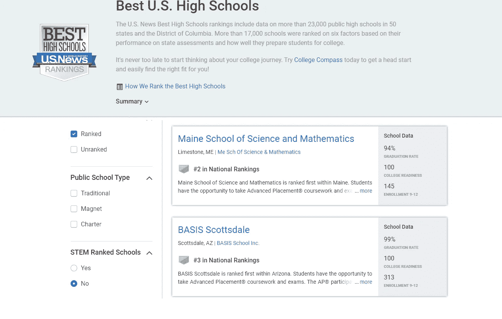

# 预测特许学校的弹性

> 原文：<https://towardsdatascience.com/predicting-the-resilience-of-charter-schools-65be8594d75f?source=collection_archive---------31----------------------->

## *我开发工具帮助家庭在教育选择中感到安全的经历*

图片来源:Neonbrand，via Unsplash ( [Unsplash 许可](https://unsplash.com/license))

*特许学校对学生来说是一个很好的选择，但是关于特许学校稳定性的问题可能会阻止一些家庭给他们机会。在 Insight Data Science，我开发了一个工具来帮助加州的家庭了解上一所新开的特许学校的风险。*

特许学校是公共资助但私人经营的，所以它们不是由传统的公立学区经营的，但它们不像私立学校那样收取学费。特许学校在过去 25 年中经历了大幅增长，2016 年全国约有 300 万学生入学(占公立学校总入学人数的 6%)。特许学校通常专注于特定的课程，如 STEM(科学、技术、工程和数学)或艺术，并且通常比传统的公立学校规模小。这些特点可能会吸引那些寻找更传统教育环境的替代方案的学生，并在一定程度上解释了特许经营行业的增长。

来源:[国家教育统计中心](https://nces.ed.gov/programs/coe/indicator_cgb.asp)

## 上特许学校的好处和风险

当我在亚利桑那大学攻读经济学博士学位时，我有机会为 BASIS Schools(一个特许学校网络)进行定量研究。在 BASIS 学校，我观察了课堂教学和其他各方面的管理，对网络提供的教育体验印象深刻。

BASIS Schools 从不起眼的地方起步:它的第一所学校于 1998 年在一个租赁的地方开办，那里以前是一个杂货店。BASIS Schools 在《美国新闻与世界报道》2019 年全国最佳公立高中排名中增加了两所高中，包括排名第三的学校 BASIS Scottsdale。

对于一个从以前的杂货店起步的学校系统来说，这已经不错了！来源:[美国新闻与世界报道](https://www.usnews.com/education/best-high-schools/national-rankings)

不幸的是，并不是所有特许学校的故事都以同样的成功告终。由于特许学校通常缺乏传统公立学校管理的学校的运营和财政支持，它们可能面临更大程度的不稳定。

自 2010 年以来，加州开设了 831 所特许学校，其中 73.5%仍在运营(相比之下，同期开设的加州传统公立学校的比例为 90.4%)。意外的学校关闭可能会给家庭带来严重的痛苦，让家长和学生争相寻找合适的教育替代方案。

一位母亲的女儿就读于一所意外关闭的新特许学校，她说她会考虑再次就读一所特许学校，但想知道:

“…我怎样才能更好地评估每个人的数字？…我们需要问的难题是什么？因此，如果我们能够在未来防止这种情况发生，我们绝对会这样做。”

 [## 特许学校关闭后会发生什么？

### 八岁的麦肯齐·惠斯勒的圣诞假期开局不利。她刚刚发现她不会…

www.wunc.org](https://www.wunc.org/post/what-happens-when-charter-school-closes) 

**介绍… CharterPredictor**

了解到进入一所新的特许学校的潜在积极和消极方面，我创建了 CharterPredictor。在 charterpredictor.com 的[，加州的家庭可以找到一所 2017 或 2018 学年新开的特许学校，并在学校上运行 CharterPredictor。CharterPredictor 随后为家长提供了一个衡量学校是“风险”还是“安全”选择的标准，以及学校在最初开放后继续运营三年的可能性。](http://charterpredictor.com)

CharterPredictor 还显示学校的初始注册人数，这是一个预测学校是否会继续运营的重要指标(学校资金与注册学生人数挂钩，如果注册学生人数不足，就很难覆盖固定成本)。CharterPredictor 还提供与感兴趣的学校相邻的新特许学校的附加信息，以便有兴趣支持新特许学校的家庭可以快速了解其他相关选项。

背景图片来源:Moren Hsu，via Unsplash ( [Unsplash 许可](https://unsplash.com/license))

虽然最终我们对所有特许学校的稳定性感兴趣，但对于这个项目的迭代，我想重点关注新的特许学校，因为这些学校特别容易关闭，因为它们往往缺乏更成熟的学校的资源。

## CharterPredictor 背后的数据

CharterPredictor 背后的数据来自加州教育部，其中包括学校开学和关闭的信息，入学和人口统计信息。我收集了 2004 至 2018 学年的记录，然后将它们与美国社区调查中关于失业和教育水平的邮政编码水平数据结合起来。最后，我获得了与每所特许学校相邻的传统公立学校的家长评级(来自 great schools——great schools 就像 Yelp for schools，家长可以在这里留下对学校的评论和评级),以便衡量传统公立学校的竞争。

为了预测哪些新的特许学校有关闭的风险，我收集了 2004 年至 2016 年期间加州所有新的特许学校(包括 1017 所新学校)，并使用 60/40 的拆分将数据分为训练集和测试集。CharterPredictor 然后使用 2017 年和 2018 年开设的学校的信息进行预测。

## 模拟学校关闭

我使用 XGBoost 来模拟特许学校的关闭，因为 XGBoost 给我的预测比逻辑回归模型更准确。XGBoost 模型导致曲线下面积(“AUC”)测量值为 0.95，而逻辑回归导致 AUC 为 0.94。虽然逻辑回归更容易理解，但我继续使用 XGBoost，因为我希望它能更好地推广到加利福尼亚州以外的新的州和新的功能。

我在几个超参数上使用交叉验证和网格搜索，包括最大树深度、收缩率和提升轮数来调整模型(您可以在 [CharterPredictor GitHub 资源库](https://github.com/pjcizek/Charter-Predictor)查看构建分析数据集的代码)。预计关闭概率为 20%或更高的特许学校被归类为“有风险的”，因为如果我是一名家长，考虑到学校的稳定性，这似乎是我希望得到通知的水平，尽管这个截止值无疑有些武断。

在评估测试集时，经过训练的模型具有 94.1%的准确性，70.3%的召回率和 70.3%的精确度。在我们测试的 38 所实际关闭的学校中，CharterPredictor 可以正确地将其中的 26 所归类为风险学校。如果 CharterPredictor 的主要目标是保护学生免受不稳定因素的影响，我们可能会选择更低的关闭概率作为阈值来定义一所学校有风险。然而，重要的是避免过度热衷于将学校分类为风险学校，因为其中一些学校可能是我们希望家庭考虑的好机会。

## 结论和下一步措施

由于教育数据和特许学校政策因州而异，我想先从加州开始。下一步要使它成为更有用的工具，就要把它扩展到加州以外的地方。到目前为止，我相信 CharterPredictor 可以成为一个有用的工具，帮助加州家庭对他们的教育选择更有信心。

总的来说，我喜欢与跨越私人和公共领域的行业合作(如教育、卫生、能源)，因为它们往往有大量可用的数据(我可能很难获得完全私人市场的企业细节和开业/倒闭)。此外，这些公共/私人市场往往与我们从社会角度非常关心的结果联系在一起。

## 关于作者

帕特里克·西泽克在亚利桑那大学获得经济学博士学位，专攻经验微观经济学。Patrick 目前是 Esurance 的数据科学家。

在 Esurance 工作之前，Patrick 是 Insight Data Science 的数据科学研究员。访问 Insight Data Science 的[网站](https://www.insightdatascience.com/)。