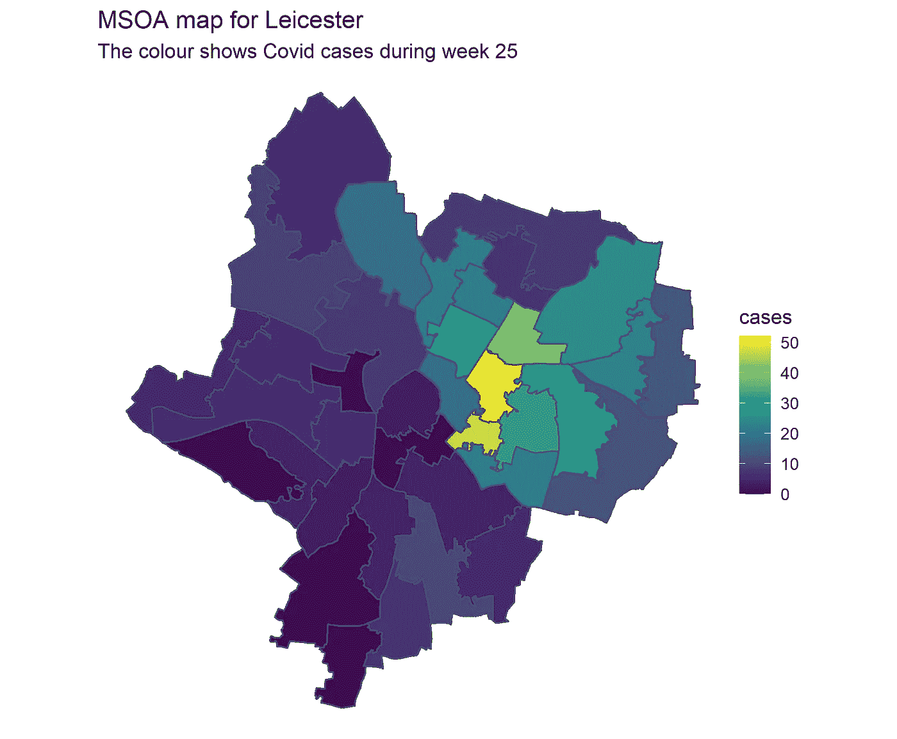

# 利用网络预测 R-1 中的新冠肺炎病例

> 原文：<https://towardsdatascience.com/predicting-the-spread-of-covid-19-using-networks-in-r-2fee0013db91?source=collection_archive---------42----------------------->

## **激励和创建网络**

第二部分可以在这里找到。

像所有传染病一样，新冠肺炎病毒的传播发生在非常局部的水平上。它不只是在世界各地随机跳跃，它必须在人与人之间传播，这些人必须旅行到一个新的地方传播病毒。正是因为这个原因，网络经常被用来帮助模拟疾病的传播，无论是通过使用社交网络来模拟疾病在人与人之间的传播，还是通过地理网络来帮助我们**根据邻近地方发生的事情预测疾病的爆发**。

在这个博客系列中，我们将关注地理网络，其中节点是地点，如果两个地点相邻，则边连接这两个地点。最终，我们将尝试使用这样一个网络，根据邻近地区的 Covid 病例来预测一个地区的 Covid 病例。

这种方法的准确性将受到限制，因为它没有考虑流行病学因素(如群体免疫和社会距离)或其他地区联系方式(如火车)。然而，这个博客系列仍然为可视化网络和使用它们创建预测分析的特征提供了有益的指导。它还表明网络分析可能是更大的 Covid 模型的有用部分。


(图片由作者创作)

在英国，发布 Covid 案例的最小地理区域被称为中间层超级输出区域(MSOAs ),因此我们将重点关注这些区域。你可以在这里的一个互动地图[里看到这个数据，在这里](https://www.arcgis.com/apps/webappviewer/index.html?id=47574f7a6e454dc6a42c5f6912ed7076)下载[。](https://c19downloads.azureedge.net/downloads/msoa_data/MSOAs_latest.csv)

在这第一部分中，我们将创造一些形象化的东西来激发为什么这种方法可能有效，然后我们将创造出上图中看到的网络。我们将展示代码，同时，所有代码都可以在 github 上找到[。](https://github.com/theOtherJLo/using_networks_to_predict_covid_cases)

这些都是用来创建本帖中显示的可视化的包。

```
# Set up ----
# Load packages
library(dplyr)
library(readr) # Loading the data
library(tidyr)
library(sf) # For the maps 
library(sp) # Transform coordinates 
library(ggplot2)
library(viridis)
library(gganimate) # For the animated map# Network packages
library(igraph) # build network
library(spdep) # builds network
library(tidygraph)
library(ggraph) # for plotting networks
```

# 动机

为了了解这种方法可能奏效的原因，我们将看看莱斯特，该市 6 月份的 Covid 病例激增，导致英国首次局部封锁。我们将通过使用{ggplot2}和{sf}包创建地图来可视化 Covid 在该区域的分布，并使用{gganimate}包制作动画。

我们需要下载案例数据(可以直接从 URL 下载)，并将其转换成正确的格式。初始表很宽(每个 MSOA 一行，每周一列)，有些周没有数据，所以我们利用相对较新的{tidyr}和{dplyr}函数`where`、`pivot_longer`和`across`来清理这些数据。

注意:自从这篇文章发表后，数据和访问数据的位置都发生了变化。这里的新网址是。我们在[第 2 部分](https://lowe-james.medium.com/predicting-the-spread-of-covid-19-using-networks-in-r-part-2-a85377f5fc39)中使用这些新数据，你可以在 [github](https://github.com/theOtherJLo/using_networks_to_predict_covid_cases) 上访问新代码。

```
url <- '[https://c19downloads.azureedge.net/downloads/msoa_data/MSOAs_latest.csv'](https://c19downloads.azureedge.net/downloads/msoa_data/MSOAs_latest.csv')
msoa <- readr::read_csv(url, col_types = cols()) %>% 
  # Drop columns that are all NA
  select(where(~!all(is.na(.)))) %>% 
  # Pivot longer
  pivot_longer(dplyr::starts_with("wk_"), 
               names_to = "week",
               values_to = "cases", 
               names_prefix = "wk_") %>% 
  # Turn week to numeric
  mutate(week = as.integer(week)) %>% 
  # Turn NAs into 0s
  mutate(across(c(last_7_days, cases), 
                .fns = ~ifelse(is.na(.), 0, .)))
```

生成的表如下所示(为了简化，我去掉了前几列)。前两列告诉我们地方当局辖区(LAD ),其面积比 MSOA 还大。接下来的两列告诉我们 MSOA。最后两列告诉我们那一周，以及那一周有多少阳性病例。“last_7_days”列告诉我们从上一整周到今天的阳性病例数。


我们应该做的第一件事是检查莱斯特峰值是否真的出现在数据中，这可以通过绘制简单的线图来完成。

```
msoa %>% 
  group_by(lad19_nm, week) %>% 
  summarise(cases = sum(cases))%>% 
  filter(lad19_nm == "Leicester") %>% 
  ggplot(aes(x = week, y = cases)) +
  geom_line(size = 1) +
  theme_minimal() +
  ggtitle("Time series gaph of cases for Leicester")
```


(图片由作者创作)

我们看到数据中有一个很大的峰值，在第 25 周达到 500 例。

下一步是看看这是如何在 MSOAs 之间分配的。我们可以将它作为另一个线图来做(事实上，我们在 github 代码中也是这样做的)，但这不会给我们与在**地图**上绘制相同的洞察力。

要绘制地图，我们必须下载英国 MSOAs 的形状文件，你可以在这里[做](https://opendata.arcgis.com/datasets/efeadef72f3745df86edc1c146006fc0_0.zip?outSR=%7B%22latestWkid%22%3A27700%2C%22wkid%22%3A27700%7D)。保存并解压缩整个文件夹后，我们可以通过以下方式加载它:

```
msoa_sf <- sf::st_read("data/maps/Middle_Layer_Super_Output_Areas__December_2011__Boundaries_EW_BFE.shp")
```

绘制莱斯特的 MSOAs 非常简单，只需将形状文件限制在莱斯特的文件中(我们通过内部连接来实现)，然后向 ggplot 添加一个`geom_sf()`。为了绘制病例数据，我们限制在特定的一周(让我们选择第 25 周的峰值)并加入病例数据。现在，我们可以根据第 25 周的阳性病例数来填充 MSOA 地区。

```
msoa_data_wk25 <- msoa %>% 
  filter(lad19_nm == "Leicester", 
         week == 25)# We see that covid cases are clustered in several MSOAs
msoa_sf %>% 
  inner_join(msoa_data_wk25 %>% distinct(msoa11_cd, cases), 
             by = c("MSOA11CD" = "msoa11_cd")) %>% 
  ggplot()+
  geom_sf(aes(geometry = geometry, fill = cases)) +
  # Everything past this point is just formatting: 
  scale_fill_viridis_c() + 
  theme_void() +
  ggtitle(label = "MSOA map for Leicester",
          subtitle = "The colour shows Covid cases during week 25")
```



(图片由作者创作)

这是我们第一次看到网络有用的迹象。我们看到邻近的澳门特别行政区也有类似的情况。这是有道理的。如果你在一个地方爆发疫情，你预计它会蔓延到邻近地区。

像这样可视化数据的一个缺点是，很难看到案例如何随时间变化。这就是{gganimate}的用武之地。{gganimate}是一个很棒的软件包，可以让您根据特定的变量来制作图形动画。它允许我们为每个星期创建上面的地图，然后为我们把它组合成一个 gif。

```
# gganimate 
# Need to install transformr for this to work
p <- msoa_sf %>% 
  inner_join(msoa %>% filter(lad19_nm == "Leicester"),
             by = c("MSOA11CD" = "msoa11_cd")) %>% 
  ggplot(aes(group = week)) +
  geom_sf(aes(fill = cases)) +
  scale_fill_viridis_c() +
  transition_time(week) +
  labs(title = paste0("New covid cases for MSOAs within Leicester"),
       subtitle = "Week = {frame_time}") +
  theme_void()# We define this to help us pick the right number of frames
num_weeks <- n_distinct(msoa$week)animate(p, nframes = num_weeks, fps = 1, end_pause = 4)
```

我们看到，到`transition_time()`为止，这段代码看起来与我们上一张图表非常相似。唯一的区别是我们没有将数据过滤到特定的一周，我们在图的`aes()`中包含了一个`group = week`。`transition_time()`是我们如何指示它使用`week`作为变量来制作动画。

最后一点代码只是帮助我们指定一个好的帧数，这样每周都会得到相同的帧数。结果如下。

邻近地区的重要性再次凸显出来。高病例数从一个地区蔓延到邻近地区。此外，就在单个 MSOA 病例数达到峰值之前(发生在第 27 周)，我们看到邻近地区的病例数也很高。网络分析能让我们预测到这个特殊的区域在第 27 周会有这样的病例高峰吗？只有一个办法可以知道。

# 网络

现在我们知道为什么网络可以帮助我们，让我们实际上建立一个。要定义一个网络，知道所有的节点是什么，以及它们如何连接在一起(即边)就足够了。

在我们的例子中，节点很简单，这些只是 MSOAs。我们知道，如果两个节点所代表的两个 MSOAs 在我们的地图上是邻居，那么我们希望这两个边是连接在一起的。幸运的是，来自{spdep}包的`poly2nb()`函数(读“多边形到邻居”)帮助我们做到了这一点。它可以生成一个形状文件，并告诉我们哪些区域是邻居。

```
# First we just need to restrict to Leicester MSOAs for one week. 
leicester_sf <- msoa_sf %>% 
  inner_join(msoa %>% filter(lad19_nm == "Leicester", week == 27) , 
             by = c("MSOA11CD" = "msoa11_cd"))# Use the poly2nb to get the neighbourhood of each area
leicester_msoa_neighbours <- spdep::poly2nb(leicester_sf)
```

然后我们可以使用`nb2mat()`函数(读作“矩阵的邻居”)把它变成一个邻接矩阵。对于网络，邻接矩阵是这样的:如果存在连接节点 *i* 到节点 *j，*的边，则单元 *i，j* 等于 1，否则等于 0。因此邻接矩阵定义了一个网络，事实上，我们可以使用{igraph}包中的`graph_from_adjacency_matrix`函数来创建一个网络对象。

```
# Use nb2mat to turn this into an adjacency matrix
adj_mat <- spdep::nb2mat(leicester_msoa_neighbours, style = "B")
rownames(adj_mat) <- leicester_sf$msoa11_hclnm
colnames(adj_mat) <- leicester_sf$msoa11_hclnm# Use graph_from_adjacency_matrix to create a graph object from the adjacency matrix
leicester_network <- igraph::graph_from_adjacency_matrix(adj_mat, mode = "undirected")
```

您可以就此打住，但我发现{tidygraph}包提供了一种使用标准{dplyr}动词(我们将在后面看到)操作网络对象的惊人方法。所以我们用`as_tbl_graph()`把这个网络对象变成一个整齐的图形对象。

```
# Use as_tbl_graph to turn this into a tidygraph
leicester_network <- igraph::graph_from_adjacency_matrix(adj_mat, mode = "undirected") %>% 
  tidygraph::as_tbl_graph()
```

现在我们已经创建了这个对象，我们如何与它交互？

打印对象显示我们的网络有 37 个节点和 91 条边。我们还看到它是由两个 tibbles 定义的，一个定义节点数据，另一个定义边缘数据。

```
> leicester_network
# A tbl_graph: 37 nodes and 91 edges
#
# An undirected simple graph with 1 component
#
# Node Data: 37 x 1 (active)
  name                            
  <chr>                           
1 Beamont Park                    
2 Rushey Mead North               
3 Stocking Farm & Mowmacre        
4 Bradgate Heights & Beaumont Leys
5 Rushey Mead South               
6 Belgrave North West             
# ... with 31 more rows
#
# Edge Data: 91 x 2
   from    to
  <int> <int>
1     1     3
2     1     4
3     2     3
# ... with 88 more rows
```

注意，节点数据只包含 MSOA 的名称，边数据根据节点在节点数据中的位置告诉我们哪些节点是连接的。例如，边缘数据的第一行告诉我们“Beamont Park”和“Stocking Farm & Mowmacre”是邻居。

如果我们想可视化网络，我们可以使用{ggraph}，它是{ggplot2}的网络特定扩展，工作方式大致相同。下面是我们如何创建一个简单的情节。节点位置由算法确定。

```
ggraph(leicester_network)  +
  geom_edge_link(colour = 'black', width = 2) + 
  geom_node_point(size = 5, colour = 'steelblue') +
  theme_void() +
  ggtitle("Network plot of MSOAs in Leicester", 
          subtitle = "Each node is an MSOA, and an edge joins two          
                      nodes if they are neighbours")
```


(图片由作者创作)

如果我们能在之前的地图上覆盖这个网络，那就太好了。这将允许我们感觉检查网络，并使它更容易在网络和现实之间转换。

为了实现这一点，我们首先需要获得每个 MSOA 的中心坐标。幸运的是，我们下载的形状文件为每个 MSOA 提供了一对经纬度坐标。不幸的是，多边形本身处于不同的空间投影下。我们使用以下代码提取坐标并转换投影。

```
coords <- leicester_sf %>% 
  as.data.frame() %>% 
  select(LONG, LAT) %>% 
  sp::SpatialPoints(proj4string=CRS("+init=epsg:4326")) %>% # LAT LONG code
  sp::spTransform(CRS("+init=epsg:27700")) %>%  # UK grid code
  as.data.frame() %>% 
  bind_cols(msoa11_hclnm = leicester_sf$msoa11_hclnm) # to allow us to bind on
```

`coords`看起来是这样的:

```
LONG     LAT msoa11_hclnm                    
     <dbl>   <dbl> <chr>                           
 1 457176\. 309094\. Beamont Park                    
 2 461975\. 307767\. Rushey Mead North               
 3 458317\. 307856\. Stocking Farm & Mowmacre        
 4 456550\. 306747\. Bradgate Heights & Beaumont Leys
 5 461046\. 307294\. Rushey Mead South               
 6 459732\. 307380\. Belgrave North West             
 7 460299\. 306733\. Belgrave North East             
 8 458059\. 305765\. Abbey Park                      
 9 462606\. 306391\. Hamilton & Humberstone          
10 459885\. 305741\. Belgrave South                  
# ... with 27 more rows
```

通过绑定 MSOA 名称，很容易将它加入到我们的网络对象中。我们本质上想要将`left_join`放到我们的节点表中。{tidygraph}让这变得非常简单。我们所要做的就是通过使用`activate()`告诉它我们想对节点表做些什么，然后我们就可以使用我们都知道并且喜欢的经典动词，比如`left_join()`。

```
# Join on cordinates and sf geometry
leicester_network <- leicester_network %>% 
  activate("nodes") %>% 
  left_join(coords, by = c("name" = "msoa11_hclnm"))
```

任何时候，您都可以使用`as_tibble()`提取激活的 tibble(即节点或边)。如果我们现在这样做，我们会看到坐标已经成功连接。

```
leicester_network %>% 
  as_tibble() %>% 
  head name                                LONG     LAT
  <chr>                              <dbl>   <dbl>
1 Beamont Park                     457176\. 309094.
2 Rushey Mead North                461975\. 307767.
3 Stocking Farm & Mowmacre         458317\. 307856.
4 Bradgate Heights & Beaumont Leys 456550\. 306747.
5 Rushey Mead South                461046\. 307294.
6 Belgrave North West              459732\. 307380.
```

现在我们创建一个图形，在这里我们使用 MSOA 形状文件作为一个`geom_sf`层，然后覆盖我们的网络。

```
ggraph(leicester_network, layout = "manual", x = LONG, y = LAT)  +
  geom_sf(data = leicester_sf, fill = "white") +
  theme_void() +
  geom_edge_link(colour = 'black', width = 2) + 
  geom_node_point(size = 5, colour = 'steelblue') +
  ggtitle("MSOA network overlaying shapefile")
```


(图片由作者创作)

就这样，我们展示了网络正是我们想要的样子；每个节点都是一个 MSOA，如果两个节点是邻居，那么一条边连接两个节点。

# 下次

我们已经成功展示了*为什么*我们可以依靠网络来帮助我们理解 COVID 是如何传播的，以及*如何*构建和可视化这样一个网络。

在[第 2 部分](https://lowe-james.medium.com/predicting-the-spread-of-covid-19-using-networks-in-r-part-2-a85377f5fc39)中，我们将看到网络结构如何让我们直观快速地创建强大的功能，然后使用这些新功能创建预测模型。

这篇文章中使用的所有代码都可以在 GitHub 上找到[，这里的`renv`被用来处理包版本和依赖关系。](https://github.com/theOtherJLo/using_networks_to_predict_covid_cases)