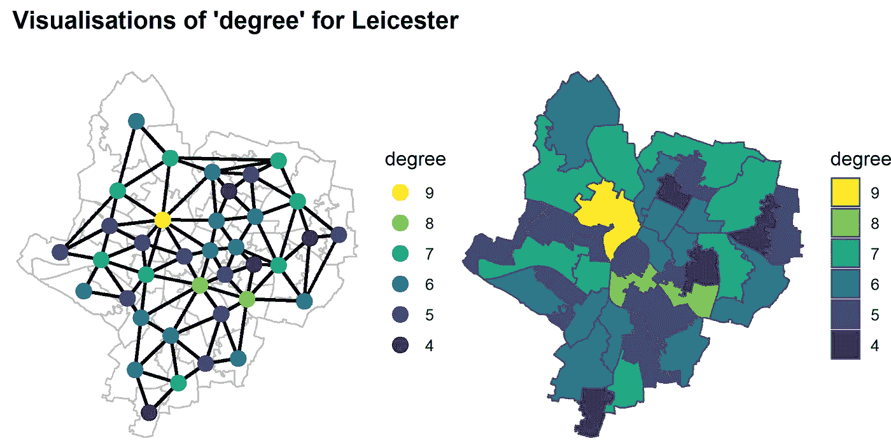
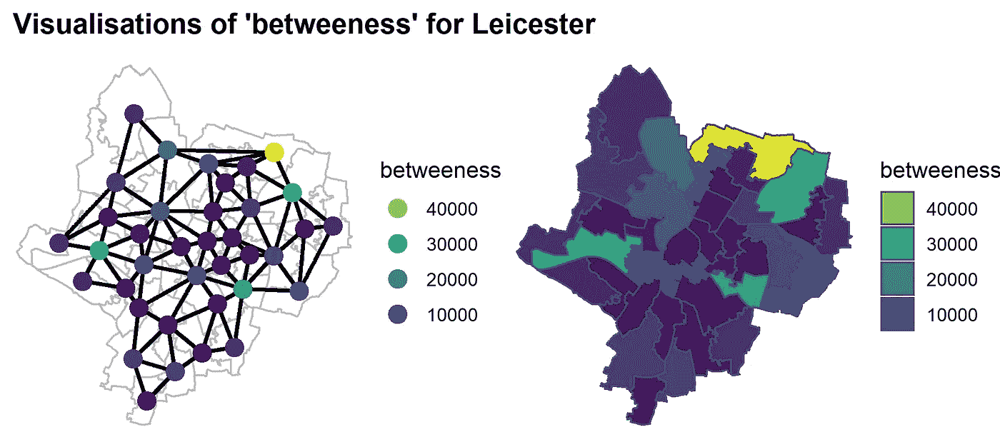
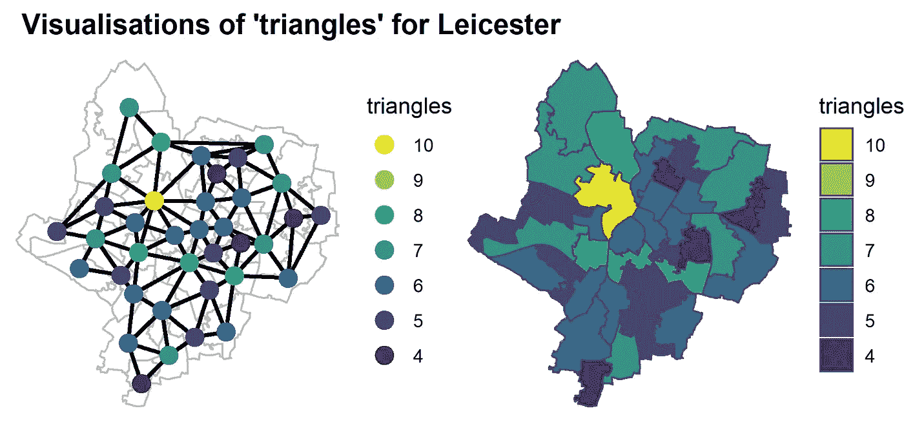
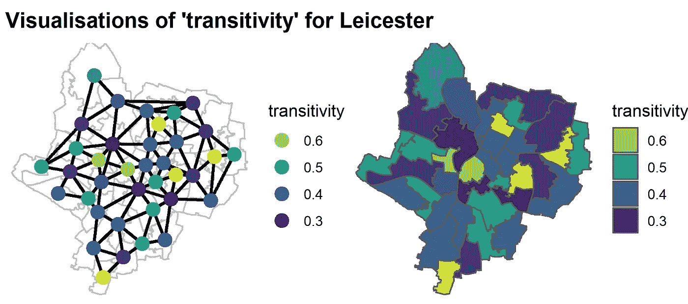
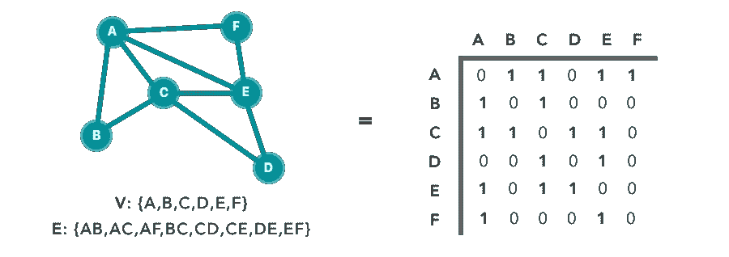
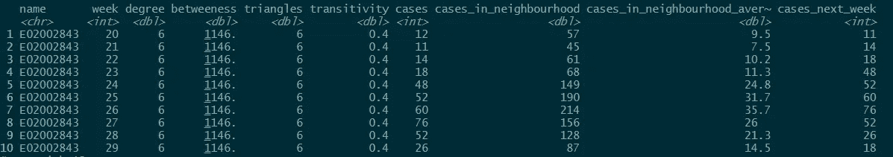
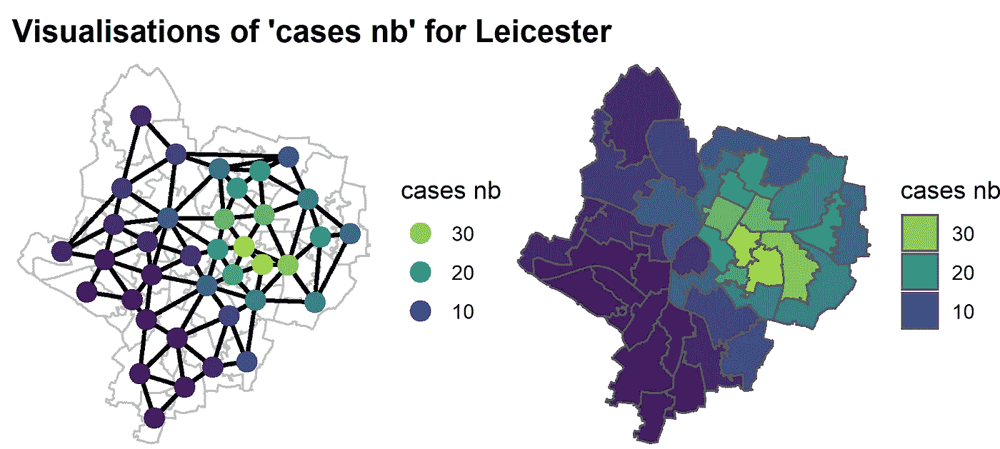
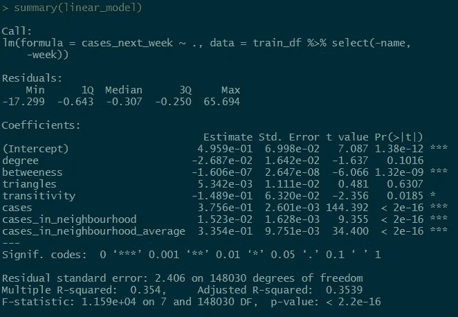
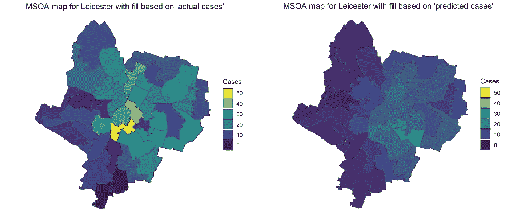

# 使用 R-Part 2 中的网络预测新冠肺炎的传播

> 原文：<https://towardsdatascience.com/predicting-the-spread-of-covid-19-using-networks-in-r-part-2-a85377f5fc39?source=collection_archive---------54----------------------->

## 生成网络要素并进行预测

在[第一部分](/predicting-the-spread-of-covid-19-using-networks-in-r-2fee0013db91)中，我们展示了为什么网络可以用于预测新冠肺炎的传播，我们创建并可视化了一个名为 MSOAs 的英国小区域地理网络。我们最后展示了莱斯特这些地区的网络，覆盖在莱斯特的地图上(如下所示)。我们关注莱斯特，因为这是英格兰第一个实行局部封锁的地区。


(图片由作者创作)

在第二部分也是最后一部分，我们将使用该网络来生成每个区域的要素。最后，我们将使用这些功能创建一个模型来预测一个地区在未来一周将获得的 Covid 病例数。

除了我们在第一部分中涉及的工作，我们将展示代码，你可以在 github 上找到所有的代码[。](https://github.com/theOtherJLo/using_networks_to_predict_covid_cases)

我们从两个 R 对象开始。第一个是`msoa`，它是一个包含 MSOA 案例数据的 tibble，第二个是`msoa_network`，它是英国每个 MSOA 的{tidygraph}网络对象，其中的节点是 msoa，如果它们是邻居，则一条边连接两个 msoa。上面的图像向我们展示了这个网络，但只是针对莱斯特。

这些都是用来创建本帖中显示的数据和可视化的包。

```
library(dplyr)
library(readr) # Loading the data
library(tidyr)
library(sf) # For the maps
library(ggplot2)
library(viridis)
library(cowplot)
library(glue)# Network packages
library(igraph) # build network
library(spdep) # builds network
library(tidygraph)
library(ggraph) # for plotting networks
```

# 使用我们的网络创建要素

有两种方法可以使用我们的网络来创建功能，这有助于将它们分开考虑。

第一类是基于网络结构的特征，例如，一个区域的邻居数量(也称为其度数)。这里的想法是，LAs 的分组和连接方式可能是 Covid 如何在网络中传播的良好指示。

第二个是基于邻近地区正在发生的情况的特征，例如，在邻近的 MSOAs 中有多少病例。这里的想法是，一个被高病例数包围的地区可以预期在接下来的一周内看到自己的上升。

# 基于网络结构的特征

我们将研究其中一些特性，展示我们是如何为我们的网络推导出这些特性的，然后展示这些特性在莱斯特每个 MSOAs 中的价值。

**度数=邻居数量**。你可以从下面的图片中看到，我们有两种不同的方式来观想这一点。

首先是使用网络，这样可以更容易地看到连接每个 MSOA 的边。使用这个网络，您可以很容易地计算任何中央 MSOAs 的所有邻居，以查看它是否与它们的度数相匹配。我们不能对接壤的 MSOAs 这样做，因为我们没有标绘他们所有的邻居，因为他们不都在莱斯特。

第二种方法是使用地图来可视化。这可以更容易地看到整个洛杉矶的价值分布。



(图片由作者创作)

**介数=一个节点有多少条最短路径。**这是一种节点重要性的度量。如果你想从一个 MSOA 旅行到另一个，总有至少一条最短的路线可以减少你必须经过的机场数量。因此，您可能会认为介数高的节点会有更多的人通过它。在现实中，这种方法不太可能代表这一点，而且现实生活中的最短旅行距离与您旅行经过的 MSOAs 最小化没有任何关系。然而，它确实提供了一些额外的背景，模型可能会发现有帮助。

同样，由于我们只是绘制了整个网络的一个子集，我们不能仅仅从莱斯特网络来计算介数。



(图片由作者创作)

**三角形=该节点所属的三角形数量。三角形就是有三个节点相互连接的情况。在我们的例子中，当一个 MSOA 与两个也彼此相邻的 msoa 相邻时，就会发生这种情况。我们可能期望 Covid 在有许多三角形的区域中传播得更多，因为 MSOAs 连接得更多。**



(图片由作者创作)

**传递性=有多少局部聚类。**这是对节点的邻居中有多少也是邻居的度量，通过将邻居对的数量除以该节点所在的三角形的数量来计算。社交网络具有很高的传递性，因为朋友的朋友很可能自己也是朋友。我们可能会认为更高的值会影响 Covid 在网络中的传播方式，因为这意味着区域之间的互联程度更高。



(图片由作者创作)

**通过将方便的{igraph}函数与{tidygraph} `mutate`方法相结合，创建这些功能非常容易**。

我们从网络对象开始。我们`activate`了节点，所以它知道下面的 mutate 将应用于底层节点数据。然后我们应用 mutate，将我们的新特性定义为应用于我们的网络对象的相应的{igraph}函数，它是使用`.G()`获得的。

```
msoa_features <- msoa_network %>% 
  activate("nodes") %>% 
  mutate(degree = igraph::degree(.G()),
         betweeness = igraph::betweenness(.G()),
         triangles = igraph::count_triangles(.G()),
         transitivity = igraph::transitivity(.G(), type = "local")))
```

唯一的区别是对于**传递性**你必须指定你想要使用局部传递性(即每个节点的传递性)而不是网络传递性(这是整个网络的单一度量)。

# 基于邻域的特征

现在，我们希望根据相邻 MSOAs 中正在发生的情况(例如，病例数)来生成要素。与上面只需要生成一次的特性不同，我们需要为每周的案例数据生成这个特性。首先，我们将只看一个特定的星期，即第 25 周，这是莱斯特的第一次高峰。

首先，我们将案例数据连接到我们的网络对象。同样，我们利用了在{tidygraph}对象上使用像`left_join()`这样的{dplyr}动词的方式。

```
msoa_cases_network <- msoa_network %>%  
  activate("nodes") %>% 
  left_join(msoa_features %>% filter(week == 25), 
            by = c("name" = "msoa11_cd"))
```

现在有了一整套的{tidygraph}函数，可以让你在邻居级别应用自定义函数(例如，参见 [map_local](https://rdrr.io/github/thomasp85/tidygraph/man/map_local.html) )然而，我们在这里想要的非常简单，最有效的计算方法(很远)是使用**邻接矩阵**。

你可能还记得上次提到的**邻接矩阵**定义了一个网络。对于网络中的每个节点，它都有一行和一列，如果一条边将节点 *i* 连接到节点 *j* ，则单元 *(i，j)* 的值为 1，否则为 0。



具有相应邻接矩阵的网络示例。Jesus Najera 创作的图片，作为图论博客系列的一部分。

我们首先使用邻接矩阵来创建我们的网络，然而，通过以下方式从现有网络中获得**邻接矩阵**非常容易:

```
adj_matrix <- igraph::get.adjacency(msoa_cases_network)
```

现在，如果我们有网络中每个节点的值的向量，例如 covid 情况，让我们想想如果我们**将邻接矩阵乘以这个向量**会发生什么。结果将是一个相同长度的向量。位置 *i* 将只是原始向量的所有值的总和乘以它们在邻接矩阵的行 *i* 中的位置。但是我们知道第 *i* 排除了第 *i* 排的邻居都是 0，而在那些地方，正好是 1 *。*因此，我们看到结果只是所有节点中所有 Covid 案例的总和，而这正是我们想要的！因为这只是矩阵乘法，所以它发生得非常快。

因此，我们现在知道，为了生成这种“相邻 MSOA 中的 covid 案例”特征，我们只需**将邻接矩阵乘以每个 MSOA 中的 Covid 案例的向量**。这可以通过以下方式轻松实现:

```
msoa_cases_network <- msoa_cases_network %>% 
  mutate(cases_in_neighbourhood = 
             as.vector(adj_matrix %*% .N()$cases),
         cases_in_neighbourhood_average =     
             cases_in_neighbourhood/degree)
```

同样，我们可以将`mutate`应用于 tidygraph 对象。我们通过使用访问网络底层节点数据的`.N()`得到案例向量，然后使用`$cases`得到案例向量。我们使用矩阵乘法将我们的邻接矩阵与此相乘，在 R 中用`%*%`表示。最后，我们将结果包装在`as.vector()`中，这样 R，更确切地说是 mutate，就知道把它当作一个向量。我们通过除以节点的**度**来计算平均案例数。

# 为每周创建此内容

现在我们已经这样做了一周，我们只需要每周都这样做。我以下面的方式使用`lapply`来做这件事。如果你不熟悉[应用系列](https://www.r-bloggers.com/2015/07/r-tutorial-on-the-apply-family-of-functions/)，它类似于`for`循环，但更有效。我们每周应用的代码应该看起来非常类似于我们上面所做的。这里的关键区别是，我们在数据中每周都这样做，然后在最后将所有结果绑定在一起。

```
data_for_predictions <- lapply(msoa_features %>%  
                                  distinct(week) %>% 
                                  pull(week), 
  function(wk){

    message(paste0("Creating features for week ", wk))

    # Filter to the correct week
    weekly_data <- msoa_features %>% 
      filter(week == wk)

    # join onto the network and create network features 
    weekly_network <- msoa_network %>%  
      activate("nodes") %>% 
      left_join(weekly_data, by = c("name" = "msoa11_cd")) %>% 
      mutate(cases_in_neighbourhood = 
                  as.vector(adj_matrix %*% .N()$cases),
             cases_in_neighbourhood_average = 
                  cases_in_neighbourhood/degree)

    # Extract as tibble
    weekly_network %>% 
      as_tibble()

  }) %>% # Bind all these tibbles together
  bind_rows()
```

这样，我们就创建了一个数据集，对于进行预测建模来说，它应该看起来更熟悉。我们每个 MSOA 每周有一行，有很多功能可以帮助我们预测下周。我们在下面提供了一个**摘录，这样你就可以看到我们为某个 MSOA 的几个星期的子集创建的这些新功能。注意，我们已经创建了一个“cases_next_week”变量，因为这将是我们的结果变量。换句话说，我们将使用所有其他变量来尝试和预测下周会有多少病例。**



(图片由作者创作)

像其他功能一样，我们可以在地图上看到任何一周的这些功能。下面的可视化显示了第 25 周的情况。换句话说，**一个区域越亮，其相邻区域的病例越多**。我们称这个变量为“案例 nb”。



(图片由作者创作)

# 创建预测病例的模型

我们将使用上述数据集，尝试使用其他变量来预测“cases_next_week”。这篇博文不打算深究预测建模或机器学习方法或最佳实践。相反，我们将向您展示如何使用上面创建的数据集创建一个简单的线性模型。如果你正在使用这个博客系列从网络中创建你自己的预测模型，你可以用你最喜欢的模型来代替。

# 训练和测试数据集

为了了解模型结果的概括程度，我们将数据分为训练数据集和测试数据集。我们这样做是为了让大约 70%的数据用于训练，30%用于测试。

我们使用 week 变量进行划分，因此我们对某个时间点之前的所有数据进行训练，并对其余数据进行测试。这是为了避免我们对过去的数据进行测试，这可能会导致数据泄漏。如果我们试图将这个模型付诸实践并预测下周发生的事情，**我们将永远不会有来自未来的训练数据。**

```
processed_df <- data_for_predictions %>% 
  select(name, week, degree:cases_in_neighbourhood_average) %>% 
  drop_na()  # This is a bit of a cheat to get results quickly

training_threshold <- 0.7 
training_weeks <- processed_df %>% 
  distinct(week) %>% 
  slice(1:round(nrow(.) * training_threshold)) %>% 
  pull()train_df <- processed_df %>% 
  filter(week %in% training_weeks)test_df <- processed_df %>% 
  filter(!week %in% training_weeks)
```

# 模型创建

现在我们使用`lm`函数创建一个模型。

```
linear_model <- lm(cases_next_week ~ .,
                   data = train_df %>% select(-name, -week))
```

在这里，我们可以检查模型的摘要，并放心地看到“cases _ in _ neighbourhood _ average”与您认为极其重要的“cases”具有相似的大小系数。这意味着 MSOA 多了一个病例，对下周的病例会产生类似的联想效应，而不是我们在每个邻近地区都多了一个病例。换句话说，模型依赖于我们的邻近特征。



(图片由作者创作)

有趣的是，看起来基于网络结构的特征与下周的案例有更不确定的关系，并且没有我们预期的效果。比如他们的系数大部分都是负的。这可能与以下事实有关:如果区域中没有太多 Covid，那么网络结构容易受到 Covid 传播的影响就没有多大意义。

我们可以用下面的方法为我们的测试数据创建预测。

```
test_pred <- stats::predict(linear_model, 
                            test_df %>%  
                             select(-name, -week, -cases_next_week))
```

这让我们能够比较对未知数据的预测和观察。例如，在这里，我们计算测试数据的 RMSE，看到它是 8.36，比训练数据达到的 0.35 高得多，显示模型遭受过拟合。

```
pred.obs <- tibble(pred = test_pred,
                   obs = test_df$cases_next_week)rmse <- pred.obs %>% 
  summarise(sqrt(mean((obs-pred)^2)))
```

# 使用模型

显然，像这样的模型有数百种不同的使用方式。一种方法是将输出可视化在地图上。下面显示了我们的模型根据第 40 周(在我们的测试数据中)的数据对第 41 周每个 MSOA 中的病例进行的预测，并将其与第 41 周实际发生的情况进行了比较。



左边的地图显示实际案例，右边的地图显示根据我们的模型预测的案例。(图片由作者创作)

# 模型性能和改进

现在你可能可以从上面的视觉化图像中看出，这个模型并不是特别好。它在很多领域都是错误的，即使它是正确的，它也严重依赖于该领域已经有多少案例，这不是很有帮助。为了让你了解这一点，如果我们用一个基线模型来代替这个模型，这个基线模型**只是假设病例数不变**，我们将得到 8.18 的 RMSE，比我们的线性模型好**。**

如果我们希望在现实世界中使用这个模型，那么需要做大量的工作来理解如何使用它，并围绕它设计一个模型管道。**这只是预测建模的本质。**如果你自己要做这件事，这里有一些你可能想探索的事情的想法:

*   将结果变量改为“病例数的变化”,以尝试消除对使用当前病例数的过度依赖。
*   使用分类结果变量，如“下周病例会增加 x%吗”或“病例会超过此固定阈值吗”。
*   考虑到每个 MSOA 的人口，所以较小的地区不会有偏见。
*   使用可以减少过度拟合的更复杂的模型(例如，random forest 或 xgboost)。
*   添加更多数据或特征，例如，考虑交通连接区域的方式或额外背景，如该区域的城市化程度。
*   更多的特征工程，例如标准化特征，或者向特征添加噪声(这可以通过减少过拟合来提高模型性能)。

# 结论

这篇文章有效地展示了你如何从关于事物如何联系的信息(如地理上的邻居)开始，并创建许多可用于预测建模的有用特征。

新冠肺炎继续对我们的生活和社会产生巨大影响。由于疾病传播的指数性质，得到**任何关于哪里可能爆发疾病的警告**会在应对的选择和影响方面产生**巨大的差异**。已经有很多令人印象深刻的建模工作在进行，试图给出这个额外的警告(例如帝国理工学院的这个工作)。这篇博客文章表明，网络*可以用来提供额外的功能，使模型更加准确，从而帮助我们对抗这种疾病。*

这篇文章中使用的所有代码都可以在 GitHub 上找到[，这里的`renv`被用来处理包版本和依赖关系。](https://github.com/theOtherJLo/using_networks_to_predict_covid_cases)