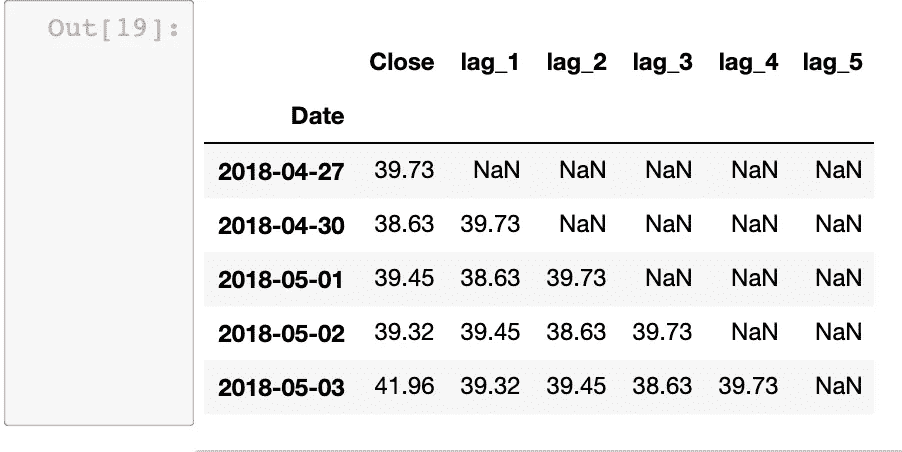
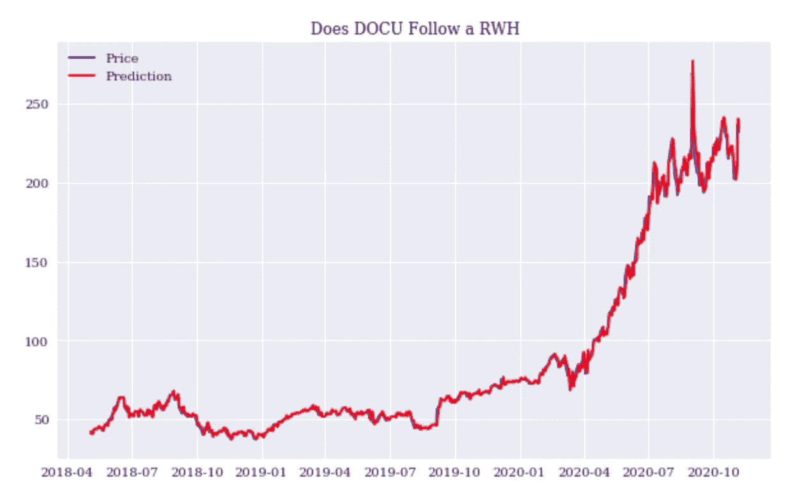
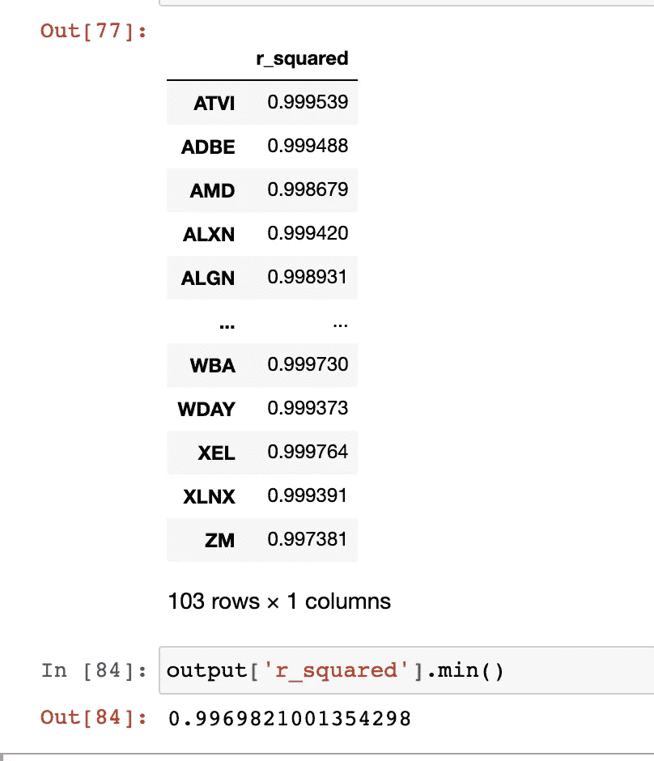

# 预测股市很难:创建一个机器学习模型(可能)不会有帮助

> 原文：<https://towardsdatascience.com/predicting-the-stock-market-is-hard-creating-a-machine-learning-model-probably-wont-help-e449039c9fe3?source=collection_archive---------9----------------------->

马库斯·温克勒在 [Unsplash](https://unsplash.com?utm_source=medium&utm_medium=referral) 上的照片

***来自《走向数据科学》编辑的提示:*** *虽然我们允许独立作者根据我们的* [*规则和指导方针*](/questions-96667b06af5) *发表文章，但我们并不认可每个作者的贡献。你不应该在没有寻求专业建议的情况下依赖一个作者的作品。详见我们的* [*读者术语*](/readers-terms-b5d780a700a4) *。*

有许多关于制作机器学习模型来预测股票价格的文章和方法。我不是在这里宣布他们是错误的或被误导的。事实上，我认为这么多人对试图解决一个古老的问题感兴趣是件好事，对 Python 等编程语言的贡献在一定程度上帮助了投资的“民主化”，人们现在可以在几分钟内建立一个相对复杂的机器学习模型。相反，本文想要展示的是支持股票价格可能无法预测这一观点的证据。具体来说，本文将使用 Python 来强调股票价格或多或少遵循随机游走的思想。文章的主旨是，随机漫步并不排除击败市场的可能性，也不主张将投资模型扔到一边，但它应该发出信号，这些模型应该以极度的谨慎和勤奋来构建，并不断进行重新评估。建立交易算法的过程在很多情况下是一个终生的过程。

## 随机游走理论综述

股票价格的随机游走理论有很长的历史，最早是在 19 世纪中期提出的，然后在 20 世纪中期由尤金·法马和伯顿·马尔基尔等人推广，后者以他的经典之作《华尔街的随机漫步》使随机游走理论在投资界变得常见。该理论最简单的形式是，股票价格无法预测，因为股票价格的变化是随机的。该理论假定金融市场是有效的。也就是说，由于市场参与者是理性的利润最大化者，所有公开信息都包含在股票的当前价格中。如果存在任何异常，它将被迅速利用和消除，从而导致更高效的状态。例如，假设市场认为苹果的股票被低估了。随机游走理论假设市场参与者会立即购买股票，这反过来会导致股票不再被低估。这种“完美”的效率使得股票价格被相应地定价，并反映所有可用的信息。新消息是唯一能改变股票价格的东西，因为消息周期是不可预测的，所以股票价格会随机波动。

你可能已经注意到，随机漫步假说(RWH)做了几个假设，其中最主要的是金融市场是有效的。然而，泡沫存在的事实似乎推翻了这一假设，从而对随机漫步理论提出了质疑。此外，该理论催生了行为金融学领域，理查德·塞勒是其主要支持者之一，该理论旨在表明投资者在许多情况下远非理性行为者，这反过来意味着当行为者经常非理性行为时，市场很难有效。

尽管有这些(合理的)反对意见，随机漫步假说得到了大量经验证据的支持，本文的剩余部分将借助 Python 强调其中的一些。代码可以在[这里](https://github.com/cbecks1212/RWH/blob/main/Trading%20Strategies.ipynb)找到

## 用 Python 演示随机漫步

根据 RWH 的说法，因为股票价格遵循随机游走，所以股票今天的价格是对其明天价格的最佳预测。为了检验这种说法，我们可以将某一特定股票在不同时间间隔内的滞后价格与该股票的最近价格进行比较，以确定它们是否代表今天的价格。

滞后 1、2、3、4 和 5 天的 DOCU

同样，这里的想法是评估今天的价格是否是明天价格的最佳指标。如果是这样的话，那么股票会相应地定价，因此会随机波动。另一方面，如果滞后价格与今天的价格几乎没有关系，那么今天的价格就不是股票价格的最佳预测者——也许过去的价格是——因此市场是无效的。使用线性回归来评估这一点，我们可以看到滞后价格与今天的价格有着极其密切的关系。在这个特殊的例子中，DocuSign 的滞后价格代表了今天的价格。

将这一分析扩展到纳斯达克 100 指数中的每一只股票，这一现象被证明是普遍的。纳斯达克 100 指数中每只股票的每个线性回归模型的 r 平方得分为 0.99，表明该模型几乎解释了数据中的所有变化。也就是说，滞后价格系列，尤其是 lagged_1，完全解释了最近的价格:

## 这是否意味着投资者不能选股

RWH 的一个含义是，传统的选股方法，如技术和基本面分析，用处不大。这两种技术都意味着投资者可以利用这些方法来制定有利可图的交易策略，但 RWH 认为这通常会弄巧成拙，因为交易者会利用并因此抵消这些异常，使市场变得有效。然而，该假说允许在某些情况下选股，分析师会比遵循简单的买入并持有政策的投资者做得更好，只要他能比其他分析师和投资者更快地识别实际价格和内在价值之间存在不可忽略的差异的情况，并且如果他能更好地预测重要事件的发生并评估它们对内在价值的影响。

## 结论

是的，随机漫步理论享有实证支持，并为算法设定了很高的标准，以持续不断地预测股价走势。但这并不自动意味着建立投资模型的雄心被抛弃。甚至 RWH 也允许 T2 的一些交易者表现优于其他交易者。[吉姆·西蒙斯](https://www.amazon.com/dp/B07NLFC63Y/ref=dp-kindle-redirect?_encoding=UTF8&btkr=1)是一个克服困难的完美例子。他花了数年时间试图“解决市场问题”，一个方法接一个方法都失败了，最终取得了突破，经过了数年和无数个小时来完善他的方法。即使是现在，他的公司也只有一半的交易是正确的。重点不是阻止你建立下一个机器学习模型，而是现实地设定期望，并鼓励你长期坚持下去。

## 进一步阅读

股票市场价格的随机波动

[漫步华尔街](https://www.amazon.com/Random-Walk-Down-Wall-Street/dp/0393358380/ref=pd_lpo_14_img_1/145-8853997-4885324?_encoding=UTF8&pd_rd_i=0393358380&pd_rd_r=28b5865a-2dc1-46cf-9231-2b42a28ae2e5&pd_rd_w=lqC0m&pd_rd_wg=B5axP&pf_rd_p=7b36d496-f366-4631-94d3-61b87b52511b&pf_rd_r=C2YVE42MF335DKN6GFS8&psc=1&refRID=C2YVE42MF335DKN6GFS8)

[解决市场的人](https://www.amazon.com/dp/B07NLFC63Y/ref=dp-kindle-redirect?_encoding=UTF8&btkr=1)