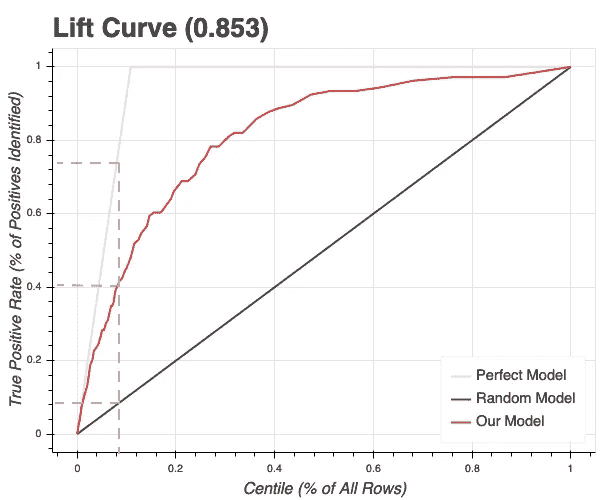

# 用机器学习预测股市。标杆管理。

> 原文：<https://towardsdatascience.com/predicting-the-stock-market-with-machine-learning-benchmarking-44181286389?source=collection_archive---------26----------------------->

## 亨尼投资

## 用随机森林分类器绘制基线。

[图片](https://stock.adobe.com/ca/images/glowing-forex-chart-background/275842087)作者[佩什科夫](https://stock.adobe.com/ca/contributor/201828616/peshkov?load_type=author&prev_url=detail)

本文描述了一个**机器学习**模型的实现细节和基线性能，该模型用于预测过去 **8 年中 **S & P500 公司**下一年的收入。**如果你还没有看到介绍，请阅读[用机器学习预测股市。引言。](https://medium.com/vhinny-investing/predicting-the-stock-market-with-machine-learning-introduction-310cd6069ffa?source=friends_link&sk=d4479bf5481f19b2b0b7ac9fe87366af)熟悉背景、问题陈述和我选择的解决方法。我们开始吧！

# 什么是基线？

基线模型是一个简单的模型，用于建立一个参考点，并有效地跟踪一个人的进展。我如何知道我在开发**机器学习**管道的各个方面时取得了进展？当新型号**比以前型号**表现得更好时，我知道我取得了进步。在本文中，我将构建这个**先前的**模型，它将成为下一个更复杂模型的**基准**。此外，它将帮助我对重要的特性建立一些直觉，并帮助确定进一步开发的优先级。

# 偏见意识

在**机器学习**中最危险的两个问题，在我看来就是未来泄漏和过拟合。

**未来泄漏**是指将表示在预测时不可用的信息的特征包括到训练数据集中。这是一个时间序列问题。因此，防止未来泄漏的第一步是确保在每个时间戳使用的功能不来自该时间戳之后发布的报告——这是一个快速验证，但我们最好确定。

**过度拟合**指的是以这样一种方式训练模型，它可以很好地预测过去(在训练集上做得很好)，但不能预测未来。在这项研究中，这个问题可能来自于财务特征的概念不会随着时间的推移而发生巨大的变化。如果我们在**训练**和**验证**集合中的不同时间戳都包括同一家公司，并且这家公司碰巧持续增加其收入，那么模型将最有可能了解什么特征组合代表这家公司(这将产生正确的预测)，而不是什么特征组合驱动实际增长。我希望我的模型能够对以前从未见过的公司做出正确的预测。因此，我需要确保它学习功能的趋势，而不是公司的趋势。

# 培训—验证—保持

有了 **8** **年**的历史和 **500 家公司**，我将使用每个时间戳每个公司 **(2)年的历史数据**。由于每个时间戳我需要 2 年的历史数据，所以可预测的最早年份是 **2014** (其中 2012 和 2013 构成特征)，最晚是 **2019** (其中 2017 和 2018 构成特征)。我使用 2018 年和 2019 年作为样本外的**维持**，它不会用于训练模型。相反，我将使用它来评估和报告模型性能。

该模型在 2014 年**至 2017 年**使用群组 K 倍验证进行训练。使用这种方法，训练包括使用较晚的年份来预测较早的年份，这在**偏差意识**一节中被警告过。但是，在这种情况下，这不是一个问题，因为我使用 **Group K-Fold** 抽样方法，通过公司 ID 而不是随机地在培训和验证之间区分公司。如果某个公司出现在定型集中，它将根本不会出现在验证集中，无论是哪一年。同时，正如**偏见意识**一节所警告的，培训(A 公司，2016)和验证(B 公司，2014)不会引入过度拟合，因为 B 公司对 A 公司没有任何洞察力，除非这两家公司的目标高度相关。

# 选择模型

在这个阶段，我想要一个实现简单并且不需要太多调整的模型。**逻辑回归**可能是一个不错的选择，但它需要仔细考虑处理空值以及相关特征，以获得有意义的系数。 **XGBoost** 可能是解决这个问题的最佳模型，但是它需要相当大的努力来调整参数。我将改为实现一个**随机森林**。与 XGBoost 不同，它本身不能处理空值，但是它具有良好的开箱即用性能，并且它的特性重要性在某种程度上代表了它预测高概率的原因。

# 基准性能

评估分类模型的一个好方法是查看其**提升曲线**。提升曲线允许我回答以下问题:“如果我从模型中选择了前 N 个预测，我将在 P 个案例中的 K 个案例中是正确的”。

下面是第 5 级的**提升曲线**，预测公司在下一年的收入是否会翻倍。

该图描绘了三(3)个场景，向我们展示了**我们的模型**的性能，随机猜测**将如何执行，以及**完美模型**将如何在维持集上执行。在这个类中，只有 **~12%的阳性**，所以我们的模型必须相当有选择性。假设我们画出了概率的前 8%(垂直虚线)。最佳模型会将前 8%的概率分配给所有正样本，这将在我们的维持集中提取所有正样本的**~ 75%**(顶部虚线)。我们的模型提取了所有阳性**(中间虚线)的 **40%** **，大约是完美模型的一半。随机猜测只有 8%的正面结果(底部虚线)，比我们的模型差五(5)倍。**

通过提高概率等级，我的模型的性能更接近完美模型的性能。如果我画出预测的前 4%,我的模型的性能将几乎是完美的，换来的是给我更少的选择。虽然这听起来很诱人，但应该谨慎，因为数据量不够大，而且前 4%只产生了几十个样本。

也就是说，要成为一个成功的投资者，你可能只需要十几家公司。如果做得正确，这些人会排在前百分之几。

# 结论

我现在已经用一个**开箱即用的随机森林**模型对我在第 5 类上的表现进行了基准测试。虽然这个性能看起来不错，但我仍然不知道这个模型依靠什么来做出决策。为了找到答案，我将打开盒子，通过查看**特征重要性**，看看是什么驱动了这些预测。这将有助于我对推动下一年收入增长的因素建立一些**直觉**。下一篇见[。](/predicting-the-stock-market-with-machine-learning-drivers-295d85d406e7?source=friends_link&sk=ceb5326ca92e917eceecb02beea7efbd)

# 财务数据

在这项研究中，我使用了 www.vhinny.com 的历史金融数据。Vhinny 的 **Alpha 数据集**为 **S & P500** 公司提供从 2011 年开始的 **8 年多**的基础数据，如资产负债表、损益表和现金流量表。

# 我们连线吧！

我很高兴和与我志同道合的人联系，这是对财务独立的追求。如果你也在寻求经济独立，或者你想合作，交流想法，请随时联系我们！以下是我管理的一些资源:

*   [www.vhinny.com](http://www.vhinny.com)—投资研究平台，为您自己的分析提供金融数据
*   [https://www.linkedin.com/company/vhinny](https://www.linkedin.com/company/vhinny)——加入我们 LinkedIn 上的社区，在那里我和其他贡献者分享与投资相关的内容

干杯！

***来自《走向数据科学》编辑的注释:*** *虽然我们允许独立作者根据我们的* [*规则和指导方针*](/questions-96667b06af5) *发表文章，但我们不认可每个作者的贡献。你不应该在没有寻求专业建议的情况下依赖一个作者的作品。详见我们的* [*读者术语*](/readers-terms-b5d780a700a4) *。*