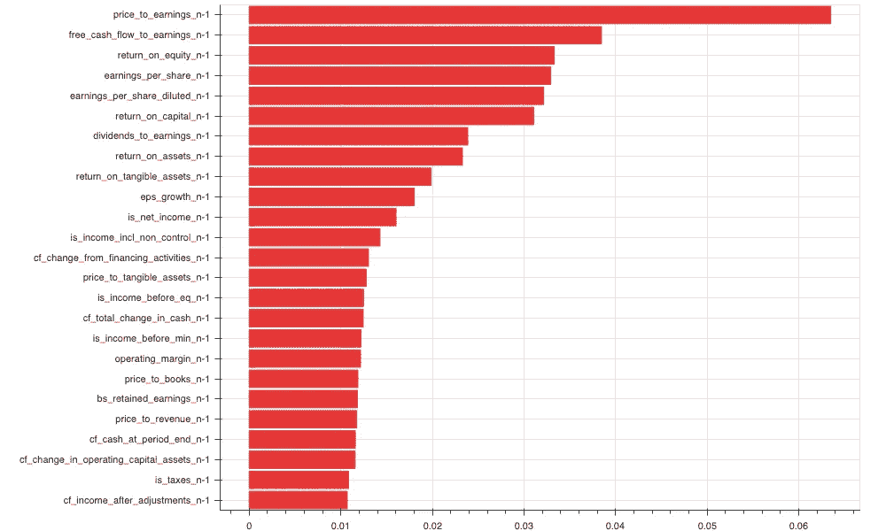
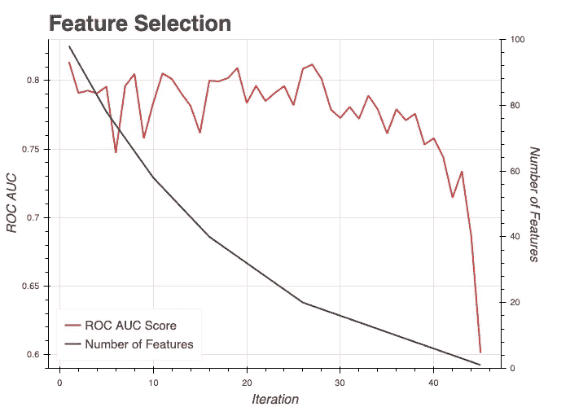
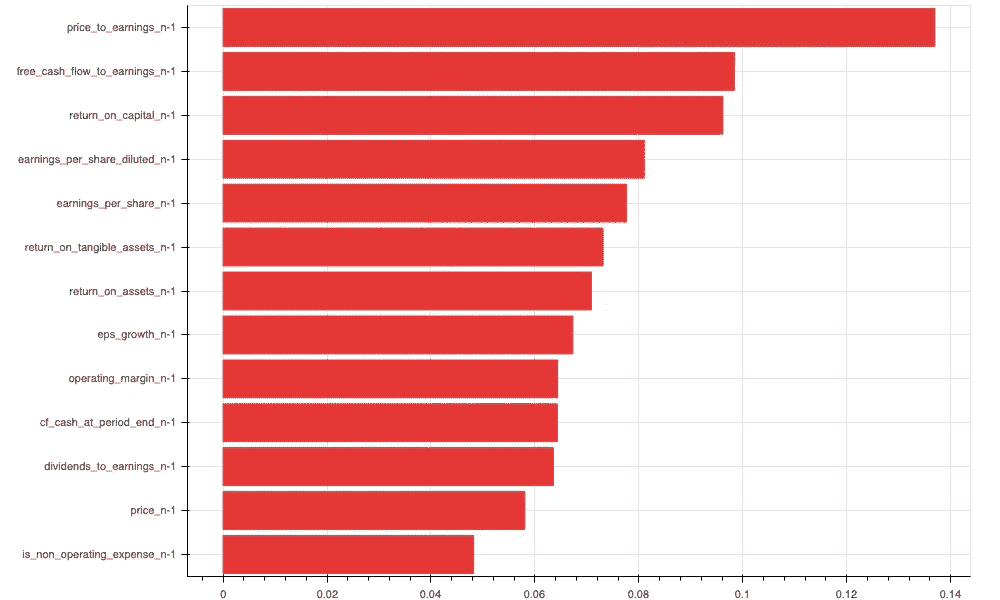
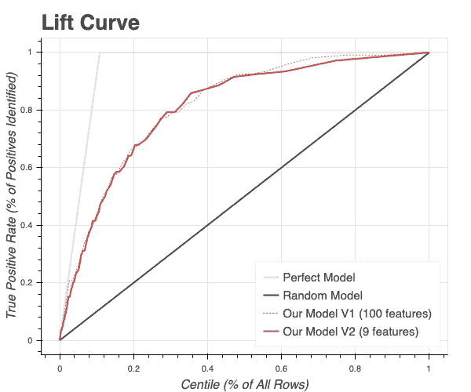

# 用机器学习预测股市。司机。

> 原文：<https://towardsdatascience.com/predicting-the-stock-market-with-machine-learning-drivers-295d85d406e7?source=collection_archive---------44----------------------->

## 亨尼投资

## 用随机森林预测下一年的收益。

[图片](https://stock.adobe.com/ca/images/strategic-management-3d-illustration-white-and-red-block-stack-continue-with-crowd-polygon-people-standing-around-on-white-floor-creativity-ideas-concept/317029619?prev_url=detail)由 [whyframeshot](https://stock.adobe.com/ca/contributor/203568134/whyframeshot?load_type=author&prev_url=detail) 拍摄

这项研究进一步有助于用**机器学习**探索**股市**。在本文中，我描述了我在以前的文章中介绍的模型的驱动因素:

*   [用机器学习预测股市。引言。](https://medium.com/vhinny-investing/predicting-the-stock-market-with-machine-learning-introduction-310cd6069ffa?source=friends_link&sk=d4479bf5481f19b2b0b7ac9fe87366af)
*   [用机器学习预测股市。标杆管理。](https://medium.com/vhinny-investing/predicting-the-stock-market-with-machine-learning-benchmarking-44181286389?source=friends_link&sk=a5e00eb9c7a7ae1b59e0903b2a942532)

如果你还没有读过它们，我建议你从“引言”开始。它将引导你按时间顺序阅读这篇文章，并帮助你熟悉问题陈述和我所采用的方法。

我们开始吧！

# 进展概述

在上一篇文章中，我讨论了我构建的**随机森林**模型，该模型用于预测明年的收入**作为这项研究的基准。我们的目标是获得模型的基线性能，并了解它在不费力的情况下能做得有多好。其基线表现中规中矩，达到了 0.85 的 **ROC AUC** 。虽然看到良好的性能很好，但更重要的是理解模型如何做出决策，并验证什么**驱动**模型**直观上有意义。****

# **随机森林特征重要性**

我已经用 **Python** 中的 **sklearn** 包实现了这个**随机森林**模型。开箱即用的软件包提供了计算**特性重要性**的内置功能。在**随机森林**和其他**树** **算法**中，一般来说，分类特征重要性是基于每个特征在所有树上平均的平均熵减少来计算的。由于它偏向于**高基数特性**并且忽略了**变量交互**，所以它不是真正特性重要性的最佳衡量标准。然而，这是一个很好的方法来大致了解正在发生的事情。

**我的模型中前 25 个特性的特性重要性**如下所示。

Y 轴上显示了建模特征。X 轴显示特征重要性值。建模数据集包含约 100 个特征，涵盖了资产负债表、损益表和现金流量表的所有方面。

我们可以观察到前 13 个特性的特性重要性之间的显著差异。上方地块上*cf _ change _ from _ financing _ activities _ n-1*下方的特征逐渐变平。这意味着该模型主要依靠前 13 个特征来做出重要决策，而对较低特征做出的决策可能不会对做出正确的预测做出重大贡献。

# 简化模型

我上面的观察表明，模型可能不需要提供给它的所有信息来完成它的工作。验证此假设的一个好方法是从最不重要的特性开始迭代地删除特性，并评估每一步模型性能的变化，这也是评估特性重要性的另一种方法。

下图显示了 **ROC AUC** 得分在每次迭代中的演变，其中**从最不重要的特征开始移除 5%** 的特征。

X 轴显示了**的迭代次数**，右边的 Y 轴显示了数据集中剩余的**个特征**，左边的 Y 轴显示了在剩余特征上训练的模型的 **ROC AUC** 分数。

我们可以看到，在第一次 **30 次迭代**中删除特性并不会显著影响这个模型的性能。将**移除**并简化模型是有意义的，给我们留下剩余的 **13 特征**，我将更详细地研究这些特征。

以下是其余 **13 个特性**的新特性重要性。

我们可以看到，该图上的大多数功能也出现在全功能模型的顶级功能中。部分变化包括精选车型中*的**缺席**is _ net _ income*以及精选车型*增加*价格的**。***发生这些变化是因为在每次迭代中重新计算了特性的重要性。由于基于树的算法的**贪婪性**，这不能保证与所有特征模型特征重要性的一致性。*

# 特性有意义吗？

在这一点上，我已经显著地**减少了**功能的数量，而没有牺牲模型的性能。人们可以观察到其余的特征具有强烈的直觉。其中大部分是描述**业务盈利能力**的比率。它们包括基本比率，如资本回报率、有形资产回报率、股息收益比、营业利润率等。

同时，有些特征不应该用于预测下一年的收入。这些特征是*价格 _n-1* 和*价格 _ 收益 _n-1。尽管价格和本益比可能与净收入的增长相关，但重要的是要记住:*

> **相关性不等于因果性**

当建立机器学习模型时，因果关系是可靠预测的基础。没有因果关系的相关性不会。收入不取决于股价，而股价可能取决于收入(或者没有收入)。净收入的变化可能是**导致**、**、**高市盈率的原因，而不是相反。

话虽如此，但值得注意的是，预测时可用的是**市盈率。为什么不用呢？**

我担心的是，高市盈率意味着**市场预期**公司未来会赚更多的钱。这意味着市盈率本身是市场对公司业绩预期的一个代表。依靠市场对一家公司收入变化的预期，确实有助于建立稳健的模型。尤其是当市场大部分时间都是错的时候。因此，PE 和价格**不应该被**用作预测**明年收入**的模型中的特征。

最后，我还将删除*每股收益 n-1* ，因为它与*每股收益稀释 n-1* 强烈**相关**，并删除*每股收益 n-1* ，因为它与更具体的*有形资产收益 n-1 强烈相关。*

这给我们留下了一个由 9 个特征驱动的模型，即:

*   资本回报率
*   稀释后每股收益
*   有形资产收益率
*   收益比股息
*   每股收益增长
*   现金
*   营业利润
*   自由现金流对收益
*   非营业费用

# 新的简化模型的性能

从原始模型中移除 90%的特征后，让我们评估升力曲线的变化。

红色虚线显示了包含所有 100 个特征的模型的升力曲线。红色实线显示了 9 特征模型的升力曲线。接近曲线右侧的性能轻微下降并不明显，而特性数量减少了 90%。这是有利的，因为理解 **9 特征**之间的关系比理解 **100 特征**之间的关系简单得多。

# 结论

在这篇文章中，我调查了预测 2014 年至 2019 年间标准普尔 500 指数公司明年收入的随机森林分类器的驱动因素。我还使用删除特征选择技术将模型中使用的特征数量减少了大约 90%。

在[的下一篇文章](/predicting-the-stock-market-with-machine-learning-findings-135f0b3a26cf?source=friends_link&sk=f94df16760de79effcd2ba10525b4ebc)中，我将更深入地研究剩余的特征，以理解**它们**究竟如何驱动**模型预测，以及寻找**成长股**的投资者应该追求什么。回头见！**

# 我们连线吧！

我很高兴和与我志同道合的人联系，这是我对财务独立的追求。如果你也在寻求经济独立，或者你想与**合作**，交换想法或交流思想，请随时联系我们！以下是我管理的一些资源:

*   [www.vhinny.com](http://www.vhinny.com)—投资研究平台，为您自己的分析提供金融数据
*   [https://www.linkedin.com/company/vhinny](https://www.linkedin.com/company/vhinny)——加入我们 LinkedIn 上的社区，在那里我和其他贡献者分享投资相关的内容

干杯！