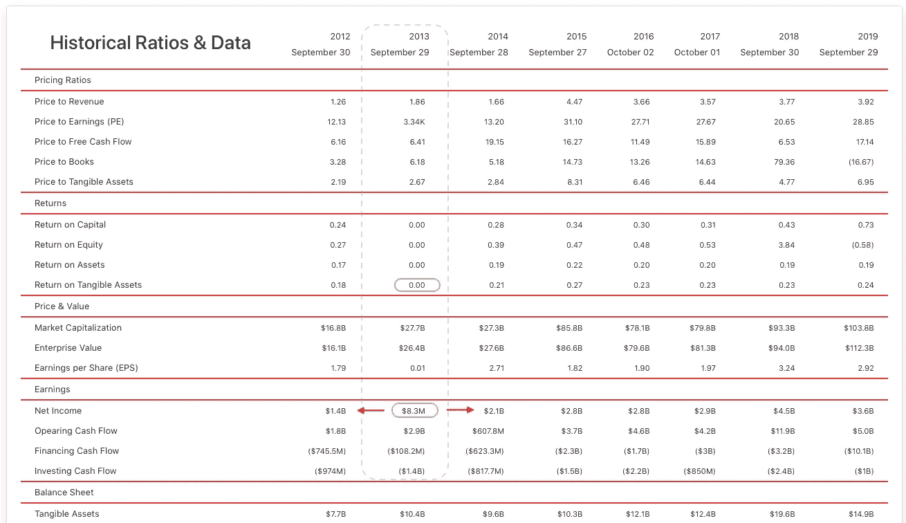

# 用机器学习预测股市。调查结果。

> 原文：<https://towardsdatascience.com/predicting-the-stock-market-with-machine-learning-findings-135f0b3a26cf?source=collection_archive---------32----------------------->

## 亨尼投资

## 用机器学习识别高收入成长股

[图片](https://stock.adobe.com/ca/search?filters%5Bcontent_type%3Aphoto%5D=1&filters%5Bcontent_type%3Aillustration%5D=1&filters%5Bcontent_type%3Azip_vector%5D=1&filters%5Bcontent_type%3Avideo%5D=1&filters%5Bcontent_type%3Atemplate%5D=1&filters%5Bcontent_type%3A3d%5D=1&filters%5Bcontent_type%3Aimage%5D=1&k=performance&order=relevance&safe_search=1&search_page=1&search_type=usertyped&acp=&aco=performance&limit=100&get_facets=0&asset_id=305061159&continue_checkout=1)由 [teerapon](https://stock.adobe.com/ca/contributor/207328848/teerapon?load_type=author&prev_url=detail) 拍摄

在这篇文章中，我展示了我在 2014 年至 2019 年间预测 **S & P500** 家公司的**明年收入**的主要发现。虽然这不是必需的，但我鼓励读者看到我在这里分享的观察结果:

*   [用机器学习预测股市。引言。](https://medium.com/vhinny-investing/predicting-the-stock-market-with-machine-learning-introduction-310cd6069ffa?source=friends_link&sk=d4479bf5481f19b2b0b7ac9fe87366af)
*   [用机器学习预测股市。标杆管理。](https://medium.com/vhinny-investing/predicting-the-stock-market-with-machine-learning-benchmarking-44181286389?source=friends_link&sk=a5e00eb9c7a7ae1b59e0903b2a942532)
*   [用机器学习预测股市。司机。](/predicting-the-stock-market-with-machine-learning-drivers-295d85d406e7?source=friends_link&sk=ceb5326ca92e917eceecb02beea7efbd)

我们开始吧！

# **知道模型在做什么**

设计一个优秀的机器学习模型，关键是要准确知道它在做什么。当使用类似于**回归**的东西时，达成这种理解可能很容易，而当使用**深度学习神经网络时，则非常困难。**尽管如此，负责人应该始终致力于**了解**模特是如何**思考**的。没有它，模型的预测一文不值。

# 我的模型在做什么

在[的前一篇文章](/predicting-the-stock-market-with-machine-learning-drivers-295d85d406e7?source=friends_link&sk=ceb5326ca92e917eceecb02beea7efbd)中，我已经将原始模型中使用的功能从 100 个减少到 9 个，而没有牺牲模型的性能。其余的特征是:

*   资本回报率
*   稀释后每股收益
*   有形资产收益率
*   收益比股息
*   每股收益增长
*   现金
*   营业利润
*   自由现金流对收益
*   非营业费用

我使用了**随机森林**特征重要性来决定哪些特征应该保留，哪些特征应该丢弃。虽然**特征重要性**帮助我理解了每个变量在预测分数时的**权重**，但它没有告诉我每个特征究竟如何影响分数。运营利润应该是**高还是**低？我们期待高股息还是低股息？**应该有多少**现金？

# 寻找方向

在基于树的算法中，将**方向**贡献给特征重要性的一种方法利用了 **SHAP 值**。如果你不熟悉这项技术，请看这里的[。](/explain-your-model-with-the-shap-values-bc36aac4de3d)

我的模型的 SHAP 值如下所示。请注意，我已经从上述功能中删除了非运营费用，因为它没有为模型性能增加实际价值。

该图上的 X 轴测量每个特征对预测分数的**影响**。Y 轴显示了用于生成预测分数的所有**特征**。颜色条显示该特征的**值**是高还是低**。例如，高股息收益鼓励模型作出积极的预测(红色，积极的 SHAP 值)。然而，有形资产的高回报鼓励模型做出负面预测(红色，负 SHAP)。**

这个图揭示了对于一个聪明的投资者来说可能不直观的关系。它说，第二年**收入**翻一番的公司应该有**低**资本回报率、**低**有形资产回报率和**低**营业利润率——所有这些都是糟糕经营业绩的指标。

# 更进一步

SHAP 值分析允许我在**个体** **样本水平**上查看每个特征如何影响预测。让我们来看看我的模型做出的**前 2 位**正确预测。

前 2 个积极预测

该模型预测 2013 年星巴克(SBUX)的收入将翻一番。我们来详细看一下。所有 8 个预测值都是红色的，**对预测值做出了积极的贡献**，将预测值一直推高到 0.96。

正如**“寻找方向”**部分所预期的那样，我们的**资本回报率** (0.001)可疑地低，而**自由现金流对收益** (520)和**股息对收益**比率(76)可疑地高。

这些比率不在正常范围内，需要进一步调查。该公司有足够的现金支付通常的股息，但收入却不多。让我们通过 Vhinny 的历史比率和数据来看看这与全球情况是如何吻合的。

[https://www.vhinny.com/display/SBUX](https://www.vhinny.com/display/SBUX)

事实上，2013 年报告的净收入为 830 万美元，与 2012 年的 14 亿美元和 2014 年的 21 亿美元相比大幅下降。更进一步，你会发现星巴克那年记下了 28 亿美元的诉讼费用。虽然 28 亿美元是一个沉重的打击，但星巴克的盈利潜力并没有受到影响。高的自由现金流对收益比率表明企业仍然赚钱，并继续正常运营。果然，第二年净收入恢复正常，证明我的**模型的预测**是正确的。

# 是什么导致了负面预测

了解了模型如何做出自信的**正面预测**，让我们看看它如何做出自信的**负面预测**。以下是**前 2 位**负面预测的 SHAP 值。

前两大负面预测

对于这两个示例，所有 8 个预测值都在**蓝色**中，对预测得分产生负面影响。事实上，这两个例子的**预测分数**是**0.00**——低得不能再低了。

看看家得宝(Home Depot)，我们可以看到良好的有形资产回报率(T44)和资本回报率(T46)，自由现金流与收益之比(1.41)在 1.41 左右，这属于正常范围。特洛伊的海伦(乐和)也有类似的情况。

这三项指标将 HD 和乐和定义为产生高回报的盈利公司。投资者通常喜欢这种类型的公司，因为它们的业务表现强劲。为什么我的模型认为一个好的企业不会在第二年收入翻倍？

虽然优秀的公司年收入翻倍并非不可能，但数据表明，一般来说，具有强大业务特征的公司会逐渐自信地成长。实际上，T2 需要两倍的人在世界各地为家得宝建造房屋，T4 需要两倍的收入。800 亿美元的年销售额，在正常情况下不太可能发生。为了让模型预测收入大幅增长的可能性，需要在数据的**异常区**中有一些东西，这就是我们在自信的正面例子中看到的。

# 结论

在这篇文章中，我描述了我建立的预测**明年收入的模型**如何做出决策。研究结果表明，在正常经营条件下，好的企业不太可能在第二年实现收入翻番。与此同时，由于“一次性”事件而失去收入的企业可能会重新站立起来，继续正常运营。该模型能够通过分析公司在给定年度的收入情况下赚了多少现金来识别这些公司。

如果读者和我一样，希望在数据中找到信号并认同股市，我鼓励读者把我的结果当作想法，进行自己的研究。如果读者对这项特别的研究感兴趣，那么推进我的发现的一个好地方就是看看公司规模如何影响企业在遭受打击后恢复正常的概率。

本文**总结了**这一系列利用基础财务数据预测**下一年收益的**。我希望读者发现我在这里分享的见解是有价值的，并在他们自己的选股过程中加以利用。

我将继续研究 2020 年的股市崩盘。下期见！

# 我们连线吧！

我很高兴和与我志同道合的人联系，这是对财务独立的追求。如果你也在寻求经济独立，或者你想合作，交流想法，请随时联系我们！以下是我管理的一些资源:

*   [www.vhinny.com](http://www.vhinny.com/)—投资研究平台，为您自己的分析提供金融数据
*   [https://www.linkedin.com/company/vhinny](https://www.linkedin.com/company/vhinny)——加入我们 LinkedIn 上的社区，在那里我和其他贡献者分享与投资相关的内容

干杯！