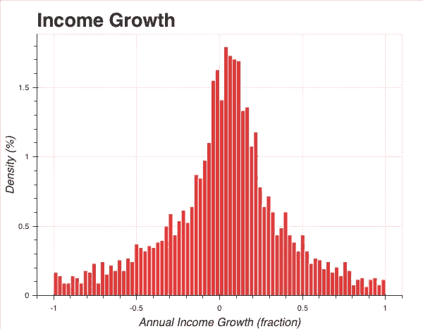
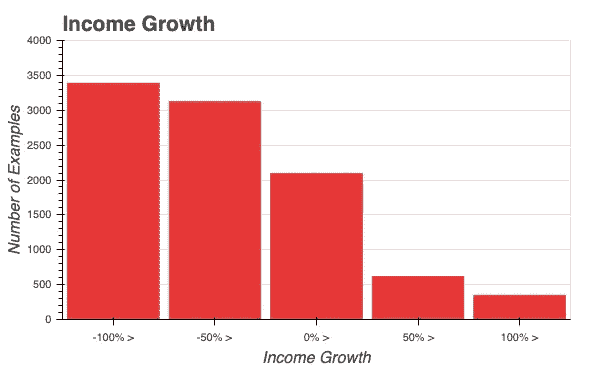

# 用机器学习预测股市。引言。

> 原文：<https://towardsdatascience.com/predicting-the-stock-market-with-machine-learning-introduction-310cd6069ffa?source=collection_archive---------19----------------------->

## 亨尼投资

## 问题陈述和方法。

这篇文章标志着我在金融市场寻找信号之旅的开始，在这里我使用各种统计方法和**机器学习**来分析股票市场，并识别有吸引力的**投资**。

[图片](https://stock.adobe.com/ca/images/mountain-climbing-route-to-peak-business-journey-path-in-progress-to-success-vector-concept/199086508)由[缩微](https://stock.adobe.com/ca/contributor/206206823/microone?load_type=author&prev_url=detail)

> 千里之行始于足下

如果你不确定我为什么自己去找信号而不去找“专家”，可以看看这篇文章:[论精英如何平庸](https://medium.com/@vitddnv/on-how-elite-is-mediocre-4645dd8e8)。

# 财务数据

在这项研究中，我将使用 www.vhinny.com 的历史金融数据。他们的 **Alpha 数据集**为 S & P500 公司提供从 2011 年开始的 **8 年多**的基本财务数据，如资产负债表、损益表和现金流量表。

# 目标

我的目标是找到我能衡量的关于公司的一些特征和股票价格之间的关联**。然而，一个聪明的投资者可能已经观察到，股票价格并不完全与商业表现相关。相反，它会受到许多因素的影响，如大大小小的经济事件、公众的看法、对变化的期望、产品的新趋势、消费者行为的新趋势等等。**

这让我置身于一个充满**噪音**和统计**偏差**的房间，因为存在着我**无法测量**的因素。忠于我的目标，我将暂时离开这个众所周知的强劲对手，股票价格预测，并专注于预测我更有**控制**的领域——明年的收入。一旦我对市场驱动因素的理解建立了坚实的基础，我就会回来预测股票价格。

明年的收入是一个更容易解决的问题，因为它与公司的基本面有直接关系。这是一个开始熟悉数据并了解财务信息在预测财务表现时是否有任何预测能力的好地方。

# 定义目标

我在预测明年的收入。为了有一个一致的目标，我将预测收入的年度**增长**，而不是收入本身。这样，我的预测将适用于所有公司，无论其规模大小。

下面的直方图显示了 **S & P500 公司**在过去 **8 年**的收入增长分布。

X 轴代表年度**收入增长**，定义为当年和上一年之间的*净收入变化*除以上一年的*收入的比率。*Y 轴显示每个 bin 所占的数据百分比。

我们可以看到，该直方图的峰值高于 0，反映出平均值为 0.20 的**和 0.05 的**中值**。这具有直观的意义，因为自 2008 年危机以来，股市一直在持续上涨，表明繁荣的经济有利于业务增长。**

# 回归与分类

我个人更喜欢解决分类问题，而不是回归，因为它们对评估指标有很高的可解释性。对我来说，根据 **Lift、PR** 和 **ROC** 曲线做决定比根据 **R2** 分数做决定更直接。所以，我要把这变成一个分类问题。

更确切的说，我准备把它做成**五(5)** **分类问题**，看我能更好地解决哪一个。我将预测公司是否会

*   将其收入最多减少 100%或增加
*   将其收入最多减少 50%或增加
*   增加其收入至少 0%
*   增加至少 50%的收入
*   增加至少 100%的收入

我还将保持目标**的非互斥性**，意思是“增加至少 50%”，例如，也将满足前面的 3 个类。

下面的直方图显示了**目标按类别的分布。**

**注意**仓**如何逐渐减少**。这是因为每个下一个箱包含来自前一个箱的数据减去不满足下一个箱的更严格条件的样本。比如“100% >”就是最严格的条件。因此，它的例子最少。同时，此箱中的公司满足所有早期箱的条件。因此，它们也将作为早期箱的例子出现。

# 待续

这就结束了我对我要解决的问题的介绍。在下一篇文章中，[用机器学习预测股市。对标](https://medium.com/vhinny-investing/predicting-the-stock-market-with-machine-learning-benchmarking-44181286389?source=friends_link&sk=a5e00eb9c7a7ae1b59e0903b2a942532)，我在用随机森林模型预测下一年的收入。在那里见。

# 我们连线吧！

我很高兴与和我有共同道路的人联系，这是对财务独立的追求。如果你也在寻求经济独立，或者你想合作，交流想法，请随时联系我们！以下是我管理的一些资源:

*   [www.vhinny.com](http://www.vhinny.com)—投资研究平台，为您自己的分析提供金融数据
*   [https://www.linkedin.com/company/vhinny](https://www.linkedin.com/company/vhinny)——加入我们 LinkedIn 上的社区，在那里我和其他贡献者分享与投资相关的内容

干杯！