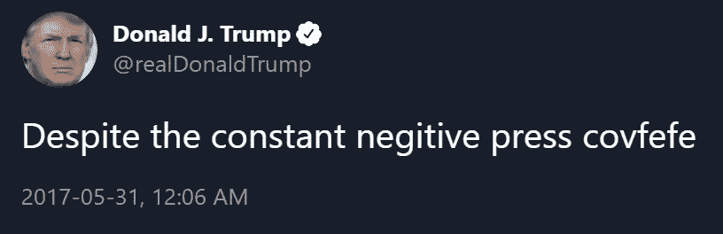
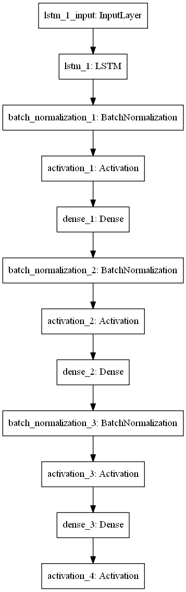
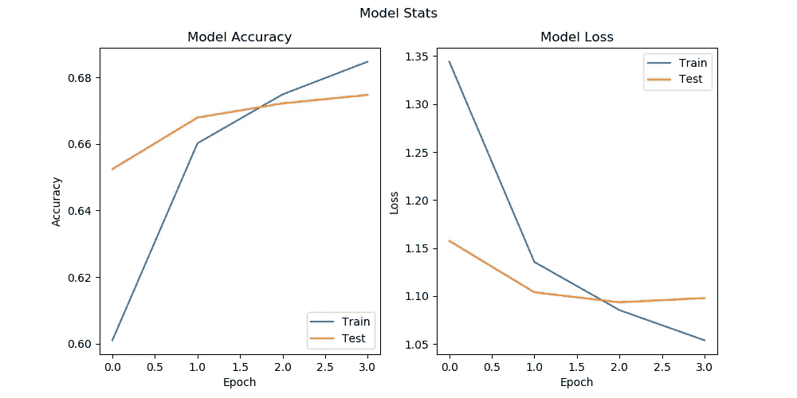
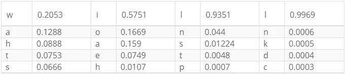
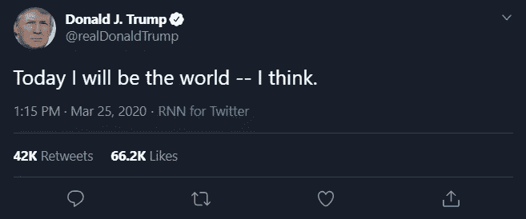

# 用递归神经网络预测特朗普的推文

> 原文：<https://towardsdatascience.com/predicting-trump-tweets-with-a-rnn-95e7c398b18e?source=collection_archive---------22----------------------->

## 用 LSTM RNN 生成作者和特定任务的文本。



唐纳德·特朗普著名的“covfefe”推文。

唐纳德·特朗普独特的方言是每个美国人都能识别的；然而，我们能建立一个神经网络来模仿特朗普的‘cov fefe’一样的词汇吗？

[](https://github.com/mm909/Predicting-Trump) [## mm 909/预测-川普

### 文本预测只在特朗普的推文、演讲和采访上进行了训练。-mm 909/预测-川普

github.com](https://github.com/mm909/Predicting-Trump) 

在 Andrej Karpathy 被高度引用的博文[递归神经网络](http://karpathy.github.io/2015/05/21/rnn-effectiveness/)的不合理有效性中，Karpathy 表明[递归神经网络(RNNs)](https://stanford.edu/~shervine/teaching/cs-230/cheatsheet-recurrent-neural-networks) 可以作为非常强大的生成模型。他给出了 RNNs 生成莎士比亚戏剧的例子，维基百科关于自然主义的文章，甚至带有真实用户评论的 Linux 源代码。

*我们将使用 RNN 来生成新的特朗普推文。*

这不是对自然语言处理(NLP)或 RNNs 的深入指导，而是对项目的概述；尽管如此，还是提供了所有的代码，并且有大量的链接可以帮助扩展本文中没有完全解释的主题。

# 数据

我们首先收集特朗普词汇的例子，[越多越好](https://static.googleusercontent.com/media/research.google.com/en//pubs/archive/35179.pdf)。幸运的是，我们不缺乏数据。特朗普的思想几乎总是保存在推特上，在演讲中，或者在采访中。我们将使用这些推文、演讲和采访的组合来训练角色预测模型。

## 小鸟叫声

特朗普的推文在几个地方存档。我从 TrumpTwitterArchive 下载了大约 50，000 条他的推文。然后，我通过从推文中删除所有表情符号和网址来清理数据，以帮助提高预测的准确性。以下节选自 [cleanTweets.txt](https://github.com/mm909/Predicting-Trump/blob/master/data/trump/tweets/clean/cleanTweets.txt) :

> 感谢我们伟大的美国企业为保护我们最脆弱的公民的安全所做的一切！
> 
> 经双方同意，我们将暂时关闭与加拿大的北部边境，禁止非必要的交通。贸易不会受到影响。详情随后！
> 
> 同样根据每日来电显示，在佛罗里达州，嗜睡的乔·拜登以 48%对 42%领先。

## 演讲:GitHub

不幸的是，特朗普的所有演讲都没有一个中心位置，但有几个 GitHub 存储库存有他的演讲子集。下面是一些你可以从哪里得到数据的例子；然而，我只使用了第一个库。

[](https://github.com/unendin/Trump_Campaign_Corpus) [## unendin/Trump_Campaign_Corpus

### 特朗普竞选语料库包括唐纳德·特朗普的演讲、采访、辩论、市政厅、新闻发布会…

github.com](https://github.com/unendin/Trump_Campaign_Corpus) [](https://github.com/PedramNavid/trump_speeches) [## PedramNavid/trump _ 演讲

### 特朗普 2015 年 6 月至 2016 年 11 月 9 日的所有演讲——PedramNavid/Trump _ speechs

github.com](https://github.com/PedramNavid/trump_speeches) [](https://github.com/ryanmcdermott/trump-speeches) [## ryanmcdermott/trump-演讲

### speechs . txt:1mb 的文本数据摘自唐纳德·特朗普在 2016 年竞选活动中不同时间点的演讲…

github.com](https://github.com/ryanmcdermott/trump-speeches) [](https://github.com/alexmill/trump_transcripts) [## Alex mill/trump _ 抄本

### 这是唐纳德·特朗普竞选演讲和辩论笔录的半结构化版本，因为…

github.com](https://github.com/alexmill/trump_transcripts) 

同样，与 tweet 数据一样，这些数据也需要清理。对于来自 *unendin 的*存储库的数据，我们需要删除非川普演讲者的所有文本。以下是唐纳德·川普和马克·霍尔珀林在[接受采访的节选。](https://github.com/unendin/Trump_Campaign_Corpus/blob/master/text/2015-06-17%2017.10.00%20(Complete%2C%20As%20spoken)%20Interview%20with%20Mark%20Halperin%2C%20John%20Heilemann%2C%20'With%20All%20Due%20Respect'%2C%20Bloomberg.txt)

> 马克·哈尔珀林:人们对你的个性非常感兴趣。很多人，我想你听过这句话，认为你自大或者太自信了。有些人说你极度缺乏安全感，这就是你如此行事的原因。你对任何事情都没有安全感吗？
> 
> 唐纳德·特朗普:我不知道。也许是两者的结合。
> 
> 马克·哈尔珀林:你缺乏安全感吗？
> 
> 唐纳德·特朗普:每个人都没有安全感。

我们可以通过编写一个正则表达式来匹配“SPEAKER: TEXT ”,然后删除除 Donald Trump 之外的所有发言者，从而删除采访中马克·霍尔珀林一方的所有内容。

我还选择删除所有的换行符，因为我觉得它们对文本预测并不重要。由此产生的文字记录只是特朗普在采访中的一面之词。

> 我不知道。也许是两者的结合。每个人都没有安全感。

然后将所有的演讲连接起来，放入 [cleanSpeech.txt](https://github.com/mm909/Predicting-Trump/blob/master/data/trump/speeches/clean/cleanSpeech.txt)

## 演讲:[事实基础](https://factba.se/transcripts)

FactBase 是唐纳德·特朗普的演讲和采访档案。可悲的是，FactBase 没有简单的方法一键下载他所有的演讲；然而，这并不重要，因为这些数据很容易被删除。

我们可以使用 [Selenium 从 FactBase](https://github.com/mm909/Predicting-Trump/blob/master/scraping/factbase.py) 中抓取数据。随着时间的推移，这将把特朗普的所有新演讲添加到我们的数据库中。

# 数据准备

要开始训练我们的模型，我们需要加载和处理文本数据，为网络做好准备。通过这样做，我们将定义两个重要的[超参数](https://medium.com/@jrodthoughts/knowledge-tuning-hyperparameters-in-machine-learning-algorithms-part-i-67a31b1f7c88):序列长度和步长。

## 加载数据

让我们从把数据载入内存开始。我们将读入数据，并使所有的文本小写。这样，T 和 T 被认为是同一个字母。语料库长度是我们数据库中的字符数。

```
Corpus length: 23342237
```

## 字符词典

模型不会自然地理解文本和标点符号，比如“a”和“？”，但他们确实理解数字。因此，我们需要一种方法将我们所有的文本翻译成数字。

有很多方法可以做到这一点，但我选择使用两本字典。一个把字母变成数字，另一个把数字变成字母。

```
char_indices['a'] -> 42
indices_char[42] -> 'a'
```

```
Unique Chars: 66
```

## 序列长度

*序列长度是我们的模型得到的上下文窗口的大小。*

序列长度定义了有多少个字母，以及有多少上下文，我们要给模型预测下一个字符。序列长度越长，模型在进行预测时就有越多的上下文。序列长度为 20 的示例:

```
"Today I will be addr"
```

你可能会猜到这个序列中的下一个字母是 e，句子中的下一个单词是 addressing。这就是我们希望我们的模型预测的。

对于我们的模型，我们将使用长度为 80 的序列。

## 步长

步长是我们每次迭代滑动上下文窗口的距离。

步长定义了在制作训练样本时，每次迭代要移动多少个字母。下面是一个序列长度为 20，步长为 2，句子为“今天我将向全国发表演讲”的例子：

```
"Today I will be addr"
"day I will be addres"
"y I will be addressi"
"will be addressing t"
"ll be addressing the"
" be addressing the n"
"e addressing the nat"
"addressing the natio"
"dressing the nation."
```

对于我们的模型，我们将使用步长 4。

## 序列长度和步长的权衡

我们希望序列长度尽可能长，以便模型有更多的上下文来预测下一个字符，然而，更长的序列长度意味着更大的模型和更多的处理时间。我选择序列长度为 80，因为我更关心网络拼凑长文本串的能力，而不是网络的处理时间。

步长的权衡更加片面。步长越小越好。较小的步长意味着更多的训练样本和更多的相关句子，然而，只有一定数量的样本可以被存储。我们希望最小化步长，同时仍然将所有的句子放入内存。

***使用[数据发生器](https://stanford.edu/~shervine/blog/keras-how-to-generate-data-on-the-fly) ***消除了步长折衷

## 编码

使用选择的序列长度和步长，我们现在创建一个句子数组来保存所有拆分的句子，创建一个下一个字符数组来保存序列中的下一个字母。

为了更具可读性，我展示的例子是序列长度为 20，步长为 2。句子数组现在看起来像这样:

```
["Today I will be addr",
"day I will be addres",
"y I will be addressi",
"will be addressing t",
"ll be addressing the",
" be addressing the n",
"e addressing the nat",
"addressing the natio",
"dressing the nation."]
```

下一个字符数组保存每个句子中的下一个字母:

```
['e',
's',
'n',
'h',
' ',
'a',
'i',
'n',
'']
```

这为我们提供了培训示例的总数:

```
Number of training examples len(sentences): 5835540
```

最后，我们将[热编码](https://machinelearningmastery.com/how-to-one-hot-encode-sequence-data-in-python/)这些序列，使它们能够被神经网络处理。

我们现在有( **X** ，y)对供网络处理。提醒一下，5835540 是训练样本的数量，80 是序列长度，66 是唯一字符的数量。

```
X.shape: (5835540, 80, 66)
y.shape: (5835540, 66)
```

# 模型

我们的模型将是一个[长短期记忆(LSTM) RNN](/illustrated-guide-to-lstms-and-gru-s-a-step-by-step-explanation-44e9eb85bf21) 。递归层之后是几个[密集层](https://keras.io/layers/core/)，用[比例指数线性单元(SELU)](https://keras.io/activations/) 激活，用[批量归一化](https://keras.io/layers/normalization/)正则化。

在探索了几种不同的选择之后，我做出了这些决定。



模型图

# 结果

仅仅过了四个时期，我们就有了一个验证数据准确率为 67.362%的模型。考虑到随机猜测会给我们 1.51%的准确度，该模型表现良好。因此，我们的模型比猜测精确 44 倍。



模型统计

下表显示了对句子“Today I”的预测。



《今日我》预测表

对于第一个字符预测，模型选择“w ”,但它对其决策不是很有信心。这是因为在“今天的我”之后有大量合理的可能性。尽管如此，有 20.53%的把握，这个模型把“今天的我”变成了“今天的我”。

在第一次预测之后，我们继续向模型询问字符。随着可能选项的数量减少，该模型变得更有信心。“今天我要”变成了“今天我要”，然后是“今天我要”。最终，该模型 99%确信最后一个字符是“l ”,从而得到字符串“Today I will”。

# 预测的句子

以下是不同模型生成的句子示例。所有的模型都在相同的数据集上训练，但是具有不同的架构。这些模型能够理解 twitter 标签、标点、连词、重要日期，甚至反问句。

## 模型 1

```
Seed: 'Welcome to America'
Output: 'Welcome to America, right? Well, I would have said that we have to make America great again, but I want to talk about the problem now.'Seed: 'It is really'
Output: 'It is really sad but the fake news media don't want to see the Republican Party continue to prove what we have.'
```

## 模型 2

```
Seed: 'I'
Output: 'I mean, in the middle east, we are going to win. We are going to repeal and replace Obamacare. Hillary is a disaster. We are going to win.'Seed: 'America'
Output: 'America first. Our jobs are going to win on November 8th.  Manufacturing jobs have got to do it.'
```

## 模型 3

```
Seed: 'Today I will' 
Output: 'Today I will make America great again! @realdonaldtrump is a big thing that is the best in the country and the president is a big deal.'Seed: 'I think that'
Output: 'I think that is a big contract that comes out the world trade center and we have to take care of our country.'
```

## 模型 4

```
Seed: 'I will always'
Output: 'I will always stop the state of the state of Michigan in the state of Michigan'Seed: 'The whitehouse' 
Output: 'The whitehouse is not for the state of Michigan'Seed: 'China is a' 
Output: 'China is a total crisis and the story in the same thing that I was a great and I will be interviewed by @seanhannity to the @whitehouse!'
```

**披露**:我在输出中添加了所有的大写。

# 结论

我们创造了非常现实的句子，听起来就像真的来自唐纳德·特朗普的推特。我自信地说，这个模型肯定是[循环神经网络](http://karpathy.github.io/2015/05/21/rnn-effectiveness/)不合理有效性的另一个例子。在整个过程中，我做了一些重要的观察，并将它们列在下面。

## 选择性短语

似乎每个模型都选择了一些短语来保持重用。有时这些短语会在一个预测中出现多次。模型 1 不断重复使用短语，“但我现在想谈谈这个问题”和“假新媒体。”对于模型 2，一切都发生在中东。Model 3 总说东西是“全国最好的”。最后，Model 4 讨厌密歇根州。尽管所有这些短语都是唐纳德·特朗普词汇的一部分，但它们在预测中出现得太频繁了，以至于不自然。

一个有趣的观察是，在相同数据集上训练的模型可以专注于不同的短语。这意味着模型更频繁选择的短语与数据集无关。

## 影响

除了娱乐价值，rnn 还有实际的现实价值。能够生成作者和特定任务的文本，比如 tweets，非常有用。rnn 能够通过给你文本建议来帮助你写更快的电子邮件，比如 Gmail[。它们还可以帮助演讲稿撰写人更准确地匹配演讲者词汇。RNNs 和 NLP 之间的交叉非常广泛，应用领域非常广阔。](https://www.blog.google/products/gmail/subject-write-emails-faster-smart-compose-gmail/)

## 丰富

**训练时间:**不幸的是，每个纪元需要大约一个小时才能完成，所以我将训练限制在 4 个纪元。虽然从第 3 代到第 4 代的改进很小，但我认为多训练几个小时会产生更精确的模型。

在写这篇文章的时候，我发现了 [CuDNNLSTM](https://keras.io/layers/recurrent/) 。用 CuDNNLSTM 替换 LSTM，可减少 66%的培训时间。我还没有 CuDNNLSTM 如何影响模型准确性的结果；然而，我怀疑 CuDNNLSTM 和 LSTM 会表现相似。

**减少偏差:**模型有大量可避免和不可避免的偏差，正如吴恩达在[机器学习向往](https://d2wvfoqc9gyqzf.cloudfront.net/content/uploads/2018/09/Ng-MLY01-13.pdf)中所定义的。即使对人类来说，文本预测也是一项艰巨的任务，正因为如此，我们可以预期会有相当高的不可避免的偏差。还有大量可以避免的偏见。这可以通过使用[更复杂的模型](https://github.com/minimaxir/textgenrnn)和添加[字嵌入](https://machinelearningmastery.com/what-are-word-embeddings/)来解决。

**减少差异:**唐纳德·特朗普(Donald Trump)喜欢的“covfefe”词汇的例子越多越好。我希望继续收到更多的推文、演讲和采访。虽然方差目前非常低，但随着模型变得更加复杂，方差将会增加。添加更多的数据将有助于控制差异。

**Keras dataGenerator:** 我还没有为文本数据实现 [Keras 的 dataGenerator](/writing-custom-keras-generators-fe815d992c5a) 类。实现这个类意味着我们的模型可以总是步长为 1 而不会溢出内存。这意味着我们可以显著增加训练数据库的大小，而不用担心它不适合内存。

所有这些改进将使模型更加精确。

# 项目存储库

[](https://github.com/mm909) [## mm909 -概述

### 在 GitHub 上注册你自己的个人资料，这是托管代码、管理项目和构建软件的最佳地方…

github.com](https://github.com/mm909) 

```
Seed: 'Today I will'
Output: 'Today I will be the world -- I think.'
```

