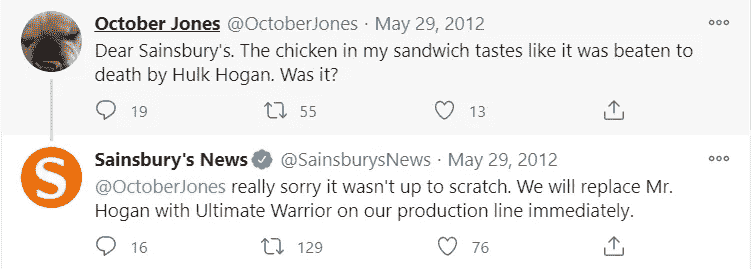
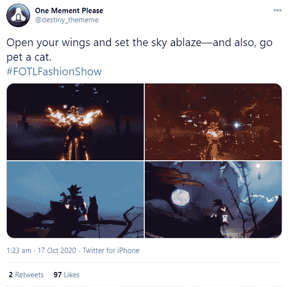
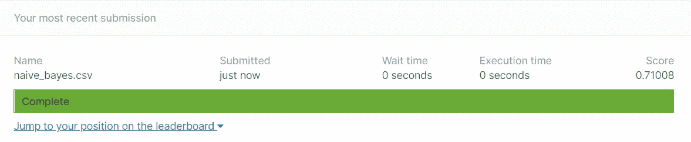

# 用机器学习预测推特情感

> 原文：<https://towardsdatascience.com/predicting-tweet-sentiment-with-machine-learning-3599c8add259?source=collection_archive---------18----------------------->

## 推特上的情感分析

🇨🇭·克劳迪奥·施瓦茨| @purzlbaum 在 [Unsplash](https://unsplash.com?utm_source=medium&utm_medium=referral) 上拍摄的照片

不可否认的是，社交媒体现在已经成为一个极其重要的平台，帮助企业扩大在线影响力。多年来，营销人员越来越意识到社交媒体平台(如脸书、Twitter、LinkedIn)的重要性，以及它们通过嘴对嘴营销在业务增长中发挥的作用。

许多人也注意到，社交媒体是一个很好的地方，可以在你的客户所在的地方与他们见面，公平地说，一些企业有很好的幽默感…

来源:[推特供稿](https://twitter.com/sainsburysnews/status/207455935424241664?lang=en)

如果我们回忆一下社交媒体的目的，我将把它概括为将世界任何地方的人们联系在一起，这就可以理解为什么企业纷纷涌向社交媒体，因为他们意识到这是一个交流的好地方，无论这种交流是好消息、坏消息、假新闻还是世界上某个地方发生的紧急情况。

此外，智能手机的普及使人们能够实时宣布这些事件。如果顾客在他们的食物中发现一根头发，你可以打赌它会出现在社交媒体上。因此，越来越多的机构、组织、企业和好奇的个人对有计划地监控各种社交媒体网站以获取对他们重要的信息产生了兴趣。

这方面的一个很好的例子可能是希望检测灾难发生的救灾组织。这显然是一项非常重要的任务，但也非常困难，因为人们并不总是清楚一个人的话是在宣布一场灾难还是对某件有吸引力的事情的夸张描述——在这方面，可以公平地说，话可能非常模糊。

来源:[推特供稿](https://twitter.com/destiny_thememe/status/1317259848996802560)

上面的图片显示了一个用户的推文，他说他们想要点燃“*天空*”。当把“*着火*”当作动词时，这条推文可以被认为是一场灾难，因为这意味着天空正在猛烈燃烧。然而，根据推文中提供的上下文，我们知道用户指的是形容词版本的“*闪亮的*”，这意味着他们在说天空非常明亮或明亮。这是显而易见的，但对计算机来说就不一样了。

因此，作为数据科学家(NLP 专家),我们的工作是提出解决方案，尽最大努力克服语言的各种模糊性，这样我们服务的人们就不会不断受到由于语言差异而导致的错误灾难声明的轰炸。

在这一点上，我们将做一些[情绪分析](/getting-started-with-sentiment-analysis-731531ec880d)结合机器学习来检测来自 Twitter 的灾难推文的情绪。目标是根据推文确定是否有真正的灾难。

> 注意:对于我的帖子的关注者，你会记得我们一直在一起研究自然语言处理。如果你是新手，这一切都是关于我在 Coursera 上记录的自然语言专业笔记。为了避免我再次解释什么是情绪分析，请回顾一下[开始情绪分析](/getting-started-with-sentiment-analysis-731531ec880d)的帖子。

## 数据

我们可以使用 Twitter 的 API 自己检索数据。[文档](https://developer.twitter.com/en/docs/getting-started)指出" *Twitter 的开发者平台使你能够在你自己的应用中利用 Twitter 的开放、全球、实时和历史交流网络的力量。该平台提供工具、资源、数据和 API 产品供您整合，并通过研究、解决方案等扩大 Twitter 的影响。*”。这样做意味着我们必须自己处理和标记数据，这更适合现实世界的情况。

对我们来说幸运的是，大部分艰苦的工作已经完成了，因为数据已经被检索并作为逗号分隔值(csv)文件存储在 Kaggle 上。因此，我们的工作只是将数据下载到我们的本地驱动器—要下载数据，访问 [**真实与否？NLP 与灾难 Tweets**](https://www.kaggle.com/c/nlp-getting-started/overview) 入门竞赛并从数据部分下载数据。

> **免责声明**:本次比赛的数据集包含可能被视为亵渎、粗俗或冒犯的文本。

我们期望在数据中看到的特征如下:

*   `id` —每条推文的唯一标识符。
*   `text` —推文的文本
*   `keyword` —推文中的一个关键词(虽然这可能是空白的！)
*   `location` —发送推文的位置(也可以是空白的)
*   `target` —表示一条推文是否是关于真实的灾难(`1`)或者不是(`0`)；只有在`train.csv`和`sample_submission.csv`

评估标准是 F1 分数，详情请见下文。

 [## 混淆矩阵“未混淆”

### 打破混乱矩阵

towardsdatascience.com](/confusion-matrix-un-confused-1ba98dee0d7f) 

# 构建模型

所有代码都可以通过 [Github](https://github.com/kurtispykes/twitter-sentiment-analysis) 访问。

 [## kurtispykes/twitter 情绪分析

### 此时您不能执行该操作。您已使用另一个标签页或窗口登录。您已在另一个选项卡中注销，或者…

github.com](https://github.com/kurtispykes/twitter-sentiment-analysis) 

## 第一相

当开始一个项目时，获得快速反馈是非常重要的，因此，我不担心立即获得最佳的准确性。相反，我想找到从数据中获得即时反馈的最佳方式，然后开始更深入地研究，以辨别可以做出哪些改进。

为了通过这个阶段，我首先将我的数据分成训练、开发和测试集——因为这些数据来自 Kaggle，我们已经有了一个测试集，所以我们只需要一个开发集。然而，我将使用分层 Kfold 交叉验证，而不是使用基于维持的开发集——更多关于[交叉验证](/cross-validation-c4fae714f1c5)的信息，请参阅我关于交叉验证的文章。

 [## 交叉验证

### 验证机器学习模型的性能

towardsdatascience.com](/cross-validation-c4fae714f1c5) 

为了帮助我们编写代码，我制作了一个配置文件，我们将使用它，这样我们就不会在脚本中进行任何硬编码…

现在让我们创建我们的折叠。

该函数读取我们从 Kaggle 接收的原始训练数据，创建一个新列并用`-1`填充所有值。之后，我们重组数据，通过标记每个实例所属的文件夹来创建文件夹，最后将其保存为 csv 文件。

创建折叠的过程对我来说很标准。我确实在交叉验证文章中详细描述了我如何选择我的验证策略，但更多的时候，我会对分类问题进行分层——我甚至在我的[使用机器学习检测欺诈](/using-machine-learning-to-detect-fraud-f204910389cf)的故事中使用它。

## 第二相

快速迭代的下一个阶段是尽可能快地训练一个模型，这意味着我们不会太担心最佳特性工程实践或任何事情。我们只想训练一个简单的模型，做推理。

本质上，我们有 3 个特征(不包括`id`)，它们是`text`、`keyword`和`location`。我能想到的处理这些问题的最简单的方法就是简单地将关键字和位置附加到文本的末尾。之后，我们对文本进行一些基本的处理，将文本转换成向量，然后建立我们的模型。

为了将我们的文本转换成向量，我们使用了`CountVectorizer`，它将一组文本文档转换成一个令牌计数矩阵——参见[文档](https://scikit-learn.org/stable/modules/generated/sklearn.feature_extraction.text.CountVectorizer.html)。

我们将使用 2 个不同的模型运行我们的训练脚本，并在我们编写脚本进行推理时，使用每个折叠上具有最佳平均值的模型提交给 Kaggle。我们使用的两个模型是逻辑回归和朴素贝叶斯。

 [## 从零开始的算法:逻辑回归

### 从头开始详述和构建逻辑回归模型

towardsdatascience.com](/algorithms-from-scratch-logistic-regression-7bacdfd9738e)  [## 从零开始的算法:朴素贝叶斯分类器

### 从头开始详述和构建朴素贝叶斯分类器

towardsdatascience.com](/algorithms-from-scratch-naive-bayes-classifier-8006cc691493) 

如果您不记得上面的内容，本次比赛的评估标准是 F1 分数:

因此，我们将使用朴素贝叶斯进行推理…

这将输出一个 CSV 文件，我将把它提交给 Kaggle

提交给 Kaggle 的文件(图片由作者提供)

关于这一点需要注意两件事…我们的平均开发集分数和我们的测试分数之间有很大的差异，所以我们必须对我们的交叉验证技术做一些调整。接下来的事情就是我们的分数没有那么大。我的目标是 F1 成绩达到 85 分左右。

在另一篇文章中，我将讨论错误分析，这样我们就可以开始改进我们的模型。

感谢阅读到最后，让我们继续 LinkedIn 上的对话…

 [## Kurtis Pykes -数据科学家-自由职业者，自由职业者| LinkedIn

### 在世界上最大的职业社区 LinkedIn 上查看 Kurtis Pykes 的个人资料。Kurtis 有 3 个工作列在他们的…

www.linkedin.com](https://www.linkedin.com/in/kurtispykes/)