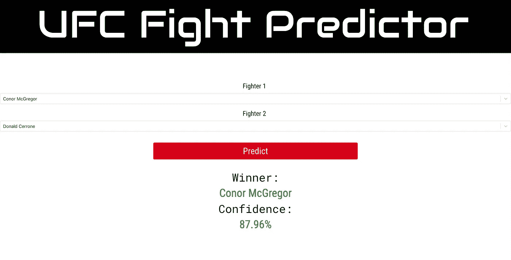

# 用机器学习预测 UFC 格斗

> 原文：<https://towardsdatascience.com/predicting-ufc-fights-with-machine-learning-5d66b58e2e3a?source=collection_archive---------13----------------------->

## 我如何使用 Scrapy、深度学习、Flask 和 React 构建多模型战斗预测器。


迪伦·诺尔特在 [Unsplash](https://unsplash.com?utm_source=medium&utm_medium=referral) 上的照片

> **TL；DR:** 亲自检查一下**[预测器](http://www.ufcfightpredictor.com/)，看看它在即将到来的 UFC 战斗卡中表现如何，或者检查一下 [github](https://github.com/cdpierse/UFC_Fight_Predictor) 上的代码**

# **项目概述**

**作为一个 MMA 爱好者，我经常发现自己试图预测即将到来的战斗卡上的战斗结果。问题是战斗的本质是非常不可预测的。甚至比拳击更重要的是，MMA 比赛的结果可以在一瞬间改变，但当然这也是它如此有趣的原因。**

**尽管如此，我还是想知道是否有一种方法可以将现代机器学习技术应用于历史格斗数据，并观察一个模型在新的格斗中的表现。**

# **入门指南**

**当然，像任何 ML 项目一样，我需要数据来处理。幸运的是，我有一个好主意，我可以在哪里找到一些经常在战斗卡后第二天去 www.ufcstats.com 的人，以获得战斗的统计数据。**

**所以现在我有了我的数据源和一些如何实现这个模型的想法，我想知道是否有其他人已经建立了一个这样的项目，并且看到了这个由[田园](https://medium.com/u/98d39400f6fe?source=post_page-----5d66b58e2e3a--------------------------------)写的[帖子](https://medium.com/@yuan_tian/predict-ufc-fights-with-deep-learning-ii-data-collection-and-implementation-in-pytorch-ff7a95062554)，详细描述了他建立一个战斗预测器的过程。**

**袁的帖子非常详细和有见地，我抓取统计数据页面的方法很大程度上是受他如何构建自己的抓取工具的启发。谢谢袁！**

**在袁的预测中，他使用了比赛前可用的比赛数据，我称之为“静态比赛数据”，如年龄，距离，体重，W/L 记录等。然而，UFC 统计页面还详细列出了历史比赛的具体统计数据，如击球、击倒、提交尝试和后卫传球。**

**由于 UFC 统计页面上没有太多的数据点，我觉得丢弃这些“动态战斗统计”将是一种耻辱。所以我决定建立一个双向预测系统的预测器:**

*   **第一个模型使用静态统计数据作为战斗机 1 和战斗机 2 的自变量，然后预测因变量，即动态战斗统计数据。**(一个** [**多目标回归**](/regression-models-with-multiple-target-variables-8baa75aacd) **问题)**。**
*   **然后，我们将静态和动态的战斗统计数据传递给一个整体赢家模型，该模型预测战斗机 1 或战斗机 2 是赢家。**(一个二元分类问题)**。**

# **抓取 UFC 统计数据**

**这个项目的刮刀被分解成两个[刺儿头](https://scrapy.org/)蜘蛛，爬行 UFC 战斗统计的两个部分:**

*   **关于刮刀**
*   **战斗机铲运机**

****关于刮刀**数据对象被分解为以下碎屑项:**

```
class BoutScraperItem(Item):                           
event_name = Field()                           
event_date = Field()                           
event_attendance = Field()                          
fighter1 = Field()                          
fighter2 = Field()                           
str_stat_f1 = Field()                           
str_stat_f2 = Field()                           
td_stat_f1 = Field()                           
td_stat_f2 = Field()                           
sub_stat_f1 = Field()                           
sub_stat_f2 = Field()                           
pass_stat_f1 = Field()                           
pass_stat_f2 = Field()                           
weight_class = Field()                           
win_method_type = Field()                           
win_method_finish = Field()                           
round_ = Field()                           
time = Field()                           
winner = Field()
```

**回合蜘蛛抓取 UFC 战斗统计的[事件](http://www.ufcstats.com/statistics/events/completed)部分，并记录每个战士的特定统计，如 str_stat_f1(战士 1 的攻击统计)，其中许多将成为我们多目标回归问题的因变量。Fighter1 和 Fighter2 是一场比赛中所涉及的拳手的名字，我们将这些值加入到战斗机数据中。**

****战斗机铲运机**数据对象分解为:**

```
class FightScraperItem(Item):                           
fighter_name = Field()                           
fighter_record = Field()                           
height = Field()                           
weight = Field()                           
reach = Field()                          
stance = Field()                           
date_of_birth = Field()                           
slpm = Field()  # strikes landed per min stat                           td_avg = Field()  # takedown average                           strike_acc = Field()  # striking accuracy                           td_acc = Field()  # takedown accuracy                           
sapm = Field()  # strikes absorbed per minute                           td_def = Field()  # takedown defence                           strike_def = Field()  # striking defence                           sub_avg = Field()  # submission average
```

**这里的每一项都是从[拳手统计](http://www.ufcstats.com/statistics/fighters)页面中单独抓取的，该页面详细描述了 UFC 回合中每个拳手的职业统计(尽管 UFC 早期的数据填充较少)。**

**我将这两个数据对象作为表保存到 SQLite 数据库中，并编写了一个小脚本来生成一个组合的 fight-bouts CSV 文件，其中每一行都是 fighter1 和 fighter2 各自的 fighter stats。这个 CSV 以及 fighters 数据对象的 CSV 表示将是我们用来构建这两个模型的两个文件。**

**如果你有兴趣了解每个蜘蛛的实际抓取逻辑，看看这里的。**

# **预处理**

**与大多数这类 ML 项目一样，真正的工作是在预处理步骤中完成的，以及如何为建模阶段准备数据。**

**项目的这一方面经历了无数次迭代。我从 Jupyter 笔记本开始，但随着复杂性的增加，我决定将其作为前端应用程序来实现，我将设计更改为包含 winner predictor 和 stats predictor 的共享预处理方法以及特定于任务的预处理方法的类。**

**大量的预处理致力于清除丢失的或格式错误的值，例如，高度被表示为字符串，解析字符串斗士记录，以及获得斗士在战斗时的年龄。**

**预处理中最棘手的一个方面是改变 fighter1 和 fighter2 的统计数据的顺序。我不得不打乱这种顺序的原因是 UFC 的回合数据总是按顺序排列，所以 fighter1 是赢家，所以我必须想出一种方法来随机选择一半的数据集，并将 fighter1 和 fighter2 的统计数据位置相互交换，以便最终的数据集被整齐地分开，这样 fighter1 的 50%是赢家，fighter2 的 50%是赢家。我很乐意整理这种逻辑，如果有人有任何改进的建议，我很乐意听听。**

**处理器类的另一个重要特性是，它们必须能够在生产中以不同的方式处理数据，因为在生产环境中，数据帧的构造不像训练步骤那样整齐。**

**在生产中，战斗机的统计数据必须被特别地预测，然后插入到最终的数据帧中，用于胜利者的预测。我的解决方案是为处理器创建额外的子类，以处理特定于生产的情况。**

# ****建模****

**这两个模型都是使用 Keras 构建的，相对简单的架构只包含一个完全连接的隐藏层。我采取了一种启发式的方法来寻找两者的最佳参数，但我渴望使用更新的工具优化工具，如 [Keras 调谐器](https://github.com/keras-team/keras-tuner)来微调其性能。**

****统计模型****

**统计模型采用战斗前双方可用的所有统计的缩放数字表示，其输出层由 8 个特定于战斗的统计组成:**

```
output_cols = [                               
'pass_stat_f1', 'pass_stat_f2', 'str_stat_f1', 'str_stat_f2',                               'sub_stat_f1', 'sub_stat_f2', 'td_stat_f1', 'td_stat_f2'                           ]
```

**由于这是一个回归问题，统计模型中的最后一层具有线性激活(默认激活)。对于损失，我使用“mse”和 R 作为模型的度量来评估性能。**

**在验证集上，该模型的 R 通常约为 0.63–64，这还不算太差，但值得注意的是，随着额外的预测值(输出)的增加，R 将始终增加，其中一些可归因于碰巧对齐的随机噪声。为了解决这个问题，我将增加调整后的 R 来惩罚新版本中每一个新输出的模型。**

****赢家预测模型****

**像 stats 模型一样，它遵循一个基本的单个全连接隐藏层架构。因变量是 0 (fighter1)或 1 (fighter2)，所以我在最后一层添加了一个简单的 sigmoid 激活来预测这些结果之一。**

**该模型的准确性通常约为 86%,但必须强调的是，这一准确性是通过动态战斗统计的**完美信息**实现的，这些信息在生产中是预测值，因此不是完美信息，因此统计预测模型的预测能力存在巨大的偶然性。**

# ****通过 API 为模特服务****

**因为我想将模型及其预测作为前端服务，所以我需要构建一些 API 端点来访问模型和可以进行预测的战斗机列表。**

**使用 Flask，这是相对直接的。有两个主要端点，一个为生成预测的战斗机名称列表服务，另一个为预测管道排队并返回结果。**

**流水线处理每架战斗机的数据帧，然后将它们连接成正确的形状和顺序，以便进行统计预测。一旦返回了统计预测值，它们就作为具有各自名称和位置的列被添加到数据帧中，并被传递给获胜者预测模型，从而返回与战斗机 1 或 2 相关联的结果。**

# **反应前端**

**然后，所有 API 的功能都由一个非常简单的 React 前端调用，该前端为用户提供两个可搜索的下拉列表和一个结果显示，显示预测的获胜者和模型对其预测的信心。**

**在 React 中设置这一点很容易，我发现 React 通常是一种乐趣(我❤胡克)。**

**我想在前端添加很多东西，比如一个显示用户预测历史的表格，一个显示基本战斗机统计数据的信息图。**

****

# **包扎**

**希望这对 ML 爱好者和/或 MMA 爱好者来说都是有益的，正如我已经提到的，我希望在未来的这个项目中增加许多功能，我很想听听你们的想法。谢谢！**

**另外，也许现在还不要对模型的所有预测结果下赌注。**