# 用机器学习预测二手车价格

> 原文：<https://towardsdatascience.com/predicting-used-car-prices-with-machine-learning-fea53811b1ab?source=collection_archive---------12----------------------->

## 从数据收集到模型评估的完整数据科学项目

我打算卖掉我的车，那是一辆 4 年前的大众 polo。二手车通常在土耳其一个名为“ [sahibinden](https://www.sahibinden.com/kategori/vasita) ”的网站上出售。“Sahibinden”的意思是“来自车主”，尽管有许多经销商使用这个网站来出售或购买二手车。卖二手车最关键的部分是确定最优价格。有许多网站给你二手车的价格，但你仍然想在定价前搜索市场。此外，还有其他影响价格的因素，如位置、你想以多快的速度卖车、车内吸烟等。在你在网站上发布广告之前，最好先看看类似汽车的价格。然而，这个过程可能会很累，因为网上有太多的广告。因此，我决定利用机器学习提供的便利来创建一个模型，根据“ [sahibinden](https://www.sahibinden.com/kategori/vasita) ”上的数据预测二手车价格。它不仅有助于解决我的汽车定价问题，还能帮助我学习和实践许多与数据科学相关的主题。

本项目分为以下 5 个子部分:

1.  数据收集
2.  数据清理
3.  探索性数据分析
4.  回归模型与评估
5.  进一步改进

所有的数据和代码都可以在 [github 知识库](https://github.com/SonerYldrm/Predicting_used_car_prices)上获得。请随意使用或分发。

# **1。数据收集**

在“ [sahibinden](https://www.sahibinden.com/volkswagen-polo) ”网站上有六千多件大众马球出售。我不得不做网络搜集，从网站上收集数据。我不是网络搜集专家，但我已经学到了足够的知识来获取我需要的信息。我认为，如果你想在数据科学领域工作或正在工作，学习一定水平的网络抓取是非常重要的，因为数据通常不会放在盘子里提供给我们。我们必须得到我们需要的。

我使用了 [beautiful soup](https://www.crummy.com/software/BeautifulSoup/bs4/doc/) ，这是一个 python 库，用于从 HTML 和 XML 文件中提取数据。语法非常简单，易于学习。有几个重要的细节你需要注意，特别是如果数据被列在几页上。

总是先导入依赖项:

```
import pandas as pd
import numpy as np
import requests
from bs4 import BeautifulSoup as bs
```

我使用 python 的**请求**库的 **get()** 方法从源中检索数据，并将其存储在一个变量中。然后我用美汤提取整理了这个变量的内容。由于数据在几个页面上，我不得不创建 list 来帮助解析不同的页面，并启动空列表来保存数据。

```
#initiate empty lists to save data
model_info = []
ad_title = []
year_km_color = []
price = []
ad_date = []
location = []#create lists to parse through pages
page_offset = list(np.arange(0,1000,50))
min_km = [0, 50000, 85000, 119000, 153000, 190000, 230000] 
max_km = [50000, 85000, 119000, 153000, 190000, 230000, 500000] 
```

一个页面上最多可以显示 50 个广告。为了搜集大约 6000 辆汽车的数据，我需要迭代 120 多页。首先，我将代码组织在一个 for 循环中，从 120 页中提取数据。然而，在这个过程完成后，我发现数据在前 1000 个条目后重复。然后，我决定将数据分成更小的部分，每组不超过 1000 个条目，所以我使用“km”标准来区分组。我创建了嵌套的 for 循环来提取大约六千辆汽车的数据，如下所示:

```
for i, j in zip(min_km, max_km):
    for page in page_offset:
        r = requests.get(f'https://www.sahibinden.com/volkswagen-   polo?pagingOffset=**{page}**&pagingSize=50&a4_**max={j}**&sorting=date_asc&a4_**min={i}**', headers=headers)
        soup = bs(r.content,'lxml')
        model_info += soup.find_all("td",{"class":"searchResultsTagAttributeValue"})
        ad_title += soup.find_all("td",{"class":"searchResultsTitleValue"})
        year_km_color += soup.find_all("td",{"class":"searchResultsAttributeValue"})
        price += soup.find_all("td",{"class":"searchResultsPriceValue"})
        ad_date += soup.find_all("td",{"class":"searchResultsDateValue"})
        location += soup.find_all("td",{"class":"searchResultsLocationValue"})
```

在每次迭代中，使用 page_offset、max_km 和 min_km 列表中的值修改基本 url，以转到下一页。然后根据标签和类别将网站内容分解成预定义的列表。html 中的类和标签可以通过在浏览器上检查网站来显示。

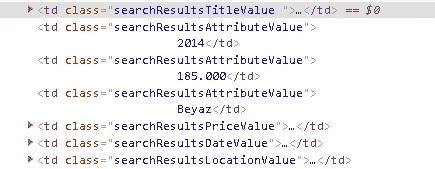

“[沙希宾登](https://www.sahibinden.com/volkswagen-polo)”网站的 HTML

得到 html 的内容后，我提取了文本部分:

```
model_info_text = []
for i in range(0,6731):
    model_info_text.append(model_info[i].text)
```

对每个列表都进行了这一过程，然后我将这些列表组合起来构建一个熊猫数据框架:

```
df = pd.DataFrame({"model":model_info_text, "ad_title":ad_title_text,"year":year_text, "km":km_text, "color":color_text,"price":price_text, "ad_date":ad_date_text, "location":location_text})print(df.shape)
print(df['ad_title'].nunique())
(6731, 8)
6293
```

Dataframe 包括 6731 个条目，但根据广告的标题，其中 6293 个条目似乎是唯一的，我认为这是区分广告的最佳选择。一些用户可能会重新发布相同的广告，或者一些广告的标题可能完全相同。

# 2.数据清理

我把从网站上抓取的数据保存为 csv 文件。

```
df = pd.read_csv('polo_data.csv')
df.head()
```

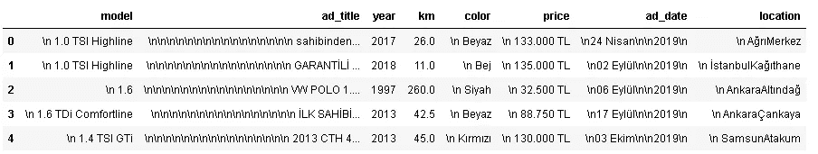

必须删除新的线条指示器(\n)。我使用 pandas **remove()** 函数，其中 **regex** 参数设置为 True。类似地，在价格单元中代表土耳其货币的 TL 必须被移除以进行数值分析。

```
df = df.replace('\n','',regex=True)
df.price = df.price.replace('TL','',regex=True)
```

在尝试进行任何分析之前，我们总是需要寻找缺失值并检查数据类型:

```
df.isna().any()
model       False
ad_title    False
year        False
km          False
color       False
price       False
ad_date     False
location    False
dtype: booldf.dtypes
model        object
ad_title     object
year          int64
km          float64
color        object
price        object
ad_date      object
location     object
dtype: object
```

日期的数据类型是 object。为了能够正确使用日期，我将数据 dype 转换为日期时间**。数据是土耳其语的，所以在使用 **astpye()** 函数之前，我将月份的名称改为了英语。我用字典来改变月份的名称。**

```
months = {"Ocak":"January", "Şubat":"February", "Mart":"March", "Nisan":"April","Mayıs":"May","Haziran":"June","Temmuz":"July","Ağustos":"August","Eylül":"September", "Ekim":"October", "Kasım":"November", "Aralık":"December"}df.ad_date = df.ad_date.replace(months, regex=True)#change the datatype
df.ad_date = pd.to_datetime(df.ad_date)
```

**在读取 csv 文件时,“km”列被截断，该列显示汽车已经行驶了多少公里。这是因为“点”在千中使用。例如，25.000，即 25，000 被检测为 25.0。为了解决这个问题，我将“km”列乘以 1000。为了能够将“km”列的数据类型改为数字(int 或 float)，我还删除了“.”和“，”字符。**

```
df.km = df.km * 1000df.iloc[:,5] = df.iloc[:,5].str.replace(r'.','')
df.iloc[:,5] = df.iloc[:,5].str.replace(r',','') #change the datatype
df.price = df.price.astype('float64')
```

**在土耳其，由于人口分布不均，位置可能是决定二手车价格的一个因素。我们的数据框架中的位置数据包括城市和地区。我不认为同一个城市不同区的价格变化。因此，我修改了位置数据，只包含了城市的名称。**

**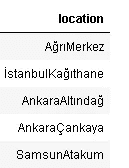**

**位置信息的格式为 CityDistrict(中间没有空格)。地区名称以大写字母开头，用于区分城市和地区。我用的是 python 的 **re** 模块的 **sub()** 函数。**

```
import res = df['location']
city_district = []for i in range(0,6731):
    city_district.append(re.sub( r"([A-Z, 'Ç', 'İ', 'Ö', 'Ş', 'Ü'])", r" \1", s[i]).split())city_district[:5]
[['Ağrı', 'Merkez'],
 ['İstanbul', 'Kağıthane'],
 ['Ankara', 'Altındağ'],
 ['Ankara', 'Çankaya'],
 ['Samsun', 'Atakum']]
```

**这个 for 循环以大写字母拆分 location 列的每个单元格中的字符串。土耳其语字母表包含不在英语字母表[A-Z]范围内的字母。我也在 sub 函数中添加了这些字母。输出是两项列表的列表。我使用这个列表的第一项创建了另一个名为“city”的列。**

```
city = []
for i in range(0,6731):
    city.append(city_district[i][0])city[:5]
['Ağrı', 'İstanbul', 'Ankara', 'Ankara', 'Samsun']df['city'] = city
```

****nunique()** 函数计算对探索性数据分析和结果确认都有用的唯一值。**

```
df.city.nunique()
81
```

**土耳其有 81 个城市，因此数据集包括每个城市至少一辆汽车。**

# ****3。探索性数据分析****

****价格****

**了解目标变量总是好的。在我们的例子中，目标变量或因变量是价格。**

```
print(df.price.mean())
print(df.price.median())
83153.7379289853
64250.0
```

**平均值远高于中值，这表明存在异常值或极值。让我们同时检查最大值和最小值:**

```
print(df.price.max())
print(df.price.min())
111111111.0
24.0
```

**这种价值观显然是错误的。除非镀金，否则没有超过 1 亿英镑的大众马球。同样，24 土耳其里拉的价值也是不可能的。在使用 **sort_values()** 函数对 price 列中的值进行排序之后，我检测到了一些异常值，并使用 pandas **drop()** 函数通过传递要删除的值的索引来删除它们。让我们检查新的平均值和中间值:**

```
print(df.price.mean())
print(df.price.median())
print(df.price.median())66694.66636931311
64275.0
25000.0
```

**平均值仍高于中值，但差异并不极端。我还检查了 mode，这是最常出现的值。平均值高于中值表明数据是正确的或正偏态的，这意味着我们有更多的较低价格和一些具有较高值的异常值。被排序为均值>中值>众数的集中趋势度量是正(右)偏度的指示。我们可以用分布图仔细检查:**

```
x = df.price
plt.figure(figsize=(10,6))
sns.distplot(x).set_title('Frequency Distribution Plot of Prices')
```

**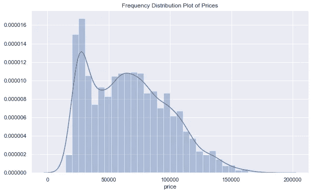**

**从图中可以看出，数据是右偏的，25000 左右的峰值向我们展示了该模式。检查分布和异常值的另一种方法是**箱线图**:**

```
plt.figure(figsize=(8,5))
sns.boxplot(y='price', data=df, width=0.5)
```

**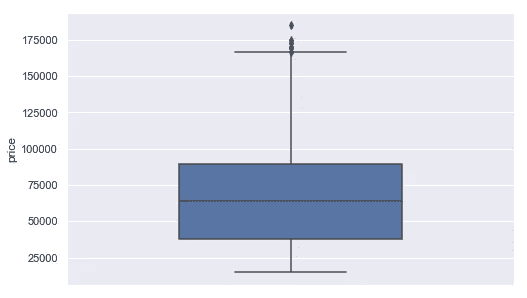**

**蓝框的底部和顶部分别代表第一个四分位数(25%)和第三个四分位数(75%)。第一个四分位数意味着 25%的数据点低于该点。中间的线是中位数(50%)。异常值用最大线上方的点表示。**

****日期****

**我不认为日期本身对价格有影响，但网站上广告的等待时间是一个需要考虑的因素。更长的等待时间可能会促使业主降价。如果一个广告在网站上停留了很长时间，这可能是因为价格设置不当。因此，我将添加一个列，表明广告已经在网站上的天数。数据于 2020 年 1 月 18 日报废。**

```
df['ad_duration'] = pd.to_datetime('2020-01-18') - df['ad_date']
```

**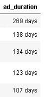**

**Ad_duration 必须是数字数据，因此需要删除数字旁边的“天数”。我用熊猫 **replace()** 函数去掉了‘天’。**

**让我们检查广告持续时间数据的分布:**

```
print(df.ad_duration.mean())
print(df.ad_duration.median())
12.641540291406482
10.0
```

**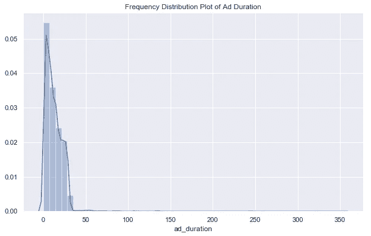**

**平均值高于中值，有许多异常值。数据是右偏的。为了更好地理解，我还绘制了小于 50 的数据点:**

**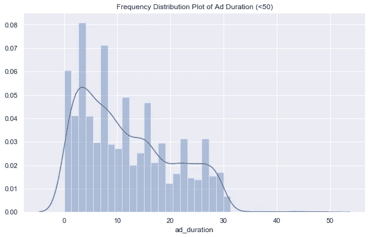**

****地点****

**有 81 个不同的城市，但 62%的广告都列在前 10 个城市，伊斯坦布尔占 23%的广告。**

```
a = df.city.value_counts()[:10]
df_location = pd.DataFrame({"city": a , "share": a/6726})df_location.share.sum()
0.6216176033303599
```

**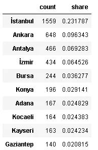**

**广告数量排名前十的城市**

****颜色****

**看起来大众 polo 的最佳颜色选择是白色。一半以上的汽车是白色的，其次是红色和黑色。前三种颜色覆盖了 72%的汽车。**

**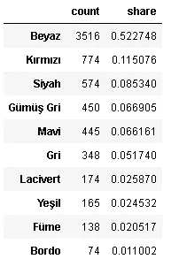**

**贝亚兹:白色，科勒姆兹:红色，西亚赫:黑色**

****年****

**车龄肯定会影响价格。然而，用 is 代替汽车的型号年份更有意义。所以我用当年的“年份”一栏来代替。**

```
df['age'] = 2020 - df['year']
```

**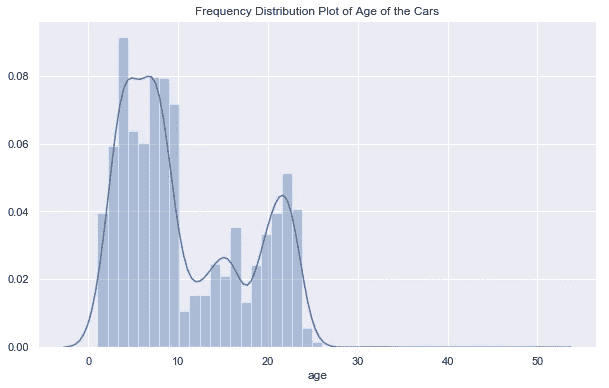**

**从分布来看，大部分车龄不到 10 年。在 10 处有一个巨大的下降，然后是一个上升的趋势。**

****公里****

**公里值显示了车开了多少，所以它绝对是决定价格的一个重要因素。Km 数据近似呈正态分布。**

```
print(df.km.mean())
print(df.km.median())
141011.5676479334
137000.0
```

**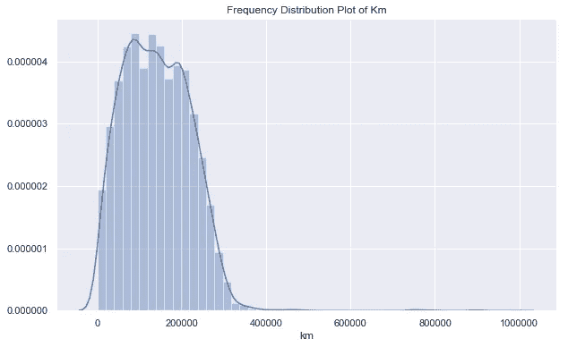**

****广告标题****

**广告标题是广告的一种说明。卖家试图用数量有限的人物来吸引潜在买家。一旦广告被点击，另一个带有图片和更详细信息的页面就会打开。然而，第一步是让人们点击你的广告，所以广告标题在销售过程中起着至关重要的作用。**

**我们来看看大家一般都在标题里写些什么。我在这个任务中使用了 **wordcloud** 。**

```
#import dependencies
from wordcloud import WordCloud, STOPWORDS
```

**WordCloud 唯一需要的参数是一个文本。您可以通过键入“？其他可选参数。我们无法将列表输入到 wordcloud，所以我通过连接 ad_title 列中的所有标题创建了一个文本:**

```
text_list = list(df.ad_title)
text = '-'.join(text_list)
```

**然后用这段文字生成了一个单词云:**

```
#generate wordcloud
wordcloud = WordCloud(background_color='white').generate(text)#plot wordcloud
plt.figure(figsize=(10,6))
plt.imshow(wordcloud, interpolation='bilinear')
plt.axis("off")
plt.show()
```

**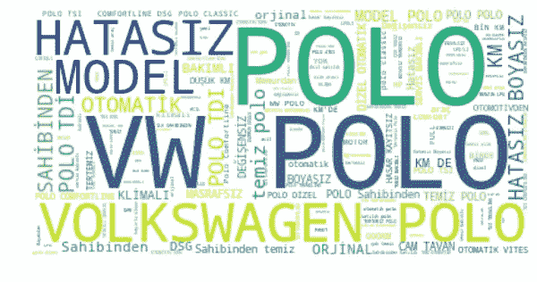**

**无停用词的词云**

**单词云的想法非常简单。越频繁出现的单词显示得越大。这是一个信息量大、易于理解的文本分析工具。然而，上面的 wordcloud 并没有告诉我们太多，因为“大众”、“大众”和“polo”这些词并不是我们要找的。它们展示了我们正在分析的品牌。在这种情况下，我们要使用 wordcloud 的**停用词**参数，列出需要排除的词。**

```
stopwords = ['VW', 'VOLKSWAGEN', 'POLO', 'MODEL', 'KM']
wordcloud = WordCloud(stopwords=stopwords).generate(text)plt.figure(figsize=(10,6))
plt.imshow(wordcloud, interpolation='bilinear')
plt.axis("off")
plt.show()
```

****

**带停用词的单词云**

**这次我没有使用**背景颜色**参数，只是为了显示不同之处。这些话是土耳其语，所以我会给一个简短的解释:**

1.  **“Hatası”:没有任何问题**
2.  **“Sahibinden”:从所有者(这很重要，因为人们倾向于从所有者而不是经销商那里购买)。**
3.  **“Otomatik”:自动变速器**
4.  **“Boyası”:无油漆(由于裂纹、划痕或维修，汽车的任何部分都没有油漆)**

**其他的话主要是关于干净，没有任何以前的维修。**

****型号****

**型号栏包括三种不同的信息:发动机尺寸、燃料类型和变型。检查完这些值后，我发现对于所有单元，只有引擎大小信息是完整的。大多数单元格都缺少燃料类型和变体，因此我为发动机大小创建了一个单独的列。**

**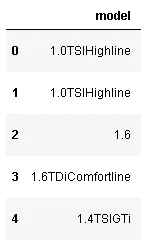**

**空格后的前三个字符代表发动机尺寸。我首先删除了空格，并从 model 列中提取了前三个字符:**

```
#remove spaces
df.model = df.model.replace(' ','',regex=True)engine = [x[:3] for x in df.model]
df['engine'] = engine
```

**让我们来看看不同发动机尺寸的价格变化:**

```
df.engine.value_counts()
1.4    3172
1.6    1916
1.2    1205
1.0     409
1.9      20
1.3       4
Name: engine, dtype: int64df[['engine','price']].groupby(['engine']).mean().sort_values(by='price', ascending=False)
```

**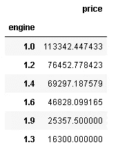**

**似乎平均价格随着发动机尺寸的增加而降低。1.3 可以忽略，因为只有 4 辆车采用 1.3 发动机。与 1.0 和其他发动机尺寸有很大差距，因为 1.0 是较新的型号。正如你在下面的图表中看到的，发动机尺寸为 1.0 的汽车平均车龄和公里数都最低，这表明它们是较新的车型。**

**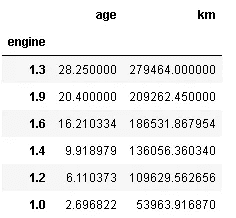**

**不同发动机尺寸的平均车龄和公里数**

# ****4。回归模型****

**线性回归是一种广泛使用的监督学习算法，用于预测连续的因变量(或目标变量)。根据独立变量的数量，它可以是简单或多元线性回归的形式。我创建了一个多元线性回归模型，因为我使用了许多自变量来预测因变量，即二手车的价格。**

**我们不应该只是使用所有的独立变量，而没有任何预处理或事先判断。**特征选择**是决定在模型中使用哪些特征(独立变量)的过程。特征选择是一个非常关键的步骤，因为使用不必要的特征会对性能产生负面影响，而删除重要的特征会妨碍我们获得高精度。**

**我们可以使用**回归图**来检查因变量和自变量之间的关系。我检查了 km 和价格之间的关系，我认为这是高度相关的。**

```
plt.figure(figsize=(10,6))
sns.regplot(x='km', y='price', data=df).set_title('Km vs Price')
```

**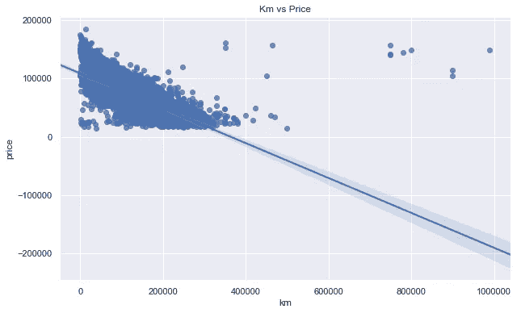**

**显而易见，随着公里数的增加，价格下降。然而，也有例外。根据上面的回归图，公里数高于 400000 的汽车可以标记为异常值。为了提高模型的准确性，我去除了这些异常值。离群值往往会使模型过度拟合。**

```
df = df[df.km < 400000]
plt.figure(figsize=(10,6))
sns.regplot(x='km', y='price', data=df).set_title('Km vs Price')
```

**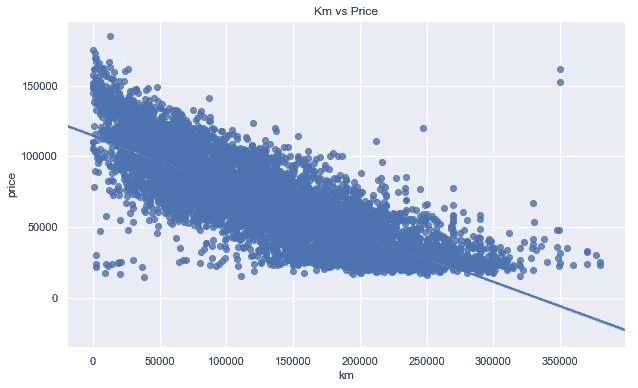**

**Km 与剔除异常值后的价格**

**现在好多了！**

**在对年龄和价格应用相同的步骤后，观察到类似的关系:**

**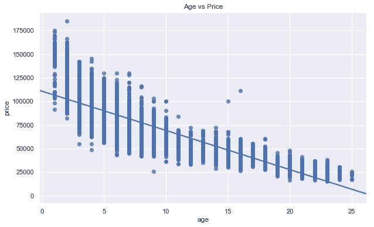**

**剔除异常值后的年龄与价格**

**我还检查了广告时长和引擎大小与价格之间的关系。发动机尺寸越大，平均价格越低。然而，广告持续时间似乎对价格几乎没有影响。**

**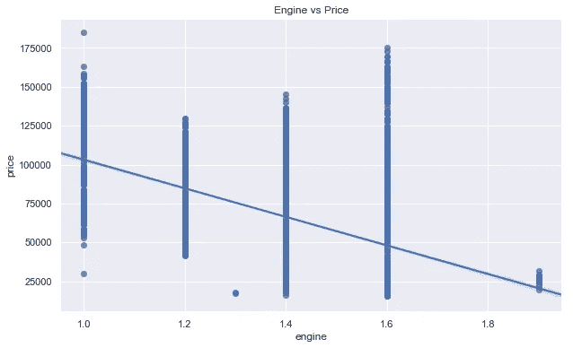****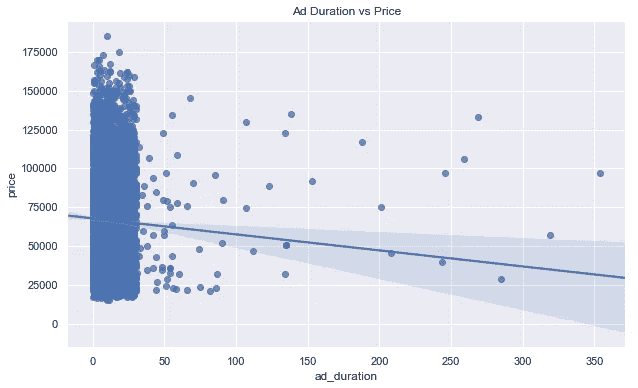**

**检查变量之间关系的另一种方法是**相关矩阵**。熊猫 **corr()** 函数计算数值变量之间的相关性。**

**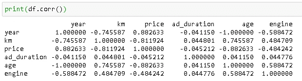**

**该值越接近 1，相关性越高。-'号表示负相关。这些值与上面的回归图一致。**

**我们也可以使用 seaborn **热图**来可视化相关矩阵:**

```
corr = df.corr()
plt.figure(figsize=(10,6))
sns.heatmap(corr, vmax=1, square=True)
```

**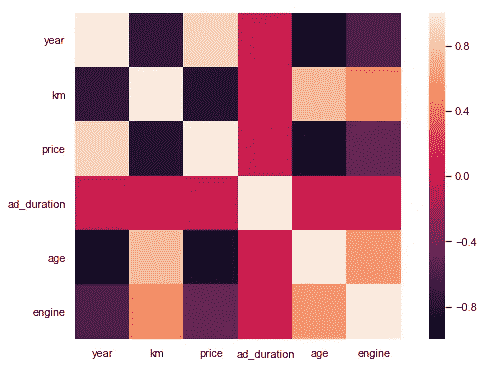**

**根据右边的颜色表，两个变量相交处的方框颜色显示相关值。**

****线性回归模型****

**在检查了变量的相关性和分布后，我决定用车龄、公里数、引擎大小和广告时长来预测一辆二手车的价格。**

**我使用了 [scikit-learn](https://scikit-learn.org/stable/) ，它提供了简单有效的机器学习工具。**

```
from sklearn.model_selection import train_test_split
from sklearn.linear_model import LinearRegression
from sklearn.metrics import r2_score
```

**我提取了要使用的特性(列):**

```
X = df[['age','km','engine','ad_duration']] #independent variables
y = df['price'] #dependent (target) variable
```

**然后使用 scikit-learn 的 **train_test_split** 函数，我将数据划分为训练和测试子集。分离训练集和测试集是每个机器学习算法中非常重要的一步。否则，如果我们在同一个数据集上训练和测试，我们将要求模型预测它已经知道的东西。**

```
X_train, X_test, y_train, y_test = train_test_split(X, y, random_state=42)
```

**然后我创建了一个 LinearRegression()对象，用训练数据集对它进行了训练。**

```
linreg = LinearRegression()linreg.fit(X_train, y_train) 
```

**是时候衡量模型的准确性了。我在训练和测试数据集上测量了模型的准确性。如果训练数据集上的精度远远高于测试数据集上的精度，我们就有一个严重的问题:**过拟合**。我不会去详细了解过度拟合。这可能是另一个帖子的主题，但我只想简单解释一下。过度拟合意味着模型过于具体，不能很好地概括。过度拟合模型试图捕获训练数据集中的噪声和极值。**

```
linreg.score(X_train, y_train)
0.8351901442035045linreg.score(X_test, y_test)
0.8394139260643358
```

**比分非常接近，这很好。这里的分数是 [**R 平方**](https://scikit-learn.org/stable/modules/generated/sklearn.metrics.r2_score.html) 分数，它是确定实际数据点与拟合回归线有多接近的度量。R 平方值越接近 1，我们的模型就越准确。r 平方度量了我们的模型解释了多少目标变量的变化。**

****残差图**用于检查实际值和预测值之间的误差。如果一个线性模型是合适的，我们期望看到误差被随机传播并且具有零均值。**

```
plt.figure(figsize=(10,6))
sns.residplot(x=y_pred, y=y_test)
```

**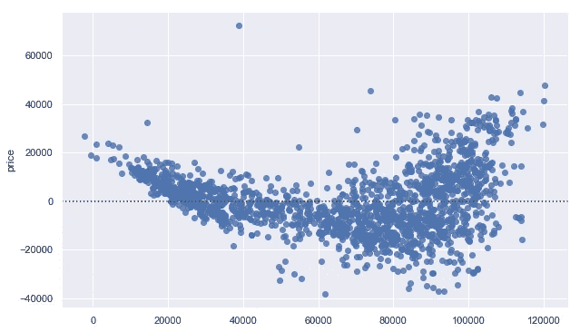**

**实际值和预测值之间的误差**

**这些点的平均值可能接近于零，但显然它们不是随机分布的。该分布接近 U 形，这表明线性模型可能不是这项任务的最佳选择。**

**在这种情况下，我想使用 scikit-learn 的 **RandomForestRegressor()** 来尝试另一个模型。随机森林是建立在**决策树**上的集成方法。威尔·科尔森的这篇文章对决策树和随机森林做了全面的解释。随机森林通常用于分类任务，但也适用于回归。**

```
from sklearn.ensemble import RandomForestRegressorregr = RandomForestRegressor(max_depth=5, random_state=0, n_estimators=10)
```

**与线性回归不同，随机森林有一些关键的超参数需要优化。[**max _ depth**](https://scikit-learn.org/stable/modules/generated/sklearn.ensemble.RandomForestRegressor.html)**是一棵树的最大深度(不言自明)，它控制着一棵树有多深或者你想要多少个分支。 [**n_estimator**](https://scikit-learn.org/stable/modules/generated/sklearn.ensemble.RandomForestRegressor.html) 是一片森林中的树木数量。决策树容易过度拟合，这意味着你很容易使它过于具体。如果 max_depth 太高，可能会导致模型过拟合。我手动更改了 max_depth，以便检查准确性和过度拟合。但是 scikit-learn 提供了非常好的超参数调优工具:[**RandomizedSearchCV**](https://scikit-learn.org/stable/modules/generated/sklearn.model_selection.RandomizedSearchCV.html)**和**[**GridSearchCV**](https://scikit-learn.org/stable/modules/generated/sklearn.model_selection.GridSearchCV.html)**。对于更复杂的任务和模型，我强烈推荐使用它。******

```
**print('R-squared score (training): {:.3f}'
     .format(regr.score(X_train, y_train)))
R-squared score (training): 0.902print('R-squared score (training): {:.3f}'
     .format(regr.score(X_test, y_test)))
R-squared score (training): 0.899**
```

****测试集上的 r 平方得分是 0.899，这表明与线性回归相比有显著的改进。我还尝试将 max_depth 参数设置为 20，结果是在 overfit 模型上，如下所示。模型在训练集上非常准确，但在测试集上的准确性变得较低。****

```
**regr = RandomForestRegressor(max_depth=20, random_state=0, n_estimators=10)regr.fit(X_train, y_train)print('R-squared score (training): {:.3f}'
     .format(regr.score(X_train, y_train)))
R-squared score (training): 0.979print('R-squared score (training): {:.3f}'
     .format(regr.score(X_test, y_test)))
R-squared score (training): 0.884**
```

****最后我根据车型查了一下我车的价格:****

```
**regr.predict([[4,75000,1.2,1]])
array([99743.84587199])**
```

****模型建议我以差不多 10 万英镑的价格卖掉我的车，这比我心目中的价格要高。然而，我的车出了事故，经过修理，价格降低了。这些信息没有被作为独立变量考虑，这就把我们带到了本文的最后一部分:进一步改进。****

# ****4.进一步改进****

****有许多方法可以改进机器学习模型。我觉得最根本最有效的一条就是多收集数据。在我们的例子中，我们可以(1)收集更多汽车的数据，或者(2)收集当前数据集中更多汽车的信息，或者两者都收集。对于第一个，有其他网站出售二手车，所以我们可以通过添加新车来增加数据集的大小。对于第二个问题，我们可以从“ [sahibinden](https://www.sahibinden.com/volkswagen-polo?pagingSize=50) ”网站收集更多关于汽车的数据。如果我们点击一个广告，另一个有详细信息和图片的页面就会打开。在这一页，人们写下汽车的问题，以前的事故或维修等等。这种信息无疑是有价值的。****

****另一种改进方法是调整模型超参数。我们可以使用 [RandomizedSearchCV](https://scikit-learn.org/stable/modules/generated/sklearn.model_selection.RandomizedSearchCV.html) 来找到最佳的超参数值。****

# ******结论******

****我试图给你一个机器学习项目如何建立的概述。尽管这不是一项非常复杂的任务，但大多数数据科学项目都遵循类似的模式。****

*   ****定义问题或疑问****
*   ****收集和清理数据****
*   ****进行探索性数据分析，以获得一些关于数据的见解****
*   ****建立一个模型****
*   ****评估模型****
*   ****除非结果令人满意，否则请返回前面的任何步骤。****