# 用机器学习技术预测二手车价格

> 原文：<https://towardsdatascience.com/predicting-used-car-prices-with-machine-learning-techniques-8a9d8313952?source=collection_archive---------1----------------------->

## 比较五种不同 ML 模型的性能


> 你可以在我的 [github 页面](https://github.com/Raizel820/Raizel820-Capstone_Project_Machine_Learning/blob/master/Capstone_Project_Complete_Analysis.ipynb)上找到这项研究的所有 Python 脚本。如果您感兴趣，您还可以在同一个存储库中找到用于该研究的数据清理的脚本。

# 谁应该读这个？

如果您有兴趣了解从零开始构建机器学习系统，包括:

*   数据清理期间的调整
*   探索性数据分析
*   执行机器学习模型:随机森林，线性回归，岭回归，拉索，KNN，XGBoost
*   模型的性能比较
*   以专业的方式报告研究结果

# **问题**

业内新车的价格由制造商确定，政府以税收的形式支付一些额外的费用。因此，购买新车的客户可以放心，他们投资的钱是值得的。但由于新车价格上涨，以及客户因缺乏资金而无法购买新车，二手车销售在全球范围内呈增长趋势(Pal，Arora 和 Palakurthy，2018)。需要一种二手车价格预测系统来使用各种特征有效地确定汽车的价值。即使有网站提供这种服务，他们的预测方法也不一定是最好的。此外，不同的模型和系统可能有助于预测二手车的实际市场价值。在买卖时，了解它们的实际市场价值是很重要的。

# **客户端**

能够预测二手车的市场价值对买卖双方都有帮助。

**二手车销售商(经销商):**他们是可能对本研究结果感兴趣的最大目标群体之一。如果二手车卖家更好地了解什么使一辆车可取，什么是二手车的重要特征，那么他们可能会考虑这些知识，并提供更好的服务。

**在线定价服务:**有些网站提供汽车的估价。他们可能有一个很好的预测模型。然而，拥有第二个模型可能有助于他们向用户提供更好的预测。因此，这项研究中开发的模型可能有助于在线网络服务，告诉二手车的市场价值。

**个人:**有很多人在他们人生的某个阶段对二手车市场感兴趣，因为他们想卖掉自己的车或买辆二手车。在这个过程中，支付过高或低于市场价值出售都是一个大问题。

# **数据**

本项目使用的数据是从 Kaggle 下载的。它是由 Kaggle.com 用户奥斯丁·里斯上传到 Kaggle 上的。奥斯汀·里斯从 craigslist 上搜集了这些数据，目的是为了非盈利。它包含了 Craigslist 提供的关于汽车销售的几乎所有相关信息，包括价格、状况、制造商、纬度/经度等栏目，以及 22 个其他类别。

**数据角力**

在本节中，我们将讨论如何对 *craigslist 二手车*数据文件应用数据清理和争论方法。

在进行数据清洗之前，对数据集进行了一些探索和数据可视化。这为如何处理缺失值和极端值提供了一些思路和指导。在数据清理之后，再次应用数据探索，以便理解数据的清理版本。

**数据清理:**数据清理的第一步是删除不必要的特征。为此， *'url '，' image_url '，' lat '，' long '，' city_url '，' desc '，' city '，' VIN'* 等功能全部被删除。下一步，调查该特性的零点数量和零点数据点的百分比(表 1)。

下一步，极值被删除，因为它们抑制了模型的预测能力。首先，标价超过 10 万美元的汽车被取消了。在 550313 个数据点中，只有 580 个数据点的价格超过 100k。它只能满足一小部分买家的需求。此外，有 61726 辆汽车的价格低于 750 美元。这些值也被从数据集中删除，因为这些价格对数据来说是噪音。其次，里程表值超过 300，000 英里但低于 10 英里的汽车被取消。最后，早于 1985 年的汽车被淘汰。对于我们的分析，这些数据点可以被视为异常值。

第二步，用适当的值填充一些缺失的值。对于缺少的'*条件'*值，注意根据类别进行填充。计算所有'*条件'*子类别的平均*里程表*。然后，通过考虑每个条件子类别的平均*里程表*值来填补缺失值。另外，*车型*值高于 2019 年的车填为'*新'*，2017-2019 年之间填为'*如新'*。在此过程结束时，清除了“条件”功能中所有缺失的值。

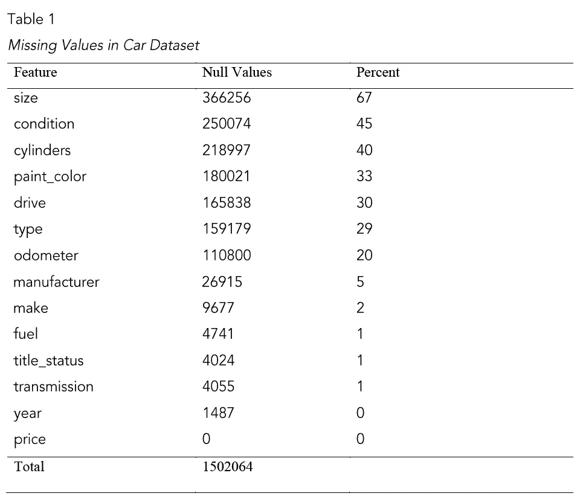

其他的用' *ffill'* 的方法填充。此方法将最后一个有效观察向前传播到下一个有效观察。因此，最后一个已知值在每个时间点都可用。到目前为止，里程表，条件，条件和价格功能的所有缺失值都很清楚。经过这一步，所有数据都变得干净了。在此操作之后，将对数据中的 380，962 个观察值进行研究和分析。

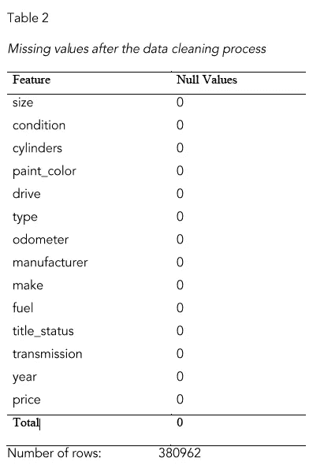

# **探索性数据分析**

在探索数据的同时，我们将借助视觉效果来观察不同的功能组合。这将有助于我们更好地理解我们的数据，并给我们一些关于数据模式的线索。

**考察物价走势**

价格是我们在这项研究中预测的特征。在应用任何模型之前，看看价格数据可能会给我们一些想法。

通过查看图 1，可以观察到大多数二手车的价格低于 20，000 美元。此外，我们看到仍有相当数量的汽车价格超过 2 万美元。我们可以猜测所有类型的汽车可能便宜或昂贵。但是，仍然优秀，喜欢新的，良好的条件的汽车是最受欢迎的汽车在二手车市场(图 2)。打捞车在流行程度上是遵循这三个类别的。因此，仅仅考虑汽车的类型或状况，很难对汽车的价格做出准确的估计。但我们可以告诉它，某些条件的汽车是受欢迎的和更高的机会出售。

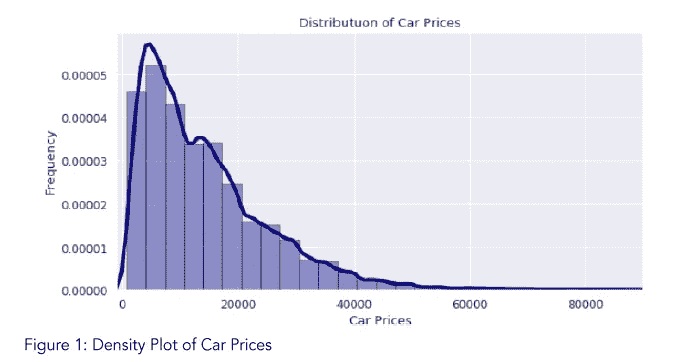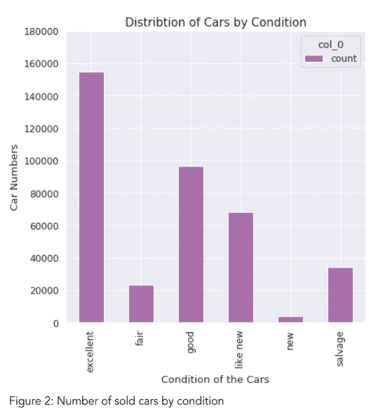

**二手车的流行特征**

在购买二手车时，人们会认真关注车上的里程表值。我们可以看到里程表显著地改变了汽车的价格(图 3)。另一方面，这并不意味着只销售低里程表汽车。根据价格，高里程表汽车也有买家(图 4)。此外，最受欢迎的二手车是里程表在 100k 左右的车。直到 150k 的里程表，市面上的车很多。

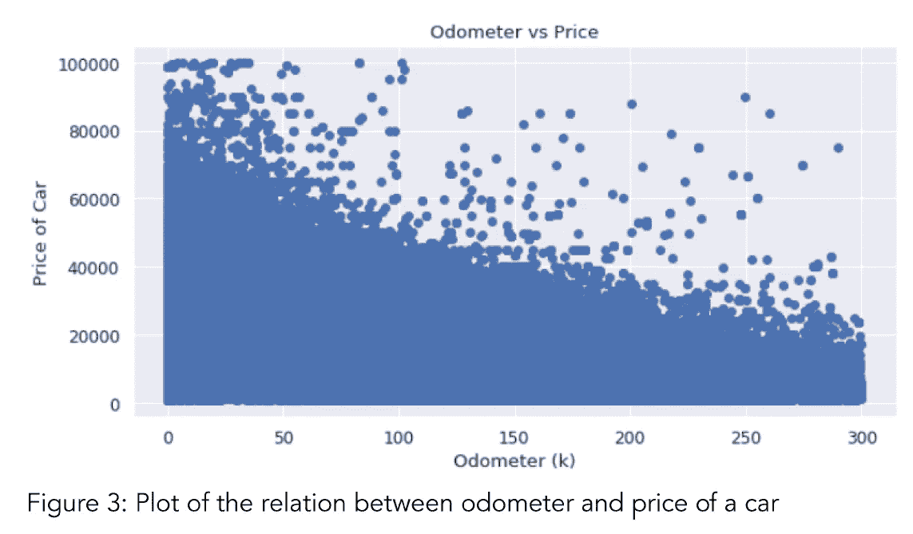

汽车制造商是二手车市场上的另一个重要变量。福特和雪佛兰是北美占主导地位的制造商之一(图 5)。丰田和日产作为大厂商遵循订单。可以得出结论，日系车在二手车市场占有相当大的份额。但是，美国车仍然是按需供应，占主导地位。

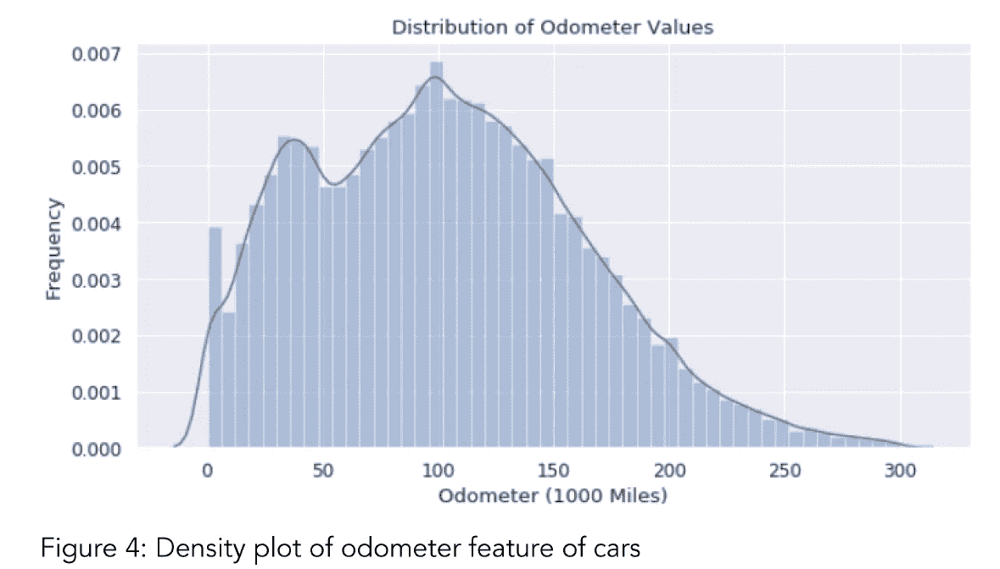

**变速器:**变速器是二手车市场中另一个占主导地位的子类别。根据图 6，自动变速器对人们对汽车的偏好有很大的影响。从图 6 中可以看出，2000 年以后，自动变速器汽车在增加。2009 年，这一数字有所下降。全球经济衰退可能会影响二手车市场。另一个有趣的趋势是，2009 年后，其他传播方式在增加。它的市场份额相比自动挡还是那么低，但还是很可观的。其他传输类型增加可能是由几个原因造成的。第一种可能性是无级变速器(CVT)增加。CVT 更环保更省油。这种技术可能会得到推广。另一种可能是 Craigslist 网站上的一些卖家没有填写汽车信息的传输部分。网站可能会直接将他们归入“其他”类别。这也解释了“其他”类别传播的增加。

**传动系统类型:**在评估一辆车的时候，了解是什么影响了它的状况是很重要的。图 7 告诉我们，四轮驱动汽车更加耐用和可靠。可以看出，从数量上看，4wd 的车是最受欢迎的。从长远来看，与 *rwd* 和 *fwd* 传动系统相比，它们可以保持更好的运行能力。4wd 在汽车的“优秀”、“像新的一样”和“状况良好”方面的数字最高。另一方面，我们需要记住，与总数相比，很难说四轮驱动汽车具有更高的“优秀”率和“喜欢新汽车”率(图 7)。此外，通过查看表 4，

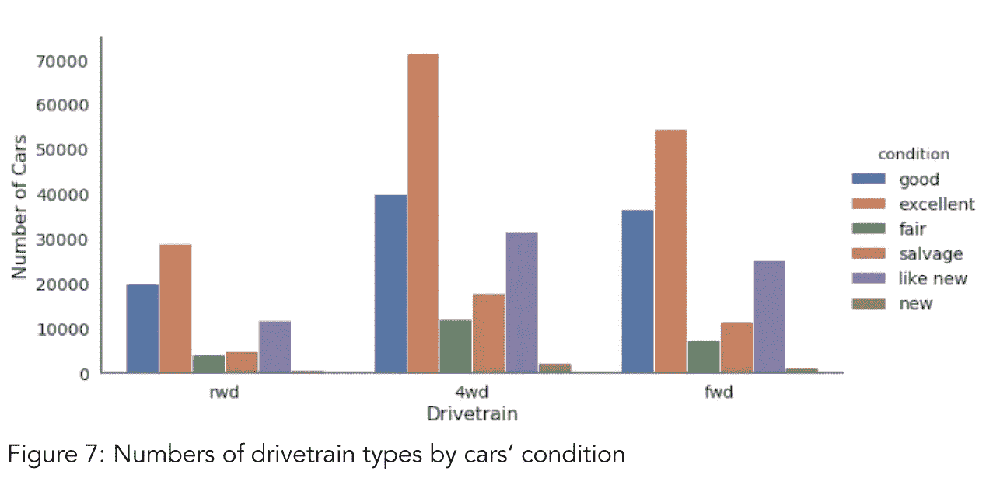

我们可以看到，对于所有分位数，所有动力传动系统类型的平均里程表彼此非常接近。这也告诉我们，在二手车市场，驾驶类型可能不会影响汽车的里程表。但是它们的受欢迎程度在驾驶员中是不同的(表 3 和图 8)。

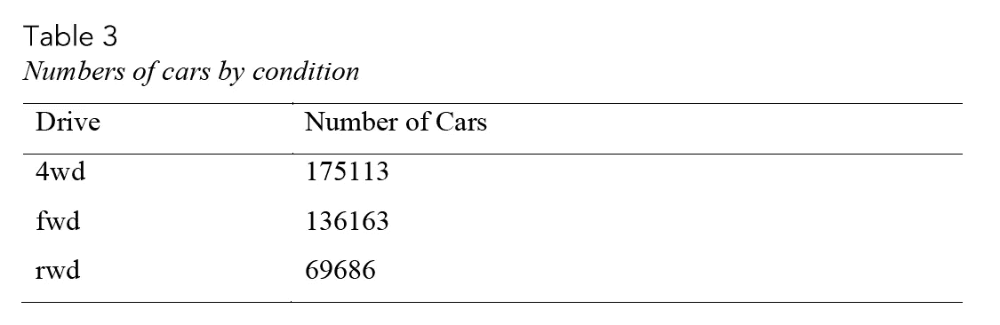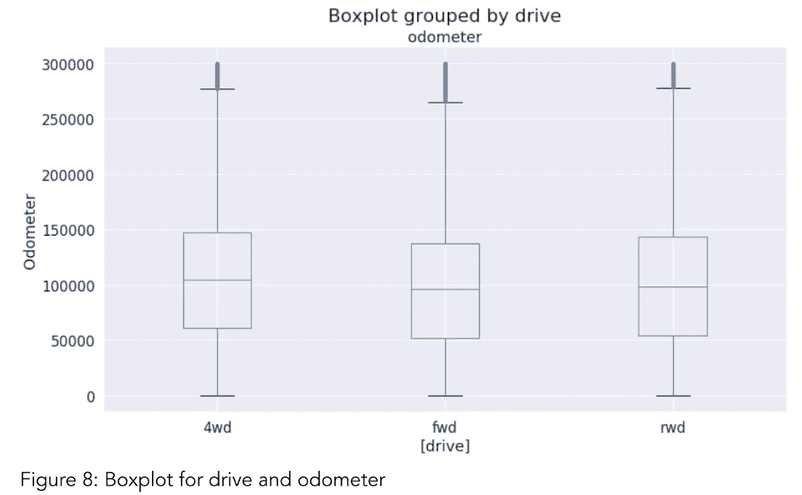

**检验&假设**

为了理解什么影响二手车价格的变化，将通过使用推断统计方法来检查数据 sat 中可用特征之间的关系。基于图表的主要假设是价格必须受到里程表和条件的影响。一定还有其他显著影响价格的特征。这将在研究的后期阶段进行调查。

***第一个假设:***

***空*假设**:汽车的价格和里程表没有显著的关系

**替代假设**:价格与里程表之间存在显著关系。

***第二个假设*** *:*

***无效*假设**:汽车的价格和状况之间没有显著的关系

**替代假设**:价格和条件之间有很大的关系。

**里程表 vs 价格**

首先，检验第一个假设。在检验两个数值变量之间的关系时，独立 t 检验是一种合适的方法。另一方面，这个测试有一些假设。方差齐性是假设之一。为了检查方差齐性假设是否被违反，应用了 Levene 检验。

**检验方差的均匀性:**Levene 检验的结果:

*Levene 结果(统计值=335641.8310266318，p 值=0.0)*

这意味着方差的同质性被破坏了。在这种情况下，我们需要使用韦尔奇检验。Welch t 检验是一种非参数单变量检验，用于检验两个不相关组的均值之间的显著差异。当方差相等的假设存在违规时，它是独立 t 检验的替代方法。因此，它适用于这种情况。以下是韦尔奇测试的结果:

```
Welch's t-test= 740.70p-value = 0.00Welch-Satterthwaite Degrees of Freedom= 276855.87
```

在这里，p 值非常重要。这说明里程表和汽车价格之间有很大的关系。作为参考，进行独立的 t 检验没有坏处。它可以提供一些想法，即使它不是里程表和价格功能的健壮方法。

**检查正态性:**对于检查正态性，q-q 图有助于我们。图 9 告诉我们这违反了常态。这意味着所使用的数据点不是正态分布的。此外，夏皮罗-维尔克检验用于检查正态性。

*结果:(0.9586305022239685，0.0)*

这里，第一个值是 W 检验统计量，第二个值是 p 值。对于 N > 5000，W 检验统计是准确的，但 p 值可能不准确。通过考虑夏皮罗-维尔克检验的 p 值，可以得出数据不是正态分布的结论。

在这种情况下，我们在初始数据点上有问题。或许，过滤数据可以解决这个问题。为此，远离平均值两个标准差的里程表和价格的值被丢弃，并应用独立 t 检验。

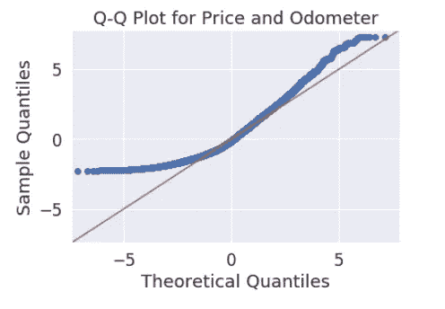

图 9: Q-q 图

如前所述，t 检验在这里是不合适的，因为它违反了方差相等假设和正态假设。另一方面，我们仍然可以解释这个结果，同时记住它是不可靠的。根据表 5，相关性为 0.90。这表明价格和里程表之间有很强的联系。此外，p 值较低，具有统计学意义。效应大小(科恩的 d)是 4.17，这是一个很大的值。d 为 4 表示它们相差 4 个标准差。这意味着两组的平均值相差 4 个标准偏差或更多，因此差异显著。

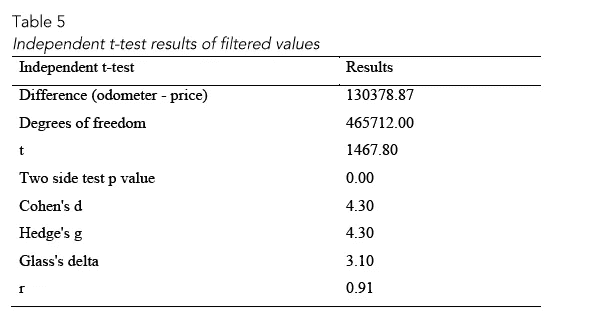

通过考虑这些韦尔奇检验的结果和表 5，可以得出结论:*里程表*和*价格*有显著的关系。因此，第一个假设的零假设被拒绝。拒绝 null 有一些可能的含义:

*   替代假设是真的。
*   可能存在类型 2 错误，这意味着零假设被错误地拒绝
*   是的，有统计学意义。但这并不意味着实际意义。

**条件 vs 价格**

这项研究的第二个假设关注汽车状况对其价格的影响。为了理解这种关系，表 6 和图 6 可能有用。通过查看图 10，可以说“状况”严重影响了汽车的中值价格。另一方面，在条件值中有许多异常值，这是这样一个 lar 数据集的预期结果。我们在图 10 的底部没有看到异常值。这主要是因为在数据清理期间，价格低于 750 美元的汽车被丢弃。

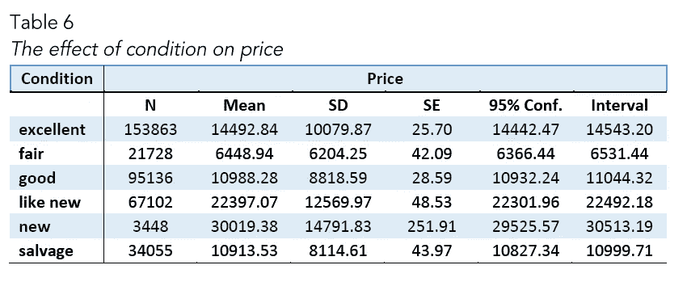

现在，是时候检查条件和价格之间的关系了。在应用任何线性关系测试之前，必须应用诊断测试。因此，可以检查该关系是否满足四个假设:残差的线性、残差的独立性、残差的正态分布、残差的等方差。为了检验正态性，进行了 Jarque-Bera，为了检验残差的等方差，应用了综合检验。此外，为了检查多重共线性，使用了条件数(condno)检验，为了检测自相关的存在，应用了德班-沃森检验(表 7)。

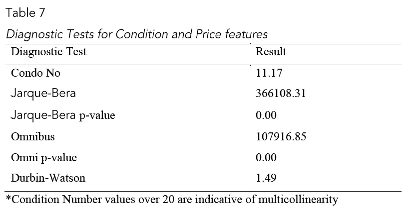

考虑到表 7，Jarque-Bera p 值和 Omni p 值非常重要。这表明存在违反正态性和方差齐性的情况。此外，Durbin Watson (DW)统计是对统计回归分析中残差的自相关性的测试。德宾-沃森统计值将总是在 0 和 4 之间。值为 2.0 意味着在样本中没有检测到自相关。从 0 到小于 2 的值表示正自相关，从 2 到 4 的值表示负自相关。“条件”和“价格”的德宾沃森得分是 1.49，这表明这是一种微弱但正相关的关系。

**对“条件”结果的推断**

假设是:

**H0** :汽车的价格和状况没有太大的关系

通过考虑测试结果，我们无法拒绝零假设。然而，该假设是基于线性关系。因此，这种情况有几种可能的解释:

“条件”和“价格”之间可以有关系，但不是线性关系。它可以是非线性关系。

可能存在线性关系，但我们的数据可能不具有代表性，使我们看不到这种关系。

零假设是正确的，在“条件”和“价格”之间没有显著的关系。

**推断统计学的挑战**

在这个数据集中，最大的挑战之一是预测变量的分布违反正态性。这就是为什么，经典的统计方法对分析这些数据帮助不大。此外，数据集中的 14 个变量中只有 3 个数值变量。这限制了我们使用 Pearson-r 相关性的机会。

因此，我们将进入下一部分。在下一节中，将应用机器学习模型，并通过使用平均绝对误差(MAE)、均方误差(MSE)和均方根误差(RMSE)来测试模型的性能。

**机器学习模型**

本节使用应用机器学习模型作为数据分析的框架。数据集是一种监督数据，指的是将因变量模型拟合到自变量，目的是为未来的观察结果准确预测因变量或了解变量之间的关系(Gareth，Daniela，Trevor，& Tibshirani，2013)。关于数据集，文献表明下列方法可能是合适的。

在本节中，将按顺序应用这些机器学习模型:

随机森林

里脊回归

套索

k-最近邻

XGBoost

此外，在岭回归之前，将应用简单的线性模型并考虑结果。

**数据预处理**

**标签编码。**在数据集中，有 13 个预测因子。其中两个是数字变量，其余的是分类变量。为了应用机器学习模型，我们需要特征的数字表示。因此，所有非数字特征都被转换成数字形式。

**训练数据。**在此过程中，20%的数据被拆分为测试数据，80%的数据作为列车数据。

**缩放数据。**在研究前几节中的数据时，我们发现数据不是正态分布的。如果不进行缩放，机器学习模型将尝试忽略低值特征的系数，因为与高值特征相比，它们的影响非常小。

在缩放时，使用正确的方法缩放也很重要，因为不适当的缩放会导致不适当的目标量化和不适当的绩效衡量(Hurwitz，e .，& Marwala，2012)。最小-最大缩放器是合适的，特别是当数据不是正态分布，并希望离群值有减少的影响。此外，脊和套索都受到特征大小的影响，以执行正则化。因此，对数据集使用了最小-最大缩放器。

**随机森林**

随机森林是多个决策树的集合。深度决策树可能会过度拟合，但随机森林通过在随机子集上创建树来防止过度拟合。这就是为什么，这是一个很好的分析模型。

在分析中，创建了 200 棵树。一般来说，树越多，效果越好。结果，获得 4001.8 RMSE 和 2122.92 平均绝对误差(MAE)(表 8)。

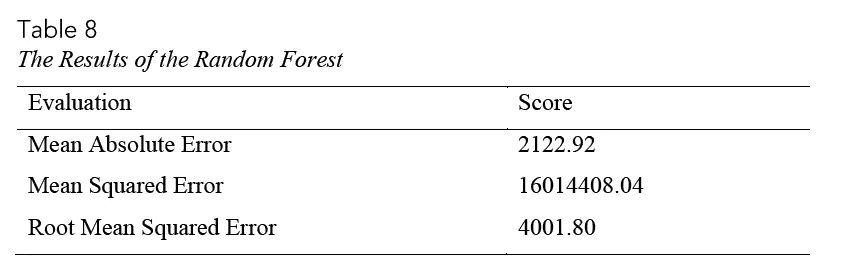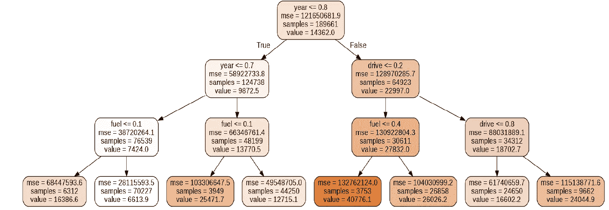

图 11:随机森林中的单一决策树

如果我们看一下图 11，我们会看到有七个叶节点。这个树只使用了三个变量:年份、驱动和燃料。叶节点没有问题，因为它们是进行最终预测的地方。要对一个新点进行分类，只需沿着树向下移动，使用该点的特征来回答问题，直到到达一个叶节点，在该叶节点上，类就是预测。

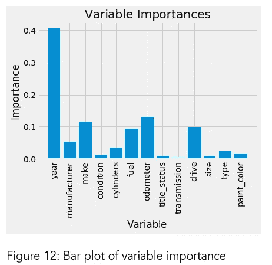

**变量重要性:**为了量化整个随机森林中所有变量的有用性，我们可以看看变量的相对重要性。图 12 是一个简单的特征重要性条形图，用来说明变量相对重要性的差异。对于本研究，达到 90%的累积重要性被视为成功。

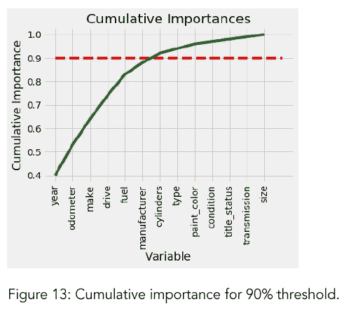

```
**Model with only important features:** Number of features for 90% cumulative importance is 7 (Fig. 13). The features are: year, odometer, make, drive, fuel, manufacturer, cylinders.  The ultimate purpose of the modelling is to get a smaller number of features that can give us a strong prediction. At this point, the model was run with only these seven important features. The new RMSE is 3960.11 (Table 9). This score is slightly better than the full model (4001.80 % vs 3960.11). In addition, this performance was obtained just by using 7 features instead of 13\. Therefore, it can be considered as an improvement in both prediction power and computational cost.
```

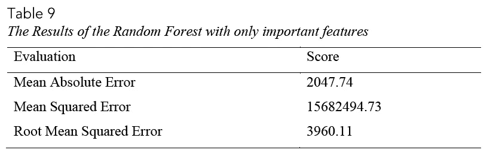

**线性回归**

在应用脊和套索之前，检查线性回归结果可能是有用的(表 10)。


正如我们在表 10 中看到的，与随机森林相比，线性回归的性能并不太好。实际值和预测值之间的差异值得注意(图 14)。这就是为什么我们需要不同的模型来给出更好的预测结果。

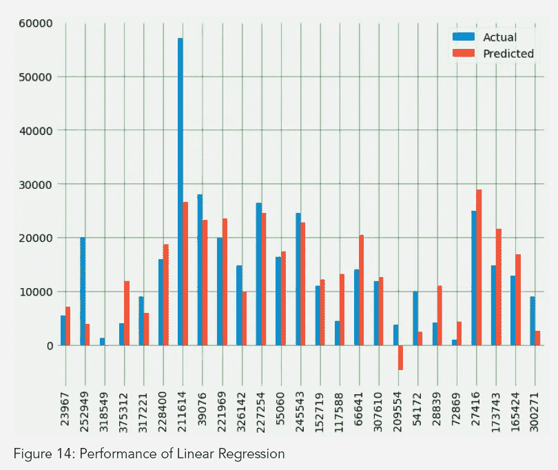

**岭回归**

普通最小二乘法(OLS)给出无偏回归系数(数据集中观察到的最大似然估计)。岭回归和套索允许正则化(“收缩”)系数。在图 15 中，可以看到系数是如何随着α值的增加而缩小的。

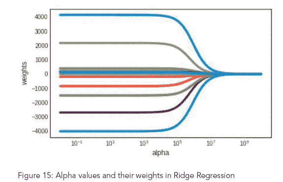

为了在岭回归中找到最佳α值，应用了交叉验证。结果如表 11 所示。

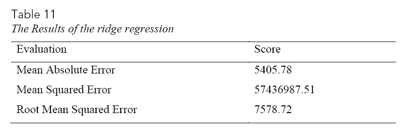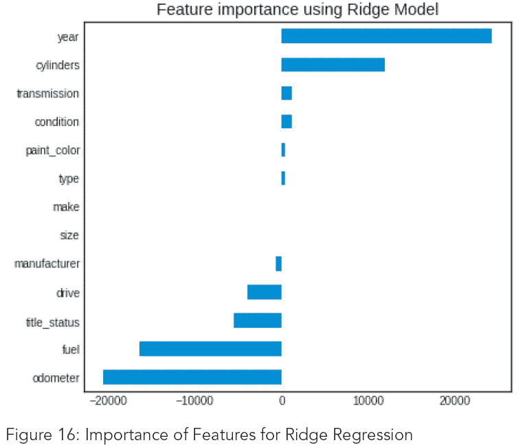

与 OLS 相比，里奇的表现几乎相同。考虑图 16，岭回归表明，这六个变量是最重要的:年份，里程表，燃料，气缸，标题状态和驱动器。

**拉索**

Ridge 缩小了变量的系数，但不会使它们为零。这在某些情况下可能是好的，但在变量数量相当大的情况下，这可能会给模型解释带来挑战(Gareth、Daniela、Trevor 和 Tibshirani，2013)。对于这个数据集，变量的数量并不大，所以不太需要套索模型。然而，看看 lasso 可以给我们另一个视角。而且，除了投入时间和精力之外，对数据集应用套索没有任何坏处。

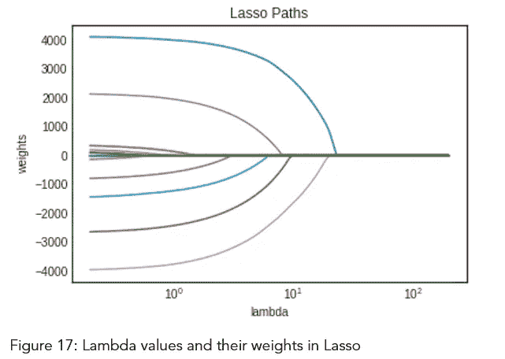

为了从图 17 中找到最佳λ值，应用了交叉验证。在这次评估中，获得的 RMSE 是 7578.82(表 12)。

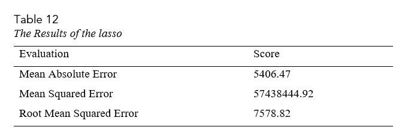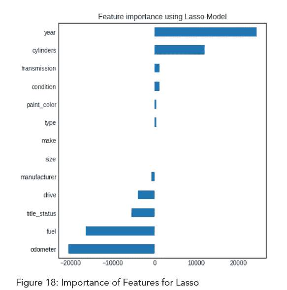

与山脊结果相似，拉索也给出了六个显著特征: ***年份、里程表、燃料、汽缸、冠军状态、驱动*** 。在进行最终解释时，可以考虑这一点。

**K-最近邻(KNN)**

当你的数据集足够小时，可以使用 KNN 分类器，这样 KNN 分类器可以在更短的时间内完成运行。KNN 算法可以与最精确的模型竞争，因为它做出高度精确的预测。因此，我们可以将 KNN 算法用于需要良好预测但不需要人类可读模型的应用程序。预测的质量取决于距离度量。因此，KNN 算法适用于具有足够领域知识的应用程序(IBM 知识中心，n.d .)。因为我们有 13 个用于预测的特征，KNN 是适用于本研究的合适方法。对于 RMSE 值的评估，我们可以看一下表 12。

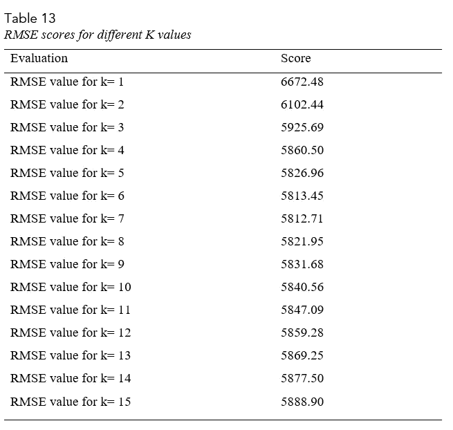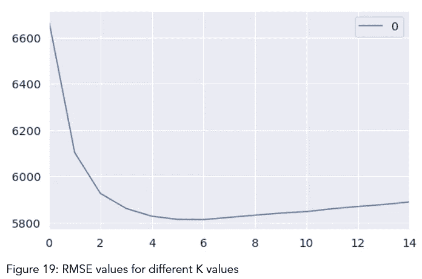

从表 13 和图 19 可以看出，当 k 为 7 时，RMSE 值最低。另一方面，k 为 2 和 7 的 RMSE 值之间没有显著差异。这里的基本原理是，如果一组 K 值看起来或多或少一样好，那么我们不妨选择最简单的模型——也就是具有最少数量预测值的模型。对于我们的情况，我们可以选择 2 个预测值，因为它具有最低的 RMSE 值(表 13)。但是，考虑到以前的模型，六七个预测器仍然有很强的理由选择，并与它们更加一致。

**XGBoost**

XGBoost 是梯度推进方法的一个具体实现，它使用更精确的近似来寻找最佳的树模型。它采用了许多巧妙的技巧，使得它异常成功，尤其是在结构化数据方面。XGBoost 还有额外的优势:训练非常快，可以并行化/跨集群分布。因此，XGBoost 是本研究中使用的另一个模型。XGBoost 的性能如表所示(表 14)。

**拟合模型:**第一步，目标参数设置为*线性*。

下一步，进行三重交叉验证。最大深度选择为 3。因此模型保持简单。最后，将执行升压的次数设置为 50。

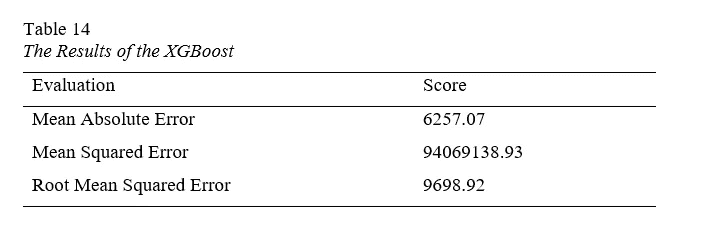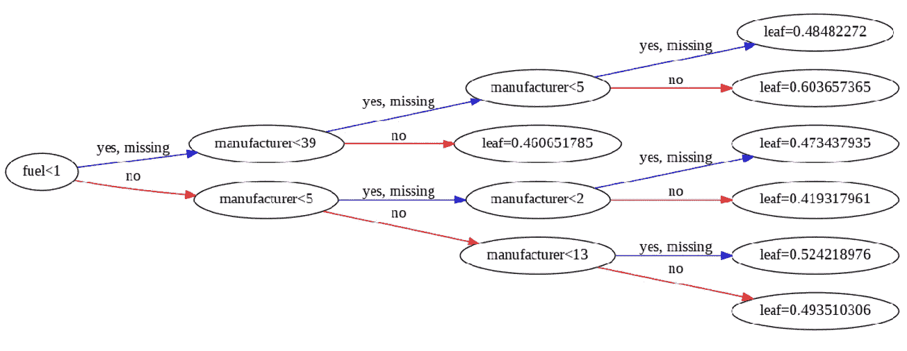

**图 20:单决策树的 XGBoost 图**

图 20 提供了该模型的不同视角。给定值(叶)的最终预测是每个分支预测的总和。另一方面，决策树可能不是为我们的数据集进行预测的稳健方式，因为它试图进行回归，但数据集有许多分类变量。除了决策树之外，特征重要性图(图 21)可以给出评估的另一个角度。通过考虑图 21，可以说里程表、制造商、年份和品牌是包含模型的重要特征。

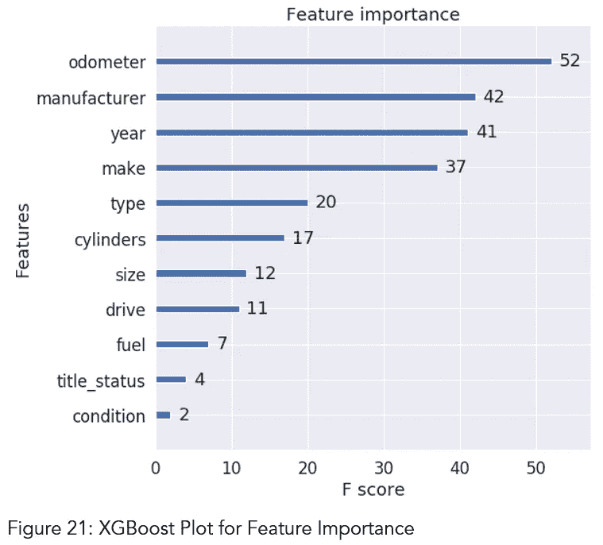

**结论**

通过执行不同的模型，旨在获得不同的视角，并最终比较它们的性能。这项研究的目的是通过使用包含 13 个预测值和 380962 个观察值的数据集来预测二手车的价格。在数据可视化和探索性数据分析的帮助下，数据集被揭示，特征被深入探索。检查了特征之间的关系。在最后一个阶段，应用预测模型预测汽车价格的顺序为:随机森林、线性回归、岭回归、lasso、KNN、XGBoost。

通过考虑表 15 中的所有四个指标，可以得出结论，随机森林是预测二手车价格的最佳模型。作为回归模型的随机森林给出了最佳的 MAE、MSE 和 RMSE 值(表 14)。据 random forest 称，以下是最重要的特征:年份、里程表、品牌、驱动、燃料、制造商、气缸。这些功能仅通过使用七个列出的功能就提供了 3960.11 RMSE。

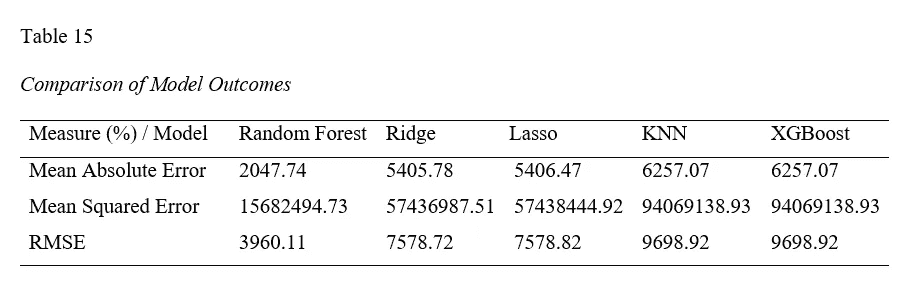

# **研究的局限性和进一步研究的建议**

这项研究使用了不同的模型来预测二手车价格。然而，有一个相对较小的数据集来进行强有力的推断，因为观察值只有 380962。收集更多的数据可以产生更可靠的预测。其次，可能有更多的特征可以作为良好的预测指标。例如，这里有一些可能改进模型的变量:门的数量、汽油/英里(每加仑)、颜色、机械和装饰翻新时间、新旧比率、评估与交易比率。

还有一点需要改进的是，在更多技术信息的帮助下，数据清理过程可以更加严格。例如，不使用“ffill”方法，可能会有一些指标帮助更有意义地填充缺失值。

作为进一步研究的建议，在预处理数据时，可以使用一种热编码器方法，而不是使用标签编码器。因此，所有非数字特征都可以转换为名义数据，而不是序数数据(Raschka & Mirjalili，2017)。这可能会导致预测模型的性能发生重大变化。此外，在训练数据之后，代替最小-最大缩放器，可以执行标准缩放器，并且可以比较结果。可以检查不同的标度是否提高了模型的预测能力。

# **参考文献**

IBM 知识中心。(未注明)。使用 KNN。检索自:[https://www . IBM . com/support/knowledge center/SSHRBY/com . IBM . swg . im . dash db . analytics . doc/doc/r _ KNN _ usage . html](https://www.ibm.com/support/knowledgecenter/SSHRBY/com.ibm.swg.im.dashdb.analytics.doc/doc/r_knn_usage.html)

Gareth，j .，Daniela，w .，Trevor，h .，和 Tibshirani，R. (2013 年)。*统计学简介*

*学习*(第八卷)。[https://doi.org/10.1016/j.peva.2007.06.006](https://doi.org/10.1016/j.peva.2007.06.006)

赫维茨和马瓦拉(2012 年)。将计算智能和机器学习应用于股票市场建模时的常见错误。 *arXiv 预印本 arXiv:1208.4429* 。

Pal，n .，Arora，p .，Kohli，p .，Sundararaman，d .，& Palakurthy，S. S. (2018 年 4 月)。我的车值多少钱？使用随机森林预测二手车价格的方法。在*信息与通信会议的未来*(第 413–422 页)。斯普林格，查姆。

Raschka，s .，& Mirjalili，V. (2017 年)。 *Python 机器学习*。帕克特出版有限公司