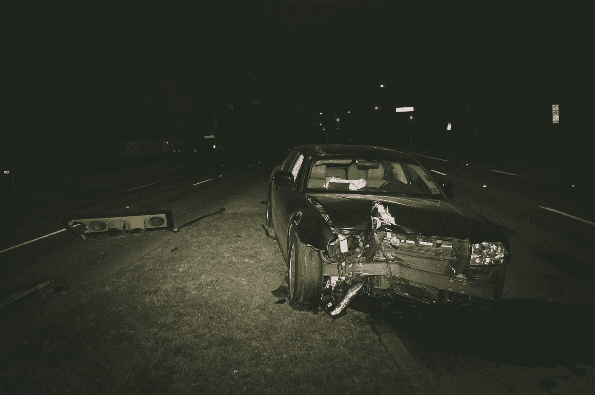
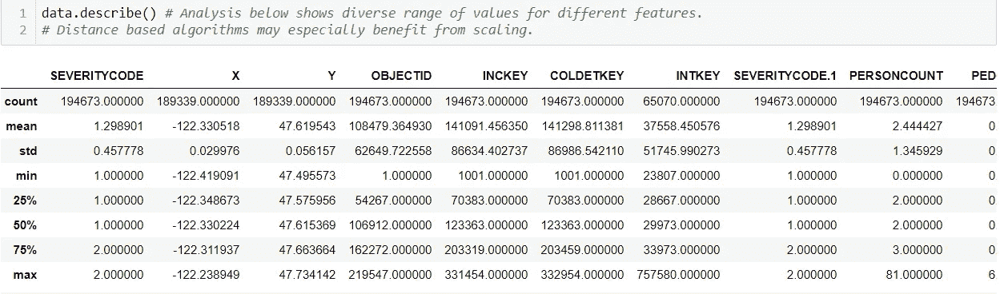
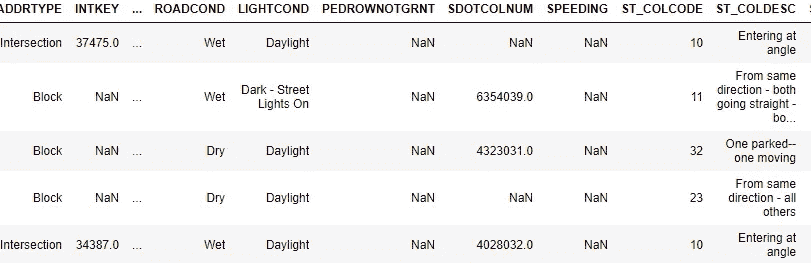
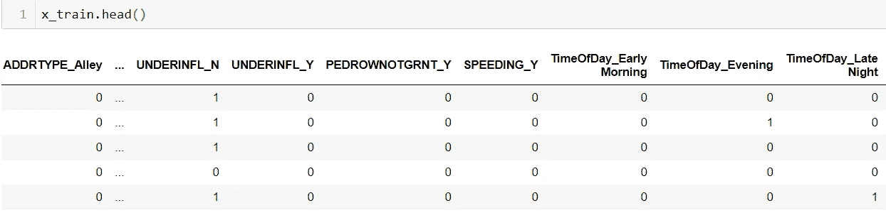
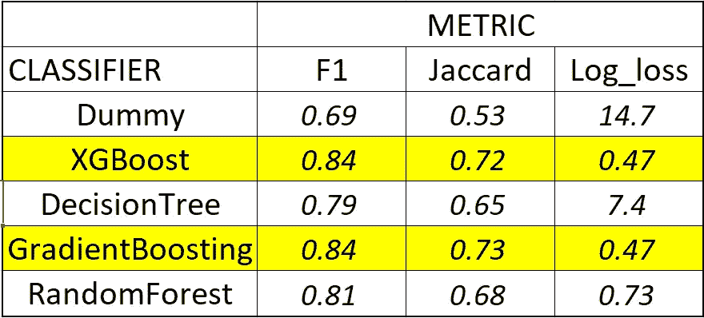

# 基于集成分类器和自动建模的车辆事故严重度预测

> 原文：<https://towardsdatascience.com/predicting-vehicle-accident-severity-using-ensemble-classifiers-and-automl-17ced9495932?source=collection_archive---------26----------------------->

## Coursera 上 IBM 数据科学认证的顶点项目摘要



马修·T·雷德在 [Unsplash](https://unsplash.com?utm_source=medium&utm_medium=referral) 上的照片

**简介/商务问题**

这篇文章详细介绍了使用西雅图市交通局登记的车辆事故公开数据集的工作。这项工作通过识别导致各种类型交通事故的因素，预测事故严重程度，并利用这些信息将风险降至最低，从而使美国公众受益。

完整的代码可以在我的 GitHub [repo](https://github.com/Ranga2904/Coursera_Capstone/blob/master/Ranga_Coursera_Capstone.ipynb) 找到

**目标**

使用包括汽车和人的数量、交通、天气状况等特征，预测事故的严重程度为“1”或“2”。这是一个分类问题，一旦建模，西雅图市当局就可以获得以前无法获得的事故风险因素的洞察力，也让作者获得必要的完成以获得 Coursera 专业认证。

**使用的数据和采取的步骤**

所用的原始数据由西雅图交通部提供，采用了以下步骤:

**步骤 1:** 数据加载和初步观察

**第二步:**特征可视化详细分析。目标是理解潜在的利用输入变量

**步骤 3:** 特征工程和选择

**第四步**:模型拟合和训练

**步骤 5** :模型评估，使用自动机器学习(也称为 AutoML)进行灵敏度检查

**步骤 6** :为客户总结外卖

**第 1 步和第 2 步:**此处一并考虑。使用 Seaborn 可视化工具加载和分析交通数据，我们的目标是了解数据分布、属性和预测车辆事故严重程度的意义。



图 1:。describe()命令应用于数据集

Seaborn 可视化是无信息的，可以在 [repo](https://github.com/Ranga2904/Coursera_Capstone/blob/master/Ranga_Coursera_Capstone.ipynb) 上找到——它们没有在这里发表，因为这篇文章没有附加价值。因此，我分析了数据和一些解释性的西雅图点文献来破译特征。

我学到了什么？

许多特征是交通部使用的唯一标识符，并在**预测**事故时提供。这些包括事故钥匙、十字路口钥匙、碰撞细节钥匙、分隔车道钥匙和人行横道钥匙。

ObjectID 的独特之处在于，虽然它也是一个由点提供的分类器，但它不会复制在另一个特性中显式可用的信息。

有许多特征是二进制的和非数字的，即可以通过简单的是或否来回答。这些特征包括检查是否:超速是一个因素，行人有通行权，注意力不集中或酒后驾车是促成因素，或一辆停放的汽车被撞。

最后，还有其他非数字特征，它们有两个以上的可能条目。这些因素包括照明和路况、发生事故的路口类型以及事故发生的日期/时间。出于本文的目的，我将时间归类为非数字，因为它是每个 Python 的一个*日期时间*对象。

**第三步:**当考虑包括/排除什么以及可能需要什么类型的特征工程时，上面指定的列表要求一种系统的方法。我们希望确保包含有影响的因素，而不增加导致过度拟合的不必要的复杂性

哪种方法保留了最有用的信息，并删除了增加复杂性的不必要的功能？

让我们首先删除作为西雅图点管理工具的特性。这些包括**报告号**、**事件键**、**交叉键**和**状态**。我们也删除“EXCEPTRSNCODE”和“EXCEPTRSNDESC”列，在这些列中删除有条目的行，这些条目的存在只是为了通知读者某个事件缺少足够的信息。

让我们也去掉坐标 x 和 y，因为它们以一两个特定区域为中心，并被认为没有预测洞察力。

任何非数字特征都需要编码来转换成机器学习算法可以处理的数字。编码可以是顺序的，也可以是一次性的:我选择了后者，因为这些变量都没有我想要保留的固有顺序。受此方法影响的要素包括地址类型、道路和照明条件、停放的汽车是否被撞、碰撞键、天气和交叉口类型。

最后，我使用事件日期和时间提取月份和时间。时间被转换为早上、中午或晚上，随后，这个细节被一次性编码。我认为这是有意义的，因为在深夜/清晨或者季节变化使得道路更难行驶时，驾驶事故会增加

在我们继续进行模型评估之前，让我们看看上面的步骤是如何改变我们数据集中的一些关键特征的。以下是之前的快照:



图 2:显示分类、连续、字母和数字数据的原始数据集快照

这是数据集的快照，在此摘录中，我们看到地址类型被编码为超速和行人是否有通行权。这是训练数据，之前已经完成了训练-测试-分割:



图 3:带编码的原始数据快照

**模型拟合和训练**

完成必要的特征工程和选择后，我选择了一系列分类器——包括用于基线的虚拟分类器，训练它们，并使用许多指标评估它们在测试集上的性能。代码片段如下。

```
dum = DummyClassifier()
xgb = XGBClassifier()
dt = DecisionTreeClassifier()
gbc = GradientBoostingClassifier()
rfc = RandomForestClassifier()clfs = [dum,xgb,dt,gbc,rfc]
f1_Scores = []
jaccard_Scores = []
log_loss_Scores = []for clf in clfs:
    clf.fit(x_train,y_train)
    ypred = clf.predict(x_test)
    ypred_proba = clf.predict_proba(x_test)
    f1score = f1_score(y_test,ypred)
    logloss = log_loss(y_test,ypred_proba)
    jaccard = jaccard_score(y_test,ypred)
    f1_Scores.append(f1score)
    jaccard_Scores.append(jaccard)
    log_loss_Scores.append(logloss)
```

**第五步**:我在下面的 Excel 表格中总结了模型性能。最佳实践建议使用多个指标来评估性能:



图 4；绩效总结

上表显示了 80 年代中期的 F1 分数和低于 0.5 的对数损失分数，这是对虚拟分类器基线性能的改进。我们将在结论中讨论上述指标对我们客户的影响，但我想先谈谈另外两个话题:

*   XGBoost 上的 GridSearchCV 在上述分数上没有提供任何改进
*   我用了 TPOT 的 AutoML 软件包。请参见下面的代码片段，了解由此产生的性能:

```
%pip install tpot --userimport tpot
from tpot import TPOTClassifier# define model evaluation
cv = RepeatedStratifiedKFold(n_splits=10, n_repeats=3, random_state=1)
# define search
model = TPOTClassifier(generations=5, population_size=50, cv=cv, scoring='f1', verbosity=2, random_state=1, n_jobs=-1)
# perform the search
model.fit(x_train,y_train)
# export the best model
model.export('tpot_capstone_best_model.py')
```

然后将导出的模型重新引入数据集中进行训练，并在测试集上进行评估。正如在下面的代码片段中观察到的，TPOT 选择对性能最高的 49%的特性使用决策树分类器，结果 F1 值为 0.84，logloss 值为 0.5。 **AutoML 更快，但是没有返回比传统方法更有希望的结果。**

```
from sklearn.pipeline import make_pipeline
from tpot.export_utils import set_param_recursive
from sklearn.feature_selection import SelectPercentile, f_classifexported_pipeline = make_pipeline(
    SelectPercentile(score_func=f_classif, percentile=49),
    DecisionTreeClassifier(criterion="entropy", max_depth=6, min_samples_leaf=19, min_samples_split=7)
)
# Fix random state for all the steps in exported pipeline
set_param_recursive(exported_pipeline.steps, 'random_state', 1)exported_pipeline.fit(x_train, y_train)
tpot_y_pred = exported_pipeline.predict(x_test)
tpot_y_pred_prob = exported_pipeline.predict_proba(x_test)f1score = f1_score(y_test,tpot_y_pred)
logloss = log_loss(y_test,tpot_y_pred_prob)
jaccard = jaccard_score(y_test,tpot_y_pred)
```

第六步:我们可以给我们的客户——西雅图交通部——一个模型，展示在识别什么会导致特别严重的事故以及什么不会导致特别严重的事故方面的表现。

我们的模型比盲目猜测要好，因为 log_loss 分数 0.47 比基于类分布的“哑分数”0.59 要好。它不仅能够准确地预测严重性，而且能够区分不同的类别——通过超过基准执行者(虚拟分类器)的高 F1 分数来衡量。

西雅图交通部的见解:

*   在预测事故严重程度时，一年中的月份是第二个最有影响力的变量。某些月份天气状况不佳，司机注意力不集中，这是有道理的。**西雅图市应该考虑安全计划，在一年中有问题的时候加大交通事故预防力度**
*   事故中涉及的人员和车辆数量对严重程度有影响。**西雅图市应考虑在一个月或一天的特定时间限制乘客乘车，以最大限度地降低风险。**
*   车道钥匙和人行横道钥匙代表事件发生的区域——了解这些特定区域意味着**城市可以安装更多的摄像头和更多的标志，以阻止这些特定十字路口的鲁莽行为。**
*   注意力不集中的影响明显不如以上这些，但城市仍然可以影响它。**西雅图市应该考虑增加对分心驾驶的罚款，并张贴更多的公益广告来阻止这种行为。**
*   碰撞的类型对预测严重程度影响最大。这并不奇怪，但这本身并不可行

一如既往，我欢迎想法、建议和反馈。