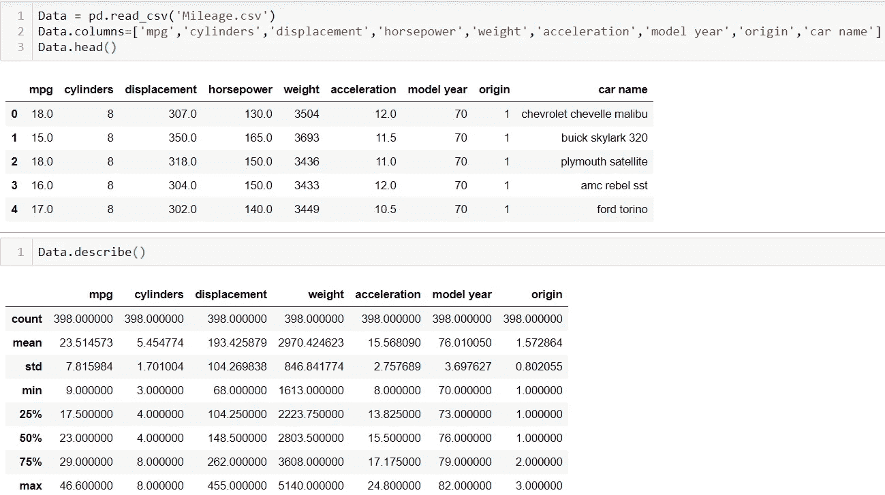
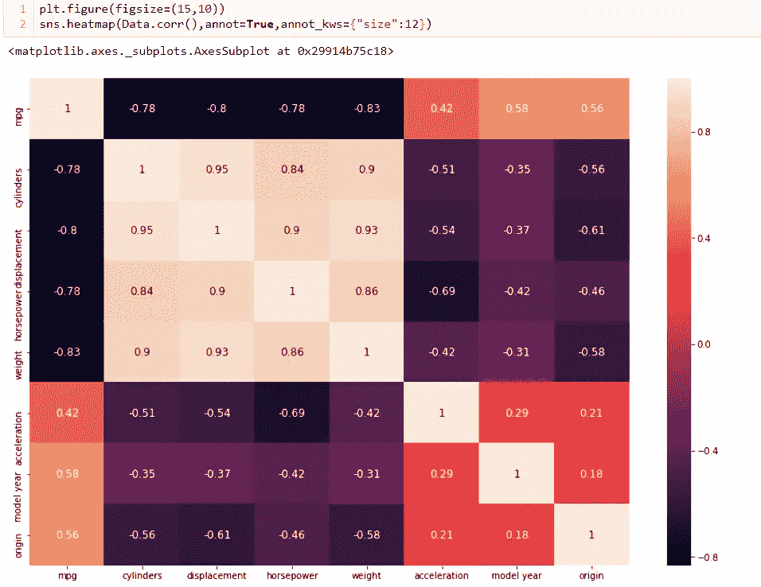
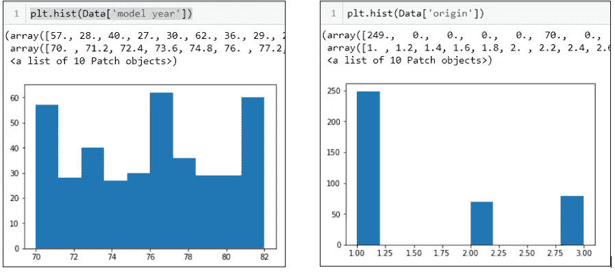
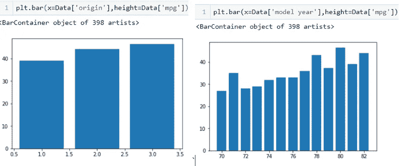
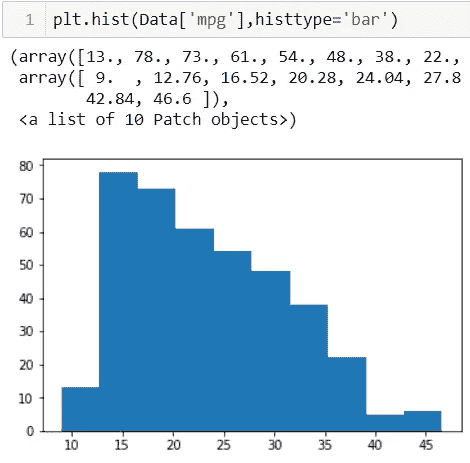
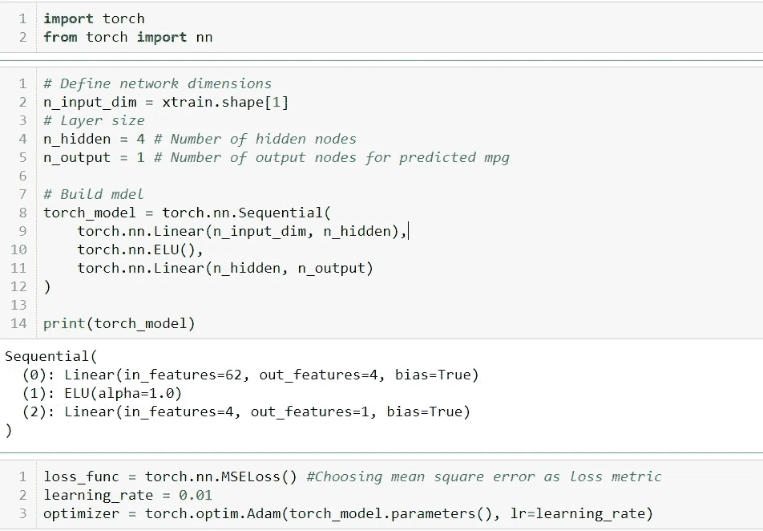
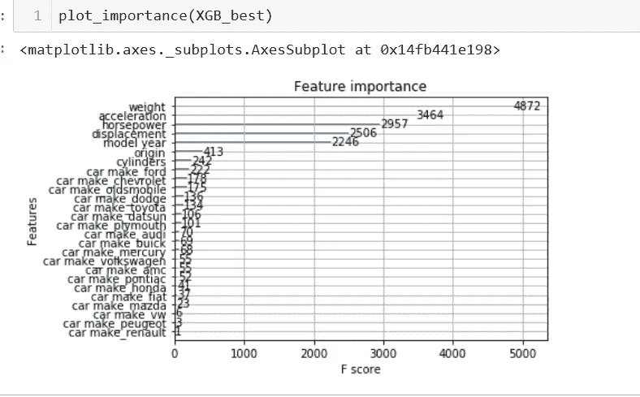

# 预测车辆燃油效率

> 原文：<https://towardsdatascience.com/predicting-vehicle-fuel-efficiency-c6065479a72f?source=collection_archive---------20----------------------->

## 比较 XGBoost(使用 GridSearchCV)和 PyTorch 神经网络来拟合回归模型，并根据汽车特征预测里程


米卡·鲍梅斯特在 [Unsplash](https://unsplash.com?utm_source=medium&utm_medium=referral) 上的照片

我的[以前的帖子](https://medium.com/@rangys3)关注的是机器学习和神经网络在石油行业数据集中的应用。这些努力让我有信心成功地实现 XGBoost 和人工神经网络，以预测我工作的炼油厂的重大安全隐患。我非常自豪的重大成功！

为了锻炼一些通用性，我想在这个应用程序中使用 PyTorch 和 GridSearchCV，首先想在一个更简单、更小的数据集上进行实践——即来自 UCI 资源库的 [Auto MPG 数据集。](https://archive.ics.uci.edu/ml/datasets/Auto%2BMPG)

和以前一样，我提出了一个分步的方法来确保系统化的应用:

**第一步** =在深入建模之前了解目标和大局。

**步骤 2** =加载并获得数据的高级洞察

**第三步** =进一步可视化以探索数据。目标:尽早了解最具杠杆作用的特性。

**第四步** =建模计划。这里的关键是为训练和测试模型准备好数据。

**步骤 5** =执行建模并评估性能。根据需要完成灵敏度分析

第六步 =从工作中得出结论，让最终用户受益

下面是 GitHub repo 中的代码片段和完整代码。

**第一步**:我们的目标是根据各种特征预测汽车的里程。通过建模工作，我们可以了解是什么使汽车高效，以及如何实现目标里程消耗。

**第二步:**将输入数据读入 Python 并使用。describe()，。head()函数获取关键的统计数据和初步的数据。我还想命名列，因为这在原始数据中是不可用的。



图 1:首先看看数据，有一些高层次的见解

高级外卖:

*   数据集的变量涵盖了很大范围的数字；如果我们使用像 kNN 这样的算法，这表明需要缩放。
*   似乎我们有连续变量和离散变量的混合，其中一个是非数字的。这表明需要某种编码。
*   有 398 个条目，平均里程为 23 英里，3 个可能的来源，5 个可能的车型年。

单独的检查(此处未显示)显示数据集的“马力”特征有 6 个空值。

**步骤 3a)** 将相关性绘制为 Seaborn 热图



图 2:皮尔逊相关系数的 Seaborn 热图

从上面可以得出什么结论？

*   车重和排量与里程负相关最强。很好地符合直觉，大型悍马不是最有效的汽油使用者
*   马力和气缸数也与里程数呈强烈的负相关关系——这也符合快速跑车比轿车需要更多汽油的直觉
*   汽车产地和车型年份是分类数字变量，让我们用柱状图来形象化这些变量。

出于建模的目的，我将首先使用所有这些特性。然而，如果我想要一个更紧凑的特征集来防止任何潜在的过度拟合，我可以删除气缸/排量/汽车重量(给定高相关系数)。

**步骤 3b)** 让我们使用柱状图了解更多关于分类数字特征的信息:



图 3:汽车产地和车型年的直方图

从图 3 直方图得出的结论:原产地 1 的汽车更具代表性，这表明 mpg 结果更适合该原产地——无论原产地可能代表什么，例如制造国。我们注意到车型年份分布在 12 年中，1970、1976、1982 比其他年份更有代表性。

这些数字分类变量应该被编码吗？



图 4:汽车产地和车型年与 mpg 的柱状图

从图 4 柱状图得出的结论:mpg 随着汽车来源数量的增加而略微增加。对于车型年来说，相关性更少，但是现在，我不会对这些变量进行编码。我不介意保留这些特性。

**步骤 3c)** 上面的分析让我对因变量(即目标，即我们试图预测的东西)产生了好奇。这是向哪个方向倾斜的吗？下面的图 4 显示了特征的右偏度，表明**我们可能想要对特征数据进行对数转换，以用于建模。**



图 mpg 的直方图

**步骤 4:** 除了做更多的数据准备和为建模创建测试/训练集，我还将设置 GridSearch CV

**4a)** 输入缺失数据并创建训练和测试集。还要对汽车品牌进行编码，去掉汽车型号——因为后者是无关的细节。

```
**# The code below one-hot encodes car make and drops car model.**Data['car make'] = Data['car name'] 
Data['car make'] = Data['car name'].apply(lambda x: x.split()[0])Data.drop(columns=['car name'],inplace=True)Data = pd.get_dummies(Data,columns=['car make'])**# Next: creating x and y below**x_no_log = Data.drop(columns=['mpg'])
y_no_log = Data['mpg']**# Imputing missing car horsepower values.**imp = SimpleImputer(missing_values=np.nan,strategy='median')
x_no_log['horsepower'] = imp.fit(x_no_log['horsepower'].values.reshape(-1, 1)).transform(x_no_log['horsepower'].values.reshape(-1, 1))
```

**4b)** 设置 GridSearchCV——这允许我们循环遍历超参数，根据所选评分指标(在我的例子中为均方差)找到最佳组合。GitHub repo 对 RandomForest 进行了类似的操作。

```
xgb_params = {'nthread':[4], 
              'learning_rate': [.03, 0.05, .07], 
              'max_depth': [5, 6, 7],
              'min_child_weight': [4],
              'subsample': [0.7],
              'colsample_bytree': [0.7],
              'n_estimators': [500,1000]}
```

**4c)** 设置 PyTorch —下面的代码导入必要的包，用输入维度、隐层节点数和输出节点设置神经网络，然后构建模型。

我还将均方误差声明为优化的损失度量，我将在测试集上评估 XGBoost 和 RandomForest 的性能时使用相同的度量。

最后，设置 Adam 优化算法来操纵梯度下降函数，如下图 6 所示。



图 6:使用 PyTorch 的代码摘录

**5)** 所有设置完成后，是时候实际运行模型并评估结果了。

**5a)** 我将首先使用 GridCV 和之前设置的超参数网格，根据训练集中的性能找到性能最佳的 XGBoost 模型(GitHub repo 中对 RandomForest 进行了类似的练习)。

然后，我将训练创建的 PyTorch 神经网络

```
gsXGB = GridSearchCV(xgbr, xgb_params, cv = 7, scoring='neg_mean_squared_error', 
                     refit=True, n_jobs = 5, verbose=True)
gsXGB.fit(xtrain,ytrain)XGB_best = gsXGB.best_estimator_train_error = []
iters = 600Y_train_t = torch.FloatTensor(ytrain.values).reshape(-1,1) #Converting numpy array to torch tensorfor i in range(iters):
    X_train_t = torch.FloatTensor(xtrain.values)  ***#Converting numpy array to torch tensor***
    y_hat = torch_model(X_train_t)
    loss = loss_func(y_hat, Y_train_t)
    loss.backward()
    optimizer.step()
    optimizer.zero_grad()
```

**5c)** 模型训练完成后，我现在可以根据测试数据评估性能了。

```
**# Evaluating best-performing XGBoost model on testing data** ypred = XGB_best.predict(xtest)
explained_variance_score(ytest,ypred)
mean_absolute_error(ytest,ypred)
mean_squared_error(ytest,ypred,squared=True)**# Evaluating PyTorch model on testing data**
X_test_t = torch.FloatTensor(xtest.values) ***#Converting numpy array to Torch Tensor.***
ypredict = torch_model(X_test_t)
mean_squared_error(ytest,ypredict.detach().numpy(),squared=True)
```

通过超参数调整得到的 XGBoost 模型的均方误差为 **0.0117 mpg。**给定原始数据集中 23.5 mpg 的平均值，这可以解释为**99.9%的准确度**

PyTorch 神经网络的均方误差为 **0.107 mpg** 。使用上述方法，这可以转化为 99.5%的**准确度。**

我们为客户完成了什么？我们有一个模型可以预测各种汽车的燃料里程；我们的客户可以利用这一点来规划达到理想燃油效率水平的汽车。

此外，我们还可以告知我们的客户——根据下图 7——体重是预测里程数的最有影响力的变量，其次是加速度。马力、排量、加速度在影响上比较接近。



图 7:预测里程的特征重要性

有了这些细节，我们的客户可以计划未来的汽车生产或购买计划。

一如既往，我欢迎任何反馈。