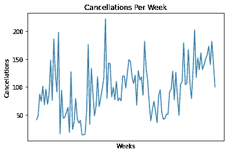
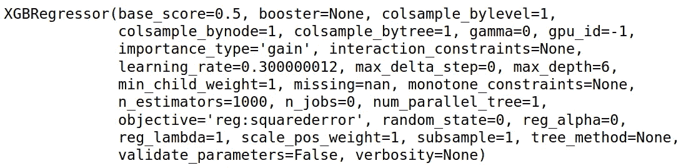

# 用 XGBRegressor 预测每周酒店取消预订

> 原文：<https://towardsdatascience.com/predicting-weekly-hotel-cancellations-with-xgbregressor-d73eb74a8624?source=collection_archive---------29----------------------->

## 基于 xgb 回归的时间序列预测


来源:照片由 [Yuri_B](https://pixabay.com/users/yuri_b-2216431/) 从 [Pixabay](https://pixabay.com/illustrations/space-rocket-night-cartoon-3262811/) 拍摄

XGBoost 最常用于基于分类或回归的问题，其中将特征合并到模型中以预测感兴趣的结果。

也就是说，XGBoost 也可以用于时间序列预测。这是通过使用感兴趣的时间序列的滞后作为模型中的独立特征来实现的。让我们看看如何使用 XGBRegressor 来帮助我们预测酒店取消预订。

# 数据处理

以下分析基于来自 [Antonio、Almeida 和 Nunes (2019)的数据:酒店预订需求数据集](https://www.sciencedirect.com/science/article/pii/S2352340918315191)。

使用 XGBoost 构建时间序列预测模型的目的是让酒店能够预测每周酒店取消预订的数量。



来源:Jupyter 笔记本输出

数据首先被分成训练和验证分区:

```
train_size = int(len(df) * 0.8)
val_size = len(df) - train_size
train, val = df[0:train_size,:], df[train_size:len(df),:]
```

假设我们正在使用一个基于[树的模型](https://github.com/dmlc/xgboost/issues/357)，在这个例子中，这些特性没有使用 MinMaxScaler 进行规范化。

形成数据集矩阵:

```
def create_dataset(df, previous=1):
    dataX, dataY = [], []
    for i in range(len(df)-previous-1):
        a = df[i:(i+previous), 0]
        dataX.append(a)
        dataY.append(df[i + previous, 0])
    return np.array(dataX), np.array(dataY)
```

然后为模型定义一个回望期，也就是说，当预测向前一步时，我们希望模型“回望”多少时间步？

首先，将使用一个 **5** 的回看周期。根据 RMSE(均方根误差)测量的精度，可以适当地修改回望周期。

```
lookback = 5
X_train, Y_train = create_dataset(train, lookback)
X_val, Y_val = create_dataset(val, lookback)
```

以下是 X_train 输出的示例:

```
array([[ 41.,  48.,  87.,  74., 101.],
       [ 48.,  87.,  74., 101.,  68.],
       [ 87.,  74., 101.,  68.,  96.],
       [ 74., 101.,  68.,  96.,  69.],
       [101.,  68.,  96.,  69.,  88.]
...
       [111.,  70.,  39.,  59.,  74.],
       [ 70.,  39.,  59.,  74.,  57.],
       [ 39.,  59.,  74.,  57.,  36.]])
```

# XGBRegressor

XGBRegressor 模型定义如下:

```
from xgboost import XGBRegressormodel = XGBRegressor(objective='reg:squarederror', n_estimators=1000)
model.fit(X_train, Y_train)
```

以下是定义的模型参数:



来源:Jupyter 笔记本输出

从上面我们可以看到，在训练 XGBRegressor 时，有许多模型参数可以修改。但是，在这种情况下，n_estimators 被设置为 1000。这定义了 XGBoost 模型中树的数量。目标设置为[‘reg:squarederror’](https://xgboost.readthedocs.io/en/latest/parameter.html)，即平方损失回归，对极值误差的惩罚更重。

该模型跨训练集和验证集进行训练:

```
>>> trainpred = model.predict(X_train)
>>> trainpredarray([ 68.00038 ,  95.99979 ,  69.00168 ,  88.00018 , 147.99892 ,
        76.000656, 185.99991 , 122.999306,  91.00025 , 197.99966 ,
...
       128.99901 , 111.99981 , 118.00009 ,  85.00055 , 181.99738 ,
       133.9994  , 111.001526,  70.00158 ,  39.0001  ,  58.99967 ,
        74.00109 ,  56.999626,  36.001102,  84.00235 ], dtype=float32)>>> valpred = model.predict(X_val)
>>> valpredarray([ 19.767576,  62.593506,  80.718994,  60.782364, 129.0691  ,
       112.3979  , 113.64816 ,  91.60748 , 105.40695 ,  62.221115,
       109.42688 , 126.32669 ,  94.05386 ,  62.81558 ], dtype=float32)
```

训练集和验证集(预测集和实际集)会相应地进行调整:

```
>>> Y_train=Y_train.reshape(-1,1)
>>> trainpred=trainpred.reshape(-1,1)>>> Y_val=Y_val.reshape(-1,1)
>>> valpred=valpred.reshape(-1,1)
```

# 结果

现在，在 RMSE(均方根误差)的基础上，将预测值与实际抵消值进行比较。

```
>>> train_mse = mean_squared_error(Y_train, trainpred)
>>> rmse = sqrt(train_mse)
>>> print('RMSE: %f' % rmse)RMSE: 0.000887>>> val_mse = mean_squared_error(Y_val, valpred)
>>> rmse = sqrt(val_mse)
>>> print('RMSE: %f' % rmse)RMSE: 50.142536
```

在验证集(Y_val)上平均每周有 109 个取消，RMSE 在验证集上达到 50.14。

我们看到，训练集的 RMSE 几乎为 0，但这并不被视为模型性能的基准。毕竟，预测模型已经训练过的数据是一项毫无意义的工作。

# 这些发现与 LSTM 相比如何？

还使用 5 的回望周期对上述数据运行了 LSTM 模型。

```
model = tf.keras.Sequential()
model.add(LSTM(4, input_shape=(1, lookback)))
model.add(Dense(1))
model.compile(loss='mean_squared_error', optimizer='adam')
history=model.fit(X_train, Y_train, validation_split=0.2, epochs=20, batch_size=1, verbose=2)
```

得到的 RMSE 如下:

```
>>> mse = mean_squared_error(Y_val, predictions)
>>> rmse = sqrt(mse)
>>> print('RMSE: %f' % rmse)RMSE: 36.792552
```

在这方面，当使用 LSTM 模型时，RMSE 低于 XGBoost，这表明 LSTM 在预测每周酒店取消方面做得稍好。然而，XGBoost 在预测每周取消时仍然表现出相当好的性能。

人们应该注意到，RMSE 对更极端值的错误惩罚更重。例如，如果某一周的取消量碰巧比正常情况高得多，而模型预测明显低估了这一点，那么这将导致更高的 RMSE。

作为参考，当使用 XGBRegressor 时，平均绝对误差在 **38** 处略低，表明该模型在预测不太极端的值时表现更好。

# 结论

在本例中，我们看到:

*   如何使用 XGBRegressor 预测时间序列
*   准备数据以使用 XGBoost 模型
*   测量模型精度的方法

非常感谢您的宝贵时间，非常感谢您的任何问题或反馈。

你可以在这里找到这个例子[的 Jupyter 笔记本。](https://github.com/MGCodesandStats/hotel-cancellations)

此外，我强烈推荐下面的[机器学习掌握](https://machinelearningmastery.com/xgboost-for-time-series-forecasting/)教程，以进一步了解 XGBRegressor 的使用。

*免责声明:本文是在“原样”的基础上编写的，没有任何担保。本文旨在提供数据科学概念的概述，不应被解释为任何形式的专业建议。作者与本文提及的任何第三方无任何关系。*