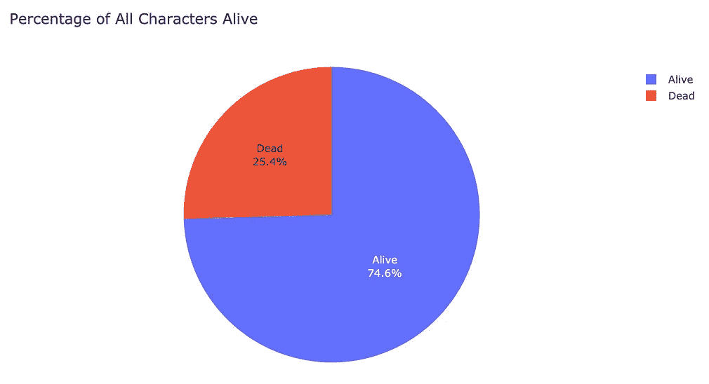

# 利用机器学习预测《权力的游戏》中谁会死

> 原文：<https://towardsdatascience.com/predicting-who-will-die-in-game-of-thrones-using-machine-learning-6c41c0ba897e?source=collection_archive---------52----------------------->

来自 [Pixabay](https://pixabay.com/) 的 [SilentPilot](https://pixabay.com/users/silentpilot-1897260/) 摄影

## “我们该对死神说什么？”

HBO 的《权力的游戏》中的死亡显然是不可预测的。角色死于被龙刺穿、斩首、爆炸，甚至烧烤。但是这些死亡有多不可预测呢？

这篇文章将着眼于使用书中的数据预测《权力的游戏》中的死亡，使用从[一个冰与火的维基](https://awoiaf.westeros.org/index.php/Main_Page)中搜集的数据。也可以在 [Kaggle](https://www.kaggle.com/mylesoneill/game-of-thrones) 上找到数据。

# **导入库**

第一件事是导入我们将使用的所有 Python 和 *Scikit-learn* 库。 *Plotly* 是一个构建交互式可视化的伟大工具。

# **探索数据**

该数据有 1946 行和 39 列。首先，让我们看看有百分之多少的人物是活着的。

我们看到将近 75%的角色都活着。还有哪些因素会影响死亡率？再来看性别。

看起来雄性比雌性更容易被杀死。

接下来让我们看看最危险的房子，通过除以房子的大小来计算房子的死亡率。

人物死亡最多的房屋(或群体)是:

*   未知(332)
*   豪斯·弗雷(83)
*   守夜人(60)
*   史塔克家族(50)

一个角色不在书里却在剧里怎么办？它们的存在是为了最终被杀死吗？让我们检查一下这个假设。

只显示角色有大约 20%的几率死亡！

既然我们已经知道了哪些因素可能会增加某人的死亡几率，那么让我们开始清理数据吧。

# **清理数据**

让我们检查一下其他的数字变量。年龄和出生日期是相关的，所以绘制它们应该显示相同的趋势。

看起来有两个字符的年龄为负，这也导致了出生日期列中的异常值。我们将不得不手动修复这些异常值。

这些情节现在没有异常值，但是有几个角色缺少年龄和生日。

让我们用它们的中间值来估算两者。

对于分类变量，让我们用字符串“未知”来估算缺失值

检查空值表明我们不再有任何丢失的值:

# 机器学习模型

首先让我们得到与活着高度相关的列。

您可以随意更改该阈值，但是在这种情况下，使用 0.2 左右的阈值可以获得最佳结果。

让我们定义一个仅由这些列以及目标列组成的新数据帧。

接下来，我们将把数据集分成 80%用于训练，20%用于测试。

## **逻辑回归**

这种分类器通常用于只有两个类值(在我们的例子中是活的或不活的)的二元分类问题。它将输出一组基于概率的类。

Logistic 回归给出了一个:

*   模型得分为 0.9615
*   训练得分 0.9615
*   测试分数为 0.9524

## 决策图表

决策树在一个标准(如男性或女性)上创建分裂点，因此每个分支导致一个实例的分类。

决策树分类器给出了:

*   训练得分为 1 分(哦，可能过度适应)
*   测试得分为 0.9282

## 随机搜索

随机化和网格搜索通过尝试固定数量的设置来优化分类器的超参数。用于预测的参数也通过交叉验证进行优化。

得到的一些最佳随机森林参数是:

*   n _ 估计数:600(数字估计数)
*   min_samples_split: 4(每次分割的最小样本数)
*   max_depth: 6=50(树的最大深度)

## 随机森林

现在我们有了最佳超参数，我们可以比较基尼和熵随机森林模型。首先，我们来试试基尼。

基尼给出:

*   训练得分 0.9647
*   测试得分为 0.9564
*   AUC 分数为 0.9373

将标准改为“熵”给出:

*   训练得分 0.9647
*   测试得分为 0.9564
*   AUC 分数为 0.9363

测试精度是相同的，所以现在让我们用基尼。

**什么特征最重要？**

不出所料，来自危房增加了某人死亡的风险。增加风险的其他因素有:

*   一个只表演的角色
*   男性的
*   流行的
*   年长的
*   在第一册和/或第四册中
*   从一个大房子

# 结论

我们可以通过流行度排序来检查最重要的模型结果。

模型结果，按受欢迎程度百分比排序

我们看到，模型 ***正确地*** 预测了*(剧透提前)*认为:

*   罗柏·史塔克会死的
*   玛格丽·提利尔会死
*   伊里斯·坦格利安(疯狂的国王)会死
*   史坦尼斯·拜拉席恩会死的
*   山姆威尔·塔利会活下来

**模型*错误地*预测到:**

*   托曼·拜拉席恩会活下来
*   乔佛里·拜拉席恩会活下来
*   瓦德·佛雷会活下来

为了排序，我们可以根据测试精度对我们使用的模型进行如下排序:

1.  优化随机森林(Gini): 95.64%
2.  基线随机森林(基尼系数):95.13%
3.  基线随机森林(熵):94.36%
4.  逻辑回归分析:95.24%
5.  决策树分类器:92.82%

**使用 Gini 作为我们的最终模型，我们得到的最终测试精度为 0.9564。**

这个模型只准确到第六季左右，之后有许多写作的变化，这部剧已经走上了不同于原著的时间线。

你怎么看待人物死亡的风险因素？