# 用几种分类技术预测葡萄酒质量

> 原文：<https://towardsdatascience.com/predicting-wine-quality-with-several-classification-techniques-179038ea6434?source=collection_archive---------0----------------------->

## 带代码的数据科学项目演练！

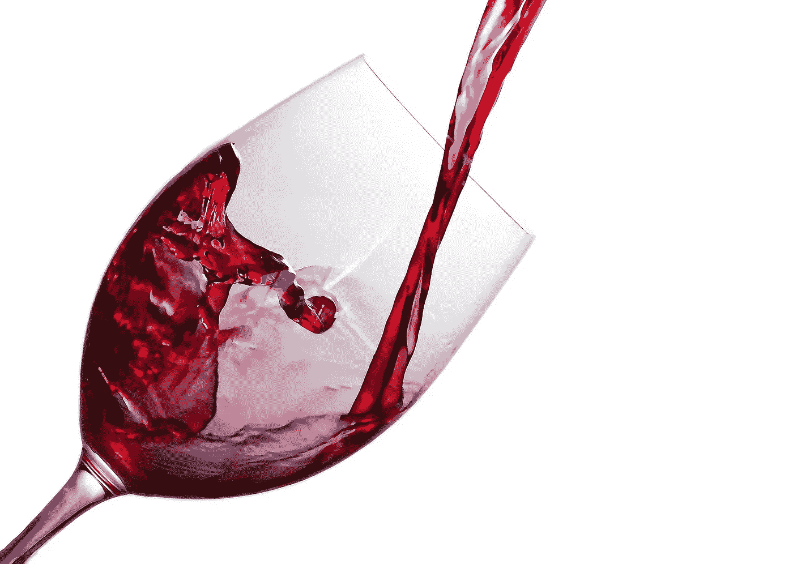

图片由来自 [Pixabay](https://pixabay.com/?utm_source=link-attribution&utm_medium=referral&utm_campaign=image&utm_content=1543170) 的 [Aline Ponce](https://pixabay.com/users/ponce_photography-2473530/?utm_source=link-attribution&utm_medium=referral&utm_campaign=image&utm_content=1543170) 拍摄

> **请务必点击** [**订阅此处**](https://terenceshin.medium.com/membership) **或我的** [**个人简讯**](https://terenceshin.substack.com/embed) **千万不要错过另一篇关于数据科学指南、技巧和提示、生活经验等的文章！**

# 目录

1.  [简介](#ad59)
2.  [设置](#30ac)
3.  [探索变量](#f05d)
4.  [转化为分类问题](#ca0a)
5.  [准备建模数据](#8334)
6.  [造型](#e0dc)
7.  [功能重要性](#98be)

# 介绍

随着隔离的继续，我有了一些爱好和兴趣…包括葡萄酒。最近，我喜欢上了葡萄酒，尽管我并不知道什么是好酒。因此，我决定应用一些机器学习模型来弄清楚是什么造就了优质的葡萄酒！

对于这个项目，我使用了 Kaggle 的[红酒质量](https://www.kaggle.com/uciml/red-wine-quality-cortez-et-al-2009)数据集来建立各种分类模型，以预测某一特定红酒是否“质量好”。该数据集中的每种葡萄酒都被赋予 0 到 10 之间的“质量”分数。出于这个项目的目的，我将输出转换为二进制输出，其中每种葡萄酒要么是“优质”(7 分或更高)，要么不是(低于 7 分)。葡萄酒的质量由 11 个输入变量决定:

1.  固定酸度
2.  挥发性酸度
3.  柠檬酸
4.  残糖
5.  氯化物
6.  游离二氧化硫
7.  二氧化硫总量
8.  密度
9.  pH 值
10.  硫酸盐化
11.  酒精

## 目标

该项目的目标如下

1.  尝试不同的分类方法，看看哪种分类方法的准确度最高
2.  确定哪些特征最能代表优质葡萄酒

说到这里，我们开始吧！

> **请务必在此** [**订阅**](https://terenceshin.medium.com/membership) **或我的** [**个人简讯**](https://terenceshin.substack.com/embed) **千万不要错过另一篇关于数据科学指南、技巧和提示、生活经验等的文章！**

# 设置

首先，我导入了我将使用的所有相关库以及数据本身。

## 导入库

```
import numpy as np
import pandas as pd
import matplotlib as plt
import seaborn as sns
import plotly.express as px
```

## 读取数据

```
df = pd.read_csv("../input/red-wine-quality-cortez-et-al-2009/winequality-red.csv")
```

## 理解数据

接下来，我想更好地了解我在做什么。

```
# See the number of rows and columns
print("Rows, columns: " + str(df.shape))# See the first five rows of the dataset
df.head()
```

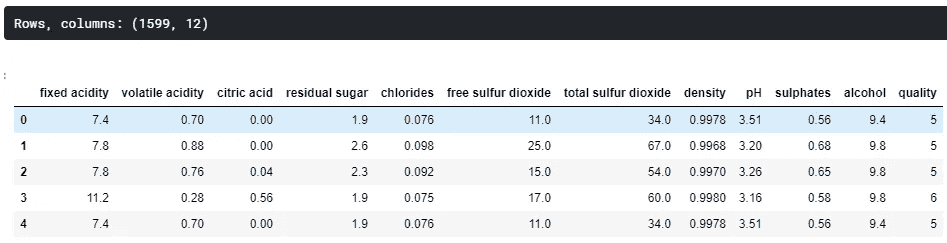

总共有 1599 行和 12 列。通过查看前五行，数据看起来非常干净，但是我仍然想确保没有丢失值。

## 缺少值

```
# Missing Values
print(df.isna().sum())
```

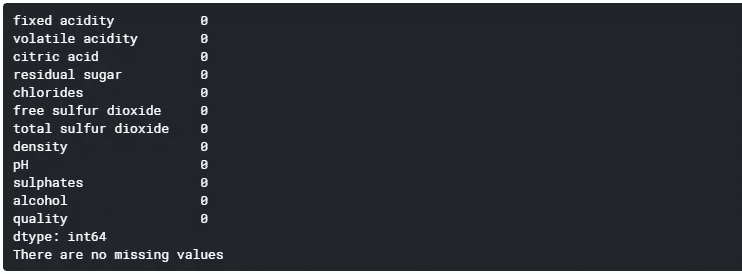

这是一个非常适合初学者的数据集。我不需要处理任何丢失的值，而且在给定这些变量的情况下，也没有太多的灵活性来进行一些特性工程。接下来，我想进一步探索我的数据。

# 探索变量

## “质量”变量直方图

首先，我想看看*质量*变量的分布。我想确保我的数据集中有足够多的“优质”葡萄酒——稍后你会看到我是如何定义“优质”的。

```
fig = px.histogram(df,x='quality')
fig.show()
```

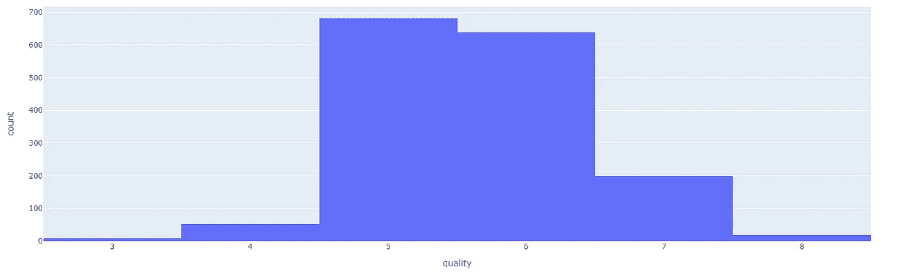

## 相关矩阵

接下来，我想看看我正在处理的变量之间的相关性。这让我可以很快更好地理解变量之间的关系。

我立即发现了一些与*质量密切相关的变量。*很可能这些变量也是我们的机器学习模型中最重要的特征，但我们稍后再看。

```
corr = df.corr()
matplotlib.pyplot.subplots(figsize=(15,10))
sns.heatmap(corr, xticklabels=corr.columns, yticklabels=corr.columns, annot=True, cmap=sns.diverging_palette(220, 20, as_cmap=True))
```

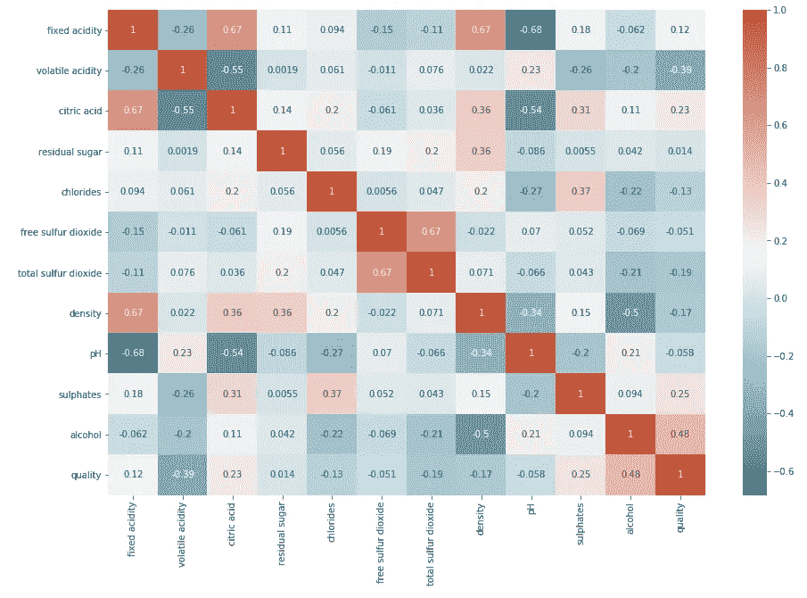

> **请务必** [**订阅此处**](https://terenceshin.medium.com/membership) **或我的** [**个人简讯**](https://terenceshin.substack.com/embed) **千万不要错过另一篇关于数据科学指南、技巧和提示、生活经验等的文章！**

# 转化为分类问题

回到我的目标，我想比较不同分类技术的有效性，所以我需要将输出变量改为二进制输出。

对于这个问题，我将一瓶葡萄酒定义为质量分数为 7 分或更高的为“质量好”，如果分数低于 7 分，则视为“质量差”。

一旦我将输出变量转换成二进制输出，我就将我的特征变量(X)和目标变量(y)分离成单独的数据帧。

```
# Create Classification version of target variable
df['goodquality'] = [1 if x >= 7 else 0 for x in df['quality']]# Separate feature variables and target variable
X = df.drop(['quality','goodquality'], axis = 1)
y = df['goodquality']
```

## 好酒与劣酒的比例

我想确保有合理数量的优质葡萄酒。根据下面的结果，这似乎是一个公平的数字。在某些应用中，如果数据极度不平衡，可能需要重新采样，但我认为这样做没问题。

```
# See proportion of good vs bad wines
df['goodquality'].value_counts()
```

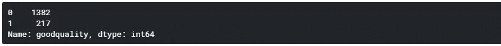

# 为建模准备数据

## 标准化特征变量

在这一点上，我觉得我已经准备好了建模的数据。我做的第一件事是标准化数据。**标准化**数据意味着它将转换数据，使其分布的平均值为 0，标准差为 1。为了均衡数据范围，标准化数据非常重要。

例如，假设数据集有两个输入要素:以毫米为单位的身高和以磅为单位的体重。因为“身高”的值由于其测量而要高得多，所以更强调身高而不是体重，这就产生了偏见。

```
# Normalize feature variables
from sklearn.preprocessing import StandardScaler
X_features = X
X = StandardScaler().fit_transform(X)
```

## 分割数据

接下来，我将数据分成训练集和测试集，这样我就可以交叉验证我的模型，并确定它们的有效性。

```
# Splitting the data
from sklearn.model_selection import train_test_split
X_train, X_test, y_train, y_test = train_test_split(X, y, test_size=.25, random_state=0)
```

现在，有趣的部分来了！

# 系统模型化

对于这个项目，我想比较五种不同的机器学习模型:决策树、随机森林、AdaBoost、Gradient Boost 和 XGBoost。为了这个项目的目的，我想比较这些模型的准确性。

## 模型 1:决策树

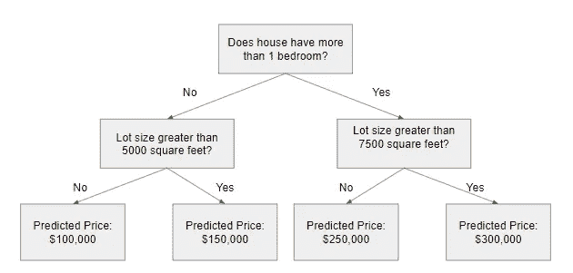

作者创建的图像

决策树是一种流行的模型，用于运筹学、战略规划和机器学习。上面的每个方块称为一个节点，节点越多，你的决策树就越精确(一般来说)。决策树的最后节点，也就是做出决策的地方，被称为树的叶子。决策树直观且易于构建，但在准确性方面有所欠缺。

```
from sklearn.metrics import classification_report
from sklearn.tree import DecisionTreeClassifiermodel1 = DecisionTreeClassifier(random_state=1)
model1.fit(X_train, y_train)
y_pred1 = model1.predict(X_test)print(classification_report(y_test, y_pred1))
```

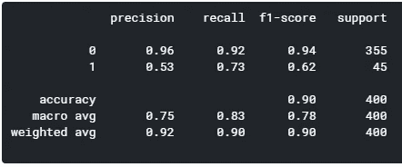

## 模型 2:随机森林

随机森林是一种基于决策树的[集成学习](https://en.wikipedia.org/wiki/Ensemble_learning)技术。随机森林包括使用原始数据的[自举数据集](https://machinelearningmastery.com/a-gentle-introduction-to-the-bootstrap-method/)创建多个决策树，并在决策树的每一步随机选择一个变量子集。然后，该模型选择每个决策树的所有预测的模式。这有什么意义？依靠“多数获胜”模型，它降低了单个树出错的风险。


作者创建的图像

例如，如果我们创建一个决策树，第三个，它会预测 0。但是如果我们依赖所有 4 个决策树的模式，预测值将是 1。这就是随机森林的力量。

```
from sklearn.ensemble import RandomForestClassifier
model2 = RandomForestClassifier(random_state=1)
model2.fit(X_train, y_train)
y_pred2 = model2.predict(X_test)print(classification_report(y_test, y_pred2))
```

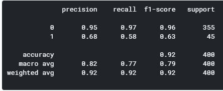

## 模型 3: AdaBoost

接下来的三个模型是提升算法，将弱学习者转化为强学习者。我不想跑题，解释三者之间的区别，因为这是相当复杂和错综复杂的。也就是说，我将留下一些资源，您可以从中了解 AdaBoost、渐变增强和 XGBoosting。

*   StatQuest: AdaBoost
*   [StatQuest:梯度推进](https://www.youtube.com/watch?v=3CC4N4z3GJc)
*   [StatQuest: XGBoost](https://www.youtube.com/watch?v=OtD8wVaFm6E)

```
from sklearn.ensemble import AdaBoostClassifier
model3 = AdaBoostClassifier(random_state=1)
model3.fit(X_train, y_train)
y_pred3 = model3.predict(X_test)print(classification_report(y_test, y_pred3))
```

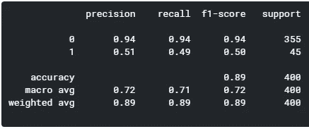

## 模型 4:梯度推进

```
from sklearn.ensemble import GradientBoostingClassifier
model4 = GradientBoostingClassifier(random_state=1)
model4.fit(X_train, y_train)
y_pred4 = model4.predict(X_test)print(classification_report(y_test, y_pred4))
```

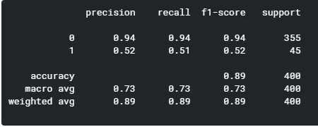

## 模型 5: XGBoost

```
import xgboost as xgb
model5 = xgb.XGBClassifier(random_state=1)
model5.fit(X_train, y_train)
y_pred5 = model5.predict(X_test)print(classification_report(y_test, y_pred5))
```

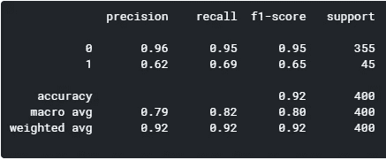

通过比较这五个模型，random forest 和 XGBoost 似乎产生了最高级别的准确性。然而，由于 XGBoost 在预测优质葡萄酒方面有更好的 f1 分数(1)，我的结论是 XGBoost 是五个模型中的赢家。

# 特征重要性

下面，我根据随机森林模型和 XGBoost 模型绘制了特性的重要性。虽然它们略有不同，但前三个特征是相同的:酒精、挥发性酸度和硫酸盐。如果你看下面的图表，我把数据集分成质量好的和质量差的两类，以便更详细地比较这些变量。

## 通过随机森林

```
feat_importances = pd.Series(model2.feature_importances_, index=X_features.columns)
feat_importances.nlargest(25).plot(kind='barh',figsize=(10,10))
```

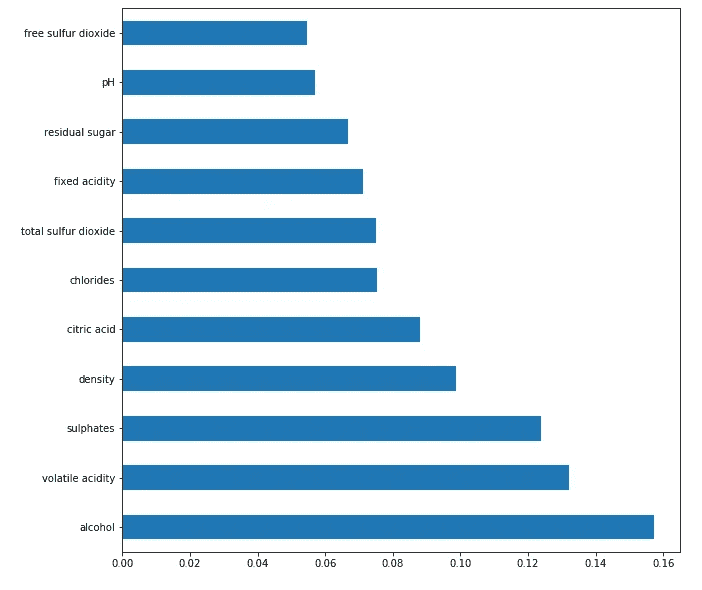

## 通过 XGBoost

```
feat_importances = pd.Series(model5.feature_importances_, index=X_features.columns)
feat_importances.nlargest(25).plot(kind='barh',figsize=(10,10))
```


## 比较四大特征

```
# Filtering df for only good quality
df_temp = df[df['goodquality']==1]
df_temp.describe()# Filtering df for only bad quality
df_temp2 = df[df['goodquality']==0]
df_temp2.describe()
```

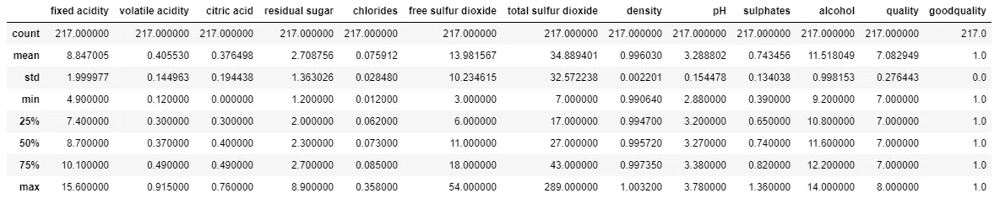

好品质

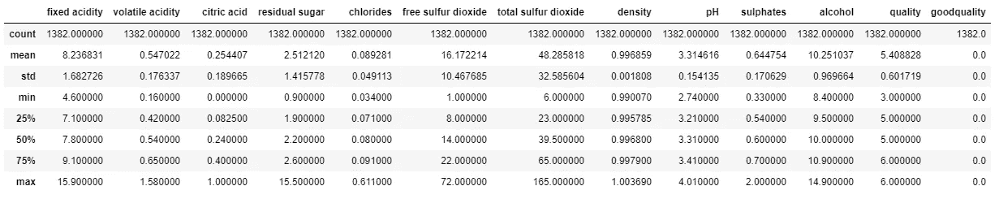

劣等质量

**通过观察细节，我们可以看到，优质葡萄酒的平均酒精含量较高，平均挥发性酸度较低，平均硫酸盐含量较高，平均残糖含量较高。**

# 感谢阅读！

如果你喜欢我的工作并想支持我，我会非常感谢你在我的社交媒体频道上关注我:

1.  支持我的最好方式是在**媒体**T10【这里上关注我。
2.  在**推特**关注我[这里](https://twitter.com/terence_shin)。
3.  点击这里订阅我的新 **YouTube 频道** [。](https://www.youtube.com/channel/UCmy1ox7bo7zsLlDo8pOEEhA?view_as=subscriber)
4.  在 **LinkedIn** 上关注我[这里](https://www.linkedin.com/in/terenceshin/)。
5.  在我的**邮箱列表** [这里](https://forms.gle/UGdTom9G6aFGHzPD9)报名。
6.  查看我的网站[**terenceshin.com**](https://terenceshin.com/)。