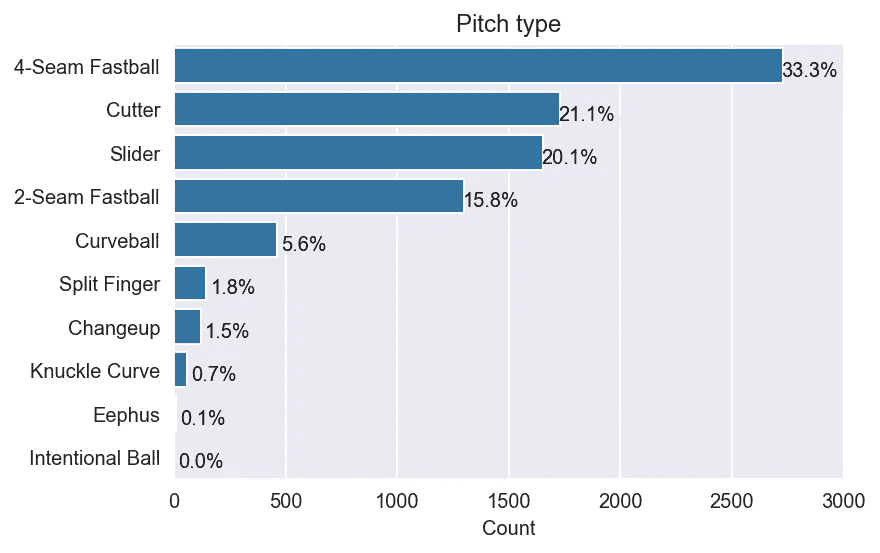
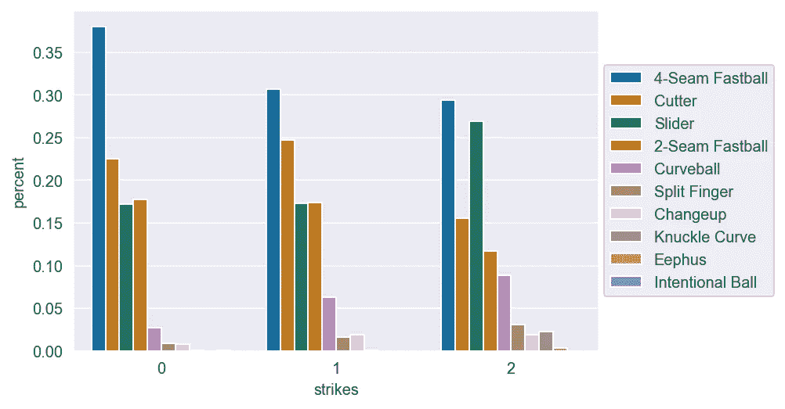
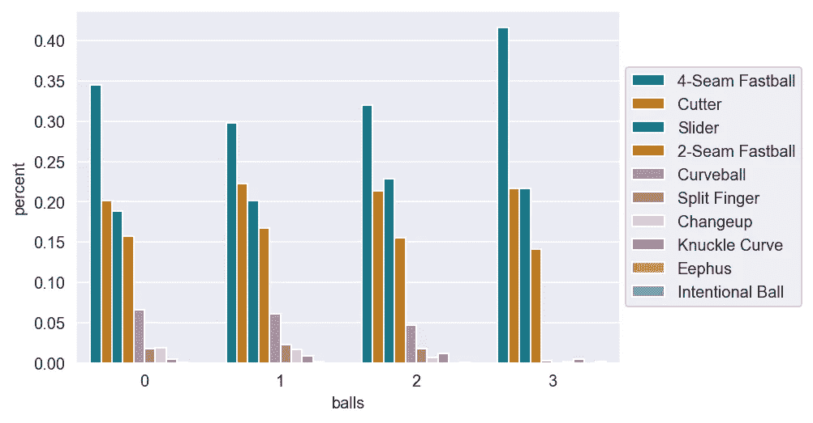
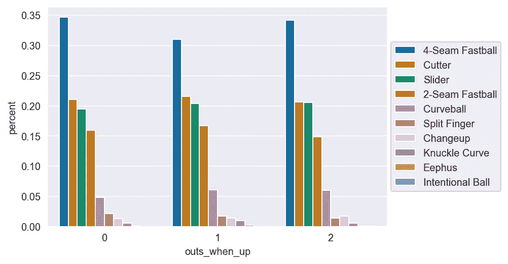
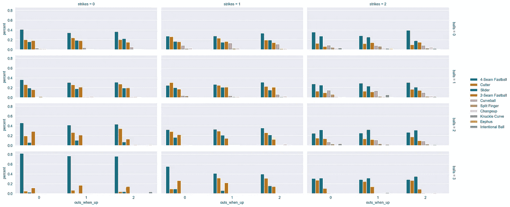
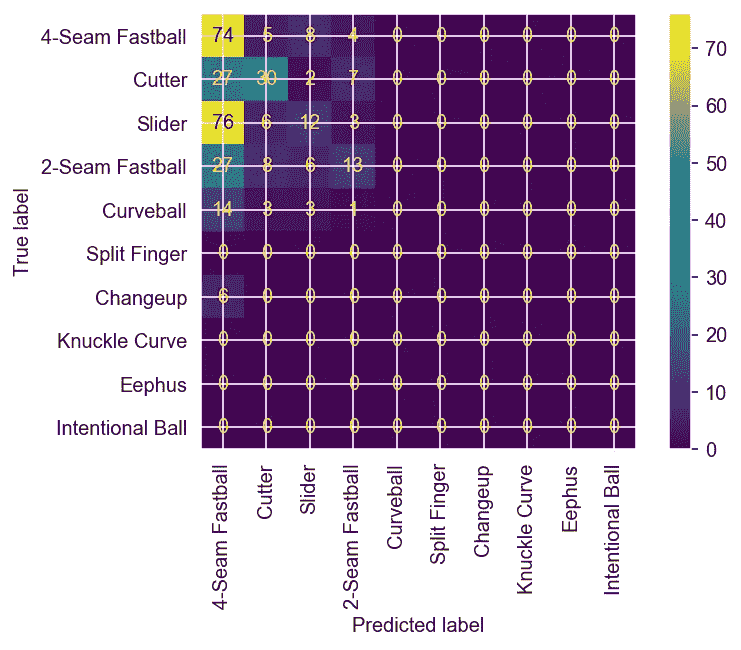

# 预测于达维什投球不砸垃圾桶

> 原文：<https://towardsdatascience.com/predicting-yu-darvishs-pitching-without-hitting-the-trash-can-779903507faa?source=collection_archive---------75----------------------->

## 使用机器学习来猜测他的下一个投球


作者图片

# 介绍

据报道，一桩丑闻震惊了棒球界，太空人队在 2017 赛季期间使用电子设备窃取了对方球队的标志，包括世界职业棒球大赛，最终他们赢得了冠军。俞达维是受害者之一。他有一个稳定的常规赛，他在季后赛早期为狗队投得非常好。然而，在世界系列赛对阵太空人的比赛中，事情发生了变化。他在两场比赛的 3.1 局中失了 9 分，包括第七场比赛，当时他在 1.2 局中投了 47 球，失了 5 分，为太空人队赢得了最后的胜利。球迷责怪他，赛季结束后他被交易到小熊队。

两年后，太空人用相机偷了他的投球手势，并在比赛期间敲垃圾桶暗示击球手。所以基本上击球手知道达维什要投什么球，这可能是他在世界大赛中比其他球队表现差的原因。(背景故事:[https://www . the ringer . com/MLB/2020/3/9/21170990/astros-sign-stealing-dodgers-world-series-Yu-darvish-Clayton-kershaw](https://www.theringer.com/mlb/2020/3/9/21170990/astros-sign-stealing-dodgers-world-series-yu-darvish-clayton-kershaw))

我很好奇有没有必要用摄像头非法盗签，有没有可能根据他的投球历史推断出他的投球？

在这次调查中，我想回答以下问题:
1 .他最擅长投哪种类型的球？
2。当他需要好球时，他投的是什么类型的球？(二击三球情况)
3。他在不同的情况下有不同的投球策略吗(0 打 0 球，2 打 3 球…，出局，一局等)。
4。有没有可能根据他的投球历史训练一个机器学习模型来预测他的投球？

# 探索性数据分析

## 资料组

用于分析的数据集包含 8221 个来自于 Darvish 的音高。数据是从 https://baseballsavant.mlb.com/下载，并为调查争论不休。
另一个数据集包含他的 2017 年季后赛数据，用来测试模型。

## 音调击穿



图 1 他的音高变化。

他口袋里有很多武器，总共 9 种音高类型。他投出 33.3%的 4 缝线和 15.8%的 2 缝线快速球，21.1%的切球和 20%的滑球。他使用他的曲球，手指分开，变速球，指节曲线和低于 10%的 ephus。

现在让我们来分析他在不同比赛条件下的投球。

## 罢工



图 2 不同打击条件下他的音高变化。

当没有好球时，他增加他的四缝线快速球百分比，当有两个好球时，他增加他的滑球。他似乎也增加了 2 击时的破发率

## 球



图 3 他在不同球况下的投球分解。

除了 3 球以外，在不同球况下没有非常明显的差异。他倾向于使用四缝线快速球，避免使用弧线球、指叉球和变速球。

## 在外

出局怎么样？他投球不同吗？



图 4 他在不同出局数的音高变化。

嗯，不太清楚是否有显著差异。

让我们把好球和出局结合起来。



图 5 他在不同击球、球和界外球时的投球情况。

该图对不同的条件进行了更深入的探究。比如他在面对 2 击 0 球的时候，还是倾向于投 4 缝快球，但是球多了，他就增加了他的滑球百分比。

这个数字可能是有用的参考，但是，它只考虑了三个特点，罢工，球和出局。让我们尝试建立一个机器模型，以包括用于预测的其他特征。

# 机器学习模型

在特征工程之后，我加入了之前投球的结果，以及每场比赛的投球数。结合数据集中的一些原始特征，我对模型使用了以下特征，并对分类变量进行了一次性编码。

```
str_list=['stand', 'pre_description','pre_pitch']
num_list=['balls','strikes','outs_when_up','inning',
        'home_away', 'score', 'other_score', 'score_diff',
 'pre_speed','pre_hd', 'pre_l_s', 'pre_l_a','on_3b', 'on_2b','on_1b','p_count']
```

2017 年季后赛的结果将用于测试模型，因此我用一个天真的猜测建立了一个基线。我选择他在训练数据集中投得最多的 4 缝线快速球作为测试数据集的预测，并与实际投球进行比较。我得到了 27.16%的准确率。

## 结果

我建立了一个随机森林模型来预测结果，没有太多的调整，通过交叉验证，我得到了 36.20 +/- 5%的准确率，在测试数据集上的准确率为 37.31%。



随机森林预测的混淆矩阵。

基于混淆矩阵，模型误预测了很多滑球到 4 缝线快速球。尽管这个数字看起来很低，但仍然比一个天真的猜测高出 30%。

# **结论**

随机森林模型提供了比天真猜测(27%)更好的预测(37%)，但是仍然不能完美地预测他的音高。我认为仍有改进的空间，例如，更好的特征工程，或包括特定击球手的投球历史。但我认为不可预测的球场是他成为伟大球员的原因之一。而棒球的不可预测性真的是棒球比赛的乐趣所在。