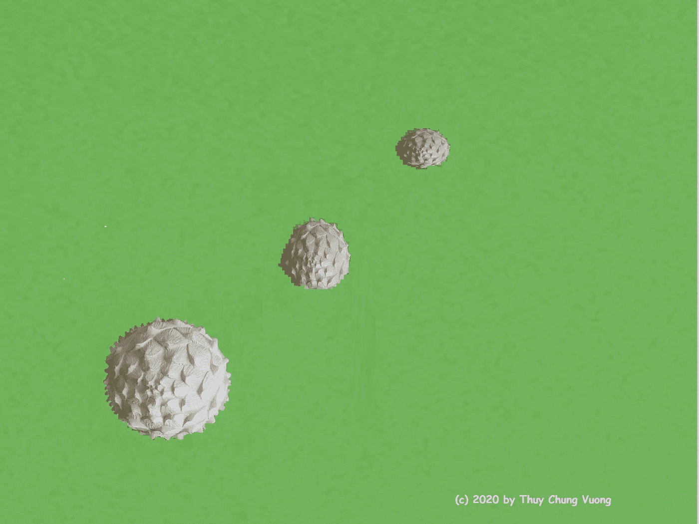
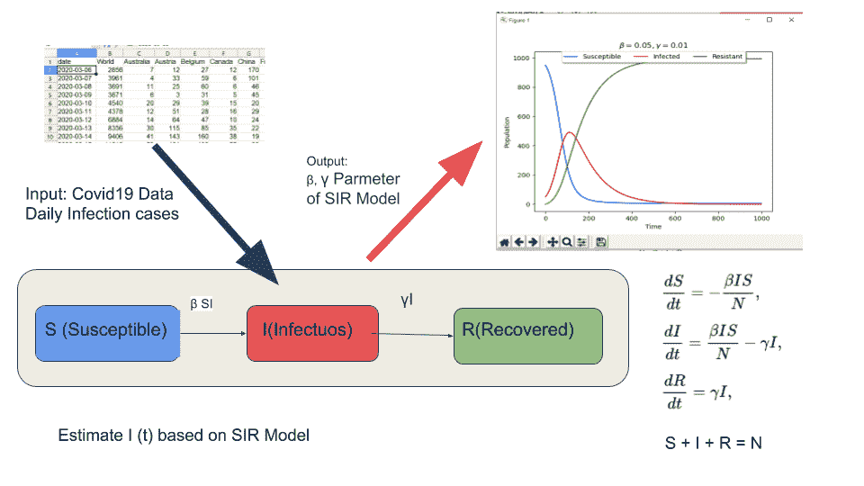
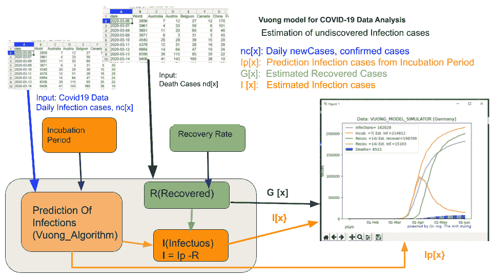
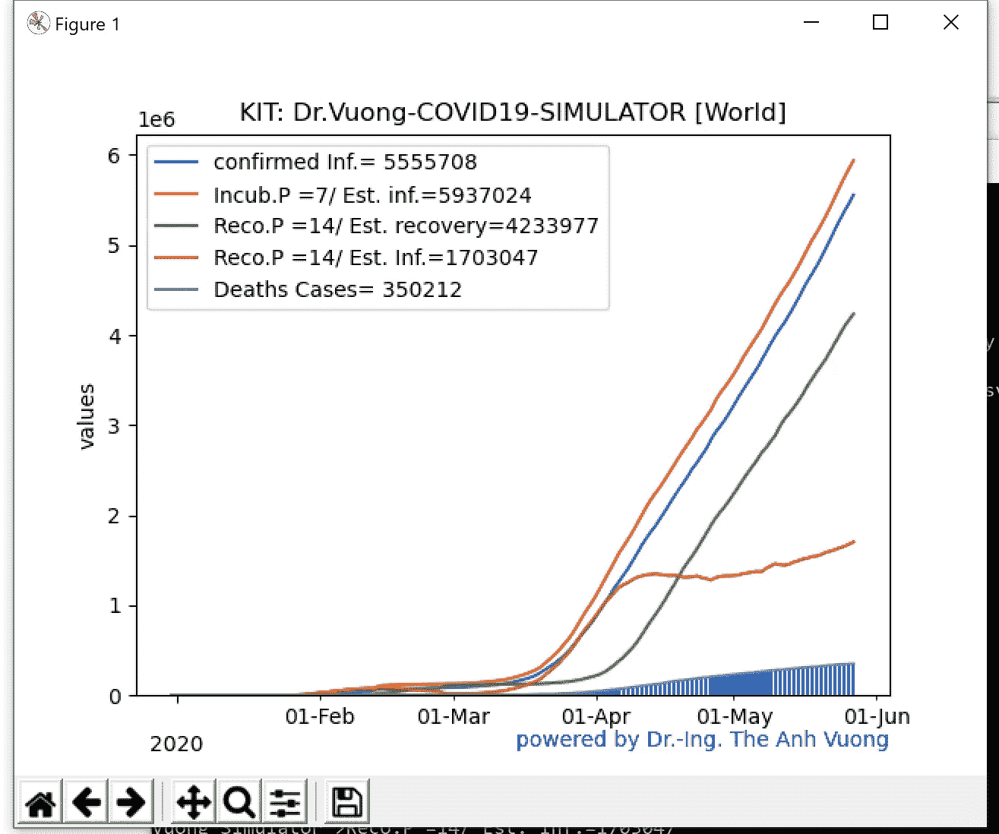
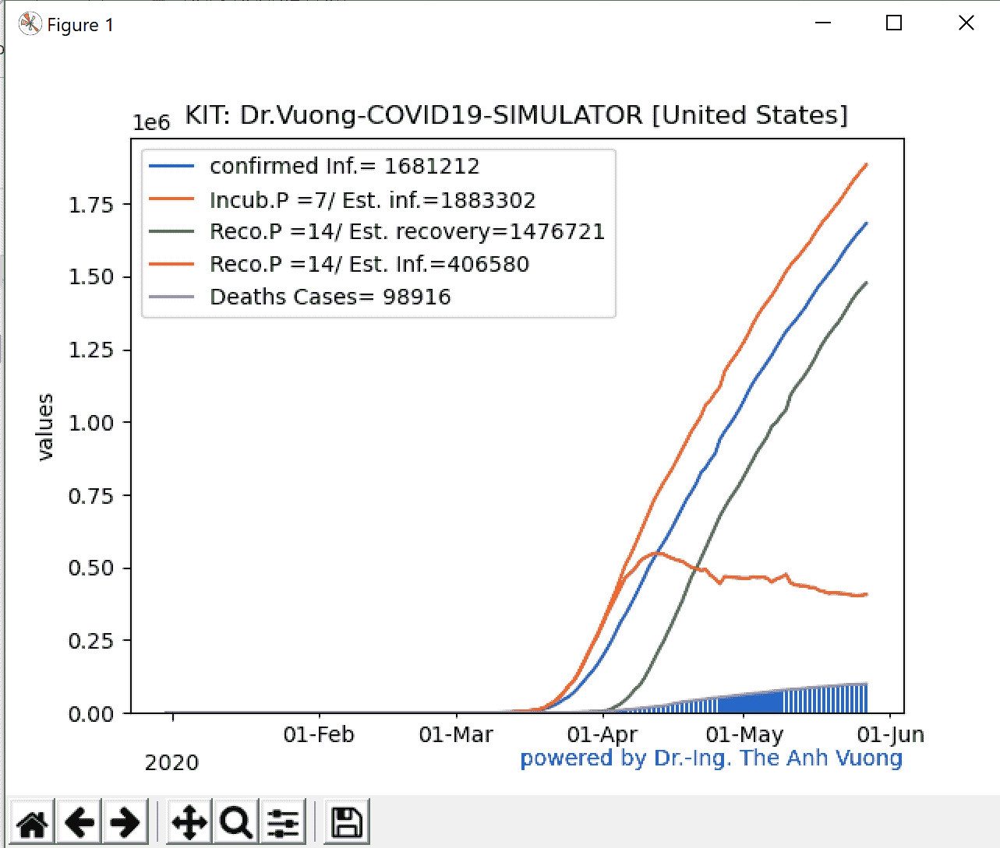
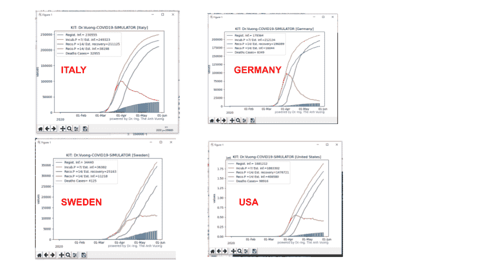

# 新冠肺炎数据的预测和分析:模型—建议算法 Vuong 模拟器

> 原文：<https://towardsdatascience.com/prediction-and-analysis-of-covid-19-data-model-proposal-algorithm-vuong-simulator-2b05d1bded7e?source=collection_archive---------56----------------------->

## 数据科学—新冠肺炎—可视化—编程

照片由 Thuy Chung Vuong 拍摄

# 如何发现未被发现的新冠肺炎感染病例？

***编者按:*** [*走向数据科学*](http://towardsdatascience.com/) *是一份以数据科学和机器学习研究为主的中型刊物。我们不是健康专家或流行病学家，本文的观点不应被解释为专业建议。想了解更多关于疫情冠状病毒的信息，可以点击* [*这里*](https://www.who.int/emergencies/diseases/novel-coronavirus-2019/situation-reports) *。*

为了加入对抗新冠肺炎·疫情的战斗，我做了我个人的数据预测研究，并根据我在数据处理和电子学方面的经验进行了分析。由于我的资源有限，我当然只能使用我的 Surface 笔记本电脑、我的 Raspberry PI 和开源社区的软件，但我想报告一个新的结果:一种用于估计未发现感染的算法，使用我的“新冠肺炎数据分析的 Vuong 模型”，其实现的软件可以在这里下载。

新冠肺炎数据分析中的一个重要且具有挑战性的研究目标是寻找未发现的感染病例数。字)，因为病毒的传播，新型冠状病毒是非常复杂和未知的。在冠状病毒潜伏期(从接触到出现症状的时间)之后，病毒可能会从一个人传播到另一个人。有报道称，一个无症状(无症状)的人可以将新型冠状病毒病毒传播给另一个人(例如“[全球范围内感染冠状病毒的巨大无症状库](https://www.news-medical.net/news/20200408/Huge-asymptomatic-pool-of-coronavirus-infected-worldwide-say-researchers.aspx)”)。冠状病毒患者在明显康复后可能会再次感染该病毒(最新好消息"[新数据表明人们不会再次感染冠状病毒](https://www.sciencenews.org/article/coronavirus-covid19-reinfection-immune-response)，2020 年 5 月 19 日)

# SIR 模型

已经有许多数据模型用于分析和模拟新冠肺炎疫情来计算感染病例数。一个已知的非线性模型是 [SIR 模型](https://en.wikipedia.org/wiki/Compartmental_models_in_epidemiology)[[ker Mack-McKendrick 理论](https://en.wikipedia.org/wiki/Kermack%E2%80%93McKendrick_theory)，1927，1928，1932]: **S** 为易感人数， **I** 为传染人数， **R** 为痊愈或死亡(或免疫)人数。r 也可称为“抗”或“除”。

从真实数据，即当前每天新增的感染病例(新病例)中，使用 SIR 模型的[微分方程](https://en.wikipedia.org/wiki/Compartmental_models_in_epidemiology)来优化 SIR 模型的函数 I (t)的参数“β”和“γ”，从而可以找到 I(t)的每个时间点的感染人数(见图 1)。

*   β“β”是感染易感人群的比率。
*   γ“γ”是感染者变得有抵抗力的比率。

您可以找到许多 SIR 模型可视化的软件包，例如[[mattravenhall/BasicSIRModel](https://github.com/mattravenhall/BasicSIRModel)]和优化β率和γ率以找到 I(t)，用于估计感染人数。，如 Brian Collins，[新冠肺炎的动态建模](https://kx.com/blog/dynamic-modeling-of-covid-19/)。

图一。优化β率和γ率以找到 I(t)，用于估计感染人数

SIR 模型的优化有一些批评点:

*   该模型只有两个参数β和γ率，这可能不足以模拟新冠肺炎疫情。
*   医学和病毒学家还没有发现很多其他的参数。
*   SIR 模型作为一个封闭系统被采用。假设 N = S + I + R 随时间保持不变。在现实世界中，我们有一个开放的系统，随着时间的推移，N 不是常数，因为人们在移动，病毒可能通过空气传播。

因此也有[ [詹姆士·扬松](https://medium.com/@jamesjansson?source=post_page-----f7246e3dc396----------------------)、[新冠肺炎造型不对](https://medium.com/@jamesjansson/covid-19-modelling-is-wrong-f7246e3dc396)的评论

图 2 新冠肺炎数据分析对 CODVID-19 数据预测分析的 Vuong 模型。

# 新冠肺炎数据分析的 VUONG 模型

因此，我想报告我的建议模型:用于新冠肺炎数据分析的 Vuong 模型，以预测和分析 CODVID-19 数据。

新冠肺炎数据函数中的时间值 t 是日期和时间(参见 Python 文档:“[日期时间模块](https://docs.python.org/3/library/datetime.html)”)。因此它们是离散值，所以函数 y (t)是一个“时间序列”。我在这里用 y[x]代替 y (t ),因此 x 是日期时间。这使得以后的编程和绘图更加容易。

我们现在开始描述用于新冠肺炎数据分析的 Vuong 模型(见图 2)。

输入:

*   **nc[x]** 是每日确诊感染病例数，即“新增病例”。
*   **nd[x]** 为每日死亡人数。

产出:

*   **I[x]** 是每日感染病例的估计数。
*   **G[x]** 是每日恢复病例的估计数(germ。Gesund Fä lle)。

参数表将会很长，并且仍然是未知的。这里只列出了重要的已知参数:

*   数据信息的本地标识，例如德国、美国的数据。
*   [潜伏期。](https://www.worldometers.info/coronavirus/coronavirus-incubation-period/)
*   [恢复期](https://www.bbc.com/news/amp/health-52301633)。
*   [社交和物理距离](https://www.hopkinsmedicine.org/health/conditions-and-diseases/coronavirus/coronavirus-social-distancing-and-self-quarantine)
*   等等。

在 Vuong 模型中，我实现了两个参数:潜伏期和恢复期

估计感染病例的概念有 3 个步骤:

## 第一步

从每日新感染病例 nc[x]中，我们将计算预测函数 Ip [x]。Ip[x]是包括未发现感染者在内的感染者人数。与 SIR 模型优化相比，我使用了一个额外的参数——潜伏期τ。

**Ip [x] = nc [x，Tau]**

Tau:潜伏期。潜伏期过后，病毒会传染给另一个人。潜伏期估计在 2-14 天之间。

## 第二步:

恢复函数 G [x]已根据步骤 1 中的 Ip[x]、nd[x](每日死亡人数)和 RG 参数计算得出:

**G [x] = g [Ip [x]，nd [x]，RG)**

RG 是恢复期，不是 R 系数。RG 是一个感染者痊愈的时间。对于轻度病例，RG 可能是 14 天，对于严重病例，大约是 30 天([冠状病毒:需要多长时间才能恢复？](https://www.bbc.com/news/amp/health-52301633)、BBC 新闻)

## 第三步:

根据预测函数 Ip[x]的数量计算最终估计的每日感染病例数，预测函数 Ip[x]已从步骤 1 中导出，并排除了来自步骤 2 的恢复估计病例。

**I [x] = Ip [x] — G [x]**

现在让我们来看看细节吧！

## Vuong 算法在新冠肺炎数据预测中的应用

传染病例数的预测 Ip[x]:

预测函数 Ip [x]取决于 nc[x](每日确诊新病例)和潜伏期τ。

对于每个 Ip [x]，都有一个 r[x-1]，即复制因子。这意味着在时间点 x 的感染病例数 Ip [x]是在前一时间点 x-1 的病例数 nc[x-1]的 r[x-1]倍。

例如:在时间 x-1，有 100 个感染病例(Ip[x-1] = 100)，生殖因子将是 5 倍(r[x-1] = 5)，那么第二天将有 500 个感染病例(Ip [x] = 500)。

**Ip [x] = r [x-1] * Ip [x-1]** (1)

r[x-1]:Ip[x]的再现因子。

从(1)中，可以计算出:

**Ip[x-1]= r[x-2]* r[x-3]*…* r[x-1-n]*…。* r [x-N] Ip [x-1-N ]** (2)

n = 0，…，N，N 是用于计算的 Ip 值的数量

假设:所有 r[x-1-n]在时间间隔 N 中是相同的

**Ip [x-1] = (R ** N)。Ip [x-1-N] (3)**

R**N: R 指数 N

根据新冠肺炎的信息，我们知道在潜伏期τ之后，一个人可以将他的病毒传染给另一个人。

> 可以说 Ip[x-1-N]患者在潜伏期后会将病毒传染给其他人。这意味着 R 在时间点 x-1-N-τ之前不会激活。接下来是:

> **R * Ip[x-1]=(R * *(N-Tau))* Ip[x-1-N]**(4)
> 
> **(N-Tau-1)log R = log(Ip[x])—log(Ip[x-1-N]**(5)

对于 Ip [x]的估计，我们只需从时间间隔{x / x= x-1，…中取 2 个数 nc[x-1]和 nc[x-1-N]。x-1-N}

然后我们从 log R 计算 R

> **log R =(log(NC[x])—log(NC[x-1-N])/(N-Tau-1)**(6)
> 
> **R = 10 ** log R**

> **R 是繁殖因子。**

然后估计感染病例数 Ip[x]:

> **Ip [x] = R * nc[x-1]** (7)

## 编程概念:

Vuong 算法已经在 [tavuong_simulator.py](https://github.com/tavuong/covid19-datakit/blob/master/lib/tavuong_simulator.py) 中实现

对于实际编程，我们在 x 轴 x = 0 上运行长度为 N 的“窗口”,开始时间为[x-1],结束时间为[x-1-N]。..在等式(5)中，我们只需要 2 个值 nc[x-1]和 nc[x1-N]。但是，这些值可以是 0(零)。**因此我们必须添加额外的规则来避免 log (0)的计算:**

> 计算 Ip 和 R 在两个场的两个向量中，Ip [x]和 R [x]
> 
> nc[x]的前 N 个值用作被调用 Ip [x]的起始值。
> 
> **Ip [x] = nc [x]，对于 x = 0… N-1**
> 
> **后 x > N:**
> 
> 如果 nc [x] = 0 且 nc [x-1-N]！= 0，即在过去有过感染，我们取 R [x] = R [x-1]
> 
> 如果 nc [x] = 0 且 nc [x-1-N] = 0，即 nc [x]中有感染，我们取 R [x] = 0
> 
> 如果 nc [x]！= 0 和 nc [x-1-N]！= 0，即过去有感染，我们取 R [x] =计算值(s .等式(6))
> 
> 如果 nc [x]！= 0 且 nc [x-1-N] = 0，即在过去有感染，我们取 R [x] = R [x-1]

**恢复功能 G[x]**

G [x]:恢复函数，取决于 nc[x](每日新病例)、nd[x](每日死亡人数)和恢复期 RG

根据对冠状病毒的了解，在 RP 恢复期后，感染者要么康复，要么死亡。在时间 x-RP 中被感染的人数将是死亡的(nd[x])或康复的。

> **G [x] = nc[x-GP] — nd[x** ] (8)

## 估计感染病例数

最后，你可以估计仍然存在的感染病例

> **I [x] = Ip [x] — G [x]** (9)

# 新冠肺炎—vuongsulator . py

我已经使用 Python 开发工具包平台"[TAV uong/covid 19-data KIT "](https://github.com/tavuong/covid19-datakit)开发了用于新冠肺炎数据分析的 vuong 模型，详细描述可以在 [Readme.md](https://github.com/tavuong/covid19-datakit/blob/master/README.md) 或我的[上一篇论文](/python-development-kit-for-visualizing-and-modelling-of-covid19-data-b33e7a13aace)中阅读，所以我在这里简单描述一下。

# 安装和启动

$ github 克隆[https://github.com/tavuong/covid19-datakit.git](https://github.com/tavuong/covid19-datakit.git)

$ pip 安装费用

$ pip 安装 Matplotlib

$ cd ~ \ covid19-datakit \

$ python。\ covid 19-vuong simulator . py[通过 PC]

$ python3。\ covid 19-vuong simulator . py[由树莓 PI 提供]

此示例向您展示了如何启动 covid 19-vuongsulation 并通过其对话框给出参数。您可以使用项目的[数据文件夹](http://tavuong / covid19-datakit/data)中的测试数据或您的数据，

$ CD ~ \ covid 19-数据套件\

$ python。\ covid 19-vuong simulator . py[通过 PC]

VMODEL >国家？世界

VMODEL > new_case-file？。/data/new_cases.csv

死亡文件？。/data/new_deaths.csv

VMODEL > VuongSimualtion 模式？6

VMODEL >潜伏期？七

VMODEL >恢复期？14

然后它将绘制和打印结果

Vuong_Simulator >确认信息。= 5555708

Vuong_Simulator >Incub。P =7/预计。inf。=5937024

Vuong_Simulator >Reco。P =14/预计。恢复=4233977

Vuong_Simulator >Reco。P =14/预计。Inf。=1703047

Vuong_Simulator >死亡人数= 350212

图 3 https://ourworldindata.org/coronavirus-source-data 新冠肺炎数据【世界】分析，数据来源:

您可以使用这个命令行来启动 Vuong 模拟器，以获得相同的结果

$ python。\ covid 19-vuong simulator . py-c World-o test.png-m ta-n . \ data \ new _ cases . CSV-d . \ data \ new _ deaths . CSV-g 0.98-r 14-t 7-s 6

刚刚通过以下选项实施:

**$巨蟒。\ covid 19-vuong simulator . py-h**

> -n <new_cases_file>-d <new_deaths_file>-o 输出文件</new_deaths_file></new_cases_file>
> 
> -c 国
> 
> -t 潜伏期τ
> 
> -r 恢复期
> 
> **-s 模拟模式**
> 
> 程序根据模拟模式进行计算和绘图。只有在模式 1 中是时间功能，在其他模式中，显示时间功能的累积
> 
> Vuong 模型后的 R 系数(开发中)
> 
> 2:确诊感染 nc[x] —死亡 nd [x]
> 
> 3:确认感染 nc[x] /恢复函数 G[x]
> 
> /最终估计感染人数 I[x]/死亡人数 nd [x]
> 
> 4:确认感染 nc[x] —恢复函数 G[x]
> 
> 死亡人数
> 
> 5:确认感染 nc[x] /估计感染 Ip[x]
> 
> /最终估计感染人数 I[x]/死亡人数 nd [x]
> 
> 6:确认感染 nc[x] /估计感染 Ip[x]
> 
> /恢复函数 G[x]
> 
> /最终估计感染人数 I[x]/死亡人数 nd [x]

## 示例命令

> $ python。\ covid 19-vuongssimulator . py-c“美国”-o test.png-m ta-n . \ data \ new _ cases . CSV-d . \ data \ new _ deaths . CSV-g 0.98-r 14-t 7-s 6

图 4 美国新冠肺炎数据分析，数据来源:[https://ourworldindata.org/coronavirus-source-data](https://ourworldindata.org/coronavirus-source-data)

# 用新冠肺炎-冯氏模拟程序预测未发现的感染病例

Vuong 算法用于分析新冠肺炎数据，这些 CSV 文件可从这里的开源[下载。我想对影响](https://ourworldindata.org/coronavirus-source-data)[的全球 213 个国家和地区](https://www.worldometers.info/coronavirus/)或城市进行分析，例如加州或纽约或杜塞尔多夫，但我能力有限。所以我用 Vuong 模拟器分析了一些国家的新冠肺炎数据:意大利、德国、瑞典、美国和“世界”，你可以在图 5 中看到结果

图 5 新冠肺炎分析-义大利、德国、瑞典、美国的数据。数据来源:【https://ourworldindata.org/coronavirus-source-data 

通过使用我提出的算法进行测试分析，我发现了一些关于冠状病毒疫情的有趣预测:

*   在意大利和德国，疫情已经大大降低(图 5)。
*   在美国，疫情已经开始减少(图 4)。
*   在瑞典，疫情仍在扩张(图 5)。
*   对世界来说，第二次危机(第二波)即将到来(图 3)。

# 摘要

开发了用于新冠肺炎数据分析的 Vuong 模型中的算法，以从确诊病例和死亡数据中搜索未发现的感染病例。Vuong 算法是基于一个开放系统，使用额外的新冠肺炎疫情信息和离散数学。这可能是众所周知的 SIR 模型优化方法的替代解决方案。

你可以下载软件[“covid 19-Vuong Simulator”](https://github.com/tavuong/covid19-datakit/blob/master/lib/tavuong_simulator.py)集成到[开发套件](http://tavuong/covid19-datakit)中，用默认测试开源[新冠肺炎数据](https://github.com/tavuong/covid19-datakit/tree/master/data)或你的数据来分析未发现的感染病例。

covid19 数据的可视化和建模一直在不断发展，未来还会更新。如果您开发了一个新的有趣的模型-模块或演示-模块，请不要犹豫联系我进行咨询开发，也许可以将您的模块贡献给开源和麻省理工学院许可的项目[***TAV uong/covid 19-data kit***](https://github.com/tavuong/covid19-datakit)over[Github](https://github.com/)。

玩得开心！

新冠肺炎数据致谢:[汉娜·里奇](https://ourworldindata.org/coronavirus-source-data)。

综述鸣谢:简范博士教授

感谢支持和咖啡蛋糕的动力:我的妻子 Thi Chung Vuong