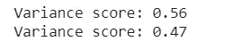

# 超出和结束可用数据的预测

> 原文：<https://towardsdatascience.com/prediction-beyond-and-end-of-the-available-data-653a9a935549?source=collection_archive---------17----------------------->

## 回归分析和未来价格预测

## 分析金融时间序列的机器学习算法


作者图片

[https://sarit-maitra.medium.com/membership](https://sarit-maitra.medium.com/membership)

P **预测**超越样本数据进入未来的复杂任务；特别是当我们处理来自高频交易的金融数据的随机时间序列时。机器学习模型的预测性能通常是这样进行的

1.  通过将给定数据集分割成样本内周期；用于初始参数估计和模型选择；
2.  样本外期间用于评估预测性能

与样本内的表现相比，样本外的预测表现通常被认为更可信，更基于经验证据。样本内性能往往对异常值和数据挖掘更敏感。样本外预测也能更好地反映实时可用的信息。但是，可以注意到，样本内收益的可预测性并不一定意味着样本外收益的可预测性。关键是，从训练集中学习的模型，是否能够推广新的数据。

让我们探索一下，看看我们现实生活中的案例研究是如何在从未见过的数据场景中工作的。我们将使用道琼斯工业指数数据进行调查。

# 数据加载:

```
df = web.DataReader('^DJI', data_source = 'yahoo', start = '2000-01-01')
print(df.head()); print('\n'); print(df.shape)
```


## 实际价格可视化:

```
dataset = df.copy()
fig = go.Figure(data=[go.Candlestick(x=dataset.index, open=dataset['Open'], high=dataset['High'], low=dataset['Low'], close=dataset['Close'])])
fig.show()
```


## 每日回报的经验分位数:

由于风险价值(VaR)的广泛使用，分位数预测对风险管理决策至关重要。它是两个因素的产物

1.  波动预测，以及
2.  波动预测的分位数。

## 使用经验分位数的每日风险值:

假设:日收益率呈正态分布。我们可以看到日收益率的分布图，如下所示。

方法:通过曲线拟合来分析分位数的历史数据，这里，学生的 t 分布

```
dataset['daily_return'] = dataset['Adj Close'].pct_change()
round(dataset["daily_return"],2).quantile(0.05)
```


每日回报的 0.05 (p=0.05)经验分位数在-0.02(0.05 分位数是第 5 个百分位数)。

*   *有 95%的信心，我们最大的每日损失不会超过投资的 2%*
*   *如果我们在€投资 100 万英镑，我们一天的 5%风险值是 0.02 *€1 万英镑=€2 万英镑*


从上面的图中可以看出，高斯白噪声具有恒定的波动性。高波动性和低波动性的时期以及回报的极端波动性。此外，我们还可以看到波动是如何依赖于时间的；高波动期持续存在，低波动期持续存在。

# VaR:蒙特卡罗模拟

我们将根据历史波动生成道琼斯价格走势。鉴于这种历史波动性，将会有一点随机性。

用于生成第二天价格的公式:

> 最后几天的价格，并乘以 1 +随机冲击，这是通过抽取给定历史波动率的分布样本而产生的。

让我们回顾一年前(252 天)的价格。

```
# resetting index
dataset.reset_index(inplace = True)
dataset = dataset.sort_values(by = 'Date', ascending=True)
print(dataset.loc[[(len(dataset) -252)]]) # closing price 252 days back
```


我们在这里看到，收盘价是 28745.08 美元。

我们运行一个 10，000 次运行的模拟来获得下面的输出。

```
days = 252
start_price = 28745.089844 # Taken from above#delta t
dt = 1/252
mu = dataset['daily_return'].mean() # mean return
sigma = dataset['daily_return'].std()  # volatilitydef stock_monte_carlo(start_price, days, mu, sigma):
    price = np.zeros(days)
    price[0] = start_price
    shock = np.zeros(days)
    drift = np.zeros(days)
    for x in range(1,days):
        shock[x]=np.random.normal(loc=mu*dt,scale=sigma*np.sqrt(dt))   drift[x] = mu * dt
        price[x] = price[x-1] + (price[x-1] * (drift[x]+shock[x]))
    return price
plt.plot(stock_monte_carlo(start_price, days, mu, sigma))
plt.xlabel('Days'); plt.ylabel('Price (US$)')
plt.title('Monte-Carlo Analysis for Dow Jones')
plt.show()
```


```
runs = 10000
simulations = np.zeros(runs)
for run in range(runs):
    simulations[run] = stock_monte_carlo(start_price,days,mu,sigma)[days-1]
q = np.percentile(simulations,1)
plt.hist(simulations, bins = 200)
plt.figtext(0.6,0.8,s="Start price: $%.2f" %start_price)
plt.figtext(0.6,0.7,"Mean final price: $%.2f" % simulations.mean())
plt.figtext(0.6,0.6,"VaR(0.99): $%.2f" % (start_price -q,))
plt.figtext(0.15,0.6, "q(0.99): $%.2f" % q)
plt.axvline(x=q, linewidth=4, color='r')
plt.title(u"Final price distribution for Dow Jones after %s days" %days, weight='bold')
plt.show()
```


上图表明，道琼斯价格自过去一年以来几乎是稳定的；起始 Adj 收盘价格为 28745 美元，超过 10000 次的平均最终价格几乎相同(28759 美元)。红线表示 99%置信区间的风险值。

我们将执行 ML 来预测未来的 Adj Close 价格。让我们做一些对模型性能至关重要的特征工程。

> 时间序列组件对于分析感兴趣的变量非常重要，以便了解其行为、模式，并能够选择和拟合适当的时间序列模型。另一方面，时间序列预测器可以帮助一些模型识别额外的模式并提高预测的质量。时间序列的组成部分和特征对于解释时间序列的行为、分析其属性、识别可能的原因等都至关重要…[Roman Josue de las Heras Torres](https://blogs.oracle.com/datascience/7-ways-time-series-forecasting-differs-from-machine-learning)

# 特征工程

```
dq = df.copy()
dq['ho'] = dq['High'] - dq['Open'] 
dq['lo'] = dq['Low'] - dq['Open']
dq['oc'] = dq.Open - dq.Close
dq['hl'] = dq.High - dq.Low
dq['volume_gap'] = dq.Volume.pct_change()
dq['day_of_week'] = dq.index.dayofweek
dq['day_of_month'] = dq.index.day
ema_12 = dq['Adj Close'].ewm(span=10).mean()
ema_26 = dq['Adj Close'].ewm(span=26).mean()
dq['ROC'] = ((dq['Adj Close'] - dq['Adj Close'].shift(5)) / (dq['Adj Close'].shift(5)))*100
delta = dq['Adj Close'].diff()
window = 14
up_days = delta.copy()
up_days[delta<=0]=0.0
down_days = abs(delta.copy())
down_days[delta>0]=0.0
RS_up = up_days.rolling(window).mean()
RS_down = down_days.rolling(window).mean()
dq['rsi'] = 100-100/(1+RS_up/RS_down)
dq['macd'] = ema_12 - ema_26#print(dataset)# lag featuerslags = 3
# Create the shifted lag series of prior trading period close values
for i in range(0, lags):
    dq["Lag%s" % str(i+1)] = dq["Adj Close"].shift(i+1).pct_change()# target variable
future_pred = int(15)
dq['prediction'] = dq['Adj Close'].shift(-future_pred)
dq.head()
```

## 相对强弱指数(RSI)和移动平均线收敛 D **收敛(MACD)**

感兴趣的可以访问 [***这里***](https://medium.com/analytics-vidhya/stock-trend-prediction-with-technical-indicators-feature-engineering-and-python-code-1fa54d5806ba) 获取详细的技术指标。

## 目标变量

我们已经创建了目标变量来预测当前数据集中不可用的未来 15 天的值。

```
dq = dq.drop(['High','Low','Open','Close','Volume', 'Adj Close'],1)
dq.dropna(inplace=True)# creating X,y set
X = dq.drop(['prediction'],1)
X_fcast = X[-future_pred:] # future prediction set
X = X[:-future_pred] # removing last 15 rows
y = y[:-future_pred]# splitting train/test
X_train, X_test, y_train, y_test = train_test_split(X, y, test_size=0.20, random_state=42)
```

不，让我们拟合一个线性(OLS)模型作为基础模型，并观察我们得到的模型:

```
ols = linear_model.LinearRegression().fit(X_train, y_train)
# Explained variance score: 1 is perfect prediction
print('Training Variance score (R^2)', r2_score(y_train, ols.predict(X_train)))
# Explained variance score: 1 is perfect prediction
print('Test Variance score (R^2): ', r2_score(y_test, ols.predict(X_test)))
```


# 极端梯度推进

我们使用 XGBRegressor 拟合模型，随后检查测试集的置信水平，并获得预测值(15 天)。XGBoost 具有处理数据中缺失值的能力。此外，基于树的算法不需要数据缩放。

```
reg = XGBRegressor(objective ='reg:squarederror', n_jobs=-1).fit(X_train, y_train)
# Explained variance score: 1 is perfect prediction
print('Variance score: %.2f' % r2_score(y_train, reg.predict(X_train)))
# Explained variance score: 1 is perfect prediction
print('Variance score: %.2f' % r2_score(y_test, reg.predict(X_test)))
```



虽然性能比基本模型有所提高，但是考虑到我们使用了回归算法，我们还没有完全达到。在这一阶段，我们可以回头看看这些功能，并在相关功能上做更多的工作。

一旦我们对准确性感到满意，我们就可以使用单独保存的预测数据进行未来预测。程序如下所示。

```
prediction = reg.predict(X_fcast)
print('\033[4mExpected Close price for next 15 days\033[0m')
print(prediction); 
```


为了更好地理解，我们需要具有上述值的日期。实际上，我们已经预测了 2 周，如下所示。下面几行代码为获得的预测值生成未来日期。

```
d = df[['Adj Close']].tail(len(prediction));
d.reset_index(inplace = True)
d = d.append(pd.DataFrame({'Date': pd.date_range(start = d.Date.iloc[-1],
periods = (len(d)+1), freq = 'D', closed = 'right')}))
d = d.tail(future_pred);
d.set_index('Date', inplace = True)
prediction = pd.DataFrame(prediction)
prediction.index = d.index
prediction.rename(columns = {0: 'Forecasted_price'}, inplace=True)
prediction
```

## 预期价格


## 形象化

将观察值(过去 2 个月)和预测值(未来 1 个月)相加的图有助于我们了解模型是否能够从历史数据中捕捉模式。这里的未来预测看起来很现实。

```
fig = go.Figure()
n = prediction.index[0]
fig.add_trace(go.Scatter(x = df.index[-100:], y = df['Adj Close'][-100:], marker = dict(color ="red"), name = "Actual close price"))fig.add_trace(go.Scatter(x = prediction.index, y = prediction['Forecasted_price'], marker=dict(color = "green"), name = "Future prediction"))
fig.update_xaxes(showline = True, linewidth = 2, linecolor='black', mirror = True, showspikes = True,)
fig.update_yaxes(showline = True, linewidth = 2, linecolor='black', mirror = True, showspikes = True,)
fig.update_layout(title= "15 days days DJIA Forecast",yaxis_title = 'DJIA (US$)',hovermode = "x",hoverdistance = 100, spikedistance = 1000,shapes = [dict(x0 = n, x1 = n, y0 = 0, y1 = 1, xref = 'x', yref = 'paper',line_width = 2)],annotations = [dict(x = n, y = 0.05, xref = 'x', yref = 'paper', showarrow = False,xanchor = 'left', text = 'Prediction')])
fig.update_layout(autosize = False, width = 1000, height = 400,)
fig.show()
```


从上面的图中我们可以清楚地看到一个糟糕的预测。

除了在特征上的工作，我们需要重新访问和查看我们的目标变量，该变量在本实验中没有改变，我们这样做可能会导致前瞻偏差。我们可以尝试用 df['Adj Close']做实验。shift(-1)，给出未来预测。

> 当我们准备好实时预测未来时，我们当然应该使用所有可用的数据进行估计，以便使用最新的数据。

# 摘要

我们可以尝试其他算法，如支持向量或随机森林。虽然，XGB 可以学习更复杂的非线性表示，但需要更多的数据集才能更好地执行。我们没有应用任何基本变量，这里使用的所有预测变量都可能与目标变量有线性关系。

> 在用于预测问题的监督机器学习算法中，基于树的算法是最好的。这些方法能够通过学习许多简单的规则来捕捉数据中的复杂关系，一次一个规则。

需要应用交叉验证和算法优化技术来最终确定稳健的模型性能。通过观察偏差/方差，我们可以调整过拟合或欠拟合问题；我们也可以引入这里没有练习过的早期停止回合。这将是一个好主意，测试几个其他模型，并可能引入一个最好的模型集合，以检查性能和准确性得分。

此外，出于验证目的保留数据是一个重要的诊断测试，因为它给出了预测未来时可以预期的准确性的最佳指示。出于验证目的，保留至少 20%的数据可能是一个好的做法。但是，在大量数据可用的情况下，坚持 50%也可以尝试。

***我这里可以到达***[](https://www.linkedin.com/in/saritmaitra/)*。*

**参考文献:**

1.  **伯格梅尔、克里斯托弗和何塞·m·贝尼特斯。“交叉验证在时间序列预测评估中的应用”信息科学 191 (2012)**
2.  **伯格梅尔、克里斯托弗、罗布·j·海曼和古邦秀。“关于评估自回归时间序列预测的交叉验证有效性的说明。”计算统计&数据分析 120 (2018)**
3.  *伯尔曼、普拉比尔、埃德蒙·周和黛博拉·诺兰。"相关数据的交叉验证方法."生物计量学 81.2 (1994)*