# 基于机器学习的养老院综合评分预测

> 原文：<https://towardsdatascience.com/prediction-of-overall-rating-of-a-nursing-home-using-machine-learning-c76871a3a827?source=collection_archive---------54----------------------->

## 养老院数据集上的端到端机器学习应用

照片来自 [Pixabay](https://www.pexels.com/photo/blue-and-silver-stetoscope-40568/)

**摘要:**

医疗保险和医疗补助服务中心为全国参加医疗保险或医疗补助计划的每家养老院发布了一套质量评级。这些评级有助于家庭了解不同养老院之间的差异及其质量。他们还帮助做出重要决定，如选择自己喜欢的养老院(医疗保险和医疗补助服务中心，2020 年)。本文旨在回答与数据集相关的某些研究问题。它使用机器学习技术对数据进行建模，并理解不同特征之间的关系。给定一组属性，训练机器学习模型来预测养老院的总体评级。对不同模型的性能进行了评估，并提供了研究问题的答案。

**简介:**

医疗保险和医疗补助服务中心引入了一个基于“星级”的评级系统，对养老院的质量进行量化。养老院的“总体评级”是根据其在三个领域的表现计算的，而这三个领域又是一个评级。

**健康检查:**进行年度检查调查，记录疗养院的不足之处。通过考虑在过去三年的这些检查中发现的缺陷的严重性和数量来分配评级。它还包括该部门要求的回访次数，以检查疗养院是否纠正了检查中发现的问题。

**人员配备:** RN 是注册护士的缩写，LPN 是执业实习护士的缩写。该评级基于每位住院医师每天的总注册护士小时数和每位住院医师每天的总护士小时数。

**质量评估:**疗养院比较网站上有 15 项质量评估，包括 9 项长期停留评估和 9 项短期停留评估。

由于有多个特征，并且很难理解和分析所有这些特征，因此存在一个称为“总体评级”的单一特征，该特征以 1 到 5(最低到最高)的等级分别对养老院进行评级。关于这三个领域的详细信息见(医疗保险和医疗补助服务中心，2020)。

**数据集描述:**

该数据集摘自 DATA.GOV 网站(医疗保险和医疗补助服务中心，2019 年)。它由 86 列和 15，437 条记录组成。每个记录都与一个疗养院相关联。描述疗养院的一些重要栏目是，

联邦提供者编号—由联邦政府提供给疗养院的唯一编号。

提供者名称—疗养院的名称。

提供者地址—疗养院的地址。

提供者城市—疗养院所在的城市。

提供者州——疗养院所在的州。

提供者邮政编码—与疗养院相关的邮政编码。

提供者电话号码—疗养院的电话号码。

提供者 SSA 县—疗养院所在的县。

提供者县名称—疗养院所属县的名称。

所有权类型-描述它是一个盈利性或政府或非盈利性实体。

提供者类型—描述疗养院是医疗保险还是医疗补助，或者是医疗保险和医疗补助。

提供者住在医院-一个布尔值，表示真或假，以表示提供者是否住在医院。

合法企业名称——养老院的合法企业。

文件导言部分还介绍了与这些措施相关的其他特点。例如，与**‘健康检查’**相关的一些特征包括‘评定周期 1 健康缺陷总数’、‘评定周期 1 标准健康缺陷数’、‘评定周期 1 健康缺陷分数’等。与**“人员配备”**相关的特征包括“每个住院医师每天报告的护士助手人员配备小时数”、“每个住院医师每天报告的 LPN 人员配备小时数”、“每个住院医师每天报告的 RN 人员配备小时数”等。与'**'相关的特性包括'质量管理评级'、'质量管理评级脚注'、'长期质量管理评级'等。**

**数据的汇总统计如表 1 所示。因为有许多列，所以表中只显示了其中的几列。**

**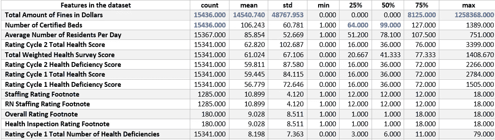**

****表 1。数据集中要素的汇总统计数据****

**“罚款总额(美元)”和“认证床位数”这两个特征的数值最高。“罚款总额(美元)”功能的平均值、标准差和 75%置信区间值是最大值。25%和 50%的置信区间值是“认证床位数”和“每日平均住院人数”列的最大值。**

****探索性数据分析:****

**图 1 显示了各州的“总加权健康调查分数”。可以观察到，加利福尼亚和得克萨斯具有更高的总加权健康调查分数。佛蒙特州、波多黎各和关岛等地的加权健康调查总得分较低。**

**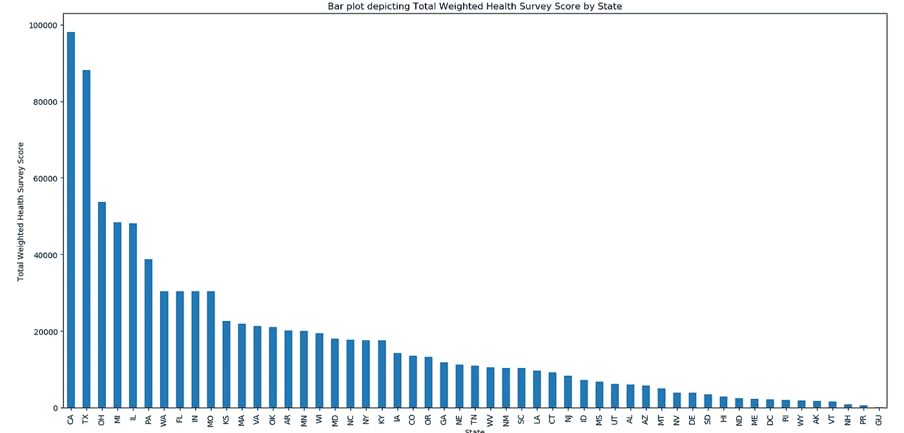**

****图 1。描述各州总加权健康调查分数的条形图****

**图 2 显示了一个热图，显示了各州养老院的“总体评分”总和。可以看出，加利福尼亚州、得克萨斯州、俄亥俄州和佛罗里达州的养老院总体排名最高。仅考虑 50 个州，阿拉斯加、佛蒙特、特拉华、怀俄明各州对养老院的“总体评分”较低。**

****

****图二。热图显示了各州所有疗养院的总体评分总和****

**图 3 描绘了各州给予养老院的罚款总额的箱线图。有趣的是，尽管德克萨斯州、密歇根州和佛罗里达州都在罚款总额最高的五个州之列，但加利福尼亚州并不在其中。在箱线图中可以观察到很多异常值，因为每个州的养老院所遭受的罚款为零。许多州的中位数也接近于零。密歇根州的四分位数间距最高。德克萨斯州和北卡罗莱纳州的养老院承担了最高的罚款。德克萨斯州的罚金最高，总额超过 120 万美元。**

**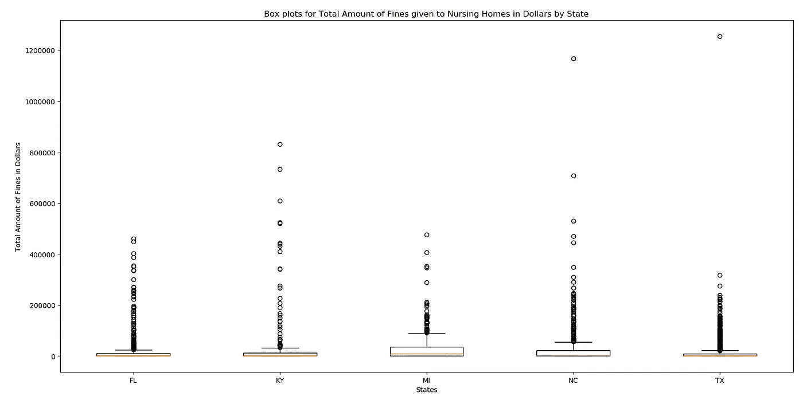**

****图 3。各州给予养老院的罚款总额(美元)的方框图****

**皮尔逊相关系数大于 0.7 的特征的相关矩阵如图 4 所示。在“评定周期 2 总健康分数”和“评定周期 2 健康缺陷分数”以及“评定周期 1 健康缺陷分数”、“评定周期 1 健康总健康分数”和“评定周期 1 健康缺陷分数”之间观察到最高相关性。皮尔逊相关系数值大于 0.8 的要素可被视为高度相关。可以从数据集中删除每个集合中的一个高度相关的列，因为它们不提供任何附加值。**

**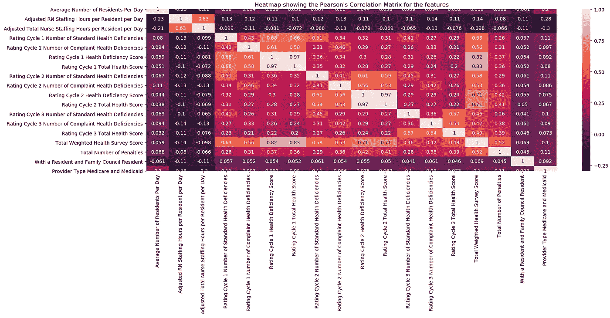**

****图 4。描述最相关特征的皮尔逊相关系数的热图****

**图 5 显示了“总体评分”和“总加权健康调查分数”栏之间的散点图。回归分析通过拟合线性回归来执行，以识别两个特征之间是否存在任何相关性。**

**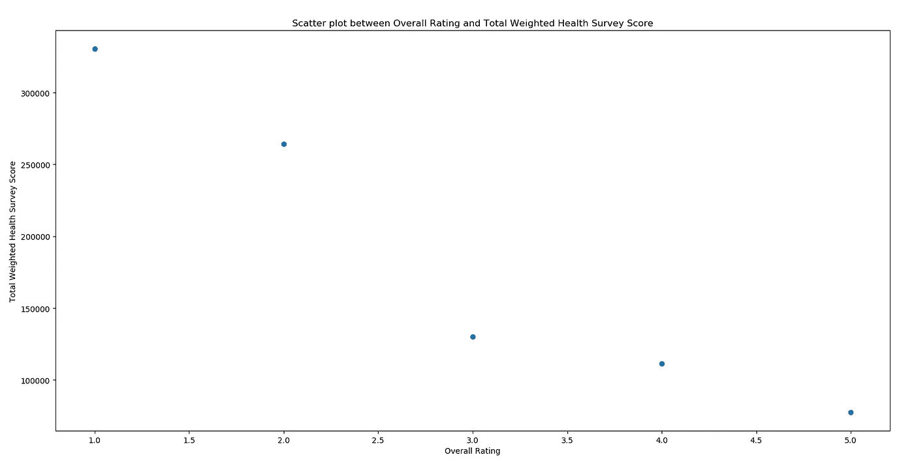**

****图 5。总体评分和总加权健康调查得分之间的散点图****

**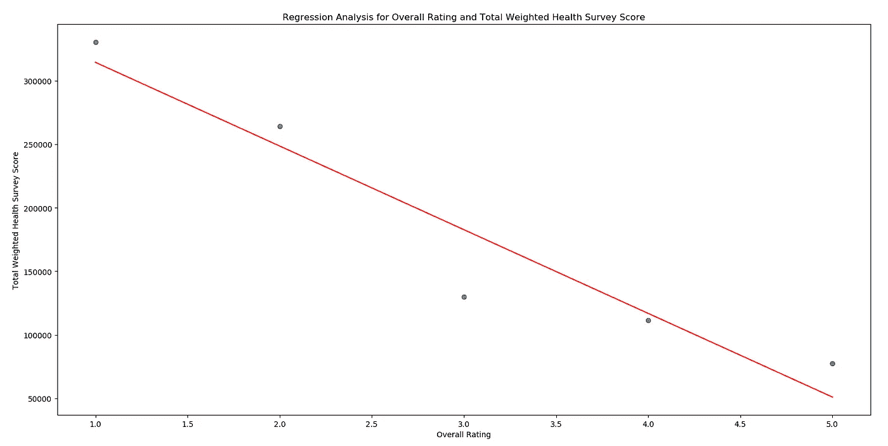**

****图 6。总体评分加权健康调查总分回归分析****

**通过对这两个特征使用线性回归，对数据拟合一条线。图 6 中描绘了相反的关系。随着总体评分的增加，总加权健康调查分数降低。这一观察结果得到了“注意，较低的调查分数对应于较少的缺陷和重访，因此在健康检查领域表现更好”这句话的支持(医疗保险和医疗补助服务中心，2019 年)。**

**对特征“提供者居住在医院”和“持续护理退休社区”进行独立性卡方检验。零假设假设特征是独立的。另一个假设假设这些特征是相关的。卡方检验显示 p 值为“7.1246454255565634e-12”。由于 p 值小于 0.05(在 95%的置信水平下)，我们拒绝零假设，并接受替代假设，认为特征是相关的。“提供商在过去 12 个月内改变了所有权”和“滥用图标”之间的类似测试表明，它们是独立的。因为显著性水平为 0.05(95%置信水平)的 p 值计算为 0.975，大于 0.05。**

****研究问题:****

**本文旨在回答有关数据集的三个研究问题。**

**1.可以开发一个机器学习模型，根据数据中观察到的模式为养老院分配一个类别(总体评级)吗？**

**2.如果是，它有多可靠，有多准确？**

**3.影响养老院整体评分的最重要因素是什么？**

**对上述问题的回答有助于确定养老院影响其整体评级的最重要因素。这可以帮助养老院做出某些决定，以提高其评级，并在高度影响其评级的领域进行改进。**

****数据预处理:****

**许多文本数据，如位置、联邦供应商编号、健康调查日期对模型拟合不是很有用，这些列已从数据集中删除。此外，还考虑了调整后的功能，而不是单独报告的功能。例如，不考虑“每个住院医师每天报告的护士助手工作时间”，而是考虑“每个住院医师每天调整的护士助手工作时间”。包含真/假(布尔值)的列已分别替换为 1/0。某些列的 NaN 值，如“质量管理评级”、“长期质量管理评级”、“短期质量管理评级”、“员工评级”都填零。**

**该列的平均值用于替换“每个住院医师每天调整后的护士助手工作时间”、“每个住院医师每天调整后的 LPN 工作时间”、“每个住院医师每天调整后的总护士工作时间”、“每天住院医师平均人数”等中的 NaN 值。对某些列执行虚拟编码，如“有居民和家庭委员会”和“提供者类型”，因为它包含分类变量。其值都是 NaN 值的列将从数据集中删除。**

**不是对整个数据集进行规范化，而是将每一列规范化为[0，1]的范围。如果对整个数据集执行规范化，包含大数的列将成为决策的主导。皮尔逊相关系数是在数据集的所有要素之间计算的，每个数据集中的一个高度相关列已从数据集中删除，因为它们不能为模型提供任何附加值。经过预处理后，总列数从 86 列减少到 52 列。**

****班级分布:****

**观察属于每个类别(总体评级)的记录数量。类别 5 的记录数量最多，而类别 1 的记录数量最少。但它们之间的差异是 1000 个记录，这是可以容忍的。这种分布是自然的，不需要抽样方法，因为没有一个阶层的代表性严重不足或过多。**

**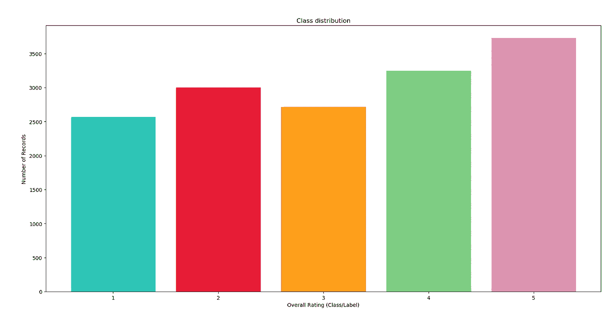**

****图七。按类别分布记录数量(总体评级)****

****模型拟合:****

**预测“总体评级”的当前任务是分类任务。诸如随机森林和支持向量机的机器学习算法是可以应用于分类(二进制或多类)的一些健壮算法。**

**随机森林是一种集成技术，它使用多个决策树，并根据输入特征为给定实例分配一个类。它可以执行回归和分类任务。使用替换对数据进行采样，并在提取的样本上训练几个决策树。在取样过程中，一定百分比的数据被分离出来并标记为 OOB(出袋)数据。在 OOB 数据上测试训练的决策树，并且获得 OOB 误差估计。最终确定具有最小 OOB 误差的最佳“n”棵树，并将其视为单个随机森林分类器。给定一个测试实例，随机森林分类器中的每个决策树预测一个类。执行类似投票的机制，并且由大多数树预测的类被生成作为随机森林分类器的输出。由于集合方法，随机森林可以非常有效地模拟数据(Leo 等人，2020)。**

**支持向量机是一种监督算法，可用于分类和回归。它确定了可以有效划分数据的最佳超平面。它也被称为最大间隔分类器，因为它试图构建一个超平面，该超平面到两个类的最近元素的距离是最大的(Cortes 等人，1995)。由于它们在许多分类任务中被证明是有效的，这两种模型都被认为是对当前数据的建模。**

****训练:****

**数据集按 80:20 的比例划分，其中 80%的数据构成训练集，其余 20%构成测试集。模型将被训练的特征被称为 X_train。对于当前数据集，X_train 构成预处理数据集后获得的所有 51 列(不包括“总体训练”列)。数据集将被训练来预测的目标/列被称为 Y_train，对于当前数据集，它将是“总体评级”列。**

**在训练过程中，机器学习模型被拟合到数据集。然而，建模的效率取决于给予模型的一组输入，这些输入通常被称为超参数。根据数据，需要调整超参数，这个过程称为超参数调整。用于训练随机森林和 SVM 模型的最佳超参数已经通过被分类为 K-Fold 交叉验证的技术来识别。在这种技术中，训练集被分成 K 个折叠/部分，其中 K-1 个部分被认为是训练集，一个部分被认为是测试集。提供一组超参数作为输入，在 K-1 个零件上训练模型，然后对一个零件进行测试(Refaeilzadeh 等人，2009 年)。这个过程被执行 K 次，并且每次都评估度量。计算分类度量的平均值，例如所选超参数的平均准确度、平均精确度、平均召回率和平均 F1 分数。超参数的最佳集合产生最高的测试分数，并且因此被确定。**

**对于当前数据集，执行了 5 重交叉验证，机器学习模型的最佳超参数确定如下。**

***RandomForestClassifier(bootstrap = True，class_weight=None，criterion='entropy '，max_depth=30，max_features='auto '，max_leaf_nodes=None，min _ infinity _ decrease = 0.0，min_samples_leaf=1，min_samples_split=2，min_weight_fraction_leaf=0.0，n_estimators=500，n_jobs=None，oob_score=False，random_state=None，verbose=0，warm _ start =***

***SVC (C=10，cache_size=200，class_weight=None，coef0=0.0，decision_function_shape='ovr '，degree=3，gamma=1，kernel='rbf '，max_iter=-1，probability=False，random_state=None，shrinking=True，tol=0.001，verbose=False)***

**随机森林和支持向量机的交叉验证分数如表 2 所示。**

**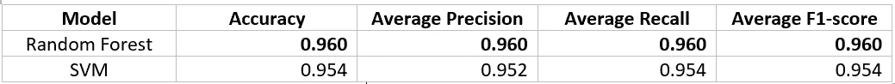**

****表二。随机森林和支持向量机的交叉验证分数****

**在交叉验证结束时，超参数被确定，并且整个训练集被模型训练为单个实体。模型已经准备好在测试集上进行测试。**

****测试和评估:****

**测试集中的每个记录都通过训练集来预测该记录的“总体评级”。每个记录代表一个疗养院。因此，该模型基本上是训练来预测养老院的“总体评级”，给定其一组特征。预测由分类指标评估—精确度、准确度、召回率和 F1 分数。**

**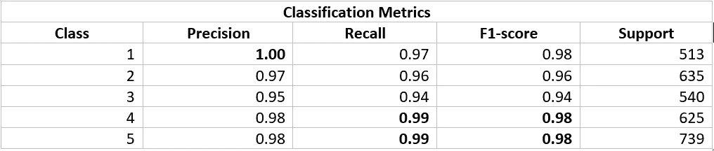**

****表 3。测试集**上随机森林的类级分类度量**

****

****表 4。测试集**上支持向量机的类级分类度量**

**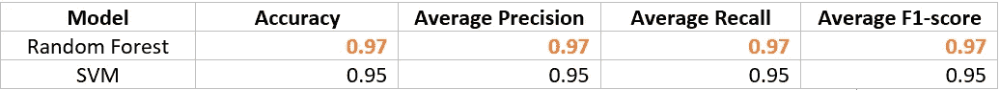**

****表五。机器学习模型性能的整体比较****

**可以得出结论，随机森林分类器是当前数据集的最佳性能模型。在所有分类指标上，如准确度、平均精确度、平均召回率和 F1 平均得分，它都占据了 SVM 的主导地位。**

****调研问题答案:****

****1。可以开发一个机器学习模型，根据数据中观察到的模式为养老院分配一个类别(总体评级)吗？****

****回答:**是的。可以开发一种机器学习模型，该模型可以将养老院分类为“总体评级”特征中呈现的五星评级之一。还可以得出结论，在关于总体评级栏的数据中存在清晰的模式，并且机器学习模型能够区分这些模式。因此，在当前数据集上建立可靠的模型并成功实现目标是可能的。构建这种模型的过程也在上面陈述了。**

****2。如果是，它有多可靠，有多准确？****

****答:**模型的性能可以通过不同的分类指标进行评估。随机森林模型的精确度被计算为 97%。随机森林模型预测类的平均精度被计算为 97%。简单来说，召回率是正确预测的数量与所有应该正确预测的数量之比。平均召回值也是 97%。F1 分数是精确度和召回率之间的调和平均值。F1 分数越高，模型越好。当前的随机森林模型在测试集上实现了 97%的平均 F1 分数。在所述指标的帮助下，可以得出结论，该模型是稳定且非常可靠的。**

****3。影响养老院整体评分的最重要因素是什么？****

****答案:**经过训练的随机森林模型提供了对数据集最重要特征的深入洞察。这是因为随机森林通过挑选对目标列最重要的特征来构建对数据建模的决策树。他们通过使用诸如“熵”、“基尼”、“增益率”等技术来计算特征的重要性。对于当前模型，特征重要性的顺序如图 8 所示。**

**影响“总体评分”的十大特征包括:“健康检查评分”、“QM 评分”、“人员配备评分”、“总加权健康调查评分”、“每个居民每天调整的 RN 人员配备小时数”、“第 1 周期总健康评分”、“长期住院 QM 评分”、“每个居民每天调整的护士人员配备小时数”、“第 1 周期健康缺陷评分”和“短期住院 QM 评分”。**

**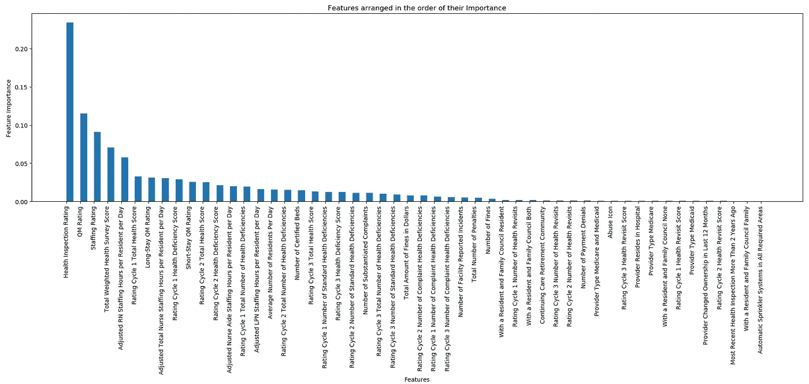**

****图八。特征重要性的顺序由随机森林分类器决定****

****结论:****

**当前的论文提供了回答提出的研究问题所需的方法、工具、技术和程序的详细描述。建立了两个机器学习模型(随机森林和支持向量机)，进行了广泛的分析和测试，以从训练的模型中获得洞察力。得出了相关结论，提供了答案。疗养院可以利用从数据中发现的丰富信息，并做出必要的决定来提高它们的总体评级。**

****限制:****

**随机森林模型的可解释性很低，因为它是决策树的集合。当树很大时，很难想象或解释它们。与随机森林的训练和测试相关联的存储器和计算成本很高。预测速度不是很快，对于时间敏感型应用来说可能是个问题(Jansen，2018)。**

**虽然有明确的规定，向养老院提供评级，但数据可能不准确。对于这种不准确的数据记录，模型可能不会给出相同的结果。**

****推荐未来分析:****

**当前数据定义了疗养院的不同属性和给予它的不同评级，以及与它的缺陷、处罚和罚款相关的信息。然而，它没有描述养老院所在的地理区域的社会经济因素。这些信息可以添加到数据集中，以丰富结果的质量并找到新的见解。**

**随着数据的增加，随机森林和 SVM 等模型无法很好地扩展。可以在数据集上训练高级模型(如神经网络)来克服这个问题。**

****参考文献:****

**医疗保险和医疗补助服务中心。(2019).提供商信息[数据文件]。于 2020 年 3 月 29 日从[https://catalog.data.gov/dataset/provider-info-1de34](https://catalog.data.gov/dataset/provider-info-1de34)取回**

**医疗保险和医疗补助服务中心。2020 年养老院设计对比五星级质量评级体系。**

**c .科尔特斯和 v .瓦普尼克(1995 年)。支持向量网络。机器学习，20(3)，273–297 页。**

**詹森斯特凡。算法交易的动手机器学习:基于使用 Python 从数据中学习的智能算法，设计和实施投资策略。Packt 出版公司，2018 年。**

**利奥，布莱曼和阿黛尔·卡特勒。“随机森林。”随机森林-分类描述。于 2020 年 5 月 10 日从 www.stat.berkeley.edu/~breiman/RandomForests/cc_home.htm[取回。](http://www.stat.berkeley.edu/~breiman/RandomForests/cc_home.htm)**

**Refaeilzadeh P .，Tang L .，Liu H. (2009)交叉验证。载于:刘，主编的《数据库系统百科全书》。马萨诸塞州波士顿斯普林格**