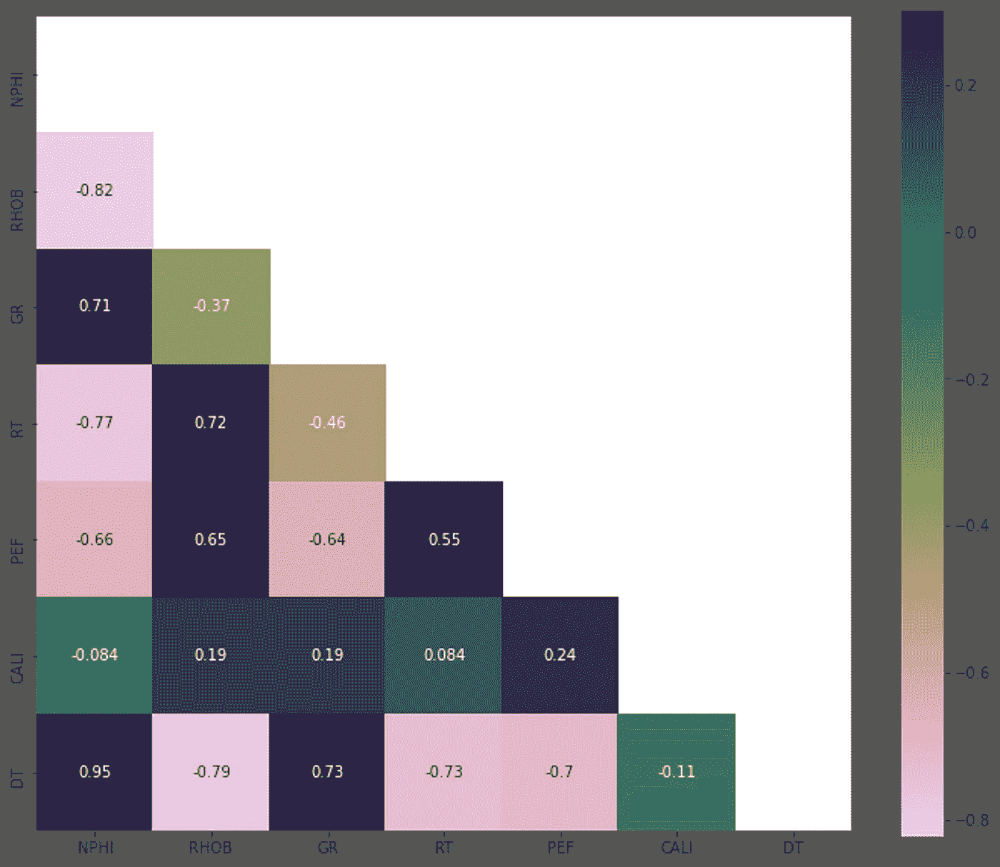

# 基于机器学习的 Volve 油田声波测井预测

> 原文：<https://towardsdatascience.com/prediction-of-p-sonic-log-in-the-volve-oil-field-using-machine-learning-9a4afdb92fe8?source=collection_archive---------21----------------------->

## [实践教程](https://towardsdatascience.com/tagged/hands-on-tutorials)

## 使用 Scikit-Learn 逐步解释


rsk Inspirer på Volve 来自 [Equinor 照片档案馆](https://communicationtoolbox.equinor.com/brandcenter/en/equinorbc/component/default/22936)

2018 年，挪威石油公司 Equinor 披露了北海 Volve 油田的大规模地下和作业数据集。两年来，对于所有热衷于改善和解决大学、研究机构和公司油气领域研究挑战的人来说，这是一个好消息。以下是来自“马科动物的首席运营官”[扬尼克·尼尔森](https://www.equinor.com/en/about-us/corporate-executive-committee/jannicke-nilsson.html)的一段鼓舞人心的话。

> “Volve 是我们如何寻找各种可能性来延长油田寿命的一个例子。现在，我们希望分享所有 Volve 数据，以确保未来解决方案的学习和开发。”

Volve 是一个油田，位于北海挪威区块南端斯塔万格以西 200 公里处，于 2008 年至 2016 年生产。

当我查看每个人都可以通过这个网站[访问的数据库](https://www.equinor.com/en/how-and-why/digitalisation-in-our-dna/volve-field-data-village-download.html)时，我看到了里面巨大的宝藏！我开始提出一些想法来探索引入机器学习的可能性，直到我想到了进行**声波测井预测**的想法，原因我在本文的**动机**部分中阐述。

我将这个项目保存在我的名为***volve-machine-learning***的 [GitHub](https://github.com/yohanesnuwara/volve-machine-learning) 资源库中(你可以访问这个资源库)。

## 数据集概述

在 Volve 油田开放数据库中，有 24 口井。在这项研究中，只使用了 5 口井。油井名称为 15/9-F-11A、15/9-F-11B、15/9-F-1A、15/9-F-1B 和 15/9-F-1C。


测井数据代表地球上的每个岩层( [Aliouane 等人，2012](https://www.intechopen.com/books/fractal-analysis-and-chaos-in-geosciences/well-logs-data-processing-using-the-fractal-analysis-and-neural-network) )

每口井都有他们所谓的**测井记录**。测井记录是代表深度范围内每个岩层属性的某些物理测量值。以下是我们将使用的日志列表。

*   NPHI 是地层孔隙度，单位为 v/v
*   RHOB 是地层体积密度，单位为克每立方厘米。
*   GR 是地层放射性含量，用 API 测量。
*   RT 是地层真实电阻率，单位为欧姆米。
*   PEF 是地层光电吸收因子，无量纲。
*   CALI 是钻孔直径，单位为英寸。
*   DT 是纵波传播时间，单位是微秒每英尺。
*   DTS 是剪切(横波)传播时间，与 DT 类似。

这些测井数据集的文件格式为 LAS 2.0，这是测井的一种特定格式。你可以在这里找到数据集。

## 动机

5 口井中有 3 口井(15/9-F-11A 井、15/9-F-1A 井和 15/9-F-1B 井)拥有这套完整的测井资料，**除了**之外，另外 2 口井(15/9-F-11A 井和 15/F-1C 井)没有 DT 和 DTS 测井资料。**这就是为什么**我们可以使用监督学习，通过回归模型在这个不完整的数据集中生成 DT 日志。

有 DT 日志的 3 个数据集作为**训练数据**，没有的作为**测试数据**。NPHI、RHOB、GR、RT、PEF 和 CALI 测井用作**特征**；而 DT 是用于预测的**目标**。目前，不会使用 DTS 日志。


scikit-从 [GitHub](https://github.com/scikit-learn/scikit-learn/blob/master/doc/logos/scikit-learn-logo.svg) 学习徽标

通过监督学习，这些训练数据会用[*Scikit-Learn*](https://scikit-learn.org/)*中的一些**回归模型**进行训练。*然后，该模型将用于根据特征预测产生新的 DT 测井曲线。

我将把工作流程分成**七个步骤**。您也可以在我的 GitHub repo 中访问我的 IPython 笔记本，它从头到尾运行这个工作流。

> **访问我的 IPython** [**笔记本**](https://github.com/yohanesnuwara/volve-machine-learning/blob/main/notebook/volve_p_sonic_prediction_final.ipynb)

## 第一步。显示测井数据集

一个名为 [*lasio*](https://lasio.readthedocs.io/en/latest/) 的 Python 库用于读取这些 LAS 数据集。在任何地层评价中，显示测井记录都是例行公事。以下是使用 *Matplotlib* 生成的其中一个训练数据 15/9-F-1B 井的显示。每个图代表一条测井曲线；正如我们已经讨论过的，NPHI、RHOB、GR、RT、PEF 和 CALI 是特征，而 DT 是目标。


1B 15/9 井的测井显示

以下是 15/9-F-1C 井的测井曲线显示，该井是没有 DT 测井的两口井之一，因此我们将预测产生一个新的 DT 测井曲线。


15/9-F-1C 井的测井显示

## 第二步。数据准备

第二步是工作流程中最关键的部分，因为它会影响整个预测的成功。*熊猫*对数据处理很有用。

首先，我们需要确保我们的整个数据不包含任何**非数字值** (NaNs)。过滤数据的一个技巧是**设置最小和最大深度限制**，这样所有数据**都以数值**开始和结束。例如，之前显示的 15/9-F-1B 井从 3100 米到 3400 米的深度开始。示例代码:

```
df = df.loc[(df['DEPTH'] >= 3100) & (df['DEPTH'] <= 3400)]
```

之后，我们检查数据中是否存在 nan。

```
df.isnull().sum()
```

如果一切归零，我们就安全了。在我们现在的情况下，它变为零，我们已经没有 NaNs 了。否则，我们需要处理 NaN 值。这个动作在[这里](https://jakevdp.github.io/PythonDataScienceHandbook/03.04-missing-values.html)详细讨论。

接下来，我们**将各个井数据集**合并到两个更大的单个数据框中，每个数据框用于训练和测试数据集。

```
df = pd.concat([df1, df2, df3])
```

现在我们有了训练和测试数据框架，最后我们分配井名。这样做的原因是为了便于我们在预测期间检索任何井。你可以在笔记本里看到我是如何分配井名的。

下面是训练数据的最终数据框。


训练数据帧

## 第三步。探索性数据分析

探索性数据分析(EDA)对于理解我们的数据至关重要。我们想知道的两件重要的事情是每个单独特征的**分布**和一个特征到另一个特征的**相关性**。

为了观察多元分布，我们可以在 *Seaborn* 包中使用一个 pair-plot。以下是特征和目标的多元分布。


训练数据集的配对图

我们从结对图中至少得到了 3 点。首先，我们观察大多数分布是如何偏斜的，并且**不是理想的高斯**，尤其是 RT。然而，对于机器学习，高斯或不太偏斜的数据是优选的。我们可以对这些数据进行标准化，这将在下面讨论。第二，我们可以看到数据里面的**离群值**。同样在下一部分，我们将讨论如何去除这些异常值。第三，我们看到一些数据对几乎**线性(因此高度)相关**，比如 NPHI 和 DT；和**反向相关**，比如 RHOB 和 DT。配对图说明了很多事情。

我们通过计算 [**Spearman 相关性**](https://en.wikipedia.org/wiki/Spearman%27s_rank_correlation_coefficient) 来查看更多特征和目标之间的相关性，并使用**热图**来可视化结果。以下是我们数据的 Spearman 相关热图。



训练数据的 Spearman 相关热图

只关注 DT 行，我们获得了 DT 和 NPHI 之间的 2 个最大相关(正相关为. 95)以及 DT 和 RHOB 之间的 2 个最大相关(负相关为. 79)。这个相关结果与我们之前在配对图中看到的结果相匹配。还有，除了 CALI，其他数据似乎都和 DT 有很高的相关性。CALI 似乎与其他特征也没有什么关联。

作为惯例，任何相关性非常低的特征都被排除在预测之外，因此 CALI 可以被排除。然而在这里，我将保留 CALI 作为一个特性。

## 第四步。正常化

我们以前从配对图中知道，大多数分布似乎是偏斜的。为了提高我们的预测性能，稍后，我们最好做一个归一化(其他人可能称之为**缩放**)。规范化是一种转换数据(不改变数据)以更好地分布数据的技术。

在进行任何标准化之前，我倾向于先对电阻率数据进行**测井转换。**

```
df['RT'] = np.log10(df['RT'])
```

然后，我用 *Scikit-Learn* 中的函数`fit_transform`进行规范化。有几种标准化技术；广泛使用的有**标准化**(用均值和标准差转换)和 **min-max** (用最小值和最大值)。在尝试了所有的方法后，我找到了使用[**Yeo-Johnson**](https://en.wikipedia.org/wiki/Power_transform#Yeo%E2%80%93Johnson_transformation)**方法**的**力量转换**技巧。

归一化后，我们可以看到数据现在是如何使用 pair-plot 再次分布的。


用 Yeo-Johnson 方法进行幂变换后的训练数据对图

看看 NPHI、DT 和 RT 现在如何不那么偏斜，更像高斯分布。虽然 RHOB 和 GR 分布看起来是多峰的，但归一化后它变得更加集中。

## 第五步。移除异常值

此外，我们刚刚观察到数据中有许多异常值。异常值的存在会降低预测性能。因此，我们做离群点剔除。

*Scikit-Learn* 提供了几种离群点剔除方法，如**隔离森林**、**使用椭圆包络的最小协方差**、**局部离群因子**、**单类支持向量机**。除此之外，最广泛使用的异常值去除方法，也是最基本的方法，是使用**标准差方法**。在这种方法中，我们将阈值指定为偏离标准偏差的最小值和最大值。我们可以自己建造。

```
threshold = 3
df = df[np.abs(df - df.mean()) <= (threshold * df.std())]
```

所有 5 种方法都已实现。我用两种方法来比较哪种方法去除异常值的效果最好。一种方法是对每种方法计算剔除异常值之前的数据和剔除异常值之后的数据。


标准化前后的数据计数

从该结果中，我们看到**标准差**方法移除的异常值最少(最多只有 302 个)，其次是**单类 SVM** 和**最小协方差**，与其他方法相比异常值相对较少(> 10，000)。您可能已经知道，**剔除的异常值越少越好**。

然后，为了决定标准差和一类 SVM 之间哪个更好，我使用*熊猫*为归一化前后的每个特征生成了**箱线图**。下面是箱线图。


关键的观察结果是，在剔除异常值前后，**异常值仍然存在于新计算的汇总统计数据的数据**中。这(间接地)是选择哪种方法是最好的直观表示。

现在，通过观察异常值的数量，可以看出**一类 SVM 比标准差方法表现得**更“干净”。尽管最小的协方差也是干净的，仍然一级 SVM 是赢家。

结论是:我们用**一级 SVM** 。同样，我们制作一个配对图来观察我们数据的最终结果。


使用一类 SVM 方法去除异常值后的训练数据对图

看看离群值现在是如何减少的。我们都为机器学习做好了准备。

## 第五步。预测！第一次尝试

现在主菜来了！第五步，我们还没有对我们的真实测试数据(没有 DT 测井的井 15/F-11B 和 15/F-1C)进行实际预测。耐心点！我们需要评估我们使用的每个回归模型的性能，方法是**训练训练数据，并用训练数据本身测试模型**，然后我们评估预测的 DT 日志与真实 DT 日志的接近程度。

> 在此步骤中，测试数据=训练数据

我尝试了来自 **Scikit-Learn** 的 6 个回归模型，分别是经典的**线性回归**、**随机森林**、**支持向量机**、**决策树**、**梯度推进**、**K-最近邻**回归器。

请记住，在完成预测后，我们总是需要对结果进行反规范化，因为我们刚刚进行了规范化。在 *Scikit-Learn* 中，我们使用一个`inverse_transform`函数来完成这项工作。

我使用 R 和均方根误差(RMSE)作为评分标准来衡量每个回归模型的性能。以下是每个回归变量的评分标准的结果。


6 个回归变量的评分标准

从结果来看，我们看到回归器的表现非常出色！可以理解为什么经典的线性回归器不如其他回归器(最低的 R 和 RMSE)表现得好。原因是并非所有的特征都是完美的线性相关的。

然后，我们可以显示真实的 DT 日志和预测的 DT 日志，以比较两者的接近程度。以下是使用梯度推进回归器对每口井预测 DT 测井的真实值。


使用梯度推进回归器的真实与预测 DT 测井

事实上，我使用的所有回归变量仍然使用默认的超参数。例如，梯度增强的几个超参数中的两个是估计器的数量和最大深度。默认值分别为 100 和 3。

根据梯度推进的评分标准，我们已经知道 R 和 RMSE 分别达到了 0.94 和 0.22 左右。我们可以进行**超参数调整**以确定最佳超参数值，从而提高性能得分。

## 第六步。超参数调谐

梯度推进回归器上的超参数调谐通过执行**训练-测试分割**开始，该分割由 0.7 训练和 0.3 测试组成。然后，通过产生的训练和测试分裂，进行具有定义的搜索超参数集的**网格搜索**和**三重交叉验证**。以下是搜索到的参数网格。

*   估计数`n_estimators` : 100 和 1000
*   最大深度`max_depth` : 10 和 100

调整超参数花费了大约 5 分钟，直到给出估计器数量为 **1，000，最大深度为**100 的结果作为最佳超参数。

然后，通过包含超参数重复前面的步骤，并打印新的得分度量，如下所示。


超参数调整后梯度增强的评分标准

R 和 RMSE 都提高了很多，分别是 0.98 和 0.12 左右！有了这个结果，我们有足够的信心使用梯度推进进行预测。以下是超参数调整后的真实与预测 DT 对数图。


超参数调整后使用梯度推进回归器的真实与预测 DT 测井

## 第七步。为最终预测编译调整后的梯度推进回归器

最后我们做真正的预测！现在，用之前根据我们的实际测试数据调整的超参数(估计数= 1000，最大深度= 10)编译梯度推进回归器。记住，我们真正的测试数据是没有 DT 测井的井；15/9-F-11B 井和 15/9-F-1C 井，或所谓的 2 井和 5 井。

以下是 2 井和 5 井的预测 DT 测井。


15/9-F-11B 井和 15/9-F-1C 井的预测测井曲线令人满意！为了关闭我们的工作流程，我们可以**将预测结果**导入到原始数据集并写入 CSV 文件。

以下是最终的 CSV 结果:井 [15/9-F-11B](https://github.com/yohanesnuwara/volve-machine-learning/blob/main/results/15_9-F-11B_Predicted_DT.csv) 和 [15/9-F-1C](https://github.com/yohanesnuwara/volve-machine-learning/blob/main/results/15_9-F-1C_Predicted_DT.csv)

## 结论

我们已经证明了监督学习在 Equinor 拥有的 Volve 油田公开数据集上的成功应用。通过这一工作流程，使用梯度推进方法，在两口原本没有压力声波测井记录的油井上预测了新的压力声波测井记录。

我希望这篇文章能为地球科学中的任何 ML 从业者带来新鲜空气，开始探索这个数据集中 ML 的其他可能性。与此同时，我正在考虑其他的可能性，我会在我的 [GitHub](https://github.com/yohanesnuwara/volve-machine-learning) ( **关注我的工作以获得更新**)中积极更新，并且很快会再写一篇！