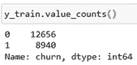
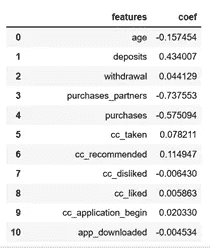
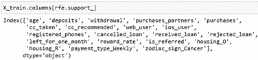

# 基于移动应用行为数据的客户流失预测

> 原文：<https://towardsdatascience.com/prediction-on-customer-churn-with-mobile-app-behavior-data-bbce8de2802f?source=collection_archive---------53----------------------->

## 通过数据处理、模型构建、验证、特征分析和选择深入研究逻辑回归建模


来自 Pixabay 的 Img 通过[链接](https://pixabay.com/photos/ux-prototyping-design-webdesign-788002/)

在之前的[文章](/logistic-regression-how-to-on-app-behavior-data-8a95802a988f)中，我们使用应用行为数据创建了一个逻辑回归模型来预测用户注册。希望你在那里学得很好。**这篇文章旨在基于更大的移动应用程序行为数据**，用新的技术和技巧提高你的建模技能。它分为 7 个部分。

1.商业挑战

2.数据处理

3.模型结构

4.模型验证

5.特征分析

6.特征选择

7.结论

现在让我们开始旅程🏃‍♀️🏃‍♂️.

1.  **商业挑战**

一家金融科技公司委托我们分析移动应用行为数据，以识别潜在的流失客户。目标是预测哪些用户可能会流失，因此公司可以专注于用更好的产品重新吸引这些用户。

2.**数据处理**

**EDA 应在数据处理前进行。**详细步骤在本[篇](https://medium.com/@vistaxjtu/exploratory-data-analysis-on-mobile-app-behavior-data-2777fc937973)中介绍。下面的视频是 EDA 后的最终数据。

2.1 一键编码

一键编码是一种将分类变量转换成数值变量的技术。它是必需的，因为我们要构建的模型无法读取分类数据。**一键编码只是根据唯一类别的数量创建附加功能。**在这里，具体来说，

```
dataset = pd.get_dummies(dataset)
```

以上自动将所有分类变量转换为数值变量。但是独热编码的一个缺点是**虚拟变量陷阱**。*这是一个变量之间高度相关的场景。*为了避免陷阱，必须删除一个虚拟变量。具体来说，

```
dataset = dataset.drop(columns = [‘housing_na’, ‘zodiac_sign_na’, ‘payment_type_na’])
```

2.2 数据分割

这是为了将数据分成训练集和测试集。具体来说，

```
X_train, X_test, y_train, y_test = train_test_split(dataset.drop(columns = ‘churn’), dataset[‘churn’], test_size = 0.2,random_state = 0)
```

2.3 数据平衡

## 不平衡类是分类中的常见问题，其中每个类中的观察值比例不成比例。但是如果我们在不平衡的数据集上训练一个模型会发生什么？该模型将巧妙地决定最好的事情是总是预测类 1，因为类 1 占用 90%的数据，所以该模型可以达到 90%的准确性。

这里有许多方法来对抗不平衡的类，例如改变性能指标、收集更多数据、过采样或下采样数据等。这里我们使用下采样方法。

首先，我们来考察一下 *y_train 中因变量的不平衡程度。*



图 1 因变量的不平衡分布:流失与否

如图 1 所示，因变量略有不平衡。为了对数据进行下采样，我们取每个类的指数，并在 *y_train* 的多个少数类中随机选择多数类的指数。然后连接两个类的索引，并对 *x_train* 和 *y_train* 进行下采样。

```
pos_index = y_train[y_train.values == 1].index
neg_index = y_train[y_train.values == 0].index
if len(pos_index) > len(neg_index):
    higher = pos_index
    lower = neg_index
else:
    higher = neg_index
    lower = pos_index
random.seed(0)
higher = np.random.choice(higher, size=len(lower))
lower = np.asarray(lower)
new_indexes = np.concatenate((lower, higher))
X_train = X_train.loc[new_indexes,]
y_train = y_train[new_indexes]
```

2.4.特征缩放

从根本上说，特征缩放是对变量范围的标准化。这是为了避免任何变量对模型产生显著影响。对于神经网络，特征缩放有助于梯度下降比没有特征缩放收敛得更快。

这里我们使用**标准化**来标准化变量。具体来说，

```
from sklearn.preprocessing import StandardScaler
sc_X = StandardScaler()
X_train2 = pd.DataFrame(sc_X.fit_transform(X_train))
X_test2 = pd.DataFrame(sc_X.transform(X_test))
```

3.**模型构建**

## 在这里，我们建立了一个逻辑回归分类器，用于流失预测。**实质上，逻辑回归使用独立变量的线性组合来预测一类概率的对数。**如果你想深入了解逻辑回归的更多细节，请访问这个[维基百科](https://en.wikipedia.org/wiki/Logistic_regression)页面。

具体来说，

```
from sklearn.linear_model import LogisticRegression
classifier = LogisticRegression(random_state = 0)
classifier.fit(X_train, y_train)
```

现在，让我们测试和评估模型。具体来说，

```
y_pred = classifier.predict(X_test)
from sklearn.metrics import confusion_matrix, accuracy_score, f1_score
cm = confusion_matrix(y_test, y_pred)
accuracy_score(y_test, y_pred)
f1_score(y_test, y_pred)
```

最后我们得到了一个 **0.61** 的精度和 **0 的 F1。61** 。表现不算太差。

4.**模型验证**

模型经过训练和测试后，一个问题是该模型推广到未知数据集的效果如何。我们使用交叉验证来衡量已知数据集和未知数据集之间的性能差异大小。具体来说，

```
from sklearn.model_selection import cross_val_score
accuracies = cross_val_score(estimator = classifier, X = X_train, y = y_train, cv = 10)
```

根据上述内容，我们发现 10 重交叉验证产生的平均准确度为 **0.64.5** ，标准偏差为 **0.023** 。这表明该模型可以在未知数据集✨✨.上很好地泛化

5.**特征分析**

有了 41 个特征，我们建立了一个逻辑回归模型。*但是如何知道在预测因变量时哪个特征更重要呢？*具体来说，

```
pd.concat([pd.DataFrame(X_train.columns, columns = [“features”]), pd.DataFrame(np.transpose(classifier.coef_), columns = [“coef”])],axis = 1)
```

如图 2 所示，我们发现两个特性非常重要: *purchase_partners* 和 *purchase* 。这表明用户的购买历史在决定是否流失时起着很大的作用。同时，这表明并非所有变量对预测都很重要。



图 2 变量对预测的重要性

6.**功能选择**

> 特征选择是一种为建模训练选择最相关特征子集的技术。

在这个应用中， *x_train* 包含 41 个特性，但是如图 2 所示，并不是所有的特性都起着重要的作用。**使用特征选择有助于减少不重要特征的数量，并以较少的训练数据获得相似的性能**。关于功能选择的更详细的解释可以在[这里](https://machinelearningmastery.com/rfe-feature-selection-in-python/)找到。

> 这里，我们使用**递归特征消除** (RFE)。它的工作原理是拟合给定的算法，按重要性排列特性，丢弃最不重要的特性，然后重新调整，直到达到指定的特性数。具体来说，

```
from sklearn.feature_selection import RFE
from sklearn.linear_model import LogisticRegression
classifier = LogisticRegression()
rfe = RFE(classifier, 20)
rfe = rfe.fit(X_train, y_train)
```

如上所述，我们设置选择 *20 个特性*。图 3 显示了所有选择的特性。



图 3 RFE 推荐的功能

太好了。使用 RFE 选择的功能，让我们重新训练和测试模型。

```
classifier.fit(X_train[X_train.columns[rfe.support_]], y_train)
y_pred = classifier.predict(X_test[X_train.columns[rfe.support_]])
```

最终我们得到了一个 **0.61** 的精度和 **0.61** 的 F1。与在 41 个特征上训练的模型相同的性能😇😇！

如果我们再次应用交叉验证，我们得到的平均准确度为 **0.647** ，标准偏差为 **0.014** 。同样，与之前的模型非常相似。

7.**结论**

最初，我们用 41 个特征训练了一个逻辑回归模型，达到了 0.645 的精确度。但是使用特征选择，我们创建了一个只有 20 个特征的轻型模型，精度为 0.647。一半的特征与决定客户流失无关。干得好！

**太好了！这就是全部的旅程！如果您需要源代码，请随时访问我的**[**Github**](https://github.com/luke4u/Customer_Behaviour_Prediction/tree/main/churn_prediction)**页面🤞🤞(仅供参考，回购正在积极维护中)。**