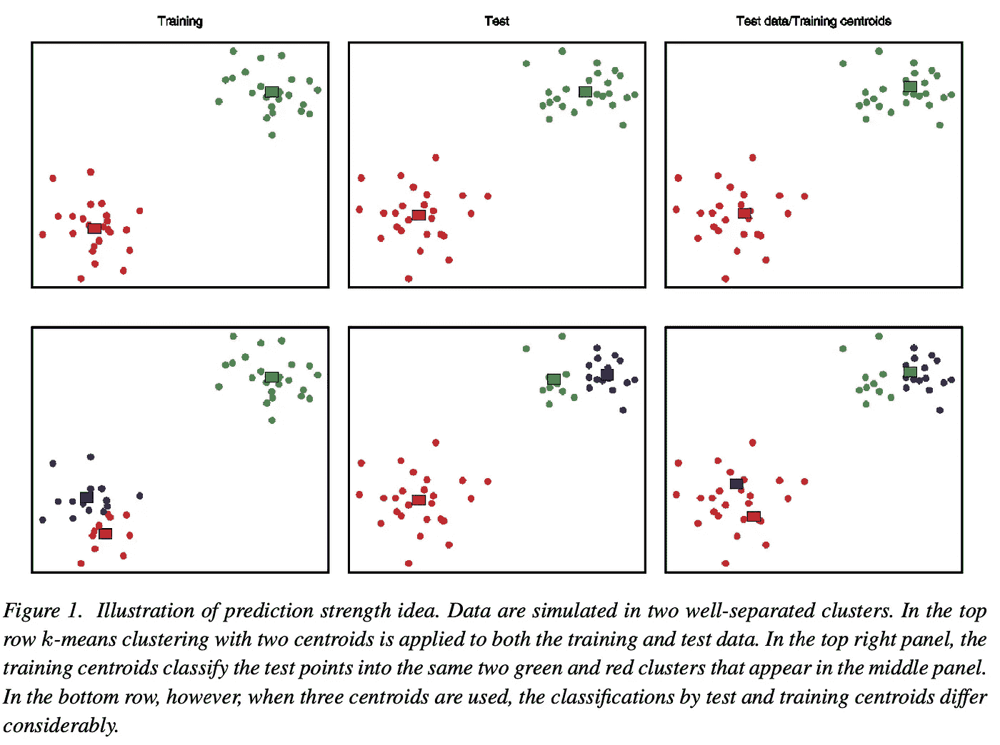
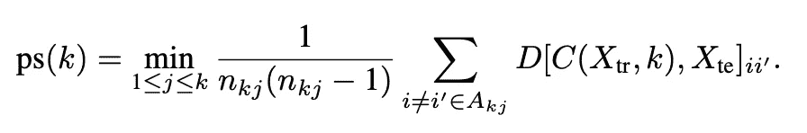
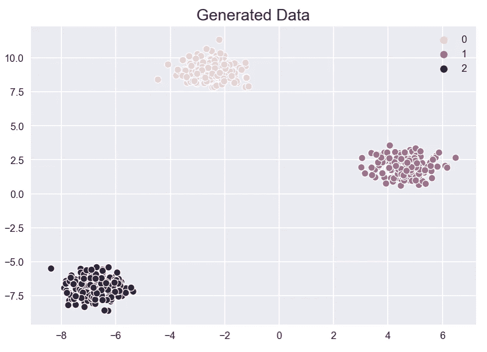
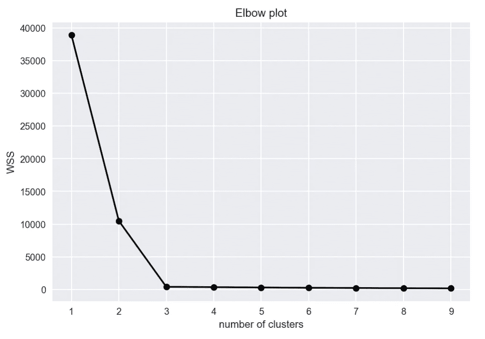
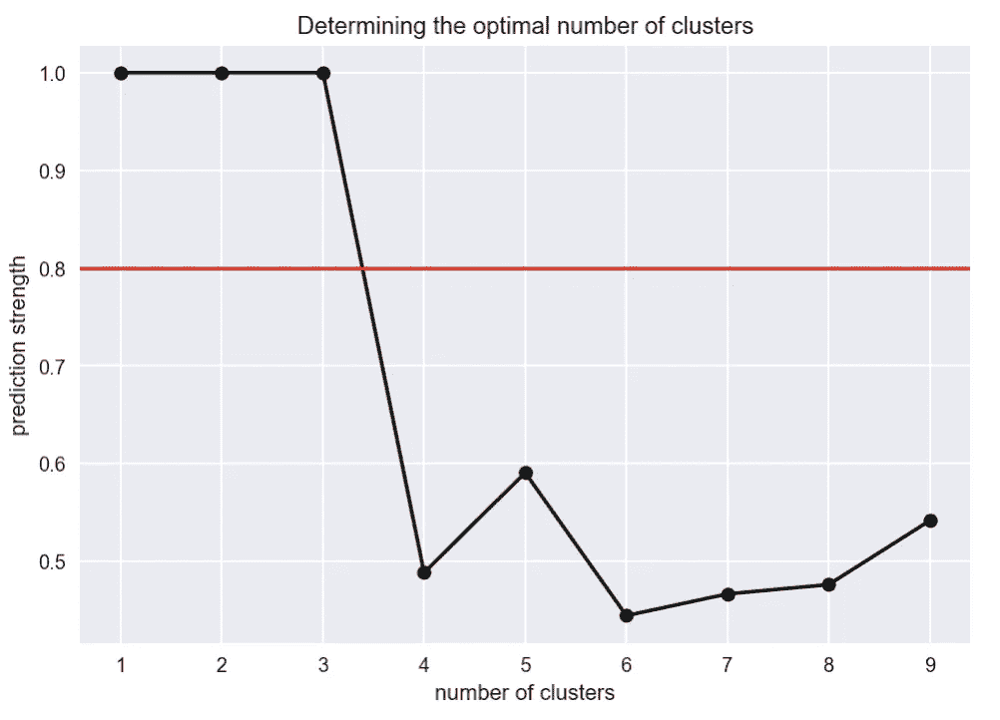

# 预测强度—一种简单但相对未知的评估聚类的方法

> 原文：<https://towardsdatascience.com/prediction-strength-a-simple-yet-relatively-unknown-way-to-evaluate-clustering-2e5eaf56643?source=collection_archive---------20----------------------->

照片由 [nrd](https://unsplash.com/@nicotitto?utm_source=unsplash&utm_medium=referral&utm_content=creditCopyText) 在 [Unsplash](/s/photos/market?utm_source=unsplash&utm_medium=referral&utm_content=creditCopyText) 拍摄

## 了解该标准如何工作，以及如何从头开始用 Python 实现它！

有很多内容(书籍、博客帖子、教程等。)的内容，以及在 k-means 聚类等算法中寻找最佳聚类数的各种方法:间隙统计、剪影得分、臭名昭著的肘(scree)图等等。

多亏了新冠肺炎和新发现的大量额外空闲时间，我终于可以回到我积压的书籍中，完成安德烈·布尔科夫的优秀作品*百页机器学习书籍*。这本书很好地概述了机器学习的各个方面，并鼓励读者深入他们感兴趣的话题。在阅读关于无监督学习和聚类算法的章节时，我遇到了一种评估聚类算法性能的新方法——预测强度。

经过快速搜索，我没有找到类似的文章，我确实认为这种方法很有趣，值得另起炉灶。所以让我们开始吧！

# 理论介绍

许多用于确定算法(如 k-means)的最佳聚类数的流行方法都是基于类内平方和(WSS)。该度量基于观测值和聚类质心之间的距离。一般来说，WSS 越低，观测值越接近质心，这表明拟合度越高。但是，我们需要在 WSS 和聚类数之间找到一个平衡点，因为无限增加聚类数(直到观察次数)总是会得到更好的拟合。

[1]中建议的**预测强度**方法从机器学习的角度来看识别最佳聚类数的问题。

我们将算法分解为以下步骤:

1.  将数据集分成训练集(X_tr)和测试集(X_te)。
2.  使用某个值 *k* (聚类数)对两个集合运行聚类算法。
3.  创建大小为`n_test` x `n_test`的**共同隶属矩阵** D[C(X_tr，k)，X_te],其中`n_test`是测试集中的观察值数量，C(X_tr，k)是适合训练集的聚类算法(在我们的例子中是 k-means)。
4.  如果测试集的元素 I 和 I '属于同一聚类，则将共同隶属矩阵的第 ii '个元素设置为 1，否则将其设置为 0。
5.  以便测量训练集质心预测测试集中的共同成员的程度。对于分配到同一测试聚类的每对测试观察值(在共同隶属矩阵中值为 1)，我们基于训练集质心确定它们是否也被分配到同一聚类。

下面来自[1]的图片说明了这个想法:

训练和测试指的是数据集。来源:[【1】](https://www.stat.washington.edu/wxs/Stat592-w2011/Literature/tibshirani-walther-prediction-strength-2005.pdf)

6.聚类的预测强度 C(.k)定义为:

其中 n_kj 是第 *j* 个星团中的观测值数量。

7.对于每个测试聚类，我们使用训练集质心计算该聚类中被分配到同一个聚类的观察对的比例。预测强度是这个量在 *k* 个测试集群中的最小值。

我们对所有考虑的集群大小运行上述算法的步骤 2-7。然后，我们选择预测强度高于某个阈值的最大聚类大小。作者进行的实验表明 0.8-0.9 是一个很好的阈值。

这可能有点难以理解，所以我建议仔细研究几次这个算法，以便理解这个想法。查看后面部分的代码也会有所帮助。

为了使这个过程更容易，我将尝试提供一些预测强度方法背后的直观解释。假设所选的聚类数等于数据集中的真实聚类数。然后，训练群集将类似于测试群集，并将很好地预测它们。因此，预测强度会很高。

相反，当所选的聚类数高于最佳聚类数时，附加的训练和测试聚类很可能是不同的，这将导致预测强度的较低值。

# **用 Python 实现**

是时候用 Python 实现预测强度算法了。我们将使用该标准来选择玩具数据集上 k-means 聚类中的最佳聚类数。此外，我们还将展示经典的肘图方法进行比较。首先，我们导入所有需要的库:

然后，我们使用`make_blobs`生成一个 2 维玩具数据集，其中有 3 个明显分开的簇。为了再现性，我们固定随机状态。

下图显示了生成的数据集。

生成数据后，我们应用 k 均值聚类。首先，我们使用肘图方法来确定最佳聚类数。我们将聚类的最大数量设置为 9。

在 k 均值聚类的`scikit-learn`实现中，`inertia_`属性存储总的类内平方和(WSS)。我们绘制了结果图:

我们可以清楚地看到“肘”点—它对应于 3 个集群，这与我们人工生成的数据相符。

是时候实现预测强度算法了。我的实现基于[3]中提供的实现，做了一些修改以使代码更简单易读。我们首先将数据分成训练集和测试集。为此，我们使用了`scikit-learn`中的`train_test_split`函数。我们采用 80-20 的分层比例。

在处理主函数之前，我们需要定义一个辅助函数。它用于确定给定观测值的最近质心(使用欧几里德距离)。

现在，我们定义主函数。在前半部分，我们创建并填充共同成员矩阵。我们使用嵌套循环和一组条件来确定矩阵中每个元素的正确值。在后半部分，我们计算每个聚类的预测强度，并选择最小值作为最终结果。

准备好函数后，我们为每个聚类大小拟合 k 均值聚类，并计算预测强度。请记住，在每次迭代中，我们实际上必须分别为训练集和测试集采用两种 k-means 算法。

下面我们可以看到绘制的结果。按照算法的逻辑，我们应该选择预测强度值高于指定阈值(在这种情况下为 0.8)的最大聚类大小。我们可以看到推荐的集群大小是 3。

# 结论

在本文中，我介绍了相对未知的聚类算法评估标准——预测强度，并展示了如何在 Python 中将它实现为一个自定义函数。您可以在下一次处理集群问题时尝试一下！

关于算法(R 中)的稍微不同但等价的实现，请参见[2]。这种方法可能更容易理解，因为作者减少了要检查的嵌套循环和条件的数量。

我们还可以应用于玩具示例的另一件事是置信区间，特别是对于非确定性聚类算法。它们基于多次计算预测强度和计算接收结果的平均值和标准偏差。记住，要这样做，我们必须从 k-means 聚类类中删除固定的随机状态。

您可以在我的 [GitHub](https://github.com/erykml/medium_articles/blob/master/Machine%20Learning/prediction_strength.ipynb) 上找到本文使用的代码。一如既往，我们欢迎任何建设性的反馈。你可以在[推特](https://twitter.com/erykml1?source=post_page---------------------------)或评论中联系我。

如果您对本文感兴趣，您可能也会喜欢:

 [## 在 scikit-learn 中编写自定义输入程序

### 了解如何创建自定义估算器，包括用于更高级用例的 groupby 聚合

towardsdatascience.com](/coding-a-custom-imputer-in-scikit-learn-31bd68e541de)  [## 使用投票分类器的集成学习

### 了解如何使用集成学习的变体来利用多个模型的优势

levelup.gitconnected.com](https://levelup.gitconnected.com/ensemble-learning-using-the-voting-classifier-a28d450be64d)  [## 以 scikit-learn 方式创建基准模型

### 了解如何为分类和回归问题创建一系列基准模型

towardsdatascience.com](/creating-benchmark-models-the-scikit-learn-way-af227f6ea977) 

# 参考

[1] Tibshirani，r .，& Walther，G. (2005 年)。通过预测强度进行聚类验证。*计算与图形统计杂志*， *14* (3)，511–528。—[https://www . stat . Washington . edu/wxs/stat 592-w 2011/Literature/TiB shirani-walther-prediction-strength-2005 . pdf](https://www.stat.washington.edu/wxs/Stat592-w2011/Literature/tibshirani-walther-prediction-strength-2005.pdf)

[https://github.com/echen/prediction-strength](https://github.com/echen/prediction-strength)

[3][https://github . com/aburkov/theMLbook/blob/master/prediction _ strength . py](https://github.com/aburkov/theMLbook/blob/master/prediction_strength.py)