# 预测分析:用 TensorFlow 中的 LSTM、GRU 和比尔斯特姆进行回归分析

> 原文：<https://towardsdatascience.com/predictive-analysis-rnn-lstm-and-gru-to-predict-water-consumption-e6bb3c2b4b02?source=collection_archive---------3----------------------->


在 [Unsplash](https://unsplash.com/) 上的[this is 工程](https://unsplash.com/@thisisengineering)拍摄

## 关于开发 LSTM、GRU 和比尔斯特姆模型进行用水量多步预测的分步指南

在这篇文章中，我开发了三个连续模型；LSTM、GRU 和双向 LSTM，预测气候变化影响下的用水量。然后，我用最可靠的一个对未来 10 年的城市用水量进行多步预测。

首先，让我提醒你一下基本面。然后，我将带您完成一个完整的 Python 数据科学项目。

**👩‍💻** [**上的 Python 代码 GitHub**](https://github.com/NioushaR/LSTM-GRU-BiLSTM-in-TensorFlow-for-predictive-analytics)

# 递归神经网络

递归神经网络(RNN)是一种设计用于使用时序数据的神经网络。在 RNNs 中，输出可以作为输入反馈到网络中，创建一个循环结构。

## 梯度消失问题

通过反向传播来训练 rnn。在反向传播过程中，RNNs 会遇到梯度消失问题。梯度是用于更新神经网络权重的值。梯度消失问题是当梯度随着时间向后传播而收缩时。因此，梯度较小的层不会学习，它们会导致网络具有短期记忆。

**💡❓** 渐变消失问题的解决方案是什么

# 长短期记忆

长短期记忆(LSTM)是一种专门的 RNN，以减轻梯度消失的问题。LSTMs 可以使用一种称为 gates 的机制来学习长期依赖关系。这些门可以了解序列中哪些信息是重要的，应该保留或丢弃。LSTMs 有三个门；输入，忘记，输出。

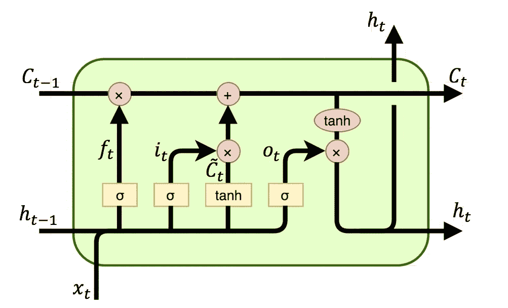

LSTM 细胞的结构

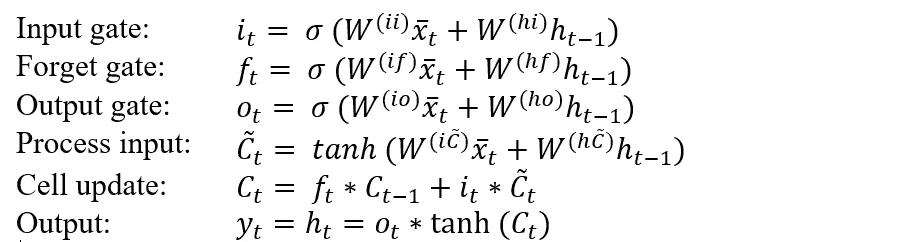

# 双向 LSTMs

双向 lstm(BiSTM)的思想是在 LSTM 模型中聚合特定时间步长的过去和未来的输入信息。在 BiLSTM 中，在任何时间点，您都可以保存过去和未来的信息。

# 门控循环单元

门控递归单元(GRU)是新一代的神经网络，非常类似于 LSTM。GRU 摆脱了细胞状态，使用隐藏状态来传递信息。GRU 和 LSTM 的另一个区别是 GRU 只有两个大门；复位和更新门。

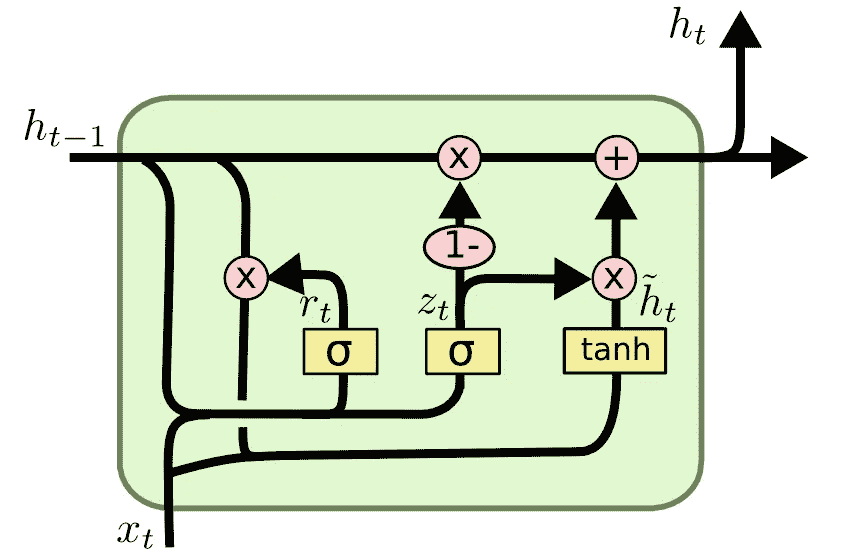

GRU 细胞的结构

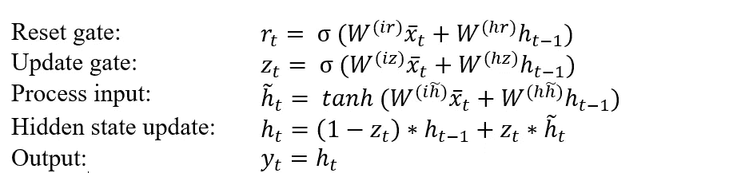

# ☺时间让我们的手 dirty❗

## 资料组

加拿大魁北克省的 Brossard 市被选为研究地点。这座城市是蒙特利尔大都市区的一部分。本项目**日用水量**数据取自 2011 年 9 月 1 日至 2015 年 9 月 30 日。收集同期**最低气温**、**最高气温**和**总降水量**。这些气候变量的测量数据来自[加拿大环境部](https://www.concordia.ca/news/stories/2019/01/07/historical-canadian-climate-data-is-now-only-a-few-clicks-away.html)。

## 导入库

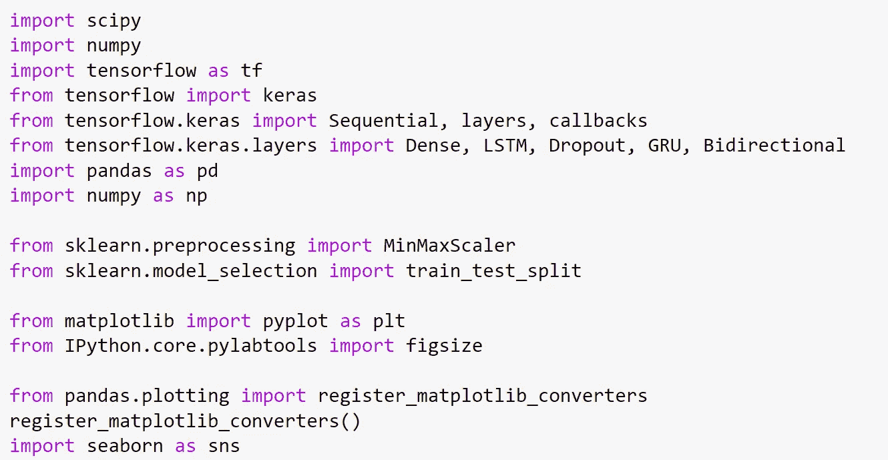

## 设置随机种子

设置随机种子以在每次运行代码后获得相同的结果。

```
**# Set random seed for reproducibility**
tf.random.set_seed(1234)
```

# 步骤 1:读取和浏览数据

在这个项目中，我正在处理多变量时间序列数据。当我从 CSV 文件导入数据时，我通过 **parse_dates = ['Date']** 确保 **Date** 列具有正确的 *DateTime* 格式。此外，当我处理日期和时间时，如果我将**日期**列设置为 dataframe 索引，就会变得容易得多。

```
**# Read file**
file = 'Data.csv'
raw_data = pd.read_csv(file, parse_dates = ['Date'],
                       index_col = 'Date')
df = raw_data.copy()
```

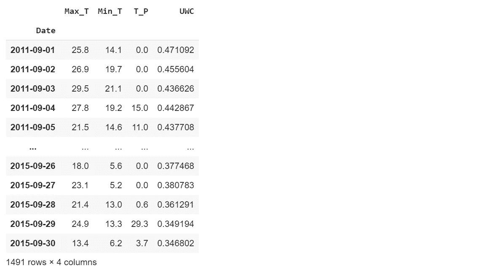

*   Max_T:最高温度(℃)
*   Min_T:最低温度(℃)
*   T_P:总降水量(毫米)
*   UWC:城市用水量(立方米/人.天)

```
**# Define a function to draw time_series plot**
def timeseries (x_axis, y_axis, x_label, y_label):
    plt.figure(figsize = (10, 6))
    plt.plot(x_axis, y_axis, color ='black')
    plt.xlabel(x_label, {'fontsize': 12}) 
    plt.ylabel(y_label, {'fontsize': 12})timeseries(df.index, df['WC (m3/capita.day)'], 'Time (day)','Daily Water consumption ($m^3$/capita.day)')
```

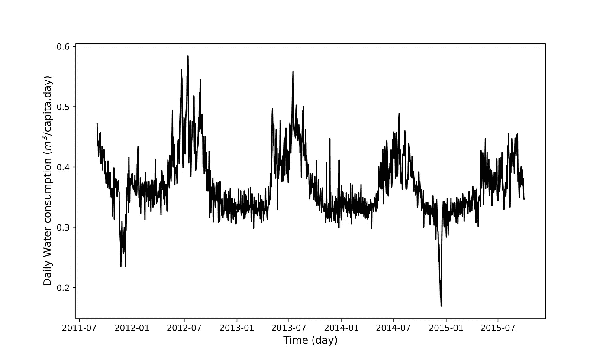

2011 年 9 月 1 日至 2015 年 9 月 30 日的日用水量时间序列

# 第二步:数据预处理

数据预处理是最耗时的步骤，包括:

*   处理缺失值
*   替换异常值
*   将数据集拆分为训练和测试数据
*   拆分目标变量和因变量
*   数据转换
*   创建 3D 输入数据集

## 2.1 处理缺失值

对于时间序列数据，使用线性插值替换缺失值是一个好主意。

```
**# Check missing values**
df.isnull().sum()
```

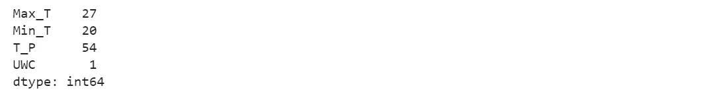

```
**# Replace missing values by interpolation**
def replace_missing (attribute):
    return attribute.interpolate(inplace=True)replace_missing(df['Max_T'])
replace_missing(df['Min_T'])
replace_missing(df['T_P'])
replace_missing(df['UWC'])
```

## 2.2 替换异常值

我使用统计方法来检测异常值。统计方法假设数据点呈正态分布。因此，低概率区域中的值被视为异常值。我在统计方法中应用了最大似然的概念，这意味着超出μ 2σ范围的值被标记为异常值。注意，在正态分布的假设下，μ 2σ包含 95%的数据。

```
**# Outlier detection**
up_b = df['UWC'].mean() + 2*df['UWC'].std()
low_b = df['UWC'].mean() - 2*df['UWC'].std()**# Replace outlier by interpolation for base consumption**
df.loc[df['UWC'] > up_b, 'UWC'] = np.nan
df.loc[df['UWC'] < low_b, 'UWC'] = np.nan
df['UWC'].interpolate(inplace=True)
```

## 2.3 将数据集分为训练和测试数据

在这个项目中，我将前 80%的数据设置为训练数据，剩下的 20%为测试数据。我用训练数据训练模型，并用测试数据验证其性能。

```
**# Split train data and test data**
train_size = int(len(df)*0.8)
train_dataset, test_dataset = df.iloc[:train_size],
df.iloc[train_size:]**# Plot train and test data**
plt.figure(figsize = (10, 6))
plt.plot(train_dataset.UWC)
plt.plot(test_dataset.UWC)
plt.xlabel('Time (day)')
plt.ylabel('Daily water consumption ($m^3$/capita.day)')
plt.legend(['Train set', 'Test set'], loc='upper right')print('Dimension of train data: ',train_dataset.shape)
print('Dimension of test data: ', test_dataset.shape)
```

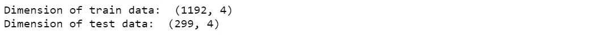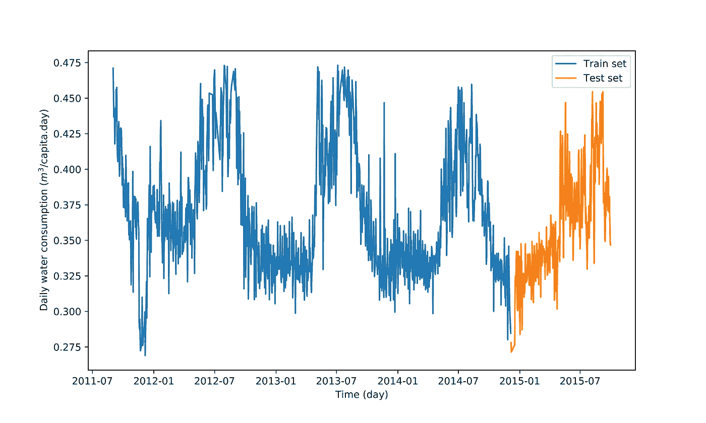

训练数据和测试数据的预处理日用水量时间序列

## 2.4 拆分目标变量和因变量

UWC 是目标变量(输出)，是因变量(输入)的函数；Max_T，Min_T 和 T_P。

```
**# Split train data to X and y**
X_train = train_dataset.drop('UWC', axis = 1)
y_train = train_dataset.loc[:,['UWC']]**# Split test data to X and y**
X_test = test_dataset.drop('UWC', axis = 1)
y_test = test_dataset.loc[:,['UWC']]
```

## 2.5 数据转换

一个很好的经验法则是，规范化的数据会在神经网络中产生更好的性能。在这个项目中，我使用来自 [scikit-learn](https://scikit-learn.org/stable/) 的 [MinMaxScaler](https://scikit-learn.org/stable/modules/generated/sklearn.preprocessing.MinMaxScaler.html) 。

我为输入和输出定义了不同的标量，因为它们有不同的形状。这对于使用**逆变换**功能尤其重要。

*   X_train.shape: (1192，3)
*   y_train.shape: (1192，1)
*   X_test.shape: (299，3)
*   y_test.shape: (299，1)

务必确保输出的比例在 0–1 范围内，以匹配 LSTM、GRU 和比尔斯特姆输出层的激活函数(tanh)的比例。此外，输入变量最好是小值，可能在 0-1 的范围内。

**💡****steps❓有哪些数据转换**

*   使用可用的训练数据拟合定标器(MinMaxScaler)(这意味着使用训练数据估计最小和最大可观测值。)
*   将缩放器应用于训练数据
*   将定标器应用于测试数据

值得注意的是，我们应该使用训练数据上安装的缩放器来缩放不可见的数据。

```
**# Different scaler for input and output**
scaler_x = MinMaxScaler(feature_range = (0,1))
scaler_y = MinMaxScaler(feature_range = (0,1))**# Fit the scaler using available training data**
input_scaler = scaler_x.fit(X_train)
output_scaler = scaler_y.fit(y_train)**# Apply the scaler to training data**
train_y_norm = output_scaler.transform(y_train)
train_x_norm = input_scaler.transform(X_train)**# Apply the scaler to test data**
test_y_norm = output_scaler.transform(y_test)
test_x_norm = input_scaler.transform(X_test)
```

## 2.6 创建 3D 输入数据集

LSTM、GRU 和比尔斯特姆采用 3D 输入(样本数、时间步数、特征数)。因此，我创建了一个助手函数， *create_dataset* ，来重塑输入。

在这个项目中，我定义 time_steps = 30。这意味着模型基于最近 30 天的数据进行预测(在 for 循环的第一次迭代中，输入携带前 30 天，输出是第 30 天的 UWC)。

```
**# Create a 3D input**
def create_dataset (X, y, time_steps = 1):
    Xs, ys = [], []
    for i in range(len(X)-time_steps):
        v = X[i:i+time_steps, :]
        Xs.append(v)
        ys.append(y[i+time_steps])
    return np.array(Xs), np.array(ys)TIME_STEPS = 30X_test, y_test = create_dataset(test_x_norm, test_y_norm,   
                                TIME_STEPS)
X_train, y_train = create_dataset(train_x_norm, train_y_norm, 
                                  TIME_STEPS)
print('X_train.shape: ', X_test.shape)
print('y_train.shape: ', y_train.shape)
print('X_test.shape: ', X_test.shape)
print('y_test.shape: ', y_train.shape)
```

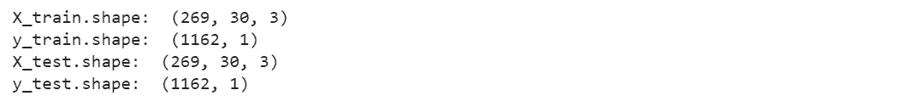

# 步骤 3:创建比尔斯特姆、LSTM 和 GRU 模型

# 3.1 tensor flow 中的比尔斯特姆、LSTM 和 GRU 模型

第一个函数， *create_model_bilstm* ，创建一个 BDLSM 并获取隐藏层中的单元(神经元)数量。第二个函数 *create_model* 获得两个输入；隐藏层中的单元数量和模型名称(LSTM 或 GRU)。

为了简单起见，比尔斯特姆、LSTM 和 GRU 在输入层有 64 个神经元，一个隐藏层包括 64 个神经元，在输出层有 1 个神经元。

为了使 LSTM 和 GRU 模型对变化具有鲁棒性，使用了**下降**函数。**掉线(0.2)** 随机掉线 20%的单位。

```
**# Create BiLSTM model**
def create_model_bilstm(units):
    model = Sequential()
    model.add(Bidirectional(LSTM(units = units,                             
              return_sequences=True),
              input_shape=(X_train.shape[1], X_train.shape[2])))
    model.add(Bidirectional(LSTM(units = units)))
    model.add(Dense(1))
    **#Compile model**
    model.compile(loss='mse', optimizer='adam')
    return model**# Create LSTM or GRU model**
def create_model(units, m):
    model = Sequential()
    model.add(m (units = units, return_sequences = True,
                input_shape = [X_train.shape[1], X_train.shape[2]]))
    model.add(Dropout(0.2))
    model.add(m (units = units))
    model.add(Dropout(0.2))
    model.add(Dense(units = 1))
    **#Compile model**
    model.compile(loss='mse', optimizer='adam')
    return model**# BiLSTM**
model_bilstm = create_model_bilstm(64)**# GRU and LSTM**
model_gru = create_model(64, GRU)
model_lstm = create_model(64, LSTM)
```

# 3.2 拟合模型

我用 100 个**时期**和**批量** = 32 的训练数据训练模型。我让模型使用 20%的训练数据作为验证数据。我设置 **shuffle = False** 是因为它提供了更好的性能。

为了避免过度拟合，我设置了一个*提前停止*，当*验证损失*在 10 个周期后没有改善时(耐心= 10)停止训练。

```
**# Fit BiLSTM, LSTM and GRU**
def fit_model(model):
    early_stop = keras.callbacks.EarlyStopping(monitor = 'val_loss',
                                               patience = 10)
    history = model.fit(X_train, y_train, epochs = 100,  
                        validation_split = 0.2, batch_size = 32, 
                        shuffle = False, callbacks = [early_stop])
    return historyhistory_bilstm = fit_model(model_bilstm)
history_lstm = fit_model(model_lstm)
history_gru = fit_model(model_gru)
```

## 绘制列车损失和验证损失

在此图中，我将查看每个模型中的时期数，并评估模型在预测中的性能。

```
**# Plot train loss and validation loss**
def plot_loss (history):
    plt.figure(figsize = (10, 6))
    plt.plot(history.history['loss'])
    plt.plot(history.history['val_loss'])
    plt.ylabel('Loss')
    plt.xlabel('epoch')
    plt.legend(['Train loss', 'Validation loss'], loc='upper right')plot_loss (history_bilstm)
plot_loss (history_lstm)
plot_loss (history_gru)
```

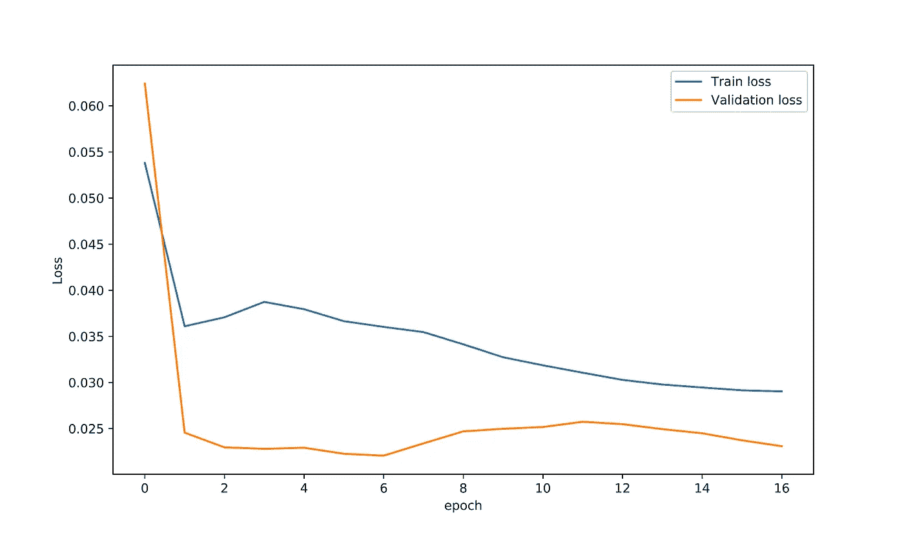

BiLSTM 的列车损失与验证损失

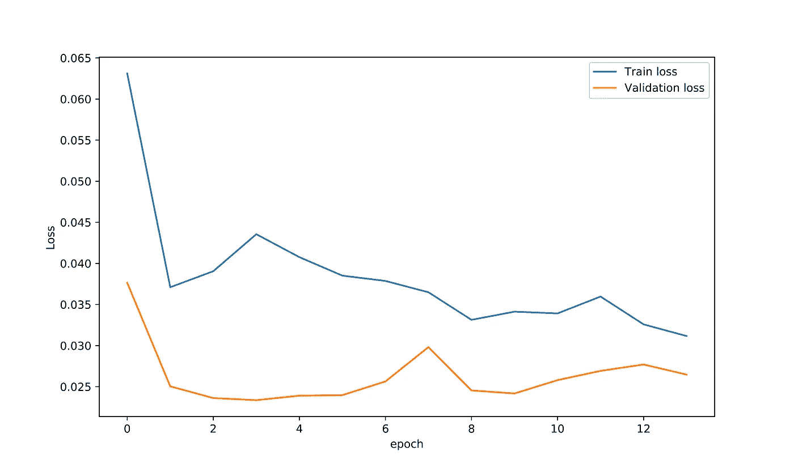

LSTM 的列车损失与验证损失

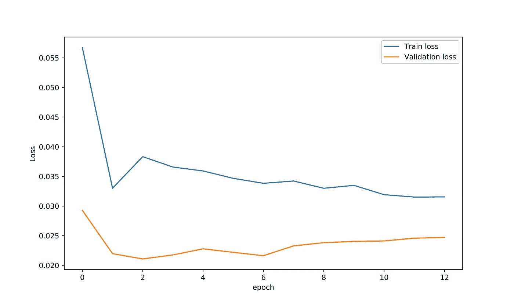

GRU 的列车损失与验证损失

# 3.3 逆变换目标变量

建立模型后，我必须使用**scaler _ y . inverse _ transform**将目标变量转换回原始数据空间，用于训练和测试数据。

```
y_test = scaler_y.inverse_transform(y_test)
y_train = scaler_y.inverse_transform(y_train)
```

# 3.4 使用比尔斯特姆、LSTM 和 GRU 进行预测

在这里，我用比尔斯特姆、LSTM 和 GRU 模型预测 UWC。然后，我绘制了三个模型的真实未来(测试数据)与预测。

```
**# Make prediction**
def prediction(model):
    prediction = model.predict(X_test)
    prediction = scaler_y.inverse_transform(prediction)
    return predictionprediction_bilstm = prediction(model_bilstm)
prediction_lstm = prediction(model_lstm)
prediction_gru = prediction(model_gru)**# Plot true future vs prediction**
def plot_future(prediction, y_test):
    plt.figure(figsize=(10, 6))
    range_future = len(prediction)
    plt.plot(np.arange(range_future), np.array(y_test), 
             label='True Future')     
    plt.plot(np.arange(range_future),np.array(prediction),
            label='Prediction')
    plt.legend(loc='upper left')
    plt.xlabel('Time (day)')
    plt.ylabel('Daily water consumption ($m^3$/capita.day)')plot_future(prediction_bilstm, y_test)
plot_future(prediction_lstm, y_test)
plot_future(prediction_gru, y_test)
```

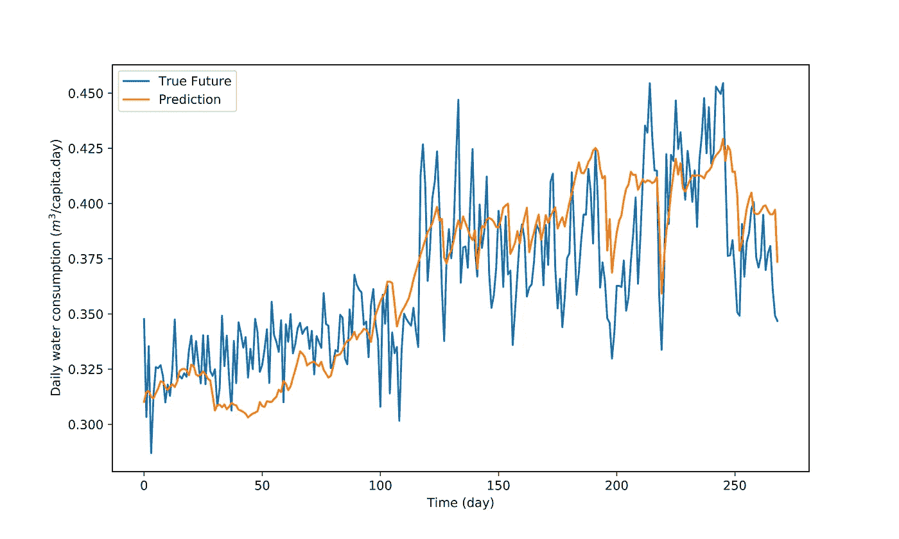

BiLSTM 模型的真实未来与日用水量预测

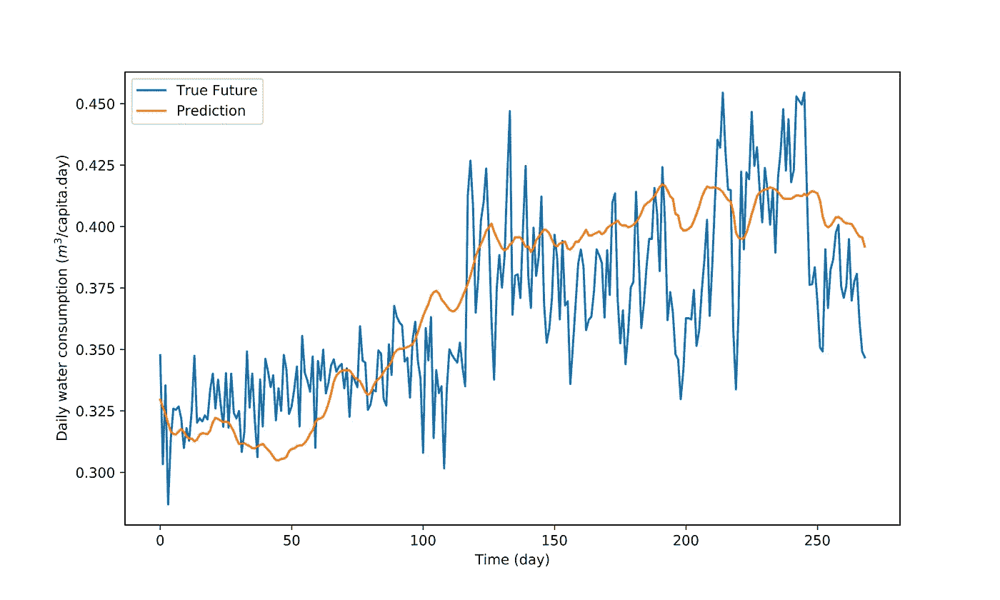

LSTM 模型的真实未来与日用水量预测

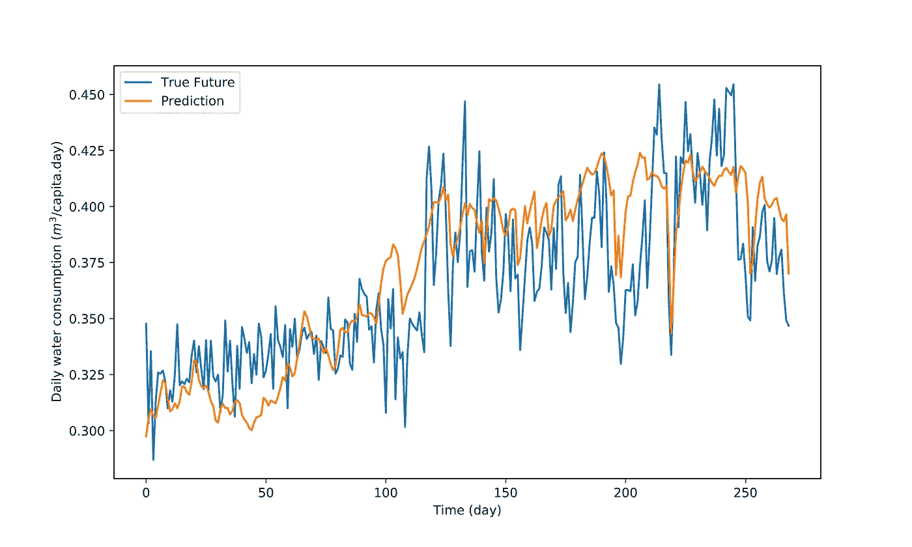

GRU 模型的真实未来与日用水量预测

# 3.5 计算 RMSE 和梅

让我用两个拟合优度来评估模型的性能。

```
**# Define a function to calculate MAE and RMSE**
def evaluate_prediction(predictions, actual, model_name):
    errors = predictions - actual
    mse = np.square(errors).mean()
    rmse = np.sqrt(mse)
    mae = np.abs(errors).mean()print(model_name + ':')
    print('Mean Absolute Error: {:.4f}'.format(mae))
    print('Root Mean Square Error: {:.4f}'.format(rmse))
    print('')evaluate_prediction(prediction_bilstm, y_test, 'Bidirectional LSTM')
evaluate_prediction(prediction_lstm, y_test, 'LSTM')
evaluate_prediction(prediction_gru, y_test, 'GRU')
```

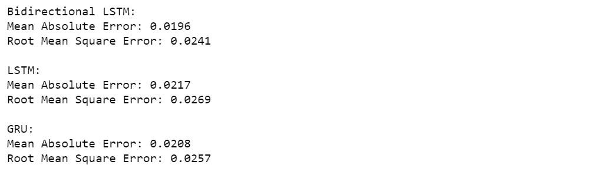

三个模型的拟合优度表明它们具有非常相似的性能。即便如此，与 LSTM 和 GRU 相比， **BiLSTM** 模型具有更高的准确性。因此，我使用 BiLSTM 模型对 UWC 未来 10 年进行多步预测。

⚠️ **注意:**这个项目的结果并不意味着 BiLSTM 比 LSTM 和 GRU 有更好的结果。这只是说明如何比较这些模型，以得出最可靠的预测。

# 步骤 4:10 年用水量的多步预测

我在研究地点导入气候数据预测，并对 2015 年 1 月 1 日至 2025 年 1 月 1 日期间的数据进行过滤。

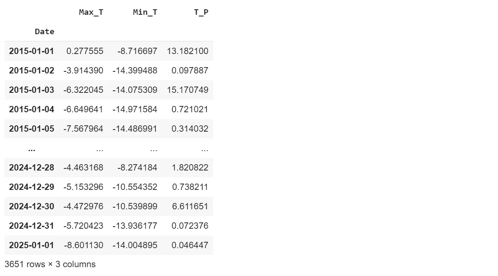

我创建了一个助手函数， *plot_history_future* ，来绘制历史和未来的 UWC。然后，我创建了一个函数， *forecast，*来重塑看不见的输入，并使用 LSTM 模型进行预测。

```
**# Plot histoy and future data**
def plot_history_future(y_train, prediction):
    plt.figure(figsize=(10, 6)) range_history = len(y_train)
    range_future = list(range(range_history, range_history +
                   len(prediction))) plt.plot(np.arange(range_history), np.array(y_train), 
             label='History')
    plt.plot(range_future, np.array(prediction),label='Prediction')
    plt.legend(loc='upper right')
    plt.xlabel('Time (day)')
    plt.ylabel('Daily water consumption ($m^3$/capita.day)')**# Multi-step forecasting** 
def forecast(X_input, time_steps):
    **# Scale the unseen input with the scaler fitted on the train set**
    X = input_scaler.transform(X_input)
    **# Reshape unseen data to a 3D input**
    Xs = []
    for i in range(len(X) - time_steps):
        v = X[i:i+time_steps, :]
        Xs.append(v) X_transformed = np.array(Xs)**# Make prediction for unseen data using LSTM model**
    prediction = model_bilstm.predict(X_transformed)
    prediction_actual = scaler_y.inverse_transform(prediction)
    return prediction_actualprediction = forecast(X_new, TIME_STEPS)
plot_history_future(y_train, prediction)
```

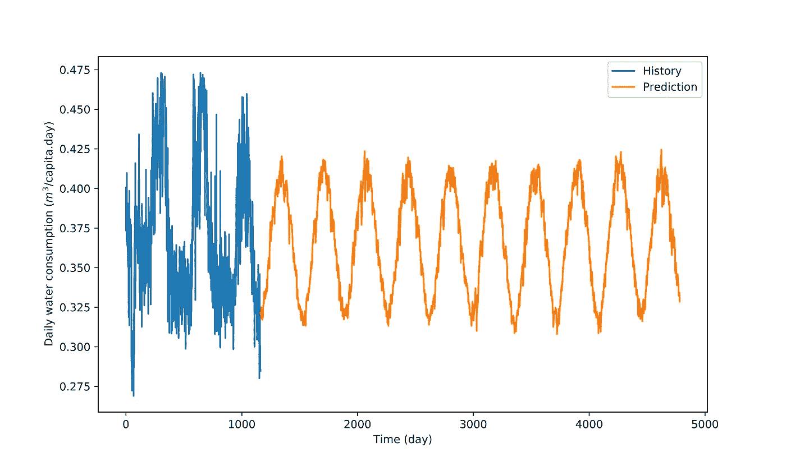

基于 BiLSTM 模型的日用水量历史与预测

# 结论

感谢您阅读这篇文章。我知道这是一个相当长的教程😏我希望它能帮助你在 Tensorflow 中为一个数据科学项目开发 LSTM、GRU 和比尔斯特姆模型😊

非常感谢您的反馈。你可以在 LinkedIn 上找到我。