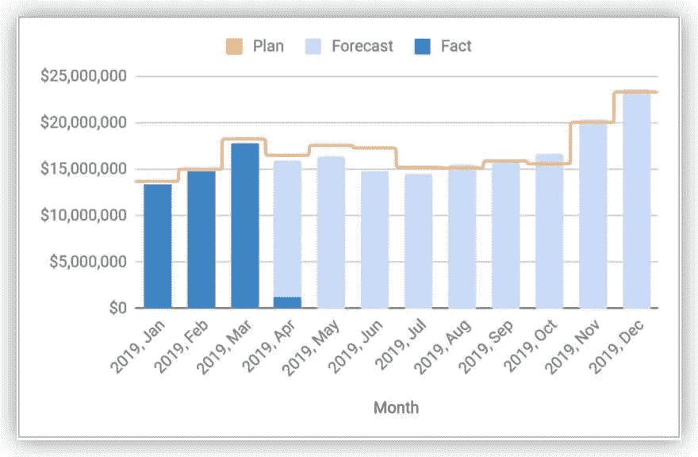

# 预测分析作为提高营销效率的工具

> 原文：<https://towardsdatascience.com/predictive-analytics-as-a-tool-to-increase-marketing-efficiency-5b4b9d922524?source=collection_archive---------50----------------------->

来源:[沉积照片](https://ru.depositphotos.com/8588391/stock-photo-analizing-data.html)

## 收集和存储数据的能力越来越强，为企业提供了更强的追溯和实时分析能力。现在，我们可以追踪模式并得出失败的结论，以免重蹈覆辙。或者我们可以确定最成功的解决方案，并重复我们的成功。

从长远来看，预测分析总是比回顾性或实时分析更有效，就像预防比紧急医疗护理更有效一样。回顾性分析本质上是一次解剖——对一个无法挽回的错误的分析。实时分析是此时此地做出反应的救护车，而预测分析是从一开始就将你从疾病中拯救出来的预防医学。

# 预测分析的概念

正如托马斯·达文波特所说，没有人有能力收集和分析来自未来的数据。但是我们有机会利用过去的数据预测未来。这被称为预测分析，事实上，许多公司已经在使用它。您可以使用过去的数据来:

1.  计算客户的终身价值(CLV)。这个指标将帮助你了解客户在一生中会给你的公司带来什么价值，包括未来的收益。
2.  根据你网站的用户行为数据开发最佳推荐。
3.  预测客户将来可能会购买什么产品或服务。
4.  预测客户流失。
5.  制定下一季度/六个月/一年的销售计划和预测。

所有这些都是预测分析的简单形式。让我们看看流行的预测分析方法。

# 预测建模

我们可以确定预测建模的以下阶段:

*   原始数据收集
*   统计模型形成
*   预测
*   随着额外数据的出现，检查/修订模型

预测模型分析用户过去的行为，以评估他们在未来表现出特定行为的可能性。这种类型的分析还涉及发现数据中微妙模式的模型，例如检测欺诈。

通常，当用户在执行转换操作的途中通过转换漏斗时，预测模型会立即进行计算，例如，评估用户实现目标的概率。有了关于从漏斗中的一个步骤过渡到另一个步骤的可能性的准确数据，企业可以更好地管理阻止或帮助用户通过漏斗的因素，并且可以更准确地描述不同类别的客户的行为模式。

# 您可以在哪里使用预测分析？

普通用户的智能手机上大约有 50 个应用程序。它们中的每一个都接收、传输和生成数据。这些数据以不同的格式存储在不同的服务中。虽然乍一看，这似乎是营销人员的一个积极因素，但有效地处理如此大量的结构化和非结构化数据是一个问题。

让我们看几个成功应用预测分析结果的公司的例子。

## 亚马逊使用预测营销…

…根据用户过去的行为向他们推荐产品和服务。根据一些报告，这种推荐给亚马逊带来了高达 30%的销售额。此外，亚马逊计划开发一种工具，根据预测，甚至在订单在网站上下单之前，就可以将产品送到预期订单所在的区域，从而缩短向客户交付商品的时间。

## 梅西百货

梅西的团队利用预测分析进行更准确的直接营销。在三个月的时间里，该公司通过捕捉用户浏览的产品类别数据并相应地发送个性化电子邮件，将其在线销售额从 8%提高到 12%。

## 哈雷戴维森使用预测分析…

…锁定潜在客户，吸引潜在客户，达成交易。他们识别出准备购买的最有价值的潜在客户。然后，销售代表直接联系这些潜在客户，并引导他们通过销售过程找到最合适的报价。

## 缝针

StitchFix 是另一家拥有独特的基于预测的销售模式的零售商。注册 StitchFix 时，用户需要完成一项关于他们风格的调查。然后应用预测分析模型为顾客提供他们最可能想要的衣服。如果顾客不喜欢他们收到的衣服，他们可以免费退货。

## Sprint 使用人工智能算法来识别有流失风险的客户…

…并预防性地提供关于如何保留它们的必要信息。Sprint 的人工智能预测客户想要什么，并在他们最有可能离开公司的时候为他们提供报价。自从引入这一人工智能系统以来，Sprint 的流失率大幅下降，客户对该公司的个性化服务和有针对性的优惠给予了优异的评价。如您所见，预测客户流失是 SaaS 和电子商务企业预测分析的一项可行任务。

以下是预测分析范围内最受欢迎的指标列表:

1.  客户外流比率(流失率)
2.  销售计划预测
3.  客户终身价值

# 如何实施预测分析？

如果没有营销和分析部门的合作，没有对研究目标和数据既定顺序的理解，引入预测分析是不可能的。执行预测分析的过程如下:

1.  定义你的假设
2.  收集内部和外部数据以构建模型
3.  定义度量标准来衡量模型的准确性
4.  使用现成的服务或开发自己的服务:

*   建立一个 MVP
*   在缺少准确性参数的情况下训练模型，以获得稳定的工作版本
*   创建界面或报告
*   更新或重新训练模型以满足新的要求

在数据收集阶段，确保您已经建立了端到端分析，因为没有它，实施预测分析通常是无效的。

# 预测分析服务

根据德勤(Deloitte)的《CMO 调查:2019 年春季报告》，基于营销分析的商业决策比例在 2019 年初达到峰值(考虑到过去六年的数据)。根据 MarketsandMarkets 的一项研究，预测分析市场将从 40 亿美元增长到 2022 年的 120 亿美元以上

对营销分析的普遍兴趣，尤其是对预测分析的兴趣，鼓励公司开发易于使用的解决方案和服务，使企业更容易获得预测分析。

以下是其中一些服务:

# OWOX 商业智能洞察

*   [OWOX BI 产品](https://www.owox.com/forecast-marketing-performance/)帮助公司实现营销目标，并以高于市场平均水平 22%的速度增长。
*   G2 在“营销软件-分析”和“电子商务分析软件”类别中的 2019 年春夏排行榜中名列前茅。
*   将有关营销计划实施的预测直接发送到您的电子邮件中。

图片由作者提供

OWOX BI:

*   结合各种来源的营销数据，使其可用于 Google BigQuery 的分析。
*   使用自己的基于漏斗的归因模型确定每个用户步骤的价值。
*   自动构建报告以分析营销效果。
*   展示您的销售计划将如何实施，您的增长领域和弱点是什么，以及您的市场份额如何变化。

# 暗示

Infer 提供的预测模型将帮助您结合所有数据源，全面了解您的销售线索在销售漏斗中的位置。[推断](https://infer.com)跟踪来自在线来源和公共数据库的信号，然后根据以前的主要账户和您设定的规则创建预测模型。Infer 获得的数据将有助于营销人员和销售专家寻找未来可能转化为客户的线索，并优化整体销售漏斗。

# 半径

Radius 提供几种数据分析服务，重点是预测性 B2B 营销。主要特性包括:

*   Radius 客户交换(RCX)，将您的公司简介与拥有相同受众的其他公司进行比较，让您有机会一起工作并创建自己的营销列表。
*   Radius 连接:向 Salesforce 提交预测数据。

Radius 平台还帮助营销人员在部门之间交换数据，并在内部数据库中找到新账户。和 Infer 一样，Radius 也是一个基于云的系统。

# 板

基于预测建模的规则，BOARD 在一个具有实时仪表板的自适应界面中工作。

这意味着您可以对各种场景建模并分析可能的结果，而不必每次都创建新的模型。

[BOARD](https://www.board.com/en) 带有几个内置连接器，因此您可以从几乎任何来源提取数据——您的 ERP 系统、云数据库、OLAP 魔方，甚至平面文件。你也可以使用 BOARD 的工具将你的预测转化为定制应用。

# TIBCO 数据科学

[TIBCO 数据科学](https://www.tibco.com)是一款相对较新的产品，于 2018 年 9 月发布。TIBCO Data Science 作为一个单一平台创建，结合了 TIBCO 前几代服务的功能:TIBCO Statistica、Spotfire Data Science、Spotfire Statistics Services 和 TERR。

数据科学服务帮助组织更快地创新和解决复杂问题，将预测快速转化为最佳解决方案。

# SAS 高级分析

SAS 拥有预测分析市场 33%的份额和 40 年的经验；它们为用户提供了基于许多可视化编辑器的高级数据分析功能。SAS 高级分析的主要功能基于图表、自动流程图、嵌入式代码和自动时间规则。

根据用户评论，SAS Advanced Analytics 在预测和分析整体移动方面表现出色，可以相对较快地处理大型数据集。SAS 提供免费的产品演示和知识库来帮助您开始使用它们。

# 快速采矿机

该软件允许您根据时间间隔自动创建报告。由于 60 多个内置集成，您可以导入自己的数据集，并将其导出到其他程序。

扩展提供了更大的灵活性(异常检测、文字处理、web 挖掘)，但可能不包括在基本订阅价格中

虽然 [RapidMiner](https://rapidminer.com) 是为数据科学家设计的，但它很容易安装和开始使用。

# IBM SPSS

IBM SPSS 使用基于统计的数据建模和分析。该软件适用于结构化和非结构化数据。它可以在云中、本地或通过混合部署来满足任何安全性和移动性要求。

您可以使用现有数据在 SPSS 可视化编辑器和建模仪表板中构建预测模型。对非结构化数据的高级支持包括语言技术和自然语言处理，因此您可以在模型中包括来自社交网络和其他基于文本的来源的数据。

# SAP HANA

SAP HANA 在本地或云中提供数据库和应用程序。该软件通过为大型外部数据集和直观可视化添加连接器，减少了创建模型所需的时间。

您还可以将预测分析库(PALs)连接到 SAP HANA，以从大型数据集获得额外的洞察力。对于以客户为中心的行业，该软件提供文本和社交媒体数据分析，以预测未来的客户行为，并根据过去的行为推荐产品。

SAP HANA 与 R 编程语言兼容，因此您不需要学习新的语言来配置您的查询。当您的系统集成了足够多的内部数据时，预测模型会自动提供新的见解。

# 总结

营销中的预测分析是一个强大的数据科学工具，其功能无法在一篇文章中涵盖。

提醒一下，以下是预测分析的三条戒律:

*   从基础开始:检查数据的质量，并自动收集数据以消除人为错误。训练模型的质量取决于训练数据的质量。
*   永远不要远离你研究的目标，因为重要的不是过程，而是结果。
*   遵守精度要求。请记住，您的预测结果只能通过测量经过验证的模型在应用于您的数据时的准确性来验证。