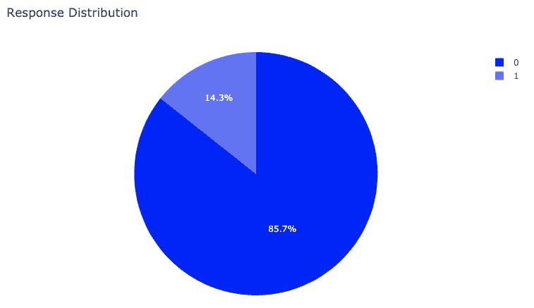

# 支持向量机(SVM)和 Plotly 的客户预测分析

> 原文：<https://towardsdatascience.com/predictive-analytics-on-customer-behavior-with-support-vector-machines-svm-7e68fd2be610?source=collection_archive---------12----------------------->

## 现实世界中的数据科学

## 围绕客户行为和人口统计的大数据的兴起，为利用预测分析的数字营销战略打开了一个可能性的世界。

营销和客户分析是当今世界最热门的数据科学应用领域之一。为了利用可用数据，现代企业需要分析工具来提供他们所需的洞察力，以提供个性化的消费者体验。在本文中，我们将探索一种被称为支持向量机(SVM)的监督机器学习算法。像这样的分类算法可以增加我们对客户的了解，并改进我们的营销和参与策略。

美国宇航局在 [Unsplash](https://unsplash.com?utm_source=medium&utm_medium=referral) 拍摄的照片

# 背景

现代客户的特点是他们对控制、连通性和便利性的需求。竞争日益激烈的全球市场将控制权交到了客户手中。当他们想要的时候，他们知道自己想要什么。惊喜！就是现在。

社交媒体和其他资源赋予了客户权力，使他们能够研究、探索、分享和比较。现代消费者关注其他人的评论和意见，一个感性的评论可以成就一个品牌，也可以毁掉一个品牌。

最后，现代消费者已经完全颠覆了对便利的传统理解。现代技术创造了对媒体和服务的期望，只需按一下按钮就可以获得。*很快，Alexa 就会在我们用完纸巾的前一天，根据世界各地流感爆发的数据，结合我们认为她没在听时记录的喷嚏频率，自动给我们送来一盒新纸巾。(这是我在 Covid 打之前写的…)*

# 目标

换句话说，真正的便利意味着客户需要的产品会来到他们身边。为了在顾客所在的地方见到他们，你必须了解他们。个人主义时代创造了独特的消费者，他们只会对迎合他们的营销体验做出反应。

通过这个项目，我们将探索汽车保险销售的客户数据。我们的目标是发现什么样的营销方法对特定的客户群最有效。到这个项目结束时，我们将能够根据客户的人口统计数据和过去的行为数据来预测客户是否会对销售电话做出回应。

在我的 [GitHub](https://github.com/npworrell/CustomerAnalyticsSVMandPlotly) 上找到数据和 Jupyter 笔记本

首先，我们将首先探索我们的客户群…

# 使用 Plotly 进行探索性数据分析(EDA)

导入包。Plotly 是 Python 中现代数据可视化的标准。

我们对这个项目感兴趣的主要变量是“响应”。它是一个二元变量，表示客户是否对营销电话作出了回应。

接下来，我们将探讨销售人员采取的行动如何影响回复率。这些因素是**销售渠道**和**更新报价类型**。为了快速执行描述性分析，我们将利用 [**Plotly Express**](https://plot.ly/python/plotly-express/) ，一个 Plotly 图形对象的高级包装器。

从第一张图中，我们发现代理人的成功率似乎最高。第二个图表显示，要约类型 3 和 4 相对无效。

现在，让我们探索一些人口统计信息，看看什么类型的客户最有可能对我们的营销优惠做出回应。

受教育程度较高的人似乎不太可能对工作做出回应。与第一张图表类似，拥有豪华汽车的客户似乎不太可能对报价做出反应。

如何才能进一步探究财富与回复率之间看似负相关的关系？

该图进一步支持了当前的营销努力对低收入客户更有效的观点。但是，它也显示了这个样本中的大多数客户都属于低收入阶层。

在我们进入分类模型之前，让我们看看哪些特征与我们的响应变量具有最强的相关性。

# 连续变量回归分析

当因变量为二元时，逻辑回归是适当的回归分析。逻辑回归用于描述数据，并解释一个因变量和一个或多个自变量之间的关系。

在这种情况下，我们将使用逻辑回归来确定哪些变量(如果有的话)对客户响应销售电话的概率有影响。

我们可以从收入的 **p 值**、每月保费汽车、自上次索赔以来的月数、自保单生效以来的月数、公开投诉数量、保单数量中看到，这些输入变量似乎与目标变量**响应**具有**显著关系**。“coef”栏告诉我们，这些变量都与响应**负相关**。

## 我们如何解释 P 值？

p 值评估样本数据支持零假设的程度。在这种情况下，我们的零假设是变量对于预测因变量 Response 是不重要的。

p 值只有在与 alpha 值比较时才有用。小于标准α值 0.05 的 p 值可被认为对因变量有显著影响。

换句话说，p 值是在零假设为真的情况下，观察到该样本中变量之间这种关系的概率。

> 如果在随机抽取样本的人群中，零假设是正确的，那么在我们现有的样本量中，得到至少和我们得到的一样极端的检验统计量的可能性有多大？彼得·弗洛姆

# 分类变量回归分析

## 标签编码

大多数机器学习算法需要将分类变量转换为数值，并且许多算法的性能根据分类变量的编码方式而变化。在这种情况下，我们所有的分类数据都是名义数据，而不是序数数据。

如您所见，每个类别都被赋予一个从 1 到 N 的值(其中 N 是特性的类别数。)

婚姻状况、续保类型、销售渠道、车辆大小、政策变量的 p 值在 0.05 显著性水平上显著。同样，这些变量与响应有**负关系**。

# 连续变量和分类变量的回归分析

我将让您自己检查这个输出。你能告诉我们在分类模型中包含哪些重要的变量吗？一个有趣的观察是，具有更高**客户终身价值**的客户似乎不太可能响应营销电话。

那么，为什么我们花了这么多时间去寻找“重要的关系”呢？这是被称为特征工程的过程的一部分。如果我们想要使用分类算法来预测未来的客户是否会对营销电话作出响应，我们想要查看那些与因变量有显著关系的特征(变量的别称)。去掉对结果没有影响的变量有很多好处。它不仅降低了模型中的噪声，还降低了模型训练所需的处理能力。

# 支持向量机分类算法

支持向量机是一种监督 ML 算法，可用于分类和回归。在此算法中，每个数据项都被绘制为 n 维空间中的一个点(其中 n 是您拥有的要素数量。)然后，找到在 N 维空间中最好地分离类别的超平面。

让我们用这幅插图*来探索一下**超平面**的概念，这是我花了太长时间拼凑的*:

**支持向量**是来自最接近超平面的每个类的数据点。SVM 的目标是最大化两个阶级之间的**差距**。如果我们移动上面例子中的一个支持向量，超平面也会随之移动。

在我们没有像上面例子那样的线性可分数据的情况下(这在现实中是经常发生的)，内核的**技巧**就派上用场了。内核技巧背后的思想是将非线性可分离的数据映射到一个更高维的空间，在那里我们可以创建一个超平面来实际分离这些类。请看这张令人惊叹的 GIF 图片:

我们将把内核技巧留给另一个项目。现在，让我们继续把我们的数据分成训练集和测试集。这是数据科学过程中的一个关键步骤，它允许您诚实地评估模型的性能。这一过程有助于保护您的模型不过度拟合。但是，如果您的样本不能代表您希望将模型应用到的人群，那么您如何对数据进行分割并不重要。

我们将使用的另一种方法是交叉验证。如下图所示，它将数据分割成您选择的 K 个(在本例中，K=5)集合。K-1 个子集用于训练我们的数据，最后一个子集用于测试。我们将 K 个“折叠”的平均准确度作为我们的最终度量。

有关训练/测试分割和交叉验证的更多信息，请查看本文

Scikit-Learn 屡试不爽。让我们看看这个模型能做什么。

正如我们所看到的，训练/测试分割和交叉验证技术都产生了非常可靠的指标。基于这一结果，我们对利用这一模型预测客户回复率的能力充满信心。

# 结论

如果给我们一份客户名单和他们的人口统计数据，我们可以利用从这个项目中收集到的洞察力来制定关于如何与该客户互动的战略决策。

**感谢**阅读！我希望这篇文章既有趣又有见地。我很开心地完成了我的第一篇文章，也很难放下我的完美主义，点击发表，哈哈。我欢迎任何建设性的反馈。随时在 [**LinkedIn**](https://www.linkedin.com/in/npworrell/) 上联系我！