# 预测分析:用 TensorFlow 中的 GRU 和比尔斯特姆进行时间序列预测

> 原文：<https://towardsdatascience.com/predictive-analytics-time-series-forecasting-with-gru-and-bilstm-in-tensorflow-87588c852915?source=collection_archive---------0----------------------->


Enrique Alarcon 在 [Unsplash](https://unsplash.com/) 上拍摄的照片

## 为时序预测构建 GRU 和双向 LSTM 的分步教程

R 当前的神经网络被设计用来处理时序分析中序列相关性的复杂性。在本教程中，我为一个单变量时间序列预测模型建立 GRU 和比尔斯特姆。门控循环单元(GRU)是新一代的神经网络，非常类似于长短期记忆(LSTM)。而双向 lstm(bil STM)的思想是在 LSTM 模型中聚合特定时间步长的过去和未来的输入信息。

下面这篇文章很好地介绍了 LSTM、GRU 和比尔斯特姆。

[](/predictive-analysis-rnn-lstm-and-gru-to-predict-water-consumption-e6bb3c2b4b02) [## 预测分析:TensorFlow 中的 LSTM、GRU 和双向 LSTM

### 关于开发 LSTM、GRU 和双向 LSTM 模型来预测用水量的分步指南

towardsdatascience.com](/predictive-analysis-rnn-lstm-and-gru-to-predict-water-consumption-e6bb3c2b4b02) 

# 什么是时间序列分析？

与回归分析不同，在时间序列分析中，我们没有强有力的证据表明什么影响了我们的目标。时间序列分析使用时间作为变量之一，以观察是否随时间发生变化。

# 什么是时间序列预测？

时间序列预测的目的是根据历史数据拟合一个模型，并使用它来预测未来的观测值。这篇文章致力于使用深度学习方法进行时间序列预测。如果你愿意学习时间序列预测的经典方法，我建议你阅读这个[网页](https://machinelearningmastery.com/time-series-forecasting-methods-in-python-cheat-sheet/)。

# ☺让我们去 code❗

**👩‍💻** [**上的 Python 代码 GitHub**](https://github.com/NioushaR/LSTM-TensorFlow-for-Timeseries-forecasting)

## 资料组

对于本项目，数据为加拿大魁北克省 Brossard 市 2011 年 9 月 1 日至 2015 年 9 月 30 日的日用水量。

## 导入库

```
import pandas as pd
import numpy as np
import matplotlib.pyplot as pltfrom sklearn.preprocessing import MinMaxScaler, StandardScalerimport warnings
warnings.filterwarnings(‘ignore’)from scipy import stats
%matplotlib inlineimport tensorflow as tf
from tensorflow import keras
from tensorflow.keras import Sequential, layers, callbacks
from tensorflow.keras.layers import Dense, LSTM, Dropout, GRU, Bidirectional
```

## 设置随机种子

```
tf.random.set_seed(1234)
```

# 1.读取和浏览数据

在这个项目中，我处理的是单变量时间序列数据。当我从 CSV 文件导入数据时，我通过 **parse_dates = ['Date']** 确保 **Date** 列具有正确的 *DateTime* 格式。此外，当我处理日期和时间时，如果我将**日期**列设置为 dataframe 索引，就会变得容易得多。

```
df = pd.read_csv(‘Data.csv’, parse_dates = [‘Date’])
```

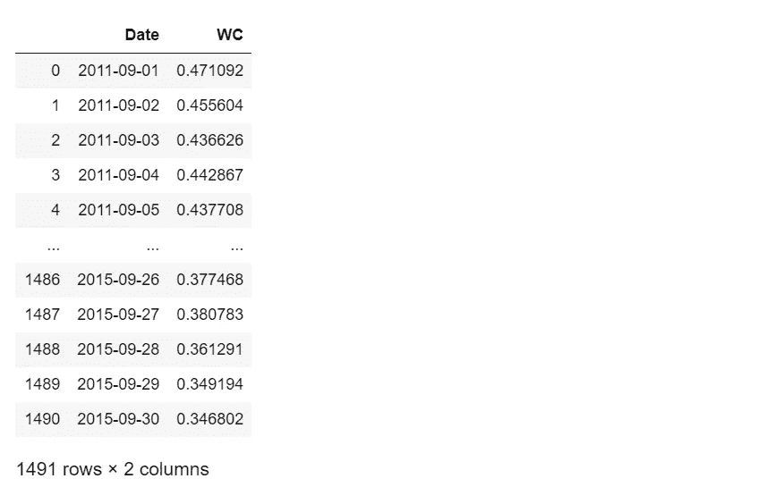

## 1.1 时间序列图

为了更好地理解数据，我绘制了每日、每月和每年的用水量。

```
**# Define a function to draw time_series plot**def timeseries (x_axis, y_axis, x_label):
    plt.figure(figsize = (10, 6))
    plt.plot(x_axis, y_axis, color =’black’)
    plt.xlabel(x_label, {‘fontsize’: 12}) 
    plt.ylabel(‘Water consumption ($m³$/capita.day)’, 
                                  {‘fontsize’: 12})
dataset = df.copy()
timeseries(df.index, dataset[‘WC’], ‘Time (day)’)dataset[‘month’] = dataset.index.month
dataset_by_month = dataset.resample(‘M’).sum()
timeseries(dataset_by_month.index, dataset_by_month[‘WC’], 
           ‘Time(month)’)dataset[‘year’] = dataset.index.year
dataset_by_year = dataset.resample(‘Y’).sum()
timeseries(dataset_by_year.index, dataset_by_year[‘WC’], 
           ‘Time (month)’)
```

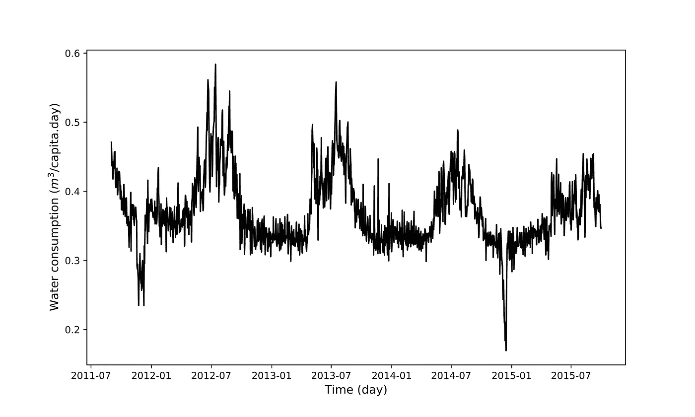

日用水量时间序列

你可以看到数据有一个季节性的模式。

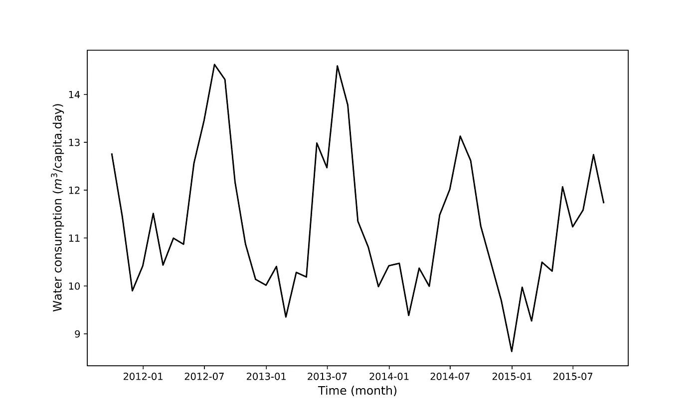

月用水量时间序列

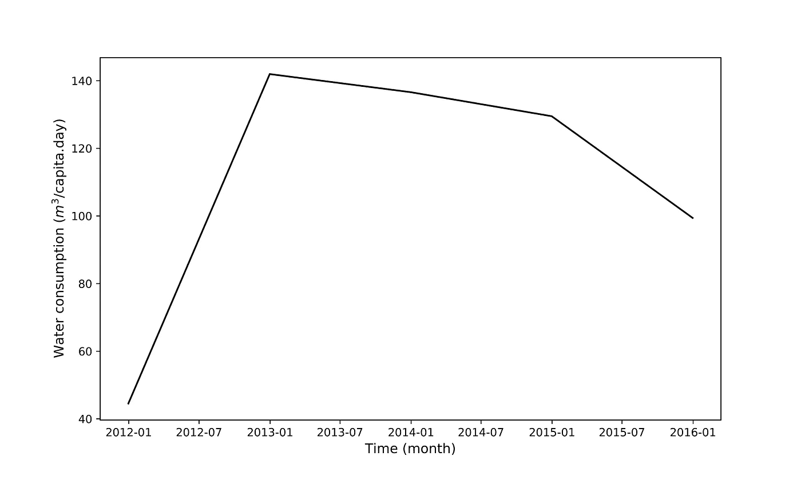

年用水量时间序列

## 1.2 处理缺失值

首先，我想检查缺失值的数量，并确定没有数据值存储的日期。然后我使用线性插值来替换丢失的值。

```
**# Check for missing values**
print(‘Total num of missing values:’) 
print(df.WC.isna().sum())
print(‘’)
**# Locate the missing value**
df_missing_date = df.loc[df.WC.isna() == True]
print(‘The date of missing value:’)
print(df_missing_date.loc[:,[‘Date’]])**# Replcase missing value with interpolation**
df.WC.interpolate(inplace = True)**# Keep WC and drop Date**
df = df.drop('Date', axis = 1)
```

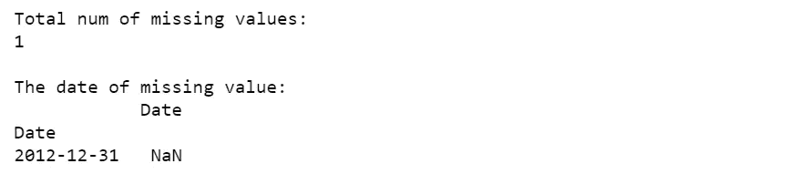

## 1.3 将数据集分为训练和测试数据

像我通常做的那样，我将前 80%的数据设置为训练数据，剩下的 20%为测试数据。我用训练数据训练模型，并用测试数据验证其性能。

💡提醒一下，您必须使用 *iloc* 根据索引位置找到数据帧的子集

```
**# Split train data and test data**
train_size = int(len(df)*0.8)

train_data = df.iloc[:train_size]
test_data = df.iloc[train_size:]
```

## 1.4 数据转换

一个很好的经验法则是，规范化的数据会在神经网络中产生更好的性能。在这个项目中，我使用来自 [scikit-learn](https://scikit-learn.org/stable/) 的 [MinMaxScaler](https://scikit-learn.org/stable/modules/generated/sklearn.preprocessing.MinMaxScaler.html) 。

您需要遵循三个步骤来执行数据转换:

*   使用可用的训练数据拟合定标器(MinMaxScaler)(这意味着使用训练数据估计最小和最大可观测值。)
*   将缩放器应用于训练数据
*   将定标器应用于测试数据

💡需要注意的是， *MinMaxScaler()的输入。fit()* 可以是数组状或数据帧状(n_samples，n_features)。在这个项目中:

train_data.shap = (1192，1)

```
scaler = MinMaxScaler().fit(train_data)
train_scaled = scaler.transform(train_data)
test_scaled = scaler.transform(test_data)
```

## 1.5 创建输入

GRU 和比尔斯特姆采用一个三维输入(数量 _ 样本，数量 _ 时间步长，数量 _ 特征)。因此，我创建了一个助手函数 *create_dataset* ，来重塑输入。

在这个项目中，我定义 look_back = 30。这意味着模型基于最近 30 天的数据进行预测(在 for-loop 的第一次迭代中，输入携带前 30 天，输出是第 30 天的用水量)。

```
**# Create input dataset**
def create_dataset (X, look_back = 1):
    Xs, ys = [], []

    for i in range(len(X)-look_back):
        v = X[i:i+look_back]
        Xs.append(v)
        ys.append(X[i+look_back])

    return np.array(Xs), np.array(ys)LOOK_BACK = 30X_train, y_train = create_dataset(train_scaled,LOOK_BACK)
X_test, y_test = create_dataset(test_scaled,LOOK_BACK)**# Print data shape**
print(‘X_train.shape: ‘, X_train.shape)
print(‘y_train.shape: ‘, y_train.shape)
print(‘X_test.shape: ‘, X_test.shape) 
print(‘y_test.shape: ‘, y_test.shape)
```

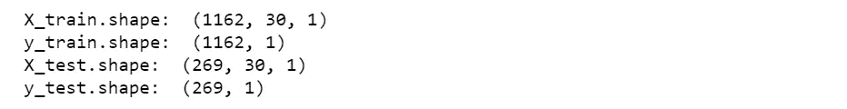

# 2.创建模型

第一个函数， *create_bilstm* ，创建一个 BiDLSM 并获取隐藏层中的单元(神经元)数量。第二个函数， *create_gru* ，构建一个 gru 并获得隐藏层中的单元数。

两者在输入层都有 64 个神经元，一个隐层包括 64 个神经元，在输出层有 1 个神经元。两个模型中的*优化器*都是 [*亚当*](https://keras.io/api/optimizers/adam/) 。为了使 GRU 模型对变化具有鲁棒性，使用了**下降**函数。**掉线(0.2)** 随机掉线 20%的单位。

```
**# Create BiLSTM model**
def create_bilstm(units):
    model = Sequential()
    **# Input layer**
    model.add(Bidirectional(
              LSTM(units = units, return_sequences=True), 
              input_shape=(X_train.shape[1], X_train.shape[2])))
    **# Hidden layer**
    model.add(Bidirectional(LSTM(units = units)))
    model.add(Dense(1))
    **#Compile model**
    model.compile(optimizer=’adam’,loss=’mse’)
    return modelmodel_bilstm = create_bilstm(64)**# Create GRU model**
def create_gru(units):
    model = Sequential()
    **# Input layer**
    model.add(GRU (units = units, return_sequences = True, 
    input_shape = [X_train.shape[1], X_train.shape[2]]))
    model.add(Dropout(0.2)) 
    **# Hidden layer**
    model.add(GRU(units = units)) 
    model.add(Dropout(0.2))
    model.add(Dense(units = 1)) 
    **#Compile model**
    model.compile(optimizer=’adam’,loss=’mse’)
    return modelmodel_gru = create_gru(64)
```

## 2.1 拟合模型

我创建一个函数， *fit_model* ，获取模型并用 100 个**时期**和 **batch_size** = 16 的训练数据训练模型。我让模型使用 20%的训练数据作为验证数据。我设置 **shuffle = False** 是因为它提供了更好的性能。

为了避免过度拟合，我设置了一个*提前停止*，当*验证损失*在 10 个周期后没有改善时(耐心= 10)停止训练。

```
def fit_model(model):
    early_stop = keras.callbacks.EarlyStopping(monitor = ‘val_loss’,
                                               patience = 10)
    history = model.fit(X_train, y_train, epochs = 100,  
                        validation_split = 0.2,
                        batch_size = 16, shuffle = False, 
                        callbacks = [early_stop])
    return historyhistory_gru = fit_model(model_gru)
history_bilstm = fit_model(model_bilstm)
```

## 2.2 目标变量的逆变换

建立模型后，我必须使用**scaler . inverse _ transform**将目标变量转换回训练和测试数据的原始数据空间。

```
y_test = scaler.inverse_transform(y_test)
y_train = scaler.inverse_transform(y_train)
```

# 3.评估模型的性能

我们将如何评价 GRU 和比尔斯特姆的表现？

## 1-绘制训练损失和验证损失

为了评估模型性能，我绘制了训练损失与验证损失的关系图，我预计验证损失低于训练损失😉

## 2-比较预测和测试数据

首先，我用比尔斯特姆和 GRU 模型预测 WC。然后，我绘制了两个模型的测试数据与预测。

## 3-计算 RMSE 和梅

我使用两种拟合优度来评估模型的准确性。

## 3.1 绘制列车损失和验证损失

```
def plot_loss (history, model_name):
    plt.figure(figsize = (10, 6))
    plt.plot(history.history[‘loss’])
    plt.plot(history.history[‘val_loss’])
    plt.title(‘Model Train vs Validation Loss for ‘ + model_name)
    plt.ylabel(‘Loss’)
    plt.xlabel(‘epoch’)
    plt.legend([‘Train loss’, ‘Validation loss’], loc=’upper right’)

plot_loss (history_gru, ‘GRU’)
plot_loss (history_bilstm, ‘Bidirectional LSTM’)
```

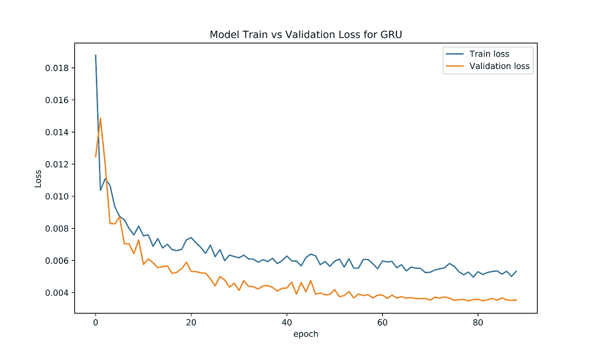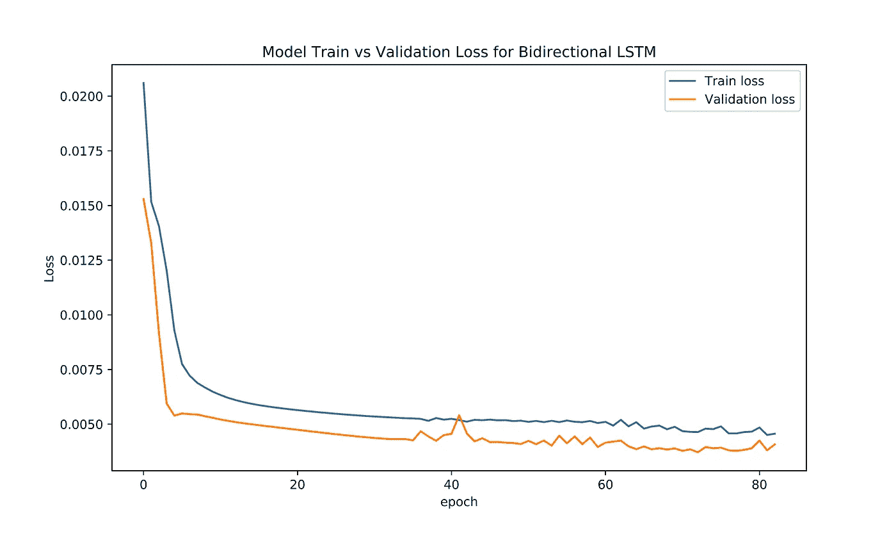

## 3.2 比较预测和测试数据

```
**# Make prediction**
def prediction(model):
    prediction = model.predict(X_test)
    prediction = scaler.inverse_transform(prediction)
    return predictionprediction_gru = prediction(model_gru)
prediction_bilstm = prediction(model_bilstm)**# Plot test data vs prediction**
def plot_future(prediction, model_name, y_test):
    plt.figure(figsize=(10, 6))
    range_future = len(prediction)
    plt.plot(np.arange(range_future), np.array(y_test), 
             label=’Test   data’)
    plt.plot(np.arange(range_future), 
             np.array(prediction),label=’Prediction’) plt.title(‘Test data vs prediction for ‘ + model_name)
    plt.legend(loc=’upper left’)
    plt.xlabel(‘Time (day)’)
    plt.ylabel(‘Daily water consumption ($m³$/capita.day)’)

plot_future(prediction_gru, ‘GRU’, y_test)
plot_future(prediction_bilstm, ‘Bidirectional LSTM’, y_test)
```

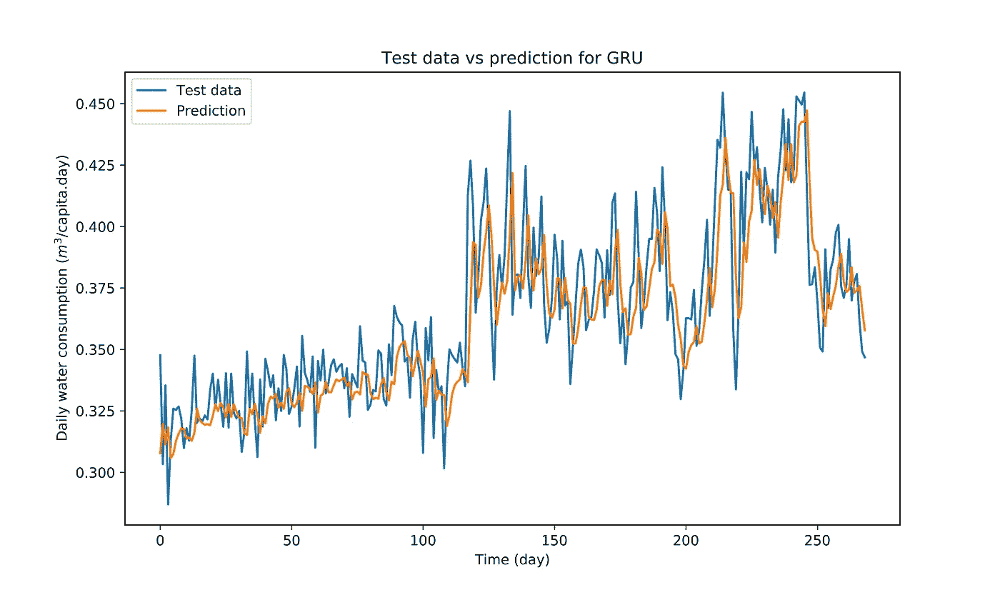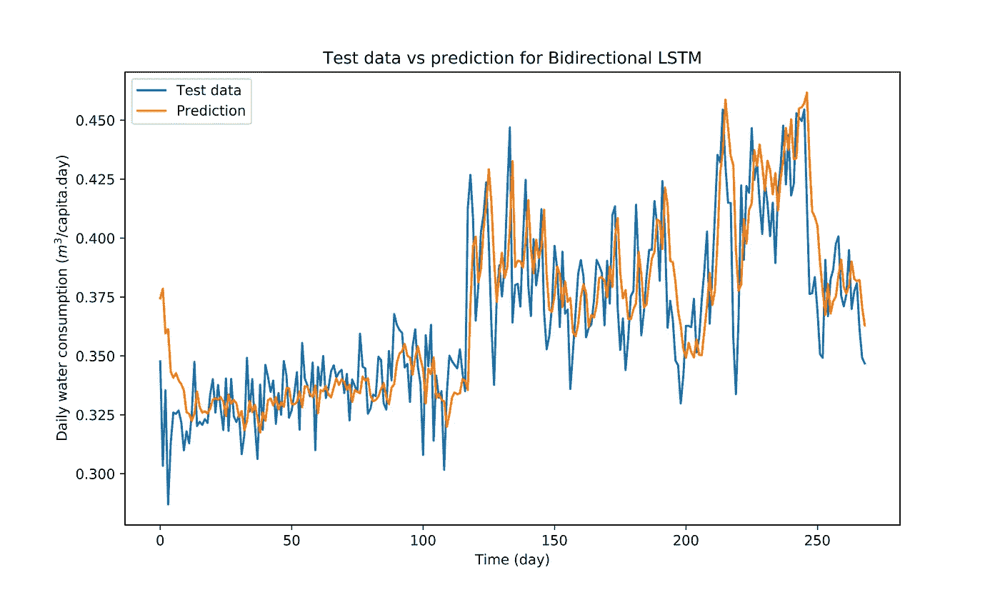

## 3.3 计算 RMSE 和梅

```
def evaluate_prediction(predictions, actual, model_name):
    errors = predictions — actual
    mse = np.square(errors).mean()
    rmse = np.sqrt(mse)
    mae = np.abs(errors).mean()
    print(model_name + ‘:’)
    print(‘Mean Absolute Error: {:.4f}’.format(mae))
    print(‘Root Mean Square Error: {:.4f}’.format(rmse))
    print(‘’)evaluate_prediction(prediction_gru, y_test, ‘GRU’)
evaluate_prediction(prediction_bilstm, y_test, ‘Bidirectiona LSTM’)
```

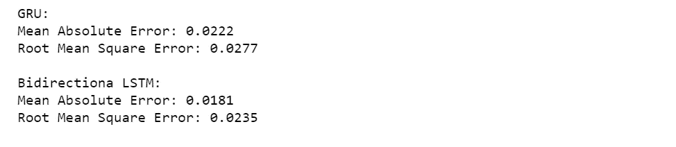

# 4.30 天用水量的多步预测

为了使用经过训练的 GRU 和比尔斯特姆模型进行预测，我需要至少 60 天的观察数据来预测未来 30 天的情况。为了便于说明，我从观测数据中选择了 60 天的用水量，并用 GRU 和比尔斯特姆预测了未来 30 天的用水量。

```
**# Make prediction for new data**
def prediction(model):
    prediction = model.predict(X_30)
    prediction = scaler.inverse_transform(prediction)
    return predictionprediction_gru = prediction(model_gru)
prediction_bilstm = prediction(model_bilstm)**# Plot history and future**
def plot_multi_step(history, prediction1, prediction2):

    plt.figure(figsize=(15, 6))

    range_history = len(history)
    range_future = list(range(range_history, range_history +
                        len(prediction1))) plt.plot(np.arange(range_history), np.array(history), 
             label='History')
    plt.plot(range_future, np.array(prediction1),
             label='Forecasted for GRU')
    plt.plot(range_future, np.array(prediction2),
             label='Forecasted for BiLSTM')

    plt.legend(loc='upper right')
    plt.xlabel('Time step (day)')
    plt.ylabel('Water demand (lit/day)')

plot_multi_step(new_data, prediction_gru, prediction_bilstm)
```

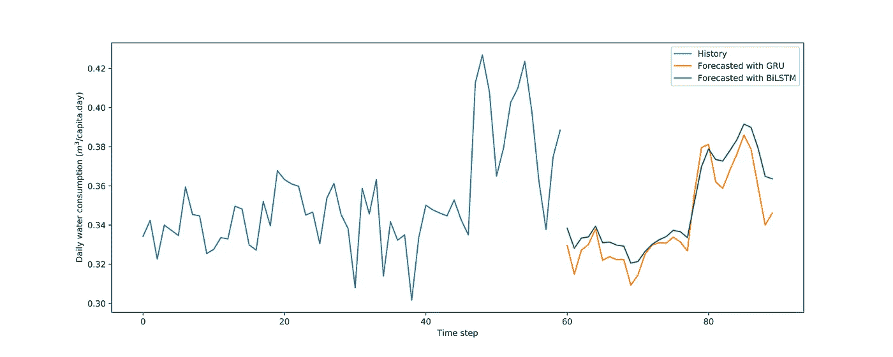

# 结论

感谢您阅读这篇文章。我希望它能帮助你在 Tensorflow 中开发用于时间序列预测的 GRU 和比尔斯特姆模型😊

非常感谢您的反馈。你可以在 LinkedIn 上找到我。