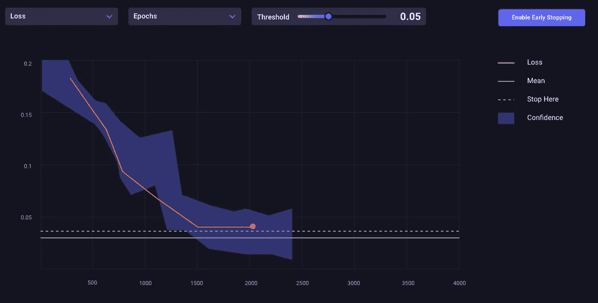
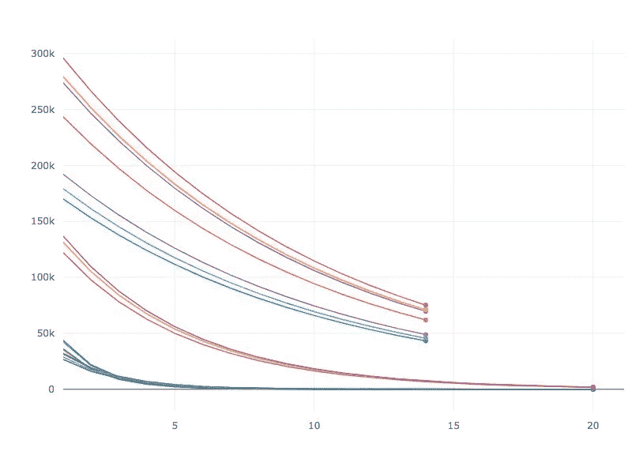
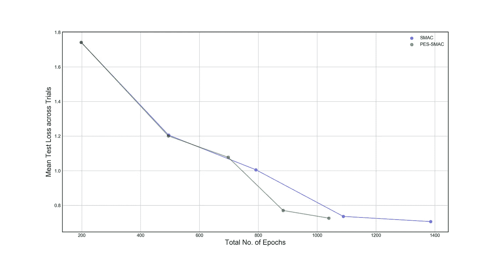
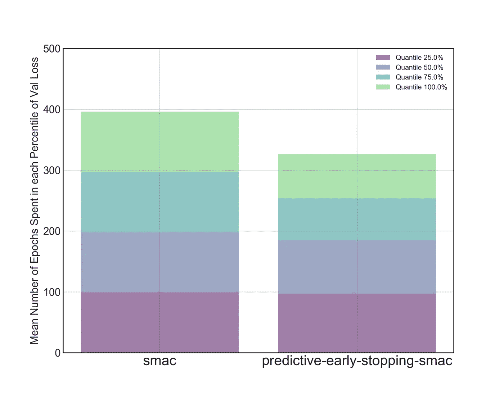
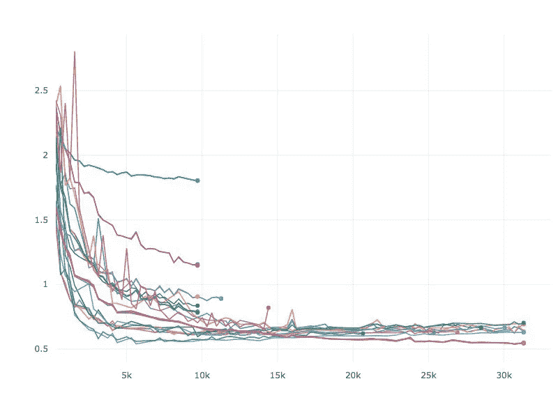
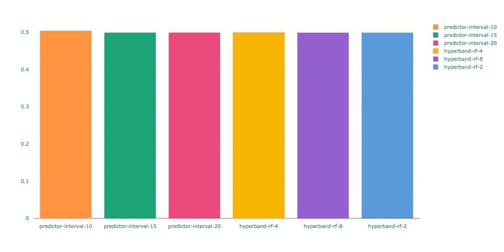
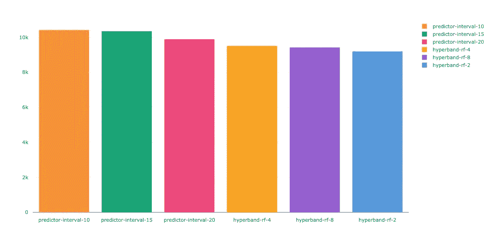

# 预测性早期停止——一种元学习方法

> 原文：<https://towardsdatascience.com/predictive-early-stopping-a-meta-learning-approach-90561f0e9454?source=collection_archive---------44----------------------->



*作者:Dhruv Nair，数据科学家，Comet.ml*

## 介绍

预测性提前停止是一种用于加速模型训练和超参数优化的最新方法。我们的基准研究表明，预测性早期停止可以加快模型训练*多达 30%的底层基础设施独立*。

我们基于从学习曲线外推、超带和中位数停止等项目中收集的见解，以创建一个预测模型，可以估计亏损曲线的收敛值。

Comet 能够利用其平台的*公共*部分的*超过*200 万个模型的模型数据，如超参数和损耗曲线，来创建一个模型，该模型的预测可以跨超参数和模型架构进行推广。

在某些情况下，我们能够在收敛实际发生之前的数百个时期提供收敛的估计。除了预测收敛值之外，我们的预测提前停止产品还提供了当前模型优于当前训练扫描中看到的最佳模型结果的概率估计。

*在某些情况下，我们能够在收敛实际发生之前的数百个时期提供收敛的估计。*

这些预测允许我们终止表现不佳的模型的训练，以便搜索过程只评估最有希望的候选人。

## 基准测试:

我们在三种不同的设置中测试了我们的预测性早期停止方法:

1.  一种超参数搜索，用于优化充当神经网络代理的函数的参数
2.  使用 SMAC 优化器在 CIFAR10 上优化 6 层 CNN 的超参数搜索，具有和不具有预测性早期停止。
3.  使用具有超波段的随机搜索与具有预测性提前停止的随机搜索来优化相同的 6 层 CNN 的超参数搜索。

## 代理函数的结果:

在我们的第一个测试中，我们设置了一个指数衰减函数作为神经网络的代理。我们将这个代理模型运行了 20 步，并使用 Comet 的贝叶斯优化器和预测性提前停止来确定这个函数的参数的最佳值。在超参数搜索过程中，我们观察到不允许次优模型训练完整的 20 个步骤。**图 1** ，说明了我们的停止机制。



## SMAC 的 CNN 模型的结果:

我们对 CNN 模型的基准测试是以如下方式建立的:

我们使用 SMAC 优化器来估计 6 层 CNN 模型中的以下超参数。模型超参数和结构基于 AlexNet。

```
{
    "learning_rate":{
        "type":"loguniform",
        "value":[0.0000001, 0.01]
    },
    "learning_rate_decay":{
        "type": "uniform",
        "value":[0.000001, 0.001]
    },
    "weight_decay": {
        "type": "loguniform",
        "value": [0.0000005, 0.005]
    }
}
```

我们对优化器进行了 8 次测试，包括有无预测性提前停止。每个优化器试验都有 6 个小时的预算来评估尽可能多的配置。允许每个超参数配置最多训练 100 个时期，并且在每个时期结束时评估验证集。我们的预测性提前停止模型使用验证损失来确定是否终止超参数配置。

在所有试验结束时，我们确定了所有试验中试验损失的平均值，作为达到该损失值所需的超参数扫描中总次数的函数。

我们可以在**图 2** 中看到，使用预测性早期停止允许 SMAC 获得可比的损失值，几乎快了 300 个时代。这减少了 25%的超参数优化时间。



我们还根据最终验证损失，将超参数配置划分为分位数。然后，我们计算了优化器在所有试验的每个分位数上花费的平均时期数。

在**图 3** 中，我们看到 SMAC 和预测性提前停止 SMAC 花费大致相同的时间来评估前 25%和前 50%的配置。然而，预测性早期停止在结果的后 50%中花费少 30 个时期训练模型，在后 25%中花费少 20 个时期。



在**图 4** 中，我们看到了预测性提前停止的超参数扫描的样本损失曲线。次优配置会在允许的训练步骤总数之前停止。



# 具有超波段的 CNN 模型的结果:

我们以类似于 SMAC 的方式为 Hyperband 设置了测试。我们特别使用了在 [Optuna](https://optuna.org/) 中实现的[异步连续二等分普鲁纳](https://optuna.readthedocs.io/en/latest/_modules/optuna/pruners/successive_halving.html#SuccessiveHalvingPruner)。我们可以认为这是一个带有单个括号的超带。我们随机选择了 120 个超参数配置。每个配置被分配了最少 10 个时期的资源，并且被允许训练最多 100 个时期。这导致最大培训预算为 12000 个纪元。

在每个评估点，基于最差的验证损失，配置的数量减少 N 倍。在我们的实验中，我们评估了 N 值为 2、4 和 8 的超带。

对于预测性提前停止，我们使用不同的间隔参数值测试了每个配置。每 10、15 和 20 个时期评估一次配置。在每一次评估中，我们都会估计当前配置优于目前最佳配置的可能性。如果这个概率小于一个阈值，在我们的例子中是 90%，我们终止当前的配置。阈值和间隔都是用于预测性早期停止的可配置超参数。

然后，我们确定超参数扫描中实现的最佳验证损失，以及扫描后预算中剩余的历元数。

在**图 5a** 中，我们看到所有方法都找到了验证损失的最佳值，然而，预测性提前停止仅使用总预算的 15%就能评估配置，相比之下，Hyperband 使用了 25%。这在速度上提高了 10%。



## 结论

预测性提前停止具有非常明显的时间、能量和成本节约优势。浪费计算周期对环境或研究人员的预算都没有好处。

[艾伦人工智能研究所](https://allenai.org/)最近发表了一份[报告](https://arxiv.org/pdf/1907.10597.pdf)，报告内容是关于训练机器学习模型的计算成本不断上升，以及这些日益增长的能源需求如何对环境产生不利影响。该论文指出，当前最先进的人工智能研究进展主要集中在准确性或误差等指标上，代价是对环境不友好。他们称这种模式为红色人工智能。为了对抗红色人工智能研究的盛行，他们提出了向强调计算效率的人工智能研究的转变:绿色人工智能。

该论文建议根据生成结果所需的浮点运算(FPO)总数来跟踪人工智能算法的效率。FPO 的总数与调整期间评估的超参数配置的数量以及每个配置上花费的训练迭代次数直接相关。

我们希望我们在预测性早期停止方面的努力有助于提高超参数搜索过程的计算效率。我们认为这个工具是降低人工智能研究相关货币壁垒的一种方式，也是朝着采用绿色人工智能实践迈出的一步。

在我们的下一篇文章中，我们将描述在不属于较大参数搜索的单独运行中应用预测性早期停止。

**购买 Comet Teams 或 Comet Enterprise 后，预测性提前停止功能可作为附加功能提供。正在通过一项或多项未决专利申请寻求对预测性提前停车的专利保护。*

了解更多信息并在此注册[。](https://www.comet.ml/site/what-is-meta-ml/)