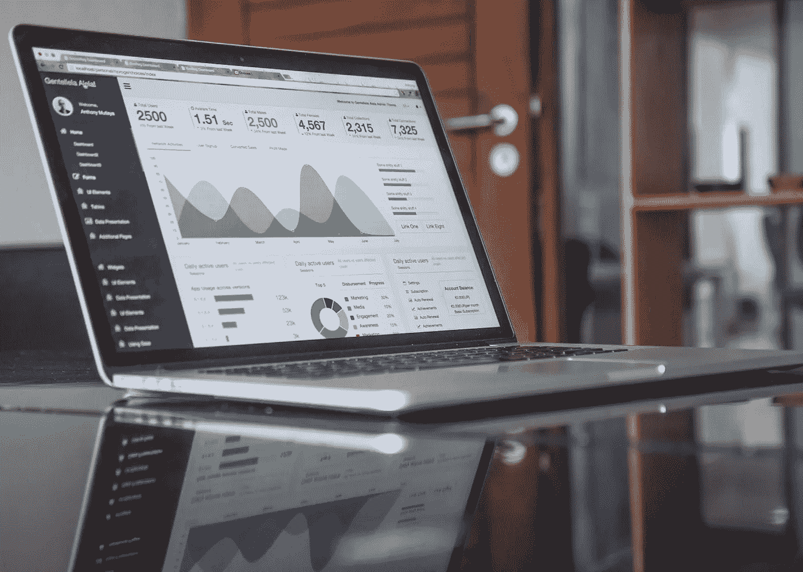
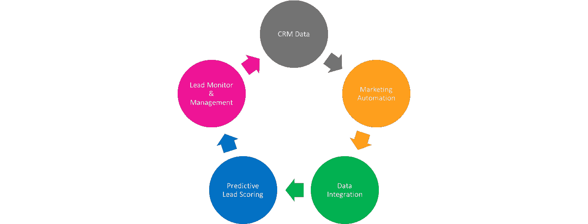
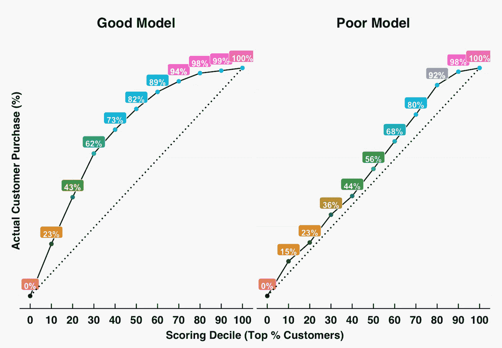
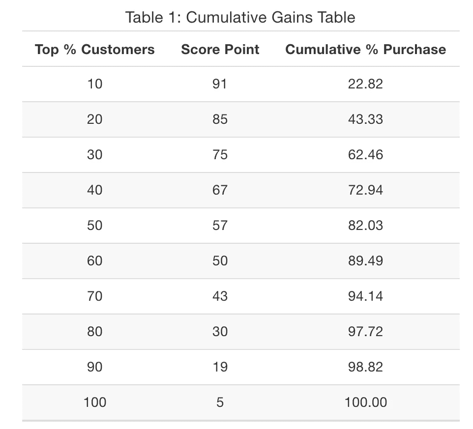
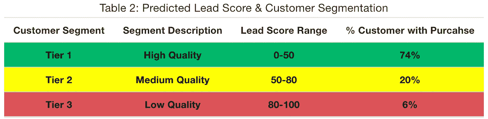
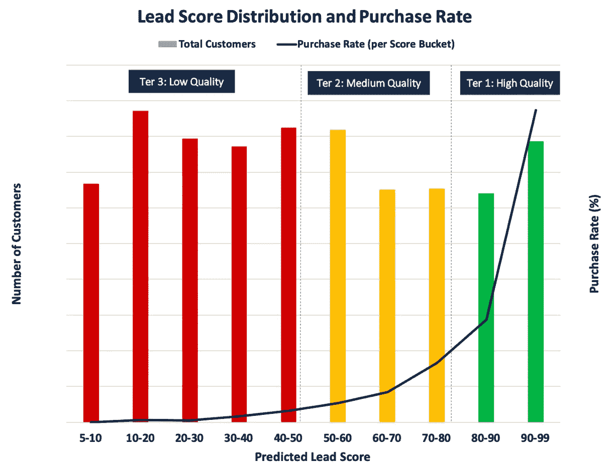

# 预测销售线索评分

> 原文：<https://towardsdatascience.com/predictive-lead-scoring-cefd8240778c?source=collection_archive---------4----------------------->

在 [Unsplash](https://unsplash.com/s/photos/statistics?utm_source=unsplash&utm_medium=referral&utm_content=creditCopyText) 上由 [Carlos Muza](https://unsplash.com/@kmuza?utm_source=unsplash&utm_medium=referral&utm_content=creditCopyText) 拍摄的照片

如今，成功的现代公司通过利用数据驱动的模型和见解，在了解其客户、产品和服务方面进行了大量投资。什么是预测性销售线索评分？为什么它对公司收购和销售策略的成功很重要？在客户旅程的每个阶段，您如何开发一个线索评分模型来优化具有预期质量的客户和潜在客户的数量？营销和销售团队如何有效地监控预测的销售线索得分，以及跟踪销售线索的质量和绩效？

我将回顾预测性销售线索评分的基本概念以及添加到营销和销售运营中的商业价值。然后，我将解释如何得出销售线索得分阈值，并系统地监控客户和潜在客户的表现，以推动最佳的销售线索质量和数量。

# **什么是预测性销售线索评分？**

销售线索评分是关键的营销自动化任务之一，用于锁定正确的客户和潜在客户，并提高营销和销售团队的生产力和效率。预测性销售线索评分将传统的销售线索评分方法提升到了一个新的水平，方法是应用大数据和机器学习算法来评估现有客户和潜在客户的关键行为，并根据一个可以区分更有可能转化、保留或购买公司产品和服务的客户和潜在客户的量表对其进行排名。首先，预测性销售线索评分根据反映客户和潜在客户感知价值的标准生成一个可跟踪的指标。其次，它允许营销团队开展更有针对性的活动和投资，以最大限度地提高营销支出的投资回报率。第三，它通过优化销售团队与高质量客户和潜在客户打交道的时间和精力，提高了销售团队的效率和生产力。最后但同样重要的是，它通过协调收购和销售目标，提高了整体转化率和购买率。

# **如何开发预测性销售线索评分模型？**

预测性销售线索评分流程从识别现有和潜在客户生成的数据和评分属性开始。确定优化的目标指标很重要——无论是转化率、保留率、产出还是服务质量等。此外，您需要根据一组关键属性训练销售线索评分模型，该模型可以捕捉客户生命周期的不同方面。该模型评估与客户和潜在客户相关联的各种属性和所识别的行为(即，客户购买)之间的关系，并基于实现所识别的行为的倾向对它们进行评分。

照片由[胡玮炜](https://medium.com/@weiwei.hu)在[媒体](https://medium.com/)上拍摄

# **预测性销售线索评分模型包括哪些关键属性？**

*   客户档案数据衡量您的客户和潜在客户的核心档案属性。这些属性可能包括客户的人口统计信息，如年龄、位置、职称、行业、任期以及角色细分。
*   帐户档案数据反映了重要的公司地理属性，如公司规模、行业和帐户类型等。
*   客户意向数据衡量现有和潜在客户对特定产品和服务的兴趣，以及他们与您的营销团队或销售代表接触的意愿。
*   客户参与数据捕捉重要的客户活动，包括电子邮件活动，如 CTO、CTR，网站活动，如访问、表单填写、产品页面浏览或下载、来宾帐户创建、免费或付费试用激活、网上研讨会或活动出席等。
*   客户购买数据捕获现有客户的购买活动，包括购买您的产品和服务的质量和金额，以及他们购买的时间和频率。
*   营销和销售绩效还提供了关于营销和销售计划和活动有效性的重要信息。表现出色的项目和活动通常可以揭示公司营销和销售活动的范围和影响的关键见解。此外，当营销和销售团队执行计划和活动时，他们从各种渠道获取客户和潜在客户，如直接、付费、有机搜索、推荐、社交媒体等。确定表现最佳的渠道将使团队能够更有效地与客户和潜在客户互动，并帮助发现各种渠道的优化策略。

一旦您收集了这些关键数据点，这些与客户或潜在客户相关的信息将被整合到系统中，同时触发预测性销售线索评分模型。整合的数据将流经预测性销售线索评分模型，该模型将科学地评估这些确定的属性与目标行为之间的关系。

# **好模式与坏模式**

在开发您的销售线索评分模型时，训练几个模型并执行适当的模型验证是非常有用的，以便选择预测部署最准确的最佳模型。例如，AUC 是比较模型的好指标。一个好的模型将产生更高的 AUC，其中具有更高预测销售线索得分的客户最有可能对应于实际购买，而质量差的客户几乎没有购买该公司产品或服务的动机。另一方面，一个糟糕的线索评分模型可能会产生更多的“错误”，这意味着该模型要么会错过预测已经购买的高质量客户，要么会高估未成熟客户的质量。这意味着一个糟糕的模型往往会产生相对较少的真阳性(TP)，但是会产生比你预期的更多的假阳性(FP)。

照片由[胡玮炜](https://medium.com/@weiwei.hu)在[媒体](https://medium.com/)上拍摄

# **如何评价预测线索评分模型的性能？**

在您训练评分模型后，预测的销售线索得分是如何工作的？市场营销和销售团队能否信任模型得出的分数，并根据预测的销售线索分数确定目标客户和潜在客户？要评估评分模型的性能，您可以将预测的销售线索得分应用于已完成销售周期的真实客户。

照片由[胡玮炜](https://medium.com/@weiwei.hu)在[媒体](https://medium.com/)上拍摄

如左图所示，预测销售线索得分≥91 的前 10%客户几乎达到了累计购买百分比的 23%。专注于前 10%的客户可以覆盖给定时间段内总客户购买量的近 23%。同样，将预测销售线索得分≥75 分的前 30%客户作为目标客户，将允许团队覆盖客户购买总量的 2/3 以上。随着您的团队有能力覆盖更多的客户，在达到前 40%-50%的客户后，累积收益的提升开始下降。建议的销售线索评分阈值是立即与质量更高的前 40% -50%的客户合作。对于预测销售线索得分较低的客户和潜在客户，他们需要首先通过有针对性的信息培育计划进行热身。因此，很明显，营销和销售团队可以通过关注高质量的线索来实现生产力和效率的显著提升。

# 如何监控客户和潜在客户的质量？

营销和销售团队将需要建立收购和销售目标，并制定实现这些目标的策略。营销和销售团队如何有效地监控客户和潜在客户的质量，并优先考虑最有可能购买的人群？团队可以考虑以下用例，并决定他们希望如何在日常业务运营中利用预测的销售线索得分。

*   **根据预测的销售线索得分有效地细分客户和潜在客户，并将其放入不同的类别。**如下表所示，仅关注预测销售线索得分≥75 分的热情销售线索将使团队覆盖客户总购买量的 84%。但是，如果他们花时间瞄准这些冷线索，他们预计只能覆盖客户购买量的 4%。

照片由[胡玮炜](https://medium.com/@weiwei.hu)在[中](https://medium.com/)拍摄

*   **系统监控预测销售线索得分和客户购买率之间的关系。**在下面的图表中，当您从图表的左侧移动到右侧时，几乎可以立即看出预测销售线索得分和客户购买率之间有很强的正相关关系。因此，它向您的营销和销售团队发出了一个强烈的信号，要求他们优先关注高质量而不是低质量的客户。

由[胡玮炜](https://medium.com/@weiwei.hu)在[媒体](https://medium.com/)上拍摄的照片

*   **准确提供关于关键优化指标的宝贵见解。**在这种情况下，您可以利用预测销售线索评分模型，深入了解哪些客户特征和行为属性对购买率的贡献最大，并揭示表现最佳的渠道、计划和活动等。

总之，预测性销售线索评分为现代公司取得成功提供了必要的信息。它不仅揭示了基于从现有和潜在客户以及产品和服务中收集的实时数据，哪些客户和潜在客户最有可能转变、保留甚至购买的关键见解，而且还帮助公司基准化和揭示关键优化指标，并一致地跟踪关键客户概况和细分，以便描绘出现有和潜在客户群中哪些销售良好而哪些销售不佳的完整画面。

如果你觉得这篇文章有帮助，请告诉我。如果您有任何问题或想法要分享，请随时发表评论。

**阅读更多:**

*   [了解和预测客户终身价值(CLTV)](/understanding-and-forecasting-customer-lifetime-value-cltv-634fe34f522b)
*   [衡量客户生命周期成功指标](https://medium.com/@weiwei.hu/measuring-customer-lifecycle-success-metrics-5c8264d711ba)
*   [从客户生命周期分析中获得的六大经验](/six-key-learnings-from-customer-lifecycle-analytics-3d2fa335f3d6)