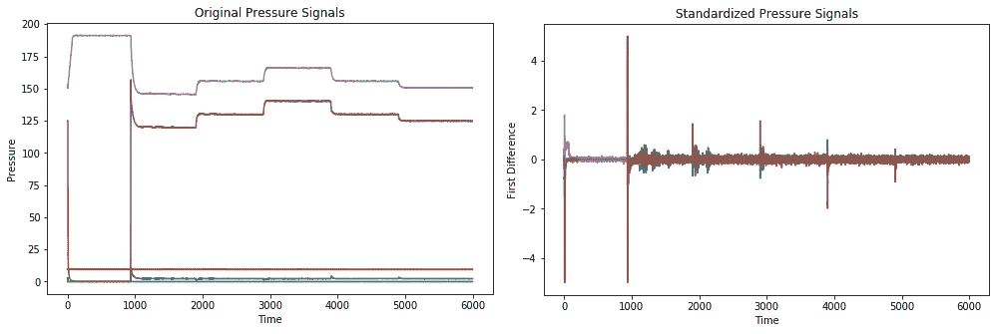
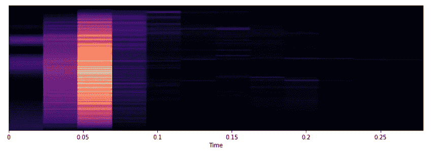
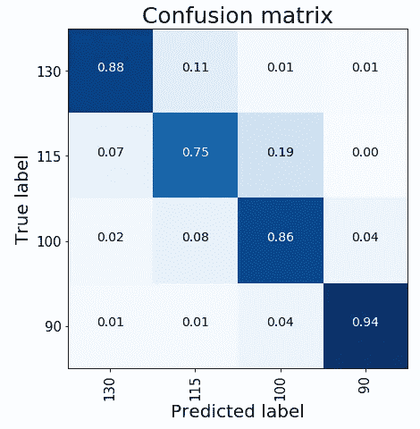

# 预测性维护:利用 CRNN 和光谱图检测传感器故障

> 原文：<https://towardsdatascience.com/predictive-maintenance-detect-faults-from-sensors-with-crnn-and-spectrograms-e1e4f8c2385d?source=collection_archive---------34----------------------->

## 应用深度学习和频谱图转换来防止故障


[詹姆斯·托马斯](https://unsplash.com/@thegalaxyshooter?utm_source=medium&utm_medium=referral)在 [Unsplash](https://unsplash.com?utm_source=medium&utm_medium=referral) 上拍照

预测性维护是各个领域的一个活跃的研究领域。特别是在最近几年，机器学习解决方案出现了巨大的发展。一些企业投入大量资金来开发能够提前预测在商业活动中可能发生的故障的解决方案。

这些研究的一个有趣领域是物联网行业，我们有传感器来监控机器或特定引擎部件的工作状态。解决这类问题的经典方法通常包括采用**时间序列模型和信号处理技术**，使我们能够从高频数据中提取价值。

在这篇文章中，我们采用深度学习架构来执行预测性维护任务，以处理我们用**光谱图**预处理的高频数据序列。这一步使我们能够采用一种特定的神经网络结构，称为**卷积递归神经网络(CRNN)** ，它同时从我们数据的空间和递归结构中学习。

# 数据

我们的任务需要研究压力条件下的液压管道，以便跟踪系统特定部分的活动状态。

> 该数据集是用液压试验台通过实验获得的。该试验台由通过油箱连接的一次工作回路和二次冷却过滤回路组成。当四个液压部件(冷却器、阀门、泵和蓄能器)的状态定量变化时，系统周期性地重复恒定负载循环(持续时间 60 秒)并测量过程值，如压力、体积流量和温度。

这些数据是由 UCI 储存库([液压系统状态监控](https://archive.ics.uci.edu/ml/datasets/Condition+monitoring+of+hydraulic+systems#))收集的，我们都很熟悉，因为我在[以前的帖子](/predictive-maintenance-detect-faults-from-sensors-with-cnn-6c6172613371)中使用过这些数据来开发预测性维护解决方案。现在，我们的范围始终是开发一种能够检测故障的机器学习解决方案，但我们对处理高频数据感兴趣。因此，我们利用以 100 Hz 采样的压力数据(每个传感器 6000 个属性:总共 6 个)来建立一个模型，该模型将蓄能器的状态分为四类(最佳压力、稍微降低的压力、严重降低的压力、接近完全失效)。

# 光谱图变换

处理这种原始数据的第一步包括充分的预处理阶段。数据只是被分成固定的、相同的标记序列，我们的职责是从这些信息来源中提取价值。如前所述，我们采用**光谱图**对这些信号片段进行预处理，并输入 CRNN。**频谱图**是信号的时频画像。它们是信号频率成分强度随时间变化的曲线图。它们在音频处理/分类中被广泛采用，并且由于它们在高频域中映射数据行为的能力而对我们有用。为了应用声谱图变换，我们必须首先降低级数的幅度；一个简单的区分，加上一个适当的剪辑来限制极端的变化，听起来不错。以下是由 6 个不同压力信号组成的原始和标准化序列的示例:



用 python 计算光谱图相当容易；Librosa 是一个提供这种功能的好库。我们对每一个压力系列都进行了转换，所以我们对每一个样品都进行了 6 个光谱图的转换，而不是原始信号的转换。



单个压力信号的频谱图示例

# 模型

卷积和递归神经网络是构建深度学习模型最常见和最强大的结构。CNN 和 rnn 并不相互排斥，因为两者都可以对图像和文本输入进行分类，从而为结合两种网络类型以提高效率创造了机会。如果要分类的输入在视觉上是复杂的，并且增加了 CNN 单独无法处理的时间特性，则尤其如此。


CRNN 架构示例

典型地，当这两种类型的网络结合时，有时称为 CRNN，输入首先由 CNN 层处理，其输出然后被馈送到 RNN 层。这些混合架构正被开发用于视频场景标记、光学字符识别或音频分类等应用。对于我们的分析，我们将先前生成的光谱图输入 CRNN，以检测液压管道中蓄能器的工作状态。每个观察值现在由叠加的光谱图组成(总共 6 个，每个压力信号一个)。在 Keras 语言中，我们可以这样复制 CRNN:

```
def get_model(data):

    inp = Input(shape=(data.shape[1], data.shape[2], data.shape[3]))

    x = Conv2D(filters=64, kernel_size=(2, 2), padding='same')(inp)
    x = BatchNormalization(axis=1)(x)
    x = Activation('relu')(x)
    x = MaxPooling2D(pool_size=(2, 1))(x)
    x = Dropout(0.2)(x)

    x = Permute((2, 3, 1))(x)
    x = Reshape((data.shape[2], -1))(x) x = Bidirectional(GRU(64, activation='relu', 
                          return_sequences=False))(x)
    x = Dense(32, activation='relu')(x)
    x = Dropout(0.2)(x)
    out = Dense(y_train.shape[1], activation='softmax')(x)

    model = Model(inputs=inp, outputs=out)
    model.compile(loss='categorical_crossentropy', 
                  optimizer='adam', metrics=['accuracy'])

    return model
```

在第一阶段，网络从频谱图中提取卷积特征，保留结构*频率 x 时间 x n _ 特征*。当我们传递到递归部分时，我们需要以格式*time x n _ features*:*time*对我们在卷积级别和频谱图中观察到的维度进行整形；新的 *n_features* 是在卷积 *n_features* 和*频率上计算的谄媚操作的结果。*

最后，我们的模型在我们的测试集上可以达到大约 86%的准确率。



# 摘要

在这篇文章中，我执行了一项预测性维护任务，对液压管道中特定类型的组件的工作状态进行了分类。在预处理阶段，我们可以应用原始高频压力信号的频谱图变换和强大的 CRNN 作为模型结构，从我们的数据中提取空间和时间特征，从而实现很好的性能。

**如果你对题目感兴趣，我建议:**

*   [**预测性维护:用 CNN**](/predictive-maintenance-detect-faultsfrom-sensors-with-cnn-6c6172613371) 检测传感器故障
*   [**预测性维护与 LSTM 暹罗网络**](/predictive-maintenance-with-lstm-siamese-network-51ee7df29767)
*   [**预测性维护与 ResNet**](https://medium.com/towards-data-science/predictive-maintenance-with-resnet-ebb4f4a0be3d)

[**查看我的 GITHUB 回购**](https://github.com/cerlymarco/MEDIUM_NoteBook)

保持联系: [Linkedin](https://www.linkedin.com/in/marco-cerliani-b0bba714b/)