# 涡扇发动机的预测维修

> 原文：<https://towardsdatascience.com/predictive-maintenance-of-turbofan-engine-64911e39c367?source=collection_archive---------42----------------------->

## 使用时间序列数据并询问 RNN“下一次故障何时发生？”


比尔·杰伦在 [Unsplash](https://unsplash.com/photos/lt6gE86VyaA) 上的照片

预测性维护对于制造商和维护人员都非常重要，它通过在问题导致设备故障之前解决问题来降低维护成本、延长设备寿命、减少停机时间和提高生产质量。

> “预测性维护技术旨在帮助确定在用设备的状况，以便估计何时应该进行维护”——来源维基百科

> 在这篇文章中，我想展示一下使用 **RNN(递归神经网络)/LSTM(长短期记忆)**架构不仅**更准确，而且与之前由 Marco Cerliani 编写的 **CNN(卷积神经网络)**方法相比，它在准确分类结果方面表现得更好。**

# 资料组

本帖使用 [**C-MAPSS 数据集**](https://ti.arc.nasa.gov/tech/dash/groups/pcoe/prognostic-data-repository/) 进行涡扇发动机的预测性维护。这里的挑战是确定**剩余使用寿命(RUL)** 直到下一次发动机发生故障。

数据集可以在 [**这里**](https://ti.arc.nasa.gov/tech/dash/groups/pcoe/prognostic-data-repository/) 找到，下面简单介绍一下数据集，

> “在每个时间序列开始时，发动机正常运行**，但在序列中的某个时间点出现故障。**
> 
> 在**训练集中，故障在数量上增长，直到系统故障**。
> 
> 在测试组**中，时间序列在系统故障**之前的某个时间结束。

以下是模型训练中使用的发动机状况

> 列车轨迹:100 个
> 测试轨迹:100 个
> 条件:一个(海平面)
> 故障模式:一个(HPC 退化)

**了解数据集**

加载数据集后，我们将获得 100 台发动机的时间序列数据，其中包含每 100 台发动机的运行设置和传感器读数，以及故障发生的不同场景和总共 20631 个训练示例。举例来说，下面是我们的训练数据集的前 5 个训练示例。

```
train_df.head()
```

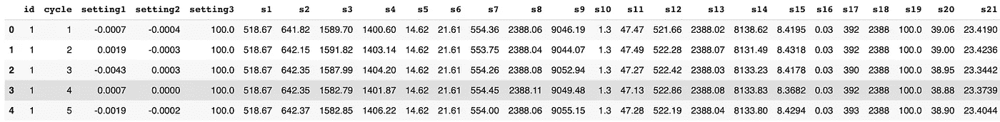

图 1:训练数据

为了进一步理解给定的数据，(见图 2)描述了对于给定的发动机，在下一个故障发生之前还有多少循环。

*例 1:69 号发动机(最左边)在故障前大约还有 360 个循环。*

*例 2:发动机识别号 39(最右边)在故障前大约还有 110 个循环。*

```
train_df.id.value_counts().plot.bar()
```

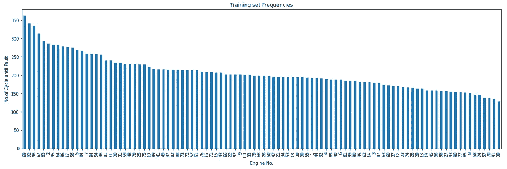

图 2:发动机及其各自的剩余有用循环直到故障

以下(图 3 和图 4)是 id 为 69 的发动机的时间序列数据。

```
engine_id = train_df[train_df['id'] == 69]ax1 = engine_id[train_df.columns[2:]].plot(subplots=True, sharex=True, figsize=(20,30))
```

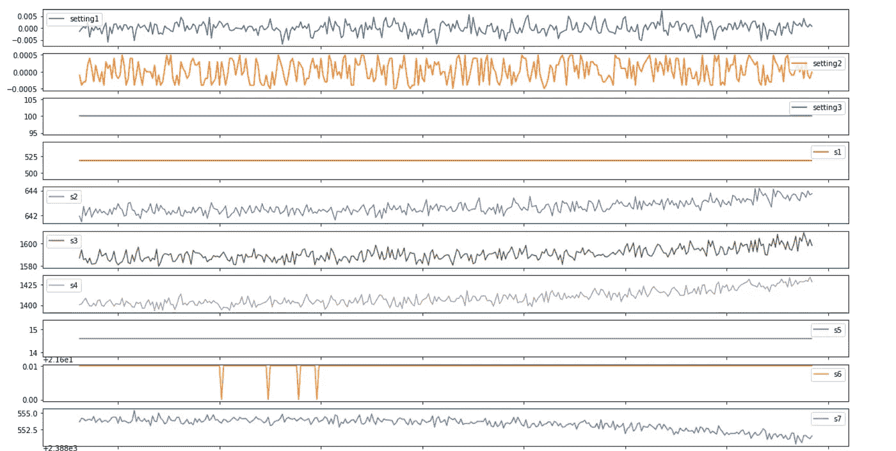

图 3:运行设置 1、2 和 3 的时间序列读数以及 s2 到 s7 的传感器读数

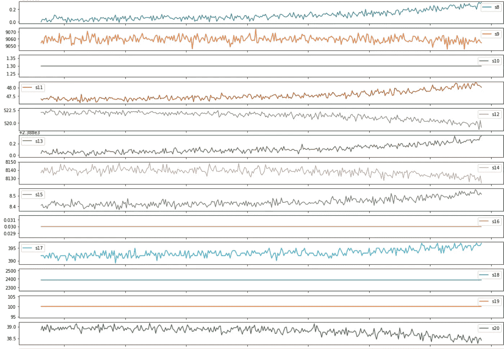

图 4:传感器 s8 直到 s20 的时间序列读数

**图片(图 2、图 3、图 4)使用 Marco Cerliani 的 GitHub Notebook (* [***此处***](https://github.com/cerlymarco/MEDIUM_NoteBook/blob/master/Remaining_Life_Estimation/Remaining_Life_Estimation.ipynb) *)的源代码获得。*

# 数据预处理

数据预处理是训练任何神经网络的最重要的步骤。对于像 RNN(递归神经网络)这样的神经网络，网络对输入数据非常敏感，数据需要在-1 比 1 或 0 比 1 的范围内。这个范围即-1 比 1 或 0 比 1，通常是因为 ***tanh (*** *见图 5)* 是伴随在网络隐层中的激活函数。因此，在训练模型之前，必须对数据进行标准化。

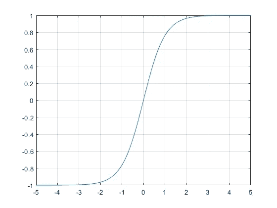

图 5:**MathWorks 文档中的 tanh** 函数

使用 sklearn 的预处理库提供的**最小最大缩放器**函数，我们在 **0 到 1、**的范围内归一化我们的训练数据，尽管理论上我们可以将我们的数据归一化并实验到-1 到 1。然而，这篇文章仅仅展示了数据在 **0 到 1 范围内的缩放。**

```
from sklearn.preprocessing import MinMaxScalersc = MinMaxScaler(feature_range=(0,1))
train_df[train_df.columns[2:26]] = sc.fit_transform(train_df[ train_df.columns[2:26]])
train_df = train_df.dropna(axis=1)
```

使用列号 2 到 26(见图 1)的原因是，我们采用操作设置 1(列号 2)、设置 2、设置 3、传感器 1 直到传感器 21(列 25)，python 范围不考虑上限，因此上限为 26。为便于说明，这里是训练数据标准化后的前 5 个训练示例(图 6)。

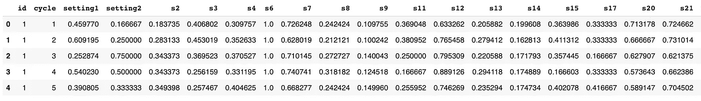

图 6:训练集的标准化数据

一旦我们将数据标准化，我们就采用一种分类方法来预测 RUL。我们通过以下方式为我们的分类方法在数据集上添加新的标签来做到这一点。

*"使用以下源代码:from*[*Github*](https://github.com/cerlymarco/MEDIUM_NoteBook/blob/master/Remaining_Life_Estimation/Remaining_Life_Estimation.ipynb)*"*

```
w1 = 45
w0 = 15train_df['class1'] = np.where(train_df['RUL'] <= w1, 1, 0 )
train_df['class2'] = train_df['class1']
train_df.loc[train_df['RUL'] <= w0, 'class2'] = 2
```

这段代码现在为我们的分类问题创建标签(见图 7 ),分类方法如下:

> 标签 0:当剩余 45+个循环后出现故障。
> 
> 标签 1:当在 16 和 45 之间的周期直到故障时。
> 
> 标签 2:当在 0 和 15 之间的周期直到故障时。

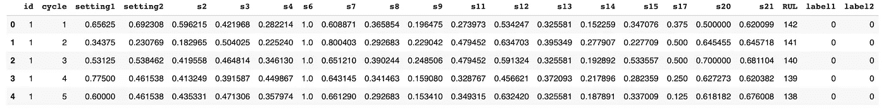

图 7:添加标签

太好了！现在，我们需要进一步准备数据，以便神经网络有效地处理时间序列数据，我们通过指定时间步长(或窗口大小)来做到这一点。诸如 RNN 或 CNN 之类的神经网络要求输入数据为三维形式。因此，我们现在需要将二维数据转换成三维数据。

为了演示这一转换过程(见图 8)，我们简单地通过指定时间步长(窗口大小)来运行时间序列数据。这个过程也被称为***滑动窗口技术*** *。*

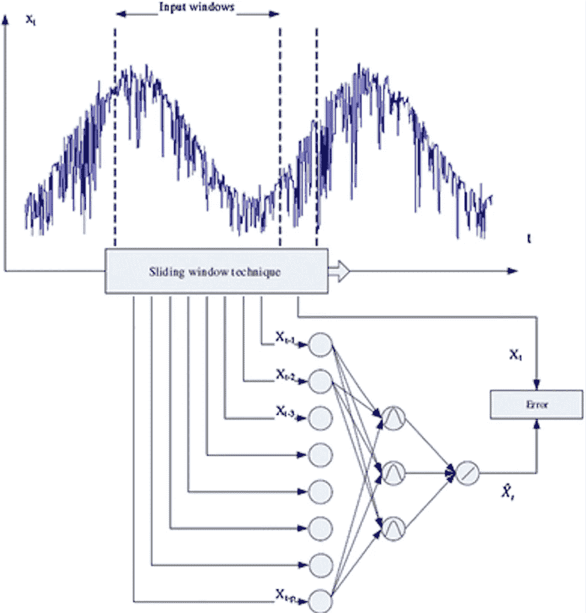

图 8:来自[弹簧连杆](https://link.springer.com/article/10.1007/s40095-014-0105-5)的滑动窗口技术

对于我们的时间序列数据，我们将*滑动窗口技术*用于所有传感器和操作设置，通过指定时间步长(或窗口大小)为 50，尽管时间步长大小可以任意设置。下面的代码片段将我们的二维数据转换为大小为 15631x50x17 的三维数据(numpy pandas 数组),这对于神经网络的输入是最佳的。

*“以下源代码修改:来自*[*Github*](https://github.com/cerlymarco/MEDIUM_NoteBook/blob/master/Remaining_Life_Estimation/Remaining_Life_Estimation.ipynb)

```
*time_steps = 50def gen_sequence(id_df):data_matrix = id_df.iloc[2:26]
     num_elements = data_matrix.shape[0]for start, stop in zip(range(0, num_elements-time_steps),    range(time_steps, num_elements)):
         yield data_matrix[start:stop, :]def gen_labels(id_df, label):data_matrix = id_df[label].values
    num_elements = data_matrix.shape[0]return data_matrix[time_steps:num_elements, :]x_train, y_train = [], []
for engine_id in train_df.id.unique():
     for sequence in gen_sequence(train_df[train_df.id==engine_id]):
           x_train.append(sequence) 

    for label in gen_labels(train_df[train_df.id==engine_id['label2']):
           y_train.append(label)x_train = np.asarray(x_train)
y_train = np.asarray(y_train).reshape(-1,1)*
```

***更多时间序列数据的进一步阅读，请阅读文章(* [*此处*](/playing-with-time-series-data-in-python-959e2485bff8) *)。**

# *深度学习模型*

*RNN/LSTM 在处理时间序列数据方面得到了最好的证明，网上有大量的文章证明了其在广泛应用中的有效性。因此，我们采用 RNN/LSTM 架构。*

*现在，由于我们的数据已经准备好，并且是三维形式，我们现在可以定义 RNN/LSTM 神经网络架构，该架构包括 2 个隐藏层，每个隐藏层具有激活函数 **tanh** (见图 5)，后面是一层 **softmax 分类器**。*

```
*model = Sequential()#inputmodel.add(LSTM(units=50, return_sequences='true', activation='tanh',
input_shape = (x_train.shape[1], x_train.shape[2])) )
model.add(Dropout(0.2))#hidden layer 1
model.add(LSTM(units=60, return_sequences='true',activation='tanh'))
model.add(Dropout(0.2))#hidden layer 2
model.add(LSTM(units=60, activation='tanh'))
model.add(Dropout(0.2))#output
model.add(Dense(units=3,activation='softmax'))
model.compile(loss='categorical_crossentropy', optimizer='adam', metrics=['accuracy'])print(model.summary())*
```

*这是模型摘要的输出(见图 9)。*

*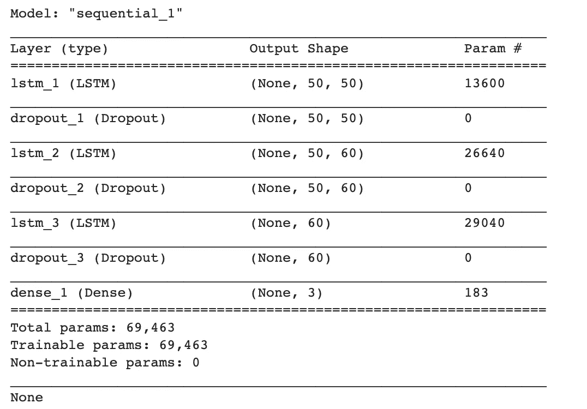*

*图 9:模型架构*

***培训 RNN/LSTM 模型***

*RNN/LSTM 模型总共被训练了 30 个时期，尽管我试图训练该模型 40 个时期，该模型被视为过度拟合。*

```
*history = model.fit(x_train, y_train,batch_size=32, epochs=30)*
```

*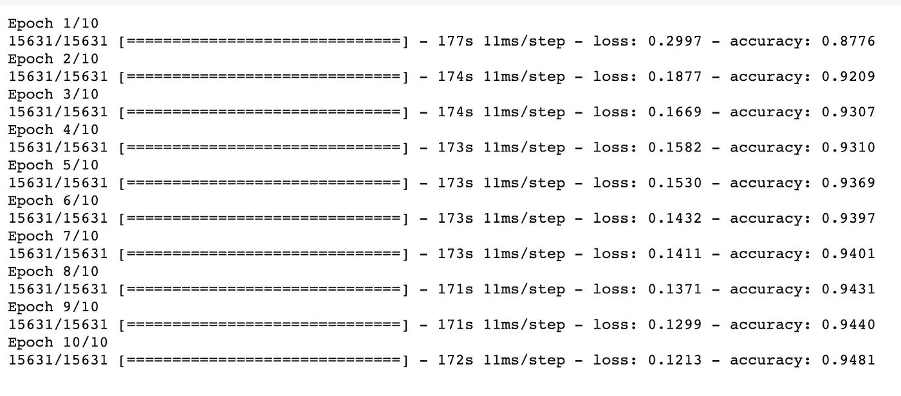*

**注:‘****历史****’变量用于记录模型在训练过程中的损耗、准确度等必要参数。**

*通过使用 keras.evaluate()函数获得准确度，并且获得接近 94%的总准确度(参见图 10)。*

```
*model.evaluate(x_test, y_test, verbose=2)*
```

*以下代码展示了如何绘制精度和损耗。*

```
*plt.subplot(211)
plt.plot(history.history['accuracy'])
plt.title('model accuracy')
plt.ylabel('accuracy')
plt.xlabel('epoch')
plt.legend(['accuracy'], loc='upper left')*
```

*这是模型精度的输出，与 79%的精度相比，获得了大约 94%的精度。我们已经看到了对以前方法的改进。*

*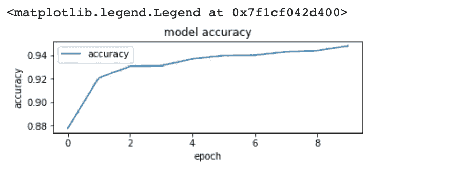*

*图 10:模型的准确性*

*我们获得的模型损耗为 0.12，比 CNN 方法好**。***

***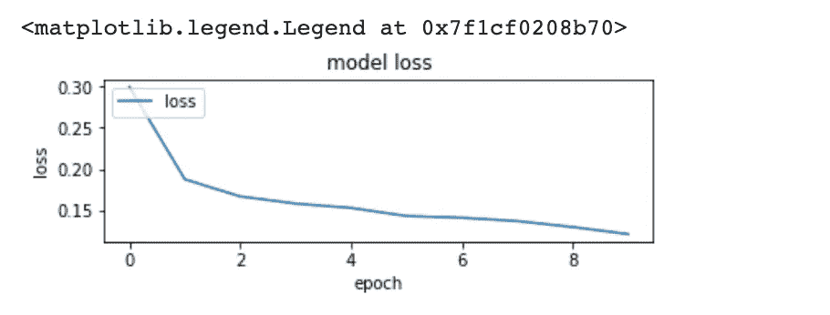***

***图 11:模型的总损失***

***这是混淆矩阵(见图 12 ),它更深入地展示了模型在分类中的实际表现。***

```
***cnf_matrix = confusion_matrix(np.where(y_test != 0)[1], model.predict_classes(x_test))plt.figure(figsize=(7,7))plot_confusion_matrix(cnf_matrix, classes=np.unique(np.where(y_test != 0)[1]), title="Confusion matrix")plt.show()***
```

**** *注:函数-混淆 _ 矩阵()位于* [*sklearn 文档*](https://scikit-learn.org/stable/auto_examples/model_selection/plot_confusion_matrix.html)***

***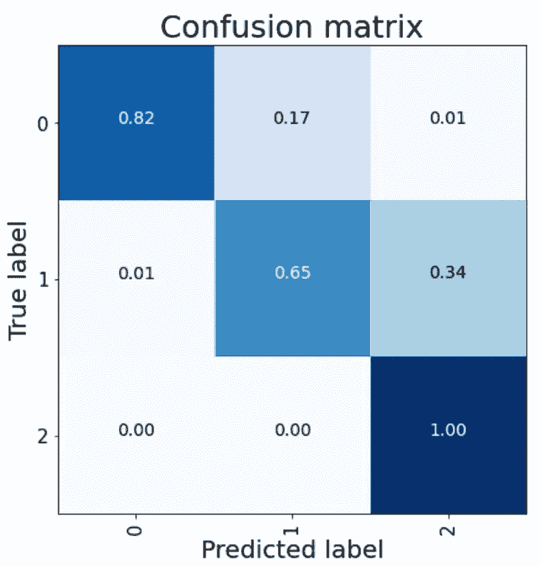***

***图 12 : [来自 sklearn 文档](https://scikit-learn.org/stable/auto_examples/model_selection/plot_confusion_matrix.html)***

# ***结论***

***在这篇文章中，我们看到了一种替代方法，如何使用 **RNN/LSTM** 神经网络架构通过解决**预测性维护问题**，并证明比之前的 **CNN** 方法更好。***

# ***参考***

*   ***[https://towards data science . com/playing-with-time-series-data-in-python-959 e 2485 BF F8](/playing-with-time-series-data-in-python-959e2485bff8)***
*   ***[https://towards data science . com/extreme-rare-event-class ification-using-auto encoders-in-keras-a565b 386 f 098](/extreme-rare-event-classification-using-autoencoders-in-keras-a565b386f098)***
*   ***[https://towards data science . com/remaining-life-estimation-with-keras-2334514 f9c 61](/remaining-life-estimation-with-keras-2334514f9c61)***