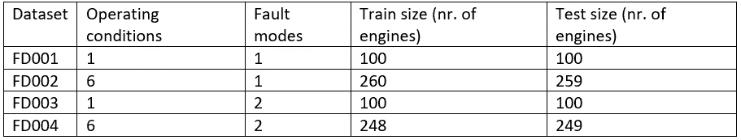
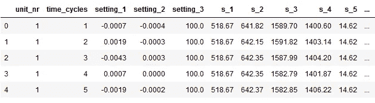
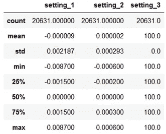
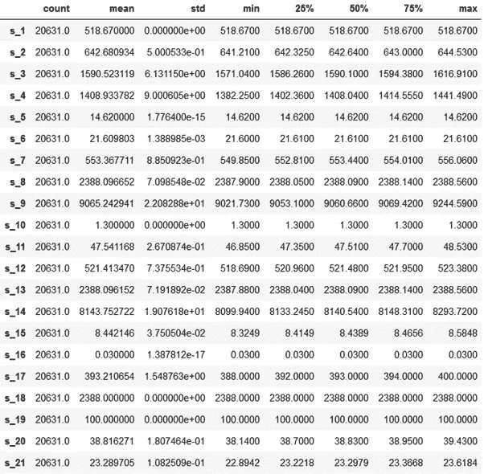
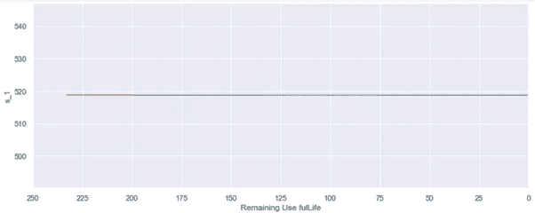
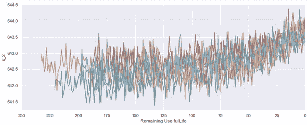
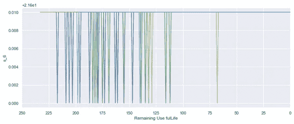
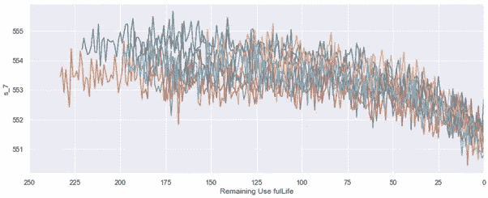
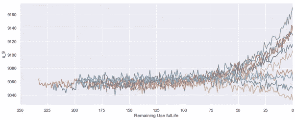
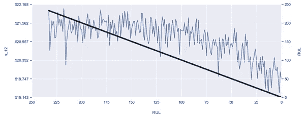

# 涡轮风扇发动机的预测性维护

> 原文：<https://towardsdatascience.com/predictive-maintenance-of-turbofan-engines-ec54a083127?source=collection_archive---------2----------------------->


埃米尔·莫勒纳尔在 [Unsplash](https://unsplash.com?utm_source=medium&utm_medium=referral) 上拍摄的照片

## [探索美国宇航局的涡轮风扇数据集](https://towardsdatascience.com/tagged/exploring-nasa-turbofan)

## 探索性数据分析和基线线性回归模型

尽管 NASA 的涡扇发动机退化模拟数据集(CMAPSS)发布于十多年前，但至今仍很受欢迎且具有相关性。到目前为止，2020 年已经发表了 90 多篇新的研究论文[1]。这些论文提出并测试了预测涡扇发动机数据集剩余使用寿命(RUL)的新算法。

当我第一次开始学习预测性维护时，我偶然发现了一些使用涡扇发动机退化数据集的博客文章。每篇文章都包括探索性数据分析和预测 RUL 的简单模型，但我觉得缺少两样东西:

1.  我从来没有完整地了解如何将不同的合适技术应用于同一问题
2.  博客帖子只关注第一个数据集，让我猜测如何解决更复杂的挑战。

几年后，对我来说，这似乎是一个有趣的项目。在一系列的文章中，我计划展示和解释多种分析技术，同时为更复杂的数据集提供一个解决方案。

我已经创建了一个索引，在下面我会更新新帖子的链接:

1.FD001 —探索性数据分析和基线模型(本文)
2。FD001 — [更新了 RUL 的假设&支持向量回归](https://medium.com/p/the-importance-of-problem-framing-for-supervised-predictive-maintenance-solutions-cc8646826093?source=email-769bd197e7cf--writer.postDistributed&sk=ec51cbfa29f084ed94fe59d0daf51df0)
3。FD001 — [时间序列分析:分布滞后模型](/time-series-analysis-for-predictive-maintenance-of-turbofan-engines-1b3864991da4?source=friends_link&sk=a62dbeb8230f6b29123b692ac08dad59)
4。FD001 — [预测性维护的生存分析](/survival-analysis-for-predictive-maintenance-of-turbofan-engines-7e2e9b82dc0e?source=friends_link&sk=d290f4c4a5c112360e679f12234043bf)
5。FD003 — [随机森林](/random-forest-for-predictive-maintenance-of-turbofan-engines-5260597e7e8f?sk=382ff22c4b40acf3b5d12928a9b25b93)(我把顺序改了，看文章找原因)
6。[Jupyter 笔记本](/primer-on-developing-reproducible-neural-networks-in-jupyter-notebook-2f88d23b7c8d?sk=dbb8d4efdc36aa676cb97857b946c5ca)
7 中 NNs 的可重现结果引物。FD002 — [滞后 MLP &基于条件的归一化](/lagged-mlp-for-predictive-maintenance-of-turbofan-engines-c79f02a15329?sk=84c2225e20760c04e9f27234c3803175)
8。FD004 — [LSTM &总结](/lstm-for-predictive-maintenance-of-turbofan-engines-f8c7791353f3?sk=b2bd1590168a6eaab5d13857807afbda)

涡扇发动机数据集有四个复杂性递增的数据集(见表 1)[2，3]。发动机开始时运转正常，但随着时间的推移出现了故障。对于训练集，引擎运行到故障，而在测试集中，时间序列在故障前“某个时间”结束。目标是预测每台涡扇发动机的剩余使用寿命(RUL)。



表一:涡轮风扇数据集概述

数据集包括多个涡扇发动机随时间的模拟，每行包含以下信息:
1。发动机单元号
2。时间，以周期为单位
3。三种操作设置
4。21 传感器读数

我发现这个数据集真正酷的地方是，你不能使用任何领域知识，因为你不知道传感器一直在测量什么。因此，结果纯粹是基于应用正确的技术。

在今天的帖子中，我们将重点探索第一个数据集(FD001 ),其中所有发动机都出现相同的故障，并且只有一种运行条件。此外，我们将创建一个基线线性回归模型，以便我们可以比较未来帖子的建模工作。

# 探索性数据分析

让我们从导入所需的库开始，读取数据并检查前几行。请注意，一些列的值似乎没有偏差或偏差很小。我们将在下面进一步探讨这些。



train.head()的结果

接下来，FD001 应该包含 100 台发动机的数据，让我们检查单元号以验证情况是否如此。我选择使用熊猫描述功能，这样我们也可以了解分布情况。当我们这样做的时候，让我们也检查一下时间周期，看看我们能了解到引擎在崩溃之前平均运行的周期数。


unit_nr 和 time_cycles 数据集描述统计

当我们检查 unit_nr 的描述性统计数据时，我们可以看到数据集总共有 20631 行，单元号从 1 开始，到 100 结束。有趣的是，平均值和分位数与 1-100 向量的描述性统计数据并不完全一致，这可以解释为每个单元具有不同的最大 time_cycles，因此行数也不同。当检查最大时间周期时，可以看到最早出现故障的发动机在 128 个周期后出现故障，而运行时间最长的发动机在 362 个周期后出现故障。发动机平均在 199 到 206 个周期之间发生故障，但是 46 个周期的标准偏差相当大。为了更好地理解，我们将在下面进一步想象。

数据集描述还表明涡轮风扇在单一工况下运行。让我们检查设置以进行验证。



发动机设置的描述性统计

观察设置 1 和 2 的标准差，它们并不完全稳定。然而，波动是如此之小，以至于无法识别其他操作条件。

最后，我们将检查传感器数据的描述性统计数据，寻找信号波动的指标(或不存在的指标)。



传感器信号的描述性统计。

通过查看标准偏差，很明显传感器 1、10、18 和 19 根本没有波动，这些传感器可以安全地丢弃，因为它们不包含有用的信息。检查分位数表明传感器 5、6 和 16 波动很小，需要进一步检查。传感器 9 和 14 的波动最大，但这并不意味着其他传感器不能保存有价值的信息。

# 计算 RUL

在我们开始绘制数据以继续 EDA 之前，我们将计算剩余使用寿命的目标变量(RUL)。目标变量有两个用途:

1.  在绘制传感器信号时，它将作为我们的 X 轴，使我们能够轻松地解释发动机接近故障时传感器信号的变化。
2.  它将作为我们的监督机器学习模型的目标变量。

没有关于训练集中引擎的 RUL 的进一步信息，我们将不得不提出我们自己的估计。我们将假设 RUL 随时间线性减小，并且在发动机的最后一个时间周期具有 0 值。这种假设意味着击穿前 10 个周期的 RUL 为 10，击穿前 50 个周期的为 50，等等。

数学上我们可以使用`max_time_cycle — time_cycle`来计算我们想要的 RUL。因为我们想考虑每个引擎的`max_time_cycle`，所以在计算`max_time_cycle`之前，我们将按照`unit_nr`对数据帧进行分组。然后将 max_time_cycle 合并回数据帧中，以便通过减去列`max_time_cycle — time_cycle`来轻松计算 RUL。之后，我们删除`max_time_cycle`，因为不再需要它，并检查前几行来验证我们的 RUL 计算。


# 测绘

为了更好地理解数据集，绘制总是一个好主意。让我们从绘制麦克斯·RUL 的直方图开始，来理解它的分布。


直方图再次证实，大多数发动机在 200 个周期左右就会发生故障。此外，分布是右偏的，很少有发动机能持续超过 300 次循环。

下面我将展示用于绘制每个传感器信号的代码。由于发动机数量众多，为每个传感器绘制每个发动机的图是不可行的。一幅图中有这么多线条，这些图表将不再能被理解。因此，我选择绘制每个 unit_nr 可被 10 整除且余数为 0 的引擎。我们恢复 X 轴，因此 RUL 沿轴减小，RUL 为零表示发动机故障。由于传感器数量众多，我将讨论几个代表整个系列的图表。请记住，根据我们的描述性统计，我们应该明确检查传感器 5、6 和 16 的图形。



S1 与衰落的 RUL 图

传感器 1、10、18 和 19 的图形看起来相似，平坦的线表示传感器没有有用的信息，这再次证实了我们从描述性统计得出的结论。传感器 5 和 16 也显示一条扁平线，这些可以添加到要排除的传感器列表中。



S2 与下降的 RUL 的曲线图

传感器 2 显示出上升趋势，对于传感器 3、4、8、11、13、15 和 17 可以看到类似的模式。



S6 对衰落的 RUL 的图表

传感器 6 的传感器读数有时会下降，但似乎与 RUL 下降没有明显关系。



七国集团对 RUL 的图表

传感器 7 显示下降趋势，这也可以在传感器 12、20 和 21 中看到。



S9 对 RUL 的图表

传感器 9 与传感器 14 具有相似的模式。

基于我们的探索性数据分析，我们可以确定传感器 1、5、6、10、16、18 和 19 不保存与 RUL 相关的信息，因为传感器值始终保持恒定。让我们从基线线性回归模型开始我们的模型开发。该模型将使用剩余的传感器作为预测器。

# 基线线性回归

首先，我们将定义一个小函数来评估我们的模型。我选择包括均方根误差(RMSE ),因为它将给出预测平均偏离多少时间周期的指示，并解释方差(或 R 得分)以指示我们使用的自变量可以解释我们的因变量的比例。

我们将删除不包含任何信息的`unit_nr, time_cycle, settings and sensors`。定型集的 RUL 列存储在自己的变量中。对于我们的测试集，我们删除了相同的列。此外，我们只对测试集中每台发动机的最后一个时间周期感兴趣，因为我们只有这些记录的真实 RUL 值。

线性回归的设置非常简单。我们通过简单地调用方法并将其赋给“lm”变量来实例化模型。接下来，我们通过传递我们的“X_train”和“y_train”来拟合模型。最后，我们对训练集和测试集进行预测，以全面了解我们的模型如何根据提供给它的数据进行操作。

```
# returns
# train set RMSE:44.66819159545453, R2:0.5794486527796716
# test set RMSE:31.952633027741815, R2:0.40877368076574083
```

请注意，RMSE 在测试集上较低，这与直觉相反，因为通常模型在训练期间看到的数据上表现更好。

一种可能的解释是，训练集的计算 RUL 范围一直到 300 多。观察下图的趋势，线性计算的 RUL 的较高值似乎与传感器信号没有很好的关联。由于测试集的 RUL 预测更接近失败，并且较低的目标 RUL 和传感器信号之间的相关性更清楚，所以模型更容易对测试集做出准确的预测。训练和测试 RMSE 的巨大差异可以被看作是我们对 RUL 假设的一个缺陷，这也是我们将来要努力改进的地方。现在，我们已经完成了 EDA 和基线模型。



描述线性下降的 RUL 和 S12 的图表。该图旨在展示传感器信号和线性下降的 RUL 强相关的地方。

在今天的帖子中，我们探索了美国宇航局涡扇发动机退化模拟数据集的第一个数据集，并创建了一个测试 RMSE 为 31.95 的基线模型。我要感谢 Maikel Grobbe 和 Wisse Smit 对我的文章的评论。在下一篇文章中，我们将看看如何改进计算出的 RUL，使预测更加准确。此外，我们将开发一个支持向量回归来进一步提高性能。

如果你有任何问题或评论，请在下面的评论中留下。完整的笔记本你可以查看我的 github 页面[这里](https://github.com/kpeters/exploring-nasas-turbofan-dataset)。

参考文献:
[1]2020 年迄今发表在 NASA CMAPSS 数据上的论文: [Google scholar search](https://scholar.google.com/scholar?hl=en&as_sdt=0%2C5&as_ylo=2020&q=cmapss+nasa+rul%7Cdiagnosis+-compass&btnG=) ，2020–08–08
访问[2] A. Saxena，K. Goebel，D. Simon 和 N. Eklund，“飞机发动机运行至故障模拟的损伤传播建模”，载于 2008 年 10 月丹佛市 Ist 国际预测与健康管理会议(PHM08)会议录。
【3】[美国宇航局官方数据仓库](https://ti.arc.nasa.gov/tech/dash/groups/pcoe/prognostic-data-repository/#turbofan)