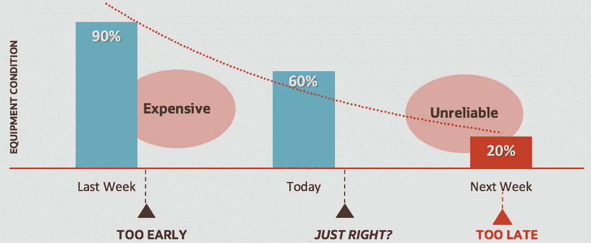
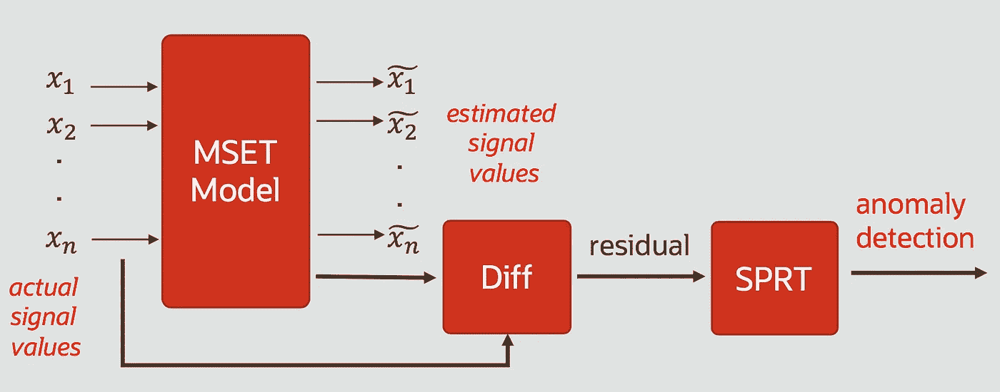
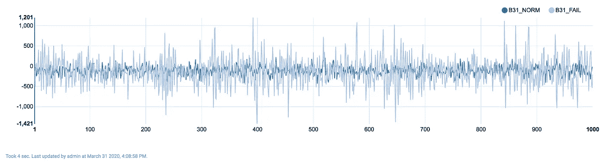
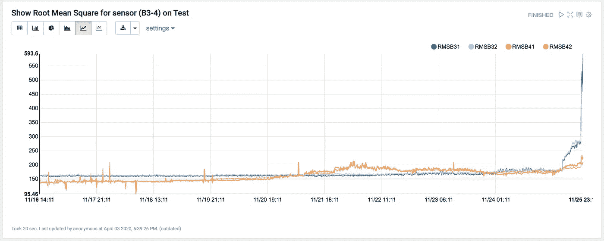
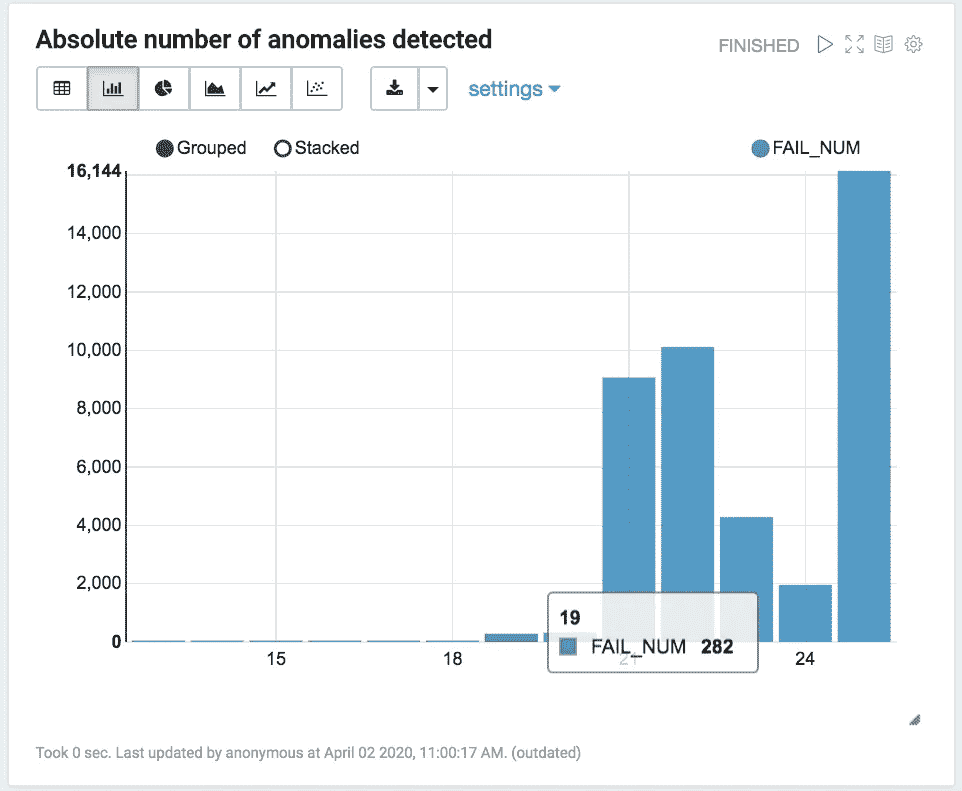
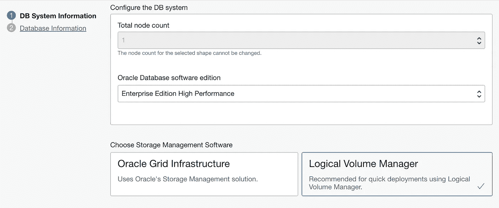

# Oracle DBMS 20c 的预测性维护

> 原文：<https://towardsdatascience.com/predictive-maintenance-with-oracle-dbms-20c-3e9c5f5abefb?source=collection_archive---------52----------------------->


*物联网传感器可以提供关于系统健康状况的信息，但隐藏了与即将发生的故障相关的有价值的早期警告，而这些故障可以通过预测性维护来避免。一种在核电站和关键基础设施中使用了几十年的机器学习算法****MSET-SPRT****，能够检测到这些被信号噪音隐藏的关键警告会用****Oracle DBMS 20c****发布。在本文中我将展示如何将应用到一个真实的测试用例中。*

根据**麦肯锡的**研究:“ [*可视化 AI 和其他分析*](https://www.mckinsey.com/featured-insights/artificial-intelligence/visualizing-the-uses-and-potential-impact-of-ai-and-other-analytics) 的使用和潜在影响”，2018 年，人工智能和其他分析对所有行业关于异常检测问题的估计影响估计在 1.0 到 1.4 T 美元之间。

异常检测是关键的成功因素，例如，在预测性维护中，它试图预测何时需要维护，而不是传统的预防性方法，在传统的预防性方法中，活动是在定期安排的基础上计划的，或者在基于条件的维护活动中，甚至通过物联网传感器来监控资产。

预测性维护的问题可以用下图来解释:



**赡养的金发女孩问题**

应用基于机器学习的异常检测算法，可以执行[预测](https://en.wikipedia.org/wiki/Prognostics)，以估计系统或组件的状况及其*剩余使用寿命* (RUL)，尝试预测即将发生的故障。

最著名的算法之一是 **MSET-SPRT** ，在这篇博文中用一个用例进行了很好的描述:“ [*机器学习用例:对工程系统的实时支持*](https://blogs.oracle.com/bigdata/real-time-machine-learning-use-case) ”。它最初于 20 世纪 90 年代在美国 DOE 的 Argonne 国家实验室开发，几十年来一直用于监控核电厂或空军，在这种情况下“*故障不是一个选项*”，它将被包含在 Oracle DB 的下一个版本 [20c](https://docs.oracle.com/en/database/oracle/oracle-database/20/newft/oracle-machine-learning-sql.html) 中，作为由[**Kenny Gross**](https://labs.oracle.com/pls/apex/f?p=labs:bio:0:2256)@[Oracle Labs](https://labs.oracle.com/pls/apex/f?p=labs:bio:0:2256)改进的实现。

**Oracle DB 20c** 现在可以作为 **Oracle 云基础设施**上的[预览版](https://blogs.oracle.com/database/ga-of-oracle-database-20c-preview-release)使用，并可用于测试其性能。

**多变量状态估计技术** e — **序贯概率比检验(MSET-SPRT)** 算法监控关键过程并检测细微异常。MSET 是一种非线性、非参数异常检测机器学习技术，它基于来自监控信号的正常操作序列的历史数据来校准系统的预期行为。它的工作方式如下图所示:



MSET-SPRT 算法

*MSET 模型*在来自 *N 个传感器*的一系列 *M 个基于时间的观察值*上被训练，并用于根据输入中的新值估计信号值。为了形成关于系统总体健康状况的假设，这些函数计算估计信号值和实际信号值之间的差(残差),并使用 SPRT 计算来确定是否有任何信号变得退化。对于输入中的正常信号，提供值为 1 的输出，对于检测到的异常，提供值为 0 的输出——为了描述评分，还提供了其他一些信息。假设被监控数据的特征不会随着时间而改变。

我们希望达到的目标是尽快检测到即将到来的故障，从信号中提取信息，以便在早期发出警报。

# 使用案例

为了试验这种异常检测算法，我选择了一个数据集，该数据集来自美国宇航局艾姆斯预测数据库 ，命名为“**轴承数据集**，由辛辛那提大学智能维护系统(IMS)中心提供。

它收集了一个机械测试工厂的数据，该工厂有 4 个轴承——我们称之为:B1、B2、B3、B4——安装在一个以 2000 RPM 旋转的轴上，电机连接到轴上，连续几天不间断地运行。每个轴承上安装了 2 个加速度计，因此我们有 8 个信号，每次以 20 KHz 采样 1 秒钟。每次采样有 20480 个点，每 10 分钟重复一次。有几组测试可用，但我使用了从 2003 年 10 月 22 日 12:06:24 到 2003 年 11 月 25 日 23:39:56 收集的数据(Set №1)。我们总共有超过 44 毫升的记录。

在该测试结束时，轴承 B3 和轴承 B4 都被损坏。

# 方法

为了创建一个能够尽快检测到即将到来的缺陷的模型，以便在正确的时间进行维护活动，我使用了一个 Oracle DB 20c 实例和一个配置为使用 PL/SQL 作为解释器的 Zeppelin 笔记本:关于如何重现该测试的所有信息都在本文的末尾。

关于 Oracle DB 上 PL/SQL 中的 Oracle 机器学习的大致了解，请参考我的帖子“ [*自治数据库上的机器学习:一个实用的例子*](https://blogs.oracle.com/datascience/machine-learning-on-autonomous-database-a-practical-example-v2) ”。在这篇文章中，我谈到了自治数据库，但是从编程的角度来看，使用 Zeppelin 是同样的方法。

首先，我已经从 44 Ml 记录数据集中提取了第一个时间框架，我们可以使用它作为系统正常行为的示例，必须在其上训练 MSET(从 10 月 22 日到 11 月 1 日)。数据集的剩余部分已被用来评估算法训练的准确性。数据集准备的重要注意事项。传感器值记录的时间戳字段必须为日期或时间戳类型。在我们的例子中，我选择了允许存储几分之一秒的时间戳，如以下代码所示:

```
**CREATE** **TABLE** MSET_TRAINING_SH_DATA 
   (	"TIME_ID" **TIMESTAMP** (6) **NOT** NULL **ENABLE**, 
	"B11" NUMBER, 
	"B12" NUMBER, 
	"B21" NUMBER, 
	"B22" NUMBER, 
	"B31" NUMBER, 
	"B32" NUMBER, 
	"B41" NUMBER, 
	"B42" NUMBER
   );
```

为了直观显示 B3.1 传感器的正常状态与接近故障状态，我绘制了以下图表:



B3.1 与故障信号相比，传感器处于正常状态

为了获得更有价值的数据可视化，我计算了连接到轴承 B3 的传感器的[均方根](https://en.wikipedia.org/wiki/Root_mean_square)和 B4，即 20 KHz 下每个样本一秒钟的观察值。正如你所看到的，直到 11 月 24 日，当情况恶化时，没有证据表明 B3 会遭受损失。对于 B4，11 月 21 日有一些微小的波动



来自附在轴承上的 4 个加速器的 RMS 信号将被损坏

仅监控这些参数，您没有时间计划维护活动来替换轴承 3 和 4，并避免每次整个系统的故障。

作为训练样本，与训练集大小(10 Ml)相比，MSET-SPRT 需要更有限的记录数，因此我查询了第一个第二个采样:22–10–2003 12:06:25.005000，对应于 2010 年 10 月 22 日系统测试运行早期的 20480 条记录。

MSET-SPRT 实现需要几个参数，但我只设置了这些参数:

*   MSET_MEMORY_VECTORS: 125
*   MSET_ALPHA_PROB: 0.1
*   毫秒警报计数:5
*   MSET _ ALERT _ windows:5
*   准备 _ 自动:开

必须理解的是，与在评分期间没有记忆的分类算法不同，在 MSET-SPRT 中，评分是在考虑一组按时间顺序的连续样本(MSET_ALERT_WINDOW)以及有多少样本(MSET_ALERT_COUNT)已经超过触发警报的阈值的情况下进行的。

对于调用 **create_model()** 函数，我们不需要设置目标，因为该算法是在正常条件观测值上训练的，但是我们需要指定时间戳字段。

```
BEGIN DBMS_DATA_MINING.DROP_MODEL('MSET_MODEL1'); **DBMS_DATA_MINING**.**create_model**(
     model_name => 'MSET_MODEL1',
     mining_function => 'CLASSIFICATION',
     data_table_name => 'sample',
     case_id_column_name => 'time_id',
     target_column_name => '',
     settings_table_name => 'MSET_SH_SETTINGS');END;
```

之后，我对由超过 33 Ml 记录组成的完整测试数据集运行了预测，以评估该模型在多少天后有助于预测即将到来的故障。

为此，我编写了一个存储过程 *test_model(startDay，stopDay)* :

```
%osql
CREATE OR REPLACE PROCEDURE test_model (startDay NUMBER,stopDay NUMBER) AS str1 varchar2(4000);
   str2 varchar2(4000);
   i  varchar2(2);
   ii varchar2(2);

BEGINstr1 := q'[
    insert into pred_stat_temp   
    select dt,count(pred)   as fail_num from (
    SELECT  to_char(time_id,'DD') as dt,b11,b31,
       PREDICTION(mset_model1 using *) OVER (ORDER BY time_id) pred 
       FROM mset_test_sh_data where to_char(time_id,'DD')=']';
str2 := q'[')  where pred=0 group by dt order by dt]';for i in startDay..stopDay loop
      if i<10 then
         ii:= '0'||to_char(i);
      else 
         ii:= to_char(i);
      end if;
      execute immediate str1|| ii ||str2;    
end loop;
END;
```

为了执行这样一个长时间运行的过程，我使用了 Oracle DB 作业，如下所示:

```
%osql

DECLARE
  X NUMBER;
begin**dbms_job.submit**(
    X,
    'BEGIN test_model(1,25); END;',
     SYSDATE
    );
end;
```

并通过以下方式监控状态:

```
select job_name,job_action,start_date,end_date from USER_SCHEDULER_JOBS
```

这种方法允许我测试超参数的几种组合，以便在算法设置上找到最合适的组合。

下图是从 11 月 10 日开始每天发射的异常数量图。



故障前最后一段时间每天检测到的异常数量

在**第 18 个**上已经检测到 **47 个异常**(在 2.375.680 记录上)，与**第 19 个**上的 **282** (在 1.474.560 记录上)相比，归一化代表**增长**的 866 %，足以在故障前 5 天触发报警**。**

但是与同一天的正常信号范围相比，这个指标有用吗？为了有个概念，我计算了 11 月 18 日和 11 月 19 日 B3.1 信号的 RMS、Min、Max 和方差，后者是模型开始显著增加警报数量的时候。


> 如果我们比较这两天，没有任何指标比模型检测到的 866%的异常增长更好。

因此，您可以使用根据 19 日触发的异常数量调整的阈值来发出警报，以请求维护活动。

# 自己试试

如果您想自己测试算法和这个用例，您必须按如下方式设置环境:

*   在 OCI 上提供数据库云服务，获得一个[试用账户](https://www.oracle.com/cloud/free/)。请注意，当您在数据库版本列表中提供 DBCS 的一个实例以具有选项 **20c(预览)**时，您必须选择*存储管理软件*作为:**逻辑卷管理器**:



要选择的存储类型，以选择版本 20c

*   按照这些[指令](https://github.com/corradodebari/pred_maintenance)安装 Zeppelin 环境并配置 Oracle DBMS 解释器；
*   从[这里](https://ti.arc.nasa.gov/tech/dash/groups/pcoe/prognostic-data-repository/)下载轴承数据集，使用脚本 python[***prepare . py***](https://github.com/corradodebari/pred_maintenance)创建训练和测试 CSV，通过 SQLDeveloper 等工具上传到 DB 上；
*   运行 Zeppelin 笔记本[提供的](https://github.com/corradodebari/pred_maintenance)。

**引文**

[1] J. Lee、H. Qiu、G. Yu、J. Lin 和 Rexnord Technical Services (2007 年)。辛辛那提大学。“轴承数据集”，美国宇航局艾姆斯预测数据库([http://ti.arc.nasa.gov/project/prognostic-data-repository](http://ti.arc.nasa.gov/project/prognostic-data-repository))，美国宇航局艾姆斯研究中心，加利福尼亚州莫菲特菲尔德

# 放弃

*本文表达的观点是我个人的观点，不一定代表甲骨文的观点。*